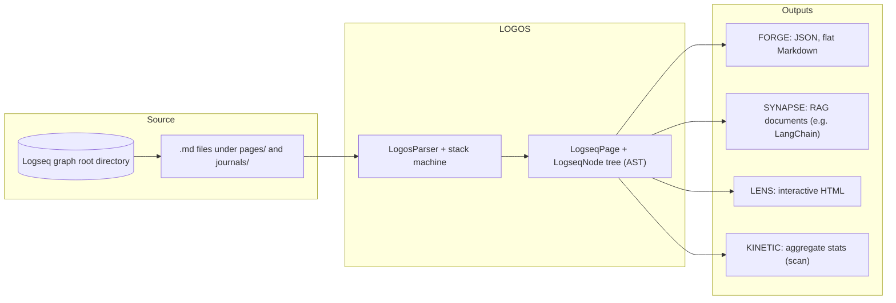

# 🔱 Logseq Matryca Parser (The Logos Protocol)

[](https://github.com/MarcoPorcellato/logseq-matryca-parser/actions)
[](https://www.python.org/downloads/)
[](#)


> *"Giving LLMs the vision to read hierarchical thought."*
> — [Marco Porcellato](https://www.marcoporcellato.it)

<p align="center">
  <video src="https://github.com/user-attachments/assets/24f73c6d-3eca-4adb-8442-981f2ba4cccd" autoplay loop muted playsinline width="800"></video>
</p>

[👉 **TRY THE LIVE INTERACTIVE DEMO (Mobile Friendly)**](https://MarcoPorcellato.github.io/logseq-matryca-parser/)

---

Standard RAG parsers destroy the semantic structure of Logseq. They chunk text blindly, losing the context of *why* a note was written.

**Logseq Matryca Parser** is the fast and deterministic engine built at [Matryca.ai](https://matryca.ai) to preserve the true Abstract Syntax Tree (AST) of your graphs. We guarantee that artificial intelligence understands spatial hierarchy, time, task, namespaces etc., not just flat text.

## 🏗️ System Architecture & Killer Features

*Want to understand why standard parsing fails on Logseq? Read our [Logseq AST Primer](docs/logseq_ast_primer.md).*



### 1. LOGOS (The Core Engine)

Unlike traditional chunkers that "cut" text randomly, Logos respects your **thought sovereignty**, keeping parent-child block relationships intact.
⚡️ SPEED: 901 Pages with 45626 Blocks parsed in 32 seconds! ⚡️

* Finite state Stack-Machine parsing engine for deterministic indentation reconstruction.
* Resolves complex syntax: properties, aliases, block-references (`((uuid))`), and temporal journals.

### 2. SYNAPSE (AI & RAG Ready)

Transform your Second Brain from Logseq into perfect vectors for LLMs.

* Native adapters for **LangChain** (`Document`) and **LlamaIndex** (`TextNode`).
* Automatically injects hierarchical relationships into metadata, ensuring the AI never loses the parent context of a bullet point.

### 3. LENS (The God-Tier Visualizer)

Explore your graph like never before.

* **Insane Performance:** Aggressively optimized ForceAtlas2 physics engine (and other physics available). Fluidly renders massive graphs (10,000+ nodes) at 60FPS.
* **Semantic Topology:** Dynamic Degree Centrality sizing (highly connected concepts become massive suns).
* **Professional HUD:** A custom Glassmorphism UI injected directly into the graph. Instantly filter out daily journals or tags to declutter your view.


### 4. FORGE & KINETIC (Exporters & CLI)

* **FORGE:** Transformation forge for optimized JSON, clean Markdown, and flat-list outputs.
* **KINETIC:** High-performance command-line interface to orchestrate the entire pipeline.

---

## 🛠️ Quickstart

Ensure you have Python 3.12+ installed.

```bash
# Clone the repository
git clone https://github.com/MarcoPorcellato/logseq-matryca-parser.git
cd logseq-matryca-parser

# Install via pip or uv
pip install -e .
```

### KINETIC CLI Usage

#### 1. Visualize your graph

Generate a stunning, interactive HTML map of your local Logseq graph.

```bash
matryca-parse visualize /path/to/your/logseq/graph my-brain-map.html
```

#### 2. Export for AI / RAG

Export your entire graph into natively formatted JSON for LangChain integration.

```bash
matryca-parse export /path/to/your/logseq/graph output_dir --format langchain
```

#### 3. Test the showcase demo

Generate a synthetic, highly connected graph to test the physics engine without a local Logseq folder.

```bash
matryca-parse demo showcase.html
```

### Python API usage

```python
from pathlib import Path
from logseq_matryca_parser.logos_parser import LogosParser
from logseq_matryca_parser.synapse import SynapseAdapter

# Parse a page into a deterministic AST
parser = LogosParser()
page = parser.parse_page_file(Path("path/to/page.md"))

# Export directly to LangChain Documents
docs = SynapseAdapter.to_langchain_documents(page.root_nodes, source_name=page.title)
```

## 🛡️ Sovereign & Privacy First

Designed to run locally. Zero telemetry. Zero training on your data. Fully GDPR-compliant by EEA protocol design.

Your Second Brain is your private intellectual property. Keep it that way.

## ☕ Support the Project

Logseq Matryca Parser is an open-source project built with passion and precision. I maintain this engine in my free time to help the PKM and AI community keep their data sovereign and accessible.

If this tool has saved you hours of parsing headaches or empowered your AI pipeline, consider supporting its development!

**💖 Sponsor me on GitHub (Preferred)**

**🤝 Enterprise Support:** Need custom RAG integrations, priority bug fixes, or consulting? Check out the higher sponsor tiers or reach out to me at marco@matryca.ai.

Architected by Marco Porcellato | Powered by Matryca.ai Building the future of Sovereign Knowledge Management.
