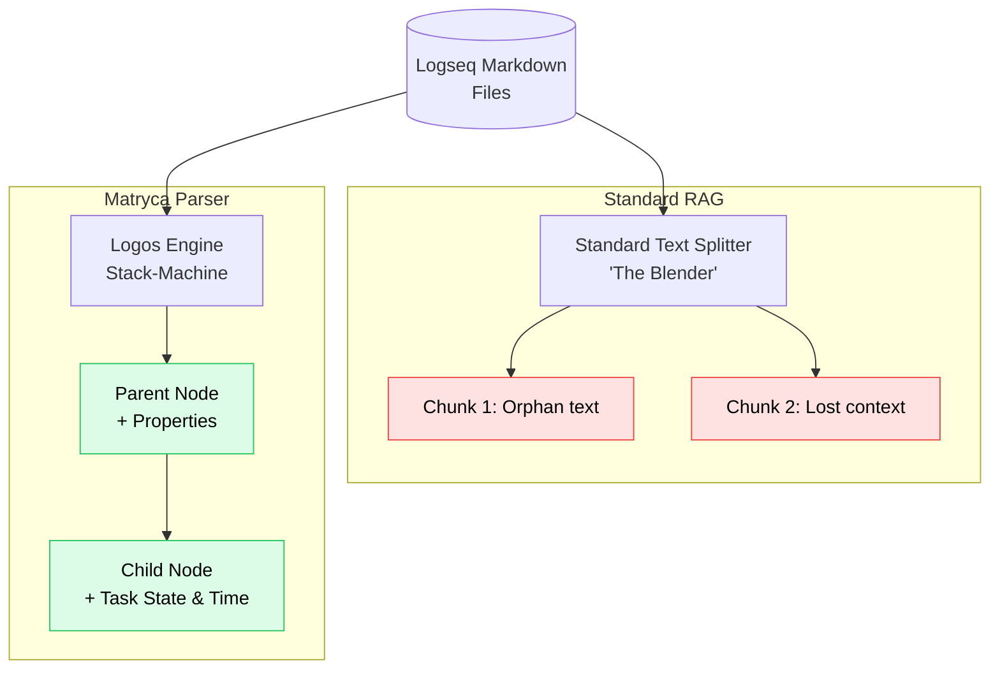

<div align="center">

# 🔱 Logseq Matryca Parser (The Logos Protocol)

**Stop feeding broken Markdown to your AI.**

[](https://github.com/MarcoPorcellato/logseq-matryca-parser/actions)
[](https://www.python.org/downloads/)
[](https://github.com/MarcoPorcellato/logseq-matryca-parser/blob/main/LICENSE)
[](https://pypi.org/project/logseq-matryca-parser/)
[](https://pypi.org/project/logseq-matryca-parser/)
[](#)


**v1.1.1** — Logseq OG parity release (see [CHANGELOG](CHANGELOG.md)) — **200+ tests**, full bidirectional Headless CRUD engine, native markdown serialization, and static typing; ready for production Enterprise integration.

> *Turning a forest of local plain-text files into a unified semantic powerhouse.*

<p align="center">
  <video src="https://github.com/user-attachments/assets/24f73c6d-3eca-4adb-8442-981f2ba4cccd" autoplay loop muted playsinline width="800"></video>
</p>

[👉 **TRY THE LIVE INTERACTIVE DEMO**](https://MarcoPorcellato.github.io/logseq-matryca-parser/)

[📘 **ARCHITECTURE**](docs/ARCHITECTURE.md) · [AST Primer](docs/logseq_ast_primer.md) · [Changelog](CHANGELOG.md) · [Release process](docs/RELEASE_PROCESS.md)

</div>

---

## 🌐 The Vision: Virtual Centralization vs. Binary Lock-in

The PKM (Personal Knowledge Management) world is currently forcing users to make a painful choice between **Data Longevity** and **AI Power**.

* **Vanilla Logseq / Obsidian** is a "Forest" of decentralized Markdown files. It guarantees the Lindy effect (plain-text lasts forever) and perfect Git versioning, but standard AI chunkers treat it like a blender, destroying the outliner hierarchy.
* **Tana** is a centralized "Tree". It offers incredible semantic power, but traps your brain in a proprietary cloud database.
* **The new Logseq DB (SQLite)** aims for database speed, but at a huge cost: it locks your notes inside a binary `.db` file. You lose human-readable files, you lose line-by-line Git diffs, and you lose the immortality of plain-text.

### 🔱 The Matryca Solution: The Best of Both Worlds
**Logseq Matryca Parser** is the ultimate bridge. It allows you to **keep your sovereign, future-proof Markdown files**, while synthesizing a **Virtual Global Graph** in RAM at runtime.

It acts as the strict **File System Driver** for your LLM OS. By using a deterministic Stack-Machine to parse your outliner topology, it feeds LangChain or LlamaIndex with the exact parent-child context of every single block.

*You get the reasoning power of a centralized relational database, without sacrificing the plain-text soul of your Second Brain in Logseq.*

---

## ⚖️ The PKM Landscape

| Feature | Vanilla Markdown | **Matryca Parser** | Logseq DB (SQLite) | Tana |
| :--- | :--- | :--- | :--- | :--- |
| **Data Format** | Plain-text (.md) | **Plain-text (.md)** | Binary (.db) | Proprietary Cloud |
| **Version Control** | Perfect (Git) | **Perfect (Git)** | Poor (Binary blob) | None |
| **Data Structure** | Decentralized Forest | **Virtually Centralized Graph** | Relational Database | Centralized Tree |
| **AI Readiness** | Low (Linear Chunks) | **High (Topological AST)** | TBD (Requires SQL) | High (Proprietary) |
| **Sovereignty** | 100% Local | **100% Local (Sovereign AI)** | 100% Local | Cloud-Only |

---

## 🧭 Matryca vs. naive framework loaders

| Capability | Typical LangChain / LlamaIndex Markdown loaders | **Matryca (LOGOS + SYNAPSE + graph)** |
| :--- | :--- | :--- |
| **Parent–child context** | Character or heading splits; children often orphaned from parents | **True outliner AST**: every block carries `parent_id`, `path`, `left_id` and visits in deterministic tree order |
| **Block references `((uuid))`** | Treated as opaque text or dropped | **Resolved** against `LogseqGraph`; optional **embed expansion** and **Obsidian `[[Page#^anchor]]`** export |
| **Property inheritance** | Page-level frontmatter at best | **`get_effective_properties`**: page + ancestor outline keys merged top-down (Org-mode style), then exposed on enriched chunks |
| **Live sync** | Re-read whole tree or poll | **`LogseqGraph.start_watching()`** (optional `watchdog`): **per-file invalidation** — re-parse one page, purge stale UUIDs from registries, refresh backlinks |
| **Page aliases & titles** | Filename-only or manual link maps | **`title::`**, **`alias::`** / **`aliases::`** re-key `graph.pages` and wire **backlinks** for alias wikilinks |

---

### 🚀 The Problem
Standard RAG pipelines treat your notes like a blender. They chop Markdown into random shards, destroying the **parent-child hierarchy** that makes Logseq powerful.



### 🔱 The Solution
Logseq Matryca Parser is a deterministic **Stack-Machine engine** that acts as the **File System Driver** for your LLM. It preserves the true topology of your thoughts, ensuring AI understands spatial hierarchy, time, and block-lineage—including **structured task state** and **first-class temporal attributes** you can query in downstream graph databases and GraphRAG engines without re-parsing raw Markdown.

---

## ⚡ Recent superpowers (v1.1.1)

### Native parity (parser + graph)

| Area | Capability |
| :--- | :--- |
| **Graph index** | `title::` / `TITLE::` overrides the filename-derived page title; `alias::` / `aliases::` inject extra keys into `graph.pages` (comma-separated strings, bullet-list values, or Python lists). |
| **Backlinks** | `[[Dev]]` resolves against alias keys the same way as canonical titles (`get_backlinks("Dev")`). |
| **Incremental reload** | `invalidate_and_reload_page` re-applies title/alias enrichment after watcher edits. |
| **Parser shields** | LaTeX `$…$` / `$$…$$`, `#+BEGIN_QUERY` … `#+END_QUERY`, fenced code (` ``` ` and `~~~`), drawers, and `{{embed [[Page]]}}` macros do not emit false wikilinks/tags. |
| **Property contiguity** | `key:: value` lines apply only while contiguous under the bullet; after a soft-break, later property syntax stays in block text. |
| **Property bullet lists** | `alias::` / `tags::` with indented `-` children become `list[str]` properties — no spurious AST child nodes. |
| **Outliner bullets** | Ordered-list markers (`1. `, `12. `, …) are first-class bullets alongside `-` and `*`. |
| **Tasks** | GFM checkboxes (`[ ]`, `[-]`, `[x]`) plus Org-mode markers including `DELEGATED`, `POSTPONED`, `IN-PROGRESS`. |
| **Aliased block refs** | `[Label](((uuid)))` cleans to `Label` in `clean_text` for RAG-friendly prose. |

```python
from logseq_matryca_parser.graph import LogseqGraph

graph = LogseqGraph.load_directory("/path/to/logseq/graph")

# file_name.md with frontmatter: title:: Custom Title
page = graph.pages["Custom Title"]

# Development.md with alias:: Dev, Coding — wikilinks to aliases resolve
assert graph.pages["Dev"] is graph.pages["Development"]
linker = graph.pages["Linker"].root_nodes[0]
assert linker in graph.get_backlinks("Dev")
```

Deep dive: [Architecture §3.6 — LogseqGraph](docs/ARCHITECTURE.md#36-logseqgraph--namespace-scoping-o1-invalidation-live-watch) and [AST primer — page properties](docs/logseq_ast_primer.md#5-page-properties-title-aliases-and-graph-indexing).

### Obsidian-native export
Compile an entire Logseq graph into an **Obsidian vault layout**: YAML frontmatter from page properties, list body preserved, Logseq `((uuid))` links rewritten to **`[[Page#^anchor]]`**, and trailing **`^block-id`** on referenced blocks. Namespace titles become nested folders (e.g. `Projects/AI/Demo.md`).

```bash
matryca-parse export /path/to/logseq/graph /path/to/obsidian/vault --format obsidian
```

> **Note:** Wikilinks currently use the **Logseq page title** (e.g. `[[Target#^…]]`). Vault files may live under namespace folders (`Projects/AI/Demo.md`). Obsidian usually resolves unique titles; aligning link text to folder paths is a possible future refinement.

### Live incremental watcher
`LogseqGraph` supports **surgical file invalidation** (optional dependency: `pip install 'logseq-matryca-parser[watch]'`). `start_watching()` runs a recursive **watchdog** observer: on `created` / `modified` under `pages/` or `journals/`, only that file is re-parsed; stale synthetic UUIDs are purged from `_node_registry` and scrubbed from `_backlink_registry`—no full-graph cold reload.

### Fluent topological queries
Filter the global node registry with a **chainable** API (tags, task state, ancestry under a parent UUID):

```python
from logseq_matryca_parser.graph import LogseqGraph

graph = LogseqGraph.load_directory("/path/to/logseq/graph")
hits = (
    graph.query()
    .has_tag("idea")
    .under_parent("aaaaaaaa-bbbb-cccc-dddd-eeeeeeeeeeee")
    .is_task_state("TODO")
    .execute()
)
```

### Agent-Native X-Ray Mode (Token Optimization)
For autonomous LLM agents, passing raw Markdown into the context window wastes thousands of tokens on **36-character UUIDs**, hidden `id::` properties, drawers, and collapsed directives that carry no immediate semantic signal. **X-Ray mode** compresses the parsed AST into **ultra-dense, zero-fluff plain text**: each block becomes `{indent}[{alias}] {clean_text}`, with heavy Logseq UUIDs replaced by **sequential integer aliases** (`[0]`, `[1]`, …) held in a session registry. On typical outlines this can reduce context consumption by **up to ~35×** compared to dumping full block payloads.

```bash
matryca-parse agent-read /path/to/graph --tag idea
matryca-parse agent-read /path/to/graph --query "quantum"
```

The agent reads cheap topology now; the registry resolves aliases back to sovereign UUIDs when you wire targeted writes.

### Headless Write Engine & AST Linter (Wave 12)
The parser is **no longer read-only**. Wave 12 adds a **headless Markdown splicer** ([`agent_writer.py`](src/logseq_matryca_parser/agent_writer.py)): `append_child_to_node` uses AST line numbers and indentation (`(indent_level + 1) × tab_size`) to insert a new bullet **atomically** into the sovereign `.md` file—via `tempfile` + `os.replace`—without Logseq’s fragile HTTP API. Beyond surgical node splicing, the engine now supports **full bidirectional page generation** via [`serialize_logseq_page`](src/logseq_matryca_parser/logseq_markdown.py) and [`write_logseq_page`](src/logseq_matryca_parser/logseq_markdown.py)—rebuilding entire Logseq-compliant `.md` pages from an in-memory AST. Pair **`agent-read`** with **`agent-write`**: X-Ray persists its alias map to **`.matryca_xray_state.json`** at the graph root so stateless CLI invocations can **read, then write** in sequence.

```bash
matryca-parse agent-read /path/to/graph --tag idea
matryca-parse agent-write /path/to/graph --alias 0 --content "Follow-up from the agent"
```

For graph hygiene, **`LogseqGraph.get_broken_references()`** flags nodes whose `((uuid))` block refs point at missing registry targets—structural linting, not regex guessing.

---

## 🏗️ Core Capabilities

| Feature | Description |
| :--- | :--- |
| **LOGOS Engine** | Deterministic AST parsing. Property contiguity, bullet-list properties, lowercase keys, multiline blocks, extended task markers, GFM checkboxes, numbered bullets, and **shielded** code/math/query regions. |
| **LogseqGraph** | In-memory vault: `pages` index (with **title/alias enrichment**), backlinks, effective properties, namespace resolution, fluent `GraphQuery`, optional **watchdog** invalidation. |
| **Advanced Task Extraction** | Task **state** (TODO / DOING / DELEGATED / IN-PROGRESS / …), **priority** markers `[#A]`–`[#C]` promoted to `task_priority`, and **SCHEDULED** / **DEADLINE** Logseq timestamps normalized to **UTC Unix epoch seconds** on `scheduled_at` / `deadline_at` for temporal graph and retrieval pipelines. |
| **SYNAPSE Adapter** | Native exports for **LangChain** and **LlamaIndex** with automated lineage metadata; **context-enriched** chunks with breadcrumbs, embed expansion, and inherited properties. |
| **FORGE** | JSON, clean Markdown, and **Obsidian** vault serialization (`ObsidianForgeVisitor`, `ForgeExporter.to_obsidian_markdown`). |
| **LENS Visualizer** | 60FPS interactive graph rendering (10k+ nodes) with Glassmorphism HUD. |
| **Agent-Native Printing Press** | [`agent_press.py`](src/logseq_matryca_parser/agent_press.py): **`SessionAliasRegistry`** maps session aliases ↔ block UUIDs; **`to_xray_markdown`** emits token-minimal outline text for autonomous agents (`matryca-parse agent-read`). |
| **Native Markdown Serialization** | [`logseq_markdown.py`](src/logseq_matryca_parser/logseq_markdown.py) + [`logseq_paths.py`](src/logseq_matryca_parser/logseq_paths.py): rebuild and write Logseq-compliant markdown pages from an AST—page properties as raw `key:: value` lines, block properties indented at **parent whitespace + exactly 2 spaces**, and namespace titles mapped via **`___`** pathing rules. |
| **Headless Write Engine** | [`agent_writer.py`](src/logseq_matryca_parser/agent_writer.py): **`append_child_to_node`** splices child bullets into on-disk Markdown from AST topology; **`serialize_logseq_page`** / **`write_logseq_page`** emit full pages; **`matryca-parse agent-write`** resolves aliases via **`.matryca_xray_state.json`**. |
| **AST Linters** | **`LogseqGraph.get_broken_references()`** returns originating nodes when `block_refs` target UUIDs absent from the global registry. |
| **Sovereign AI** | 100% Local. Zero telemetry. Private by design. |

### Data model — `LogseqNode` task fields

Each AST block is a `LogseqNode`. Alongside `task_status`, the parser surfaces priority and schedule metadata as typed fields (epoch integers are **seconds since Unix epoch, UTC**):

```json
{
  "uuid": "6ba7b810-9dad-11d1-80b4-00c04fd430c8",
  "task_status": "TODO",
  "task_priority": "A",
  "scheduled_at": 1641600000,
  "deadline_at": 1641772800,
  "clean_text": "Cut v0.3.2 release"
}
```

Marker syntax (`[#A]`, `SCHEDULED: <...>`, `DEADLINE: <...>`) is stripped from `clean_text` so embeddings stay clean; the promoted fields carry the structured signal for downstream graph databases and GraphRAG engines.

---

## 🛠️ Quickstart

```bash
# Install from PyPI (latest: v1.1.1)
pip install logseq-matryca-parser

# Optional: filesystem watcher for live incremental graph updates
pip install 'logseq-matryca-parser[watch]'

# 1. Visualize your local graph (LENS)
matryca-parse visualize /path/to/logseq/graph my-map.html

# 2. Export for AI / RAG (SYNAPSE)
matryca-parse export /path/to/logseq/graph output --format langchain

# 3. Context-enriched LangChain JSON (graph + inheritance + embed expansion)
matryca-parse export /path/to/logseq/graph output --format langchain-enriched

# 4. Obsidian vault (YAML frontmatter + ^ block ids)
matryca-parse export /path/to/logseq/graph output --format obsidian
```

### Python API
```python
from logseq_matryca_parser.graph import LogseqGraph
from logseq_matryca_parser.logos_parser import LogosParser
from logseq_matryca_parser.synapse import SynapseAdapter

# Parse a single page to AST
page = LogosParser().parse_page_file("page.md")

# Load the whole vault (pages, backlinks, node registry)
graph = LogseqGraph.load_directory("/path/to/logseq/graph")
effective = graph.get_effective_properties(graph.pages["My Page"].root_nodes[0].uuid)

# Export to LangChain with lineage metadata
docs = SynapseAdapter.to_langchain_documents(page.root_nodes, source_name=page.title)
```

### 🤖 Agentic Write Access (Append-Only)

Agents such as Hermes or OpenClaw can record structured notes into a Logseq graph **without rewriting existing pages**. The helper `logseq_agent_write` only **opens the weekly agent page in append mode** (`"a"`), writes a new bullet (journal link + optional tag links + body), and never truncates or replaces prior content—so routine logging cannot wipe blocks that already live in that file.

Point it at your graph’s **`pages`** directory and **`config.edn`** so journal titles match Logseq’s `:journal/page-title-format` (including ordinal days when you use `do` in the pattern).

```python
from logseq_matryca_parser import logseq_agent_write

result = logseq_agent_write(
    "Summarized user intent and proposed next steps.",
    config_path="/path/to/logseq/config.edn",
    pages_dir="/path/to/logseq/pages",
    context_tags=["agent/hermes", "#session"],
)
assert result["status"] == "success"
# result["path"] → e.g. .../pages/2026-18-agent.md
```
---

## 🗺️ Roadmap
- [ ] **Desktop GUI:** Standalone app for non-technical users. [(Join the RFC)](https://github.com/MarcoPorcellato/logseq-matryca-parser/issues/3)
- [x] **Obsidian Adapter:** Native CLI export (`--format obsidian`) with YAML frontmatter and `^` block anchors.
- [ ] **Ollama Integration:** One-click local RAG setup.

## ☕ Support & Enterprise
Logseq Matryca Parser is open-source. If it powers your pipeline, consider a star ⭐ or a sponsorship!

**💖 [Sponsor me on GitHub](https://github.com/sponsors/MarcoPorcellato)**

Need custom RAG integrations or consulting? Contact: [marco@marcoporcellato.it](mailto:marco@marcoporcellato.it)

---
Architected by **Marco Porcellato** | Powered by **Matryca.ai**
