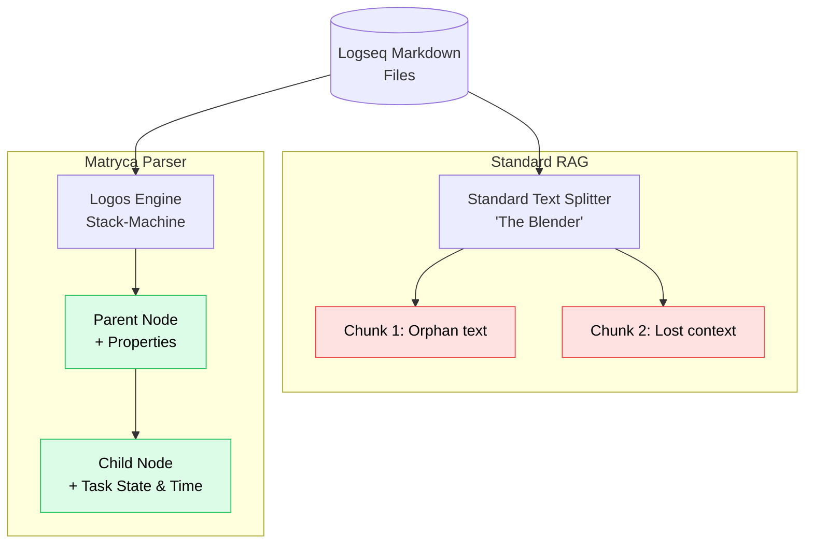

<div align="center">

# 🔱 Logseq Matryca Parser (The Logos Protocol)

**Stop feeding broken Markdown to your AI.**

[](https://github.com/MarcoPorcellato/logseq-matryca-parser/actions/workflows/ci.yml)
[](https://www.python.org/downloads/)
[](https://github.com/MarcoPorcellato/logseq-matryca-parser/blob/main/LICENSE)
[](https://pypi.org/project/logseq-matryca-parser/)
[](https://pypi.org/project/logseq-matryca-parser/)
[](#)


> *Turning a forest of local plain-text files into a unified semantic powerhouse.*

<p align="center">
  <video src="https://github.com/user-attachments/assets/24f73c6d-3eca-4adb-8442-981f2ba4cccd" autoplay loop muted playsinline width="800"></video>
</p>

[👉 **TRY THE LIVE INTERACTIVE DEMO**](https://MarcoPorcellato.github.io/logseq-matryca-parser/)

[Quickstart](#quickstart) · [Documentation](docs/README.md) · [Cookbook](docs/COOKBOOK.md) · [Release highlights](RELEASE_HIGHLIGHTS.md) · [AI / LLM index](llms.txt)

</div>

---

## Quickstart

Install the package and scan a Logseq graph:

```bash
uv pip install logseq-matryca-parser
matryca-parse scan /path/to/logseq/graph
```

The scan reports pages, blocks, references, and graph diagnostics without
changing the vault. Continue with the [CLI and Python examples](#usage), or use
the [Cookbook](docs/COOKBOOK.md) for RAG, graph-query, watcher, and agent recipes.

### Choose your workflow

- **Parse and query:** load one page or a complete vault as a typed AST and graph.
- **Build RAG context:** export LangChain documents, LlamaIndex nodes, or enriched chunks.
- **Move knowledge:** generate JSON, clean Markdown, or an Obsidian vault.
- **Visualize:** render an interactive graph with LENS.
- **Use an AI agent:** start from [`AGENTS.md`](AGENTS.md) or the concise [`llms.txt`](llms.txt) index.

---

## 🌐 The Vision: Virtual Centralization vs. Binary Lock-in

The PKM (Personal Knowledge Management) world is currently forcing users to make a painful choice between **Data Longevity** and **AI Power**.

* **Vanilla Logseq / Obsidian** is a "Forest" of decentralized Markdown files. It guarantees the Lindy effect (plain-text lasts forever) and perfect Git versioning, but standard AI chunkers treat it like a blender, destroying the outliner hierarchy.
* **Tana** is a centralized "Tree". It offers incredible semantic power, but traps your brain in a proprietary cloud database.
* **The new Logseq DB (SQLite)** aims for database speed, but at a huge cost: it locks your notes inside a binary `.db` file. You lose human-readable files, you lose line-by-line Git diffs, and you lose the immortality of plain-text.

### 🔱 The Matryca Solution: The Best of Both Worlds
**Logseq Matryca Parser** is the ultimate bridge. It allows you to **keep your sovereign, future-proof Markdown files**, while synthesizing a **Virtual Global Graph** in RAM at runtime.

It acts as the strict **File System Driver** for your LLM OS. By using a deterministic Stack-Machine to parse your outliner topology, it feeds LangChain or LlamaIndex with the exact parent-child context of every single block.

*You get the reasoning power of a centralized relational database, without sacrificing the plain-text soul of your Second Brain in Logseq.*

---

## ⚖️ The PKM Landscape

| Feature | Vanilla Markdown | **Matryca Parser** | Logseq DB (SQLite) | Tana |
| :--- | :--- | :--- | :--- | :--- |
| **Data Format** | Plain-text (.md) | **Plain-text (.md)** | Binary (.db) | Proprietary Cloud |
| **Version Control** | Perfect (Git) | **Perfect (Git)** | Poor (Binary blob) | None |
| **Data Structure** | Decentralized Forest | **Virtually Centralized Graph** | Relational Database | Centralized Tree |
| **AI Readiness** | Low (Linear Chunks) | **High (Topological AST)** | TBD (Requires SQL) | High (Proprietary) |
| **Sovereignty** | 100% Local | **100% Local (Sovereign AI)** | 100% Local | Cloud-Only |

---

## 🧭 Matryca vs. naive framework loaders

| Capability | Typical LangChain / LlamaIndex Markdown loaders | **Matryca (LOGOS + SYNAPSE + graph)** |
| :--- | :--- | :--- |
| **Parent–child context** | Character or heading splits; children often orphaned from parents | **True outliner AST**: every block carries `parent_id`, `path`, `left_id` and visits in deterministic tree order |
| **Block references `((uuid))`** | Treated as opaque text or dropped | **Resolved** against `LogseqGraph`; optional **embed expansion** and **Obsidian `[[Page#^anchor]]`** export |
| **Property inheritance** | Page-level frontmatter at best | **`get_effective_properties`**: page + ancestor outline keys merged top-down (Org-mode style), then exposed on enriched chunks |
| **Live sync** | Re-read whole tree or poll | **`LogseqGraph.start_watching()`** (optional `watchdog`): **per-file invalidation** — re-parse one page, purge stale UUIDs from registries, refresh backlinks |
| **Page aliases & titles** | Filename-only or manual link maps | **`title::`**, **`alias::`** / **`aliases::`** re-key `graph.pages` and wire **backlinks** for alias wikilinks |
| **Case-insensitive pages & tags** | Exact string match on filenames | **`get_page`**, **`resolve_relative_page_link`**, **`search_content`**, and **`GraphQuery.has_tag`** use case-insensitive matching (Datomic / Logseq parity) |
| **Attachments & assets** | Opaque `` text in chunks | **`LogseqNode.assets`** + **`LogseqPage.resolve_asset_path`** for graph-root PDFs and images |

---

### 🚀 The Problem
Standard RAG pipelines treat your notes like a blender. They chop Markdown into random shards, destroying the **parent-child hierarchy** that makes Logseq powerful.


```mermaid
graph TD
    Raw[(Logseq Markdown\nFiles)]

    subgraph Standard RAG
        Blender[Standard Text Splitter\n'The Blender']
        Chunk1[Chunk 1: Orphan text]
        Chunk2[Chunk 2: Lost context]
        Blender --> Chunk1 & Chunk2
    end

    subgraph Matryca Parser
        Architect[Logos Engine\nStack-Machine]
        Parent[Parent Node\n+ Properties]
        Child[Child Node\n+ Task State & Time]
        Architect --> Parent --> Child
    end

    Raw --> Blender
    Raw --> Architect

    classDef bad fill:#fee2e2,stroke:#ef4444,color:#000;
    classDef good fill:#dcfce7,stroke:#22c55e,color:#000;
    class Chunk1,Chunk2 bad;
    class Parent,Child good;
```

### 🔱 The Solution
Logseq Matryca Parser is a deterministic **Stack-Machine engine** that acts as the **File System Driver** for your LLM. It preserves the true topology of your thoughts, ensuring AI understands spatial hierarchy, time, and block-lineage—including **structured task state** and **first-class temporal attributes** you can query in downstream graph databases and GraphRAG engines without re-parsing raw Markdown.

---

## 🏗️ Core capabilities

| Outcome | What Matryca provides |
| :--- | :--- |
| **Parse faithfully — LOGOS** | Deterministic AST parsing for outlines, YAML and native properties, tasks, temporal markers, references, assets, code/math/query shields, stable UUIDs, line ranges, and format-preserving round trips. |
| **Understand the vault — Graph** | Canonical pages, aliases, backlinks, inherited properties, case-insensitive lookup, namespace resolution, fluent queries, broken-reference diagnostics, and optional per-file live reloads. |
| **Export and integrate — SYNAPSE, FORGE, LENS** | Lineage-aware LangChain and LlamaIndex exports, context-enriched chunks, JSON and Markdown serialization, Obsidian vault generation, and interactive graph visualization. |
| **Automate safely — KINETIC and agent tools** | CLI parse, scan, export, and visualization; token-efficient X-Ray reads; append-only logging; bounded AST writes; vault containment, dry-run patches, and atomic replacement. |

The base parser is local-first and has zero telemetry. Optional AI, watcher, and
visualization dependencies remain lazy. See the [architecture](docs/ARCHITECTURE.md)
and [API stability reference](docs/reference/API_STABILITY.md) for exact boundaries.

### Data model — `LogseqNode` task fields

Each AST block is a `LogseqNode`. Alongside `task_status`, the parser surfaces priority and schedule metadata as typed fields (epoch integers are **seconds since Unix epoch, UTC**):

```json
{
  "uuid": "6ba7b810-9dad-11d1-80b4-00c04fd430c8",
  "task_status": "TODO",
  "task_priority": "A",
  "scheduled_at": 1641600000,
  "deadline_at": 1641772800,
  "clean_text": "Cut v0.3.2 release"
}
```

Marker syntax (`[#A]`, `SCHEDULED: <...>`, `DEADLINE: <...>`) is stripped from `clean_text` so embeddings stay clean; the promoted fields carry the structured signal for downstream graph databases and GraphRAG engines.

---

## Usage

```bash
# Optional: filesystem watcher for live incremental graph updates
uv pip install 'logseq-matryca-parser[watch]'

# Or clone and sync all extras locally
uv sync --all-extras
```

```bash
# 1. Visualize your local graph (LENS)
matryca-parse visualize /path/to/logseq/graph my-map.html

# 2. Export for AI / RAG (SYNAPSE)
matryca-parse export /path/to/logseq/graph output --format langchain

# 3. Context-enriched LangChain JSON (graph + inheritance + embed expansion)
matryca-parse export /path/to/logseq/graph output --format langchain-enriched

# 4. Obsidian vault (YAML frontmatter + ^ block ids)
matryca-parse export /path/to/logseq/graph output --format obsidian

# Global options (all subcommands): --verbose, --graph /path/to/vault
matryca-parse --graph /path/to/logseq/graph --verbose export output --format json
```

### Python API

Prefer the package root for stable imports (see **`__all__`** in **`logseq_matryca_parser`**):

```python
from logseq_matryca_parser import (
    LogseqGraph,
    LogosParser,
    SynapseAdapter,
    SessionAliasRegistry,
    discover_graph_files,
)

# Parse a single page to AST (YAML or native frontmatter; utf-8-sig BOM-safe)
page = LogosParser().parse_page_file("page.md")
if page.root_nodes[0].assets:
    absolute = page.resolve_asset_path(page.root_nodes[0].assets[0])

# Load the whole vault (pages, backlinks, node registry)
graph = LogseqGraph.load_directory("/path/to/logseq/graph")
page_obj = graph.get_page("My Page")  # case-insensitive
effective = graph.get_effective_properties(page_obj.root_nodes[0].uuid)

# Export to LangChain with lineage metadata
docs = SynapseAdapter.to_langchain_documents(page.root_nodes, source_name=page.title)

# Optional strict same-page block-ref validation at parse time
from logseq_matryca_parser import StackMachineParser

strict_page = StackMachineParser(strict_refs=True).parse_page_file("page.md")
```

### 🤖 Agentic Write Access (Append-Only)

Agents such as Hermes or OpenClaw can record structured notes into a Logseq graph **without rewriting existing pages**. The helper `logseq_agent_write` only **opens the weekly agent page in append mode** (`"a"`), writes a new bullet (journal link + optional tag links + body), and never truncates or replaces prior content—so routine logging cannot wipe blocks that already live in that file.

Point it at your graph’s **`pages`** directory and **`config.edn`** so journal titles match Logseq’s `:journal/page-title-format` (including ordinal days when you use `do` in the pattern).

```python
from logseq_matryca_parser import logseq_agent_write

result = logseq_agent_write(
    "Summarized user intent and proposed next steps.",
    config_path="/path/to/logseq/config.edn",
    pages_dir="/path/to/logseq/pages",
    context_tags=["agent/hermes", "#session"],
)
assert result["status"] == "success"
# result["path"] → e.g. .../pages/2026-18-agent.md
```
---

## 🗺️ Roadmap
- [ ] **Desktop GUI:** Standalone app for non-technical users. [(Join the RFC)](https://github.com/MarcoPorcellato/logseq-matryca-parser/issues/3)
- [x] **Obsidian Adapter:** Native CLI export (`--format obsidian`) with YAML frontmatter and `^` block anchors.
- [ ] **Ollama Integration:** One-click local RAG setup. [(RFC draft)](docs/rfc/OLLAMA_RAG.md) · [(Track progress #34)](https://github.com/MarcoPorcellato/logseq-matryca-parser/issues/34)

## ☕ Support & Enterprise
Logseq Matryca Parser is open-source. If it powers your pipeline, consider a star ⭐ or a sponsorship!

**💖 [Sponsor me on GitHub](https://github.com/sponsors/MarcoPorcellato)**

Need custom RAG integrations or consulting? Contact: [marco@marcoporcellato.it](mailto:marco@marcoporcellato.it)

## 🤝 Contributing & Community

We welcome issues, pull requests, and constructive feedback.

| Resource | Link |
| :--- | :--- |
| **Good first issues** | [docs/GOOD_FIRST_ISSUES.md](docs/GOOD_FIRST_ISSUES.md) — starter tasks ([#19](https://github.com/MarcoPorcellato/logseq-matryca-parser/issues/19)–[#52](https://github.com/MarcoPorcellato/logseq-matryca-parser/issues/52)) |
| **Contributing** | [CONTRIBUTING.md](CONTRIBUTING.md) — setup, tests, PR workflow |
| **Cookbook** | [docs/COOKBOOK.md](docs/COOKBOOK.md) — integration recipes (Synapse, graph query, watcher) |
| **Documentation index** | [docs/README.md](docs/README.md) — active vs historical docs |
| **Documentation system** | [docs/DOCUMENTATION_SYSTEM.md](docs/DOCUMENTATION_SYSTEM.md) — authority, lifecycle, metadata, and federation |
| **Code of Conduct** | [CODE_OF_CONDUCT.md](CODE_OF_CONDUCT.md) — community standards |
| **Security** | [SECURITY.md](SECURITY.md) — report vulnerabilities privately |

## 📦 Release history

Read the complete [release highlights](RELEASE_HIGHLIGHTS.md), the exhaustive
[changelog](CHANGELOG.md), or the signed artifacts on
[GitHub Releases](https://github.com/MarcoPorcellato/logseq-matryca-parser/releases).

- **v1.7.1** — Added the runnable offline SYNAPSE RAG example and tightened release-note and optional-dependency security checks.
- **v1.7.0** — Hardened parser correctness, graph diagnostics, writer safety, API stability, documentation governance, and release provenance.
- **v1.5.0** — Added opt-in CLI detection of unresolved block references for vault and CI hygiene.
- **v1.4.2** — Fixed agent-write newline handling, controlled corrupt-state failures, and cyclic SYNAPSE page embeds.
- **v1.4.1** — Expanded contributor tests and refreshed the good-first-issue onboarding path.
- **v1.4.0** — Strengthened graph integrity, live reloads, serialization, path safety, strict references, and parser edge cases.
- **v1.3.1** — Aligned examples and skill installation instructions with the repository's `uv` workflow.
- **v1.3.0** — Expanded the stable API and improved graph reloads, strict references, SYNAPSE metadata, CLI behavior, and optional imports.
- **v1.2.2** — Restored CodeQL workflow reliability and documented its supported configuration.
- **v1.2.1** — Added the Python 3.12/3.13 CI matrix, security gates, release pre-flight, and contributor infrastructure.
- **v1.2.0** — Added graph parity, assets, round-trip serialization, Obsidian export, live watching, agent X-Ray mode, and headless writes.
- **v1.1.1** — Established title and alias indexing, backlinks, incremental reload, parser shields, property parsing, and broader task markers.

---
Architected by **Marco Porcellato** | Powered by **Matryca.ai**
