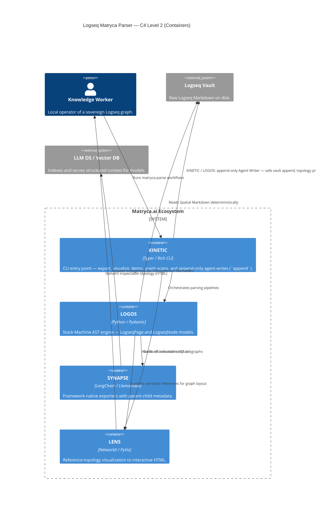
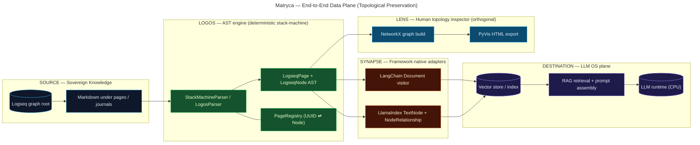
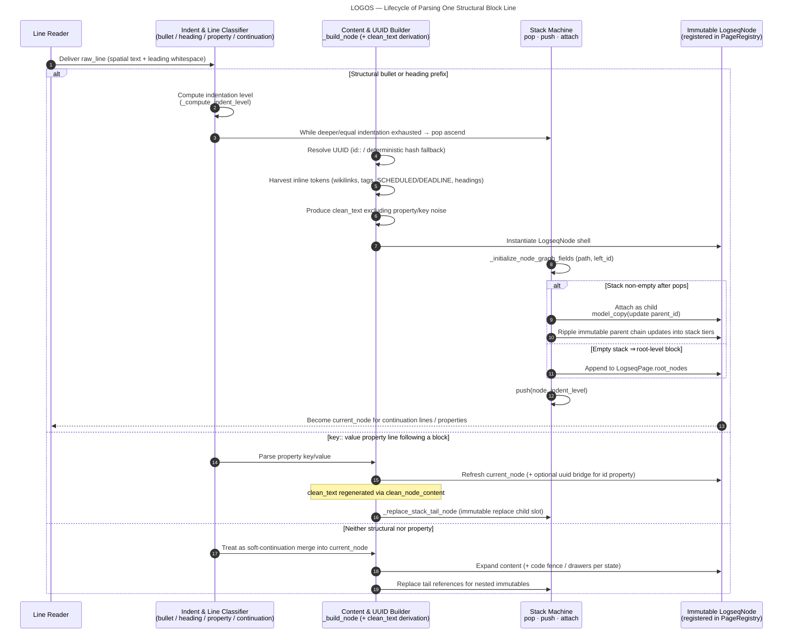

# Logseq Matryca Parser — Architecture (The Logos Protocol)

## 1. Title & High-Level Philosophy

### 1.1 The LLM operating system metaphor

Treat the intelligent stack not as an isolated language model but as **an operating system**:

| Layer              | Analogue in this architecture |
| ------------------ | ----------------------------- |
| **CPU**            | The LLM (reasoning, planning, generation). |
| **RAM**            | The **context window** — bounded, volatile working memory loaded from structured retrieval. |
| **Hard disk**      | The **Logseq graph** — durable, hierarchical, sovereign knowledge stored as outliner **Spatial Markdown** on disk. |

The Matryca Parser is the **deterministic translation layer**: it reads the hierarchical “filesystem” representation of thought (blocks, indentation, identities) without corrupting topology, so retrieval and prompting can assemble **faithful subgraphs** into RAM rather than brittle text shards.

### 1.2 “Blender RAG” vs. a topological file-system driver

**Naive / standard RAG** routinely applies **recursive or fixed-size chunkers** to raw Markdown. For Logseq-style graphs this behaves like dropping the disk into a blender: contiguous bytes are diced by character budgets, sibling blocks are fused with unrelated parents, and indentation semantics are erased. The result is embeddings of **ambiguous fragments** disconnected from lineage — a lossy projection of structured storage into unstructured bags of text.

The **Matryca (Logos) approach** rejects that erosion of structure. Implementation-wise, **`StackMachineParser` (alias `LogosParser`)** performs **O(N) deterministic parsing** using spatial indentation as the sole arbiter of parent–child linkage, yielding a rigorous **Abstract Syntax Tree (AST)** (`LogseqPage`, `LogseqNode`). **`SYNAPSE`** acts as driver-level output: adapters emit **LangChain `Document`** and **LlamaIndex `TextNode`** objects whose **metadata encodes lineage** (`parent_id`, `path`, `left_id`, graph tokens), preserving the **exact topological semantics** expected by Sovereign AI and local pipelines.

Together, LOGOS + SYNAPSE implement **Document-Driven Development** principles. Historical specifications and blueprints are preserved in [`/docs/design-docs/`](./design-docs/) to constrain behavior, while the runtime code enforces deterministic invariants matching those documents.

---

## 2. System Context Diagram

This section pairs a **C4 Model** view (Levels 1–2) with a **logical data-plane** flowchart. Together they document how Sovereign AI pipelines move from raw Spatial Markdown through deterministic parsing to structured context for retrieval and inference.

### 2.1 C4 Level 1 — System context

Actors and external systems framing **Logseq Matryca Parser** as the deterministic “driver” between the sovereign **Logseq Vault** and **LLM OS / Vector DB** runtimes.

### 2.2 C4 Level 2 — Containers

Containers live inside the **Matryca.ai Ecosystem** boundary: **KINETIC** is the operator entry point (including **append-only** agent writes to the vault); **LOGOS** rebuilds the AST; **SYNAPSE** projects the AST into framework-native AI types; **LENS** renders topology for human inspection.

### 2.3 Supplementary logical data-plane (flowchart)

The following pipeline is the complementary **logical** view for readers who prefer LR flow over C4 boxing: ingestion from raw graph markdown, deterministic AST construction, adapter emission, then downstream **vector store indexing** / **LLM OS** retrieval.

Auxiliary exporters (**FORGE** for JSON / flat Markdown) consume the same AST and are orthogonal to SYNAPSE; **KINETIC** is modeled in §2.2 but omitted from **§2.3**’s flowchart so the sovereign RAG data plane stays legible.

---

## 3. Core Components Detail

### 3.1 LOGOS — deterministic stack-machine parsing

**LOGOS** is the strict parser core ([`StackMachineParser`](../src/logseq_matryca_parser/logos_parser.py)).

- **Stack-machine semantics.** For each line, indentation is quantized (spaces plus tab-width scaling) into a discrete **logical level**. The parser maintains parallel stacks (`stack`, `stack_columns`, `stack_indents`). When a new bullet or heading block appears:
  - **Pop** ancestors while `stack_columns[-1] >= indent_level` (exit deeper subtrees).
  - **Maintain or nest** relative to the remaining top-of-stack (`stack[-1]`).
  - **Push** the freshly built `LogseqNode` onto the stack and register its UUID with `PageRegistry` for deterministic identity and future block-reference linkage.
  This yields **finite-state, linear-time** traversal with explicit ascend/descend behavior — not regex-driven whole-document guessing.

- **Spatial indentation rules.** In Logseq, **indentation defines the AST**, not list decoration. Heading blocks and bullets both participate as first-class structural lines. Levels are **normalized post-pass** to tree depth (`_normalize_indent_levels`) so persisted `indent_level` reflects hierarchical depth independent of authoring quirks after stack repair.

- **Block properties & `id::`.** Subsequent lines matching `key:: value` attach to **`current_node`** (or accumulate into **frontmatter-derived page properties** when no node exists yet). Parsed properties live in **`LogseqNode.properties`**. **`id::`** establishes the authoritative block UUID (`uuid` overridden from property `id` when present — the native anchor for `((uuid))` references inside Logseq).

- **`clean_text` isolation.** Embedding-facing text (`clean_text`) is produced by stripping property lines, timelines, markup noise appropriate to vector use, bullet prefixes, etc. **`content`** retains richer raw semantics; **`clean_text`** prevents **collapsed::**, SCHEDULED/DEADLINE noise, and similar system surface from poisoning semantic retrieval.

### 3.2 SYNAPSE — AST → LangChain / LlamaIndex with lineage injection

**SYNAPSE** (`logseq_matryca_parser.synapse`) implements **`ASTVisitor`** harnesses rather than brittle string serializers.

- **LangChain.** [`LangChainVisitor`](../src/logseq_matryca_parser/synapse.py) emits one **`Document`** per node with `page_content=node.clean_text` and metadata unioning **`node.properties`** with lineage fields (`uuid`, `parent_id`, `indent_level`, `source`, **`path`** — the UUID ancestry chain — `left_id`, `refs`, task/repeater/temporal cues). This preserves **parent context** explicitly in retrieval filters and re-ranking.

- **LlamaIndex.** [`LlamaIndexVisitor`](../src/logseq_matryca_parser/synapse.py) constructs **`TextNode`** instances keyed by **`id_=node.uuid`**. It wires **`NodeRelationship.PARENT`** and **`CHILD`** via **`RelatedNodeInfo`**, back-linking when the parent appears earlier in preorder traversal — encoding **topology as first-class edges** beyond flat metadata dictionaries.

Together, adapters guarantee that **embedding units align with intentional block boundaries**, not splitter accidents.

### 3.3 LENS — NetworkX topology + PyVis interactive visualization

**LENS** (`logseq_matryca_parser.lens.GraphVisualizer`) builds a **`networkx.Graph`** over **page ⇄ wiki/tag reference** projections using `NetworkXVisitor` during AST preorder walks. Nodes receive **degree-based sizing** (“sun” hotspots) and subgroup classification (`page`, `tag`, `journal`, etc.).

Visualization export uses **`pyvis`** with **`force_atlas_2based`** physics, fullscreen canvas, HUD filters, glassmorphism control chrome, and stabilized layout configuration suitable for **large graphs at interactive frame rates** in the browser (product positioning targets fluid exploration of graphs on the order of **10⁴ nodes**).

### 3.4 AGENT WRITER — Append-Only Sandboxing

While **LOGOS** reads and parses the graph into an immutable AST, **`agent_writer`** ([`logseq_matryca_parser.agent_writer`](../src/logseq_matryca_parser/agent_writer.py)) provides a **deterministic**, **configuration-aware** write path: it reads **`config.edn`** (for example **`:journal/page-title-format`**) so journal page filenames and titles match the vault’s own formatting rules. Writes use **`open(..., mode="a")`** **append-only** I/O so agents add blocks **after** existing bytes **without rewriting** or re-indenting prior structure — **existing topology is never torn down or merged by an overwrite**. Together with the **`append`** CLI command in **KINETIC**, this gives AI agents a bounded, inspectable channel to contribute material to journal or page files while **read/export pipelines** continue to treat the vault as the authoritative hierarchical source.

---

## 4. Data Flow Sequence

Lifecycle of introducing **one structural block line** after prior context established (bullet path; heading path symmetrically analogous).

---

## 5. The Matryca Moat — Why Standard RAG Fails on Outliner Markdown

Recursive and character-budget chunkers assume **approximately flat prose**. Logseq violates that assumption fundamentally:

| Failure mode                         | Impact on sovereign knowledge |
| ------------------------------------ | ------------------------------ |
| **Mid-block splits**                  | Fragments multimodal bullets; orphans soft-line continuations. |
| **Loss of indentation topology**      | Child insights appear unrelated to hypotheses in parent bullets. |
| **Property ingestion as prose**       | `collapsed:: true`, SCHEDULED markers, drawer noise degrade embedding geometry. |
| **UUID / reference desynchronization**| Block anchors no longer correspond to embeddings; graph-native references `((uuid))` become orphaned strings. |

**Deterministic AST parsing plus SYNAPSE metadata** restores **semantic sovereignty**: each retrieval unit inherits explicit **ancestor identity** (`parent_id`, cumulative `path`) and optional graph-native LlamaIndex **edges**, enabling **topology-aware augmentation** aligned with Andrej Karpathy’s mental model — the LLM “CPU” issues reads against a hierarchical disk through a **faithful driver**, not a stochastic blender.

---

*This document reflects the implementations in `src/logseq_matryca_parser/logos_parser.py`, `synapse.py`, `lens.py`, `logos_core.py`, and `agent_writer.py`, and complements narrative primers such as [`logseq_ast_primer.md`](logseq_ast_primer.md).* 
