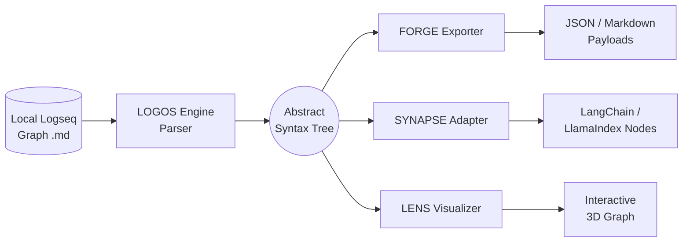
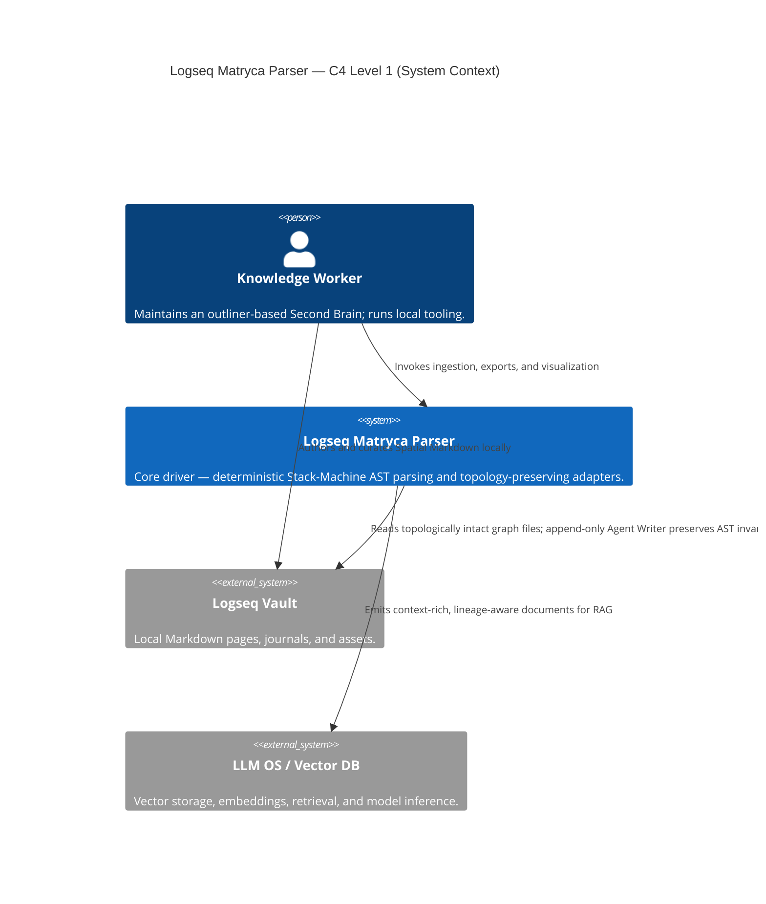
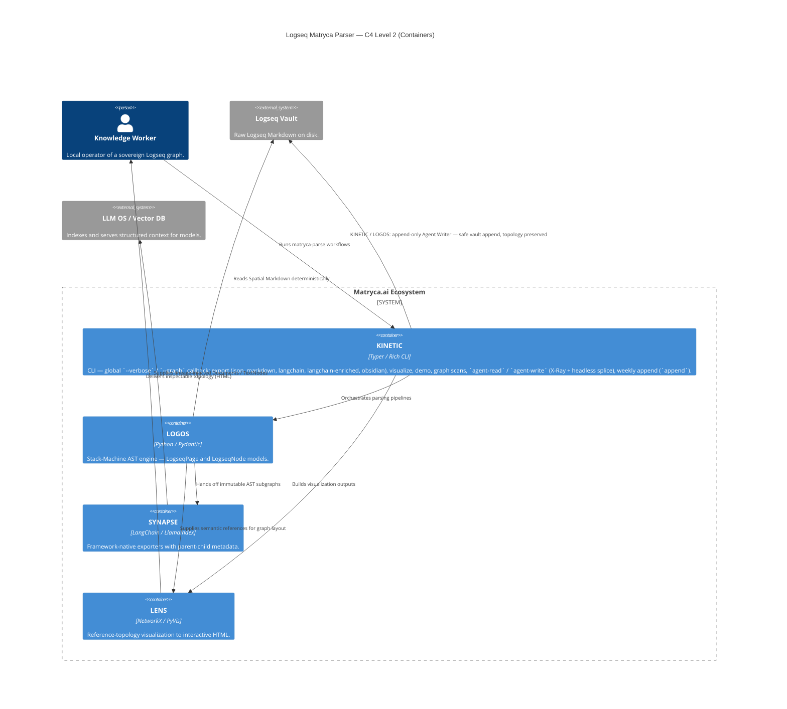
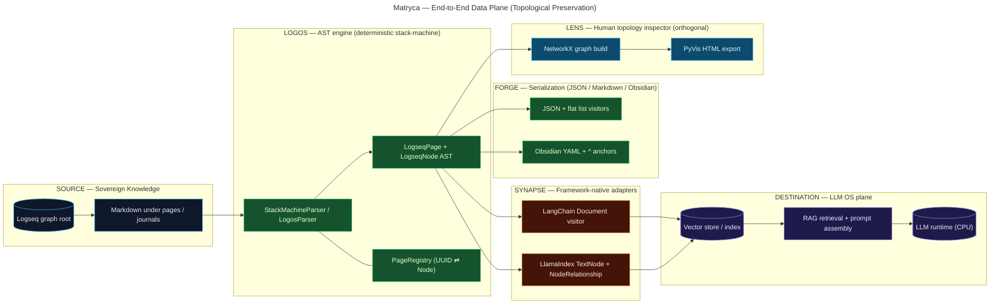
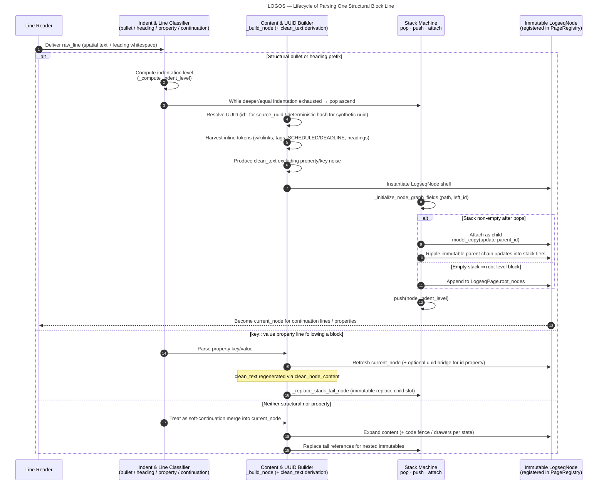

# Logseq Matryca Parser — Architecture (The Logos Protocol)

## System Architecture

High-level data flow from sovereign graph files through deterministic parsing to AST-backed exporters and adapters.



## 1. Title & High-Level Philosophy

### 1.1 The LLM operating system metaphor

Treat the intelligent stack not as an isolated language model but as **an operating system**:

| Layer              | Analogue in this architecture |
| ------------------ | ----------------------------- |
| **CPU**            | The LLM (reasoning, planning, generation). |
| **RAM**            | The **context window** — bounded, volatile working memory loaded from structured retrieval. |
| **Hard disk**      | The **Logseq graph** — durable, hierarchical, sovereign knowledge stored as outliner **Spatial Markdown** on disk. |

The Matryca Parser is the **deterministic translation layer**: it reads the hierarchical “filesystem” representation of thought (blocks, indentation, identities) without corrupting topology, so retrieval and prompting can assemble **faithful subgraphs** into RAM rather than brittle text shards.

### 1.2 “Blender RAG” vs. a topological file-system driver

**Naive / standard RAG** routinely applies **recursive or fixed-size chunkers** to raw Markdown. For Logseq-style graphs this behaves like dropping the disk into a blender: contiguous bytes are diced by character budgets, sibling blocks are fused with unrelated parents, and indentation semantics are erased. The result is embeddings of **ambiguous fragments** disconnected from lineage — a lossy projection of structured storage into unstructured bags of text.

The **Matryca (Logos) approach** rejects that erosion of structure. Implementation-wise, **`StackMachineParser` (alias `LogosParser`)** performs **O(N) deterministic parsing** using spatial indentation as the sole arbiter of parent–child linkage, yielding a rigorous **Abstract Syntax Tree (AST)** (`LogseqPage`, `LogseqNode`). **`SYNAPSE`** acts as driver-level output: adapters emit **LangChain `Document`** and **LlamaIndex `TextNode`** objects whose **metadata encodes lineage** (`parent_id`, `path`, `left_id`, graph tokens), preserving the **exact topological semantics** expected by Sovereign AI and local pipelines.

Together, LOGOS + SYNAPSE implement **Document-Driven Development** principles. Historical specifications and blueprints are preserved in [`/docs/design-docs/`](./design-docs/) to constrain behavior, while the runtime code enforces deterministic invariants matching those documents.

---

## 2. System Context Diagram

This section pairs a **C4 Model** view (Levels 1–2) with a **logical data-plane** flowchart. Together they document how Sovereign AI pipelines move from raw Spatial Markdown through deterministic parsing to structured context for retrieval and inference — and how **append-only, sandboxed writes** (Agent Writer / KINETIC) can extend the vault without re-parsing or rewriting existing structure on behalf of agents.

### 2.1 C4 Level 1 — System context

Actors and external systems framing **Logseq Matryca Parser** as the deterministic “driver” between the sovereign **Logseq Vault** and **LLM OS / Vector DB** runtimes.



### 2.2 C4 Level 2 — Containers

Containers live inside the **Matryca.ai Ecosystem** boundary: **KINETIC** is the operator entry point (including **append-only** agent writes to the vault); **LOGOS** rebuilds the AST; **SYNAPSE** projects the AST into framework-native AI types; **LENS** renders topology for human inspection.



### 2.3 Supplementary logical data-plane (flowchart)

The following pipeline is the complementary **logical** view for readers who prefer LR flow over C4 boxing: ingestion from raw graph markdown, deterministic AST construction, adapter emission, then downstream **vector store indexing** / **LLM OS** retrieval.



Auxiliary **FORGE** serialization (JSON / flat Markdown / Obsidian) appears as a parallel branch in **§2.3**; **KINETIC** orchestrates all surfaces but the operator CLI box is omitted from the RAG→LLM spine so the vector path stays legible.

---

## 3. Core Components Detail

### 3.1 LOGOS — deterministic stack-machine parsing

**LOGOS** is the strict parser core ([`StackMachineParser`](../src/logseq_matryca_parser/logos_parser.py)).

- **Stack-machine semantics.** For each line, indentation is quantized (spaces plus tab-width scaling) into a discrete **logical level**. The parser maintains parallel stacks (`stack`, `stack_columns`, `stack_indents`). When a new bullet or heading block appears:
  - **Pop** ancestors while `stack_columns[-1] >= indent_level` (exit deeper subtrees).
  - **Maintain or nest** relative to the remaining top-of-stack (`stack[-1]`).
  - **Push** the freshly built `LogseqNode` onto the stack and register its UUID with `PageRegistry` for deterministic identity and future block-reference linkage.
  This yields **finite-state, linear-time** traversal with explicit ascend/descend behavior — not regex-driven whole-document guessing.

- **Spatial indentation rules.** In Logseq, **indentation defines the AST**, not list decoration. Heading blocks and bullets both participate as first-class structural lines. The bullet detector accepts **unordered markers** (`-`, `*`) and **ordered-list markers** (`1. `, `12. `, …) via a shared `BULLET_PATTERN`, so numbered outlines participate in the stack machine like standard bullets. Levels are **normalized post-pass** to tree depth (`_normalize_indent_levels`) so persisted `indent_level` reflects hierarchical depth independent of authoring quirks after stack repair.

- **GFM task checkboxes (before Org-mode tasks).** On the first line of a block, GitHub-flavored checkboxes are recognized and mapped to **`task_status`** before Org-mode prefix fallback: `[ ]` → **`TODO`**, `[-]` → **`DOING`**, `[x]` / `[X]` → **`DONE`**. The checkbox token is stripped from **`clean_text`** so embeddings stay prose-only.

- **Org-mode task prefixes (extended).** After checkbox handling, **`_extract_task_status`** matches longest-first Org prefixes (`TODO`, `DOING`, `DELEGATED`, `IN-PROGRESS`, …) at the start of the first line and promotes the remainder to **`clean_text`**.

- **Protected regions (entity extraction dead zones).** Wikilink, tag, and block-reference harvesters run on **`_shield_inline_code`**-masked text so literals inside **fenced code** (backtick and tilde fences), **inline code**, **LaTeX** (`$…$` and `$$…$$`), **`#+BEGIN_QUERY` … `#+END_QUERY`** blocks (parse-loop state plus shielding), **HTML comments** (`<!-- … -->`), **escaped Markdown** (`\#`, `\[\[`), and **Org drawers** do not produce false graph tokens. **`{{query}}`** and **`{{advancedquery}}`** inline macros are fully shielded (no nested wikilink harvest). **`{{embed [[Page]]}}`** and similar embed macros are **not** fully opaque: nested wikilinks inside embed bodies are still harvested for graph indexing.

- **Block properties & `id::`.** Subsequent lines matching `key:: value` attach to **`current_node`** only while **`properties_allowed`** remains true (contiguous property window immediately under the bullet). A **soft-break** continuation disables further property extraction; later `key::` lines merge into **`content`** as plain text — **except** the Logseq contiguity exception: a `key::` line immediately after a closing code fence is still parsed as block metadata when contiguous under the bullet. Outer **`"`** / **`'`** on property values are stripped in the AST. Keys are normalized with **`_normalize_property_key`** (lowercase) for Datomic parity. Comma-separated **`tags::`**, **`alias::`**, **`aliases::`**, and **`page-tags::`** values split on commas but **ignore commas inside `[[wikilink]]` tokens**. An empty value (`alias::` with no inline text) opens a **pending bullet-list** accumulator: indented `-` / `*` lines deeper than the property line become **`list[str]`** values without creating child **`LogseqNode`** entries; list-shaped values also feed implicit graph tokens on **`LogseqNode.refs`**. Page frontmatter uses the same key normalization (`TITLE::` ≡ `title::`). Parsed properties live in **`LogseqNode.properties`**. Native **`id::`** values are preserved in **`source_uuid`** (and in **`properties["id"]`** when applicable) so **`((uuid))`** references match Logseq; the parser’s stable **`uuid`** field remains the synthetic identity used for AST wiring and adapters.

- **Structural edge cases.** Bare `-` or `*` lines (no text after the marker) parse as **empty blocks** instead of failing the bullet detector. **`[[Page#Section]]`** wikilinks contribute **`Page`** only (header anchor stripped) for graph routing. **`[Alias]([[Page]])`** hybrid alias links are wikilinks, not file **assets**.

- **Aliased block references in `clean_text`.** Markdown links of the form **`[Visible](((uuid)))`** are reduced to **`Visible`** in **`clean_text`** (brackets stripped) while UUIDs still populate **`block_refs`** for graph resolution.

#### Asset extraction and path resolution

During node build, **`_extract_assets`** scans block **`content`** for multimodal references:

| Source | Example | `LogseqNode.assets` entry |
| ------ | ------- | --------------------------- |
| Markdown image | `` | `../assets/scan.png` |
| PDF macro | `{{pdf mydoc.pdf}}` | `mydoc.pdf` |
| Local attachment link | `[spec](../assets/specs.pdf)` | `../assets/specs.pdf` (not hybrid `[[wikilink]]` links) |

**`LogseqPage.resolve_asset_path(asset_link)`** ([`logos_core.py`](../src/logseq_matryca_parser/logos_core.py)) decodes percent-encoded paths (`%20`), normalizes `../assets/` and `assets/` against the inferred **graph root**, and falls back to **`graph_root/assets/<filename>`** when needed — the contract Vision and document-ingestion pipelines use to map AST tokens to absolute filesystem paths. From **v1.4.0**, absolute paths and links that resolve **outside** the graph root are rejected (sandboxed to the vault).

#### Sovereign UUID architecture and zero-corruption guarantee

One of the most critical aspects of parsing a Logseq graph for AI is maintaining the integrity of block references (`((uuid))`) without causing infinite loops or polluting a vector database with duplicates.

The Logos protocol uses a **dual-track identity system** so vanilla Logseq compatibility and RAG-stable keys coexist:

1. **Native Logseq identity (absolute priority).** During AST traversal, the parser scans for Logseq’s native `id:: <uuid>` properties or inline IDs. If a block has been explicitly referenced in Logseq, that value is adopted as **`source_uuid`** — the absolute source of truth for cross-page block references and registry lookups.

2. **Topological deterministic hashing (AI fallback).** For blocks that do not carry a physical UUID in the Markdown file, Matryca generates a **deterministic SHA-256–based** synthetic UUID from strict coordinates: **page title**, **physical line number**, **exact plain-text content**, and the **parent node’s synthetic UUID** (a sentinel when the block is page-root level). Re-parsing therefore yields the same synthetic identities without random UUID v4 churn, while sibling branches cannot collide when only title, line, and text coincide.

- **`clean_text` isolation.** Embedding-facing text (`clean_text`) is produced by stripping property lines, timelines, markup noise appropriate to vector use, bullet prefixes, etc. **`content`** retains richer raw semantics; **`clean_text`** strips **collapsed::** and inline **SCHEDULED** / **DEADLINE** marker text (via `TIME_PATTERN`) so prose embeddings stay clean—while the same parse pass **promotes** decoded times to first-class node fields (below), avoiding the classic failure mode where temporal tokens pollute vectors yet remain unqueryable as data.

- **Task priority (`PRIORITY_PATTERN`).** Priority tags match `\[#([A-Z])\]` (Logseq’s A/B/C style). On the **first line** of a block, a match sets **`LogseqNode.task_priority`** to the captured letter and **`PRIORITY_PATTERN.sub("", …)`** removes the marker from **`clean_text`** so priority is a **typed attribute**, not redundant surface noise in retrieval text.

- **Temporal markers (`TIME_PATTERN`) → epoch fields.** Lines matching `\b(SCHEDULED|DEADLINE):\s*(<[^>]+>)` are parsed by **`_extract_time_properties`**: the `<…>` payload is interpreted through **`_parse_logseq_datetime`** (multiple Logseq date formats, **time ranges** `HH:MM - HH:MM` using the start time, **repeater** tokens such as `.+1w` / `++1d` stripped before parsing, and **Org warning periods** like `-3d` handled without datetime failures), then normalized to **UTC Unix epoch seconds** and assigned to **`LogseqNode.scheduled_at`** and **`LogseqNode.deadline_at`** respectively. Auxiliary keys (`scheduled_iso`, `deadline_journal_day`, repeaters, etc.) may still land in **`properties`** for human/debug parity, but the **integer epoch pair on the node** is the stable contract for **temporal graph edges**, range filters, and **GraphRAG** planners—without forcing downstream graph databases to re-scan Markdown.

#### Node anatomy — raw Markdown to temporal `LogseqNode`

```mermaid
classDiagram
  direction LR
  class RawMarkdown {
      <<Input>>
      String: "- TODO [#A] Ship new feature SCHEDULED: <2026-05-15>"
  }
  
  class LogseqNode {
      <<AST Output>>
      +uuid: String
      +clean_text: "Ship new feature"
      +task_status: "TODO"
      +task_priority: "A"
      +scheduled_at: 1778803200 (Epoch)
      +children: List~LogseqNode~
  }
  
  RawMarkdown --> LogseqNode : Parsing & Extraction
```



### 3.2 SYNAPSE — AST → LangChain / LlamaIndex with lineage injection

**SYNAPSE** (`logseq_matryca_parser.synapse`) implements **`ASTVisitor`** harnesses rather than brittle string serializers.

- **LangChain.** [`LangChainVisitor`](../src/logseq_matryca_parser/synapse.py) emits one **`Document`** per node with `page_content=node.clean_text` and metadata unioning **`node.properties`** with lineage fields (`uuid`, `parent_id`, `indent_level`, `source`, **`path`** — the UUID ancestry chain — `left_id`, `refs`, `task_status`, repeater, `created_at`). The underlying **`LogseqNode`** additionally carries **`task_priority`**, **`scheduled_at`**, and **`deadline_at`** (§3.1); adapters or custom visitors can project those into metadata when feeding **downstream graph databases** or **GraphRAG** filters. This preserves **parent context** explicitly in retrieval filters and re-ranking.

- **LlamaIndex.** [`LlamaIndexVisitor`](../src/logseq_matryca_parser/synapse.py) constructs **`TextNode`** instances keyed by **`id_=node.uuid`**. It wires **`NodeRelationship.PARENT`** and **`CHILD`** via **`RelatedNodeInfo`**, back-linking when the parent appears earlier in preorder traversal — encoding **topology as first-class edges** beyond flat metadata dictionaries. From **v1.3.0**, it also emits **`SOURCE`** (page-level anchor via **`page_source_node_id`**), **`NEXT`**, and **`PREVIOUS`** sibling edges for spatial traversal in vector stores.

- **Vector-store metadata.** **`SynapseMetadata`** and **`build_synapse_metadata`** project **`task_priority`**, temporal epoch fields, **`source_uuid`**, and joined **`path`** / **`refs`** strings into LangChain/LlamaIndex metadata without leaking raw Python list reprs.

Together, adapters guarantee that **embedding units align with intentional block boundaries**, not splitter accidents.

#### 3.2.1 Context-enriched RAG — `SynapseAdapter.to_context_enriched_chunks`

Beyond flat `Document` emission, **`to_context_enriched_chunks`** targets **vector pipelines that would otherwise lose outline semantics**. For each flattened block it builds `page_content` from a configurable template (default **`[{breadcrumbs}] {content}`**):

1. **Breadcrumbs.** [`_build_breadcrumbs`](../src/logseq_matryca_parser/synapse.py) walks the owning `LogseqPage` and the node’s UUID `path` so the chunk’s visible text carries **human-readable lineage** (page title + ancestor outline), not just an opaque `parent_id`.

2. **Recursive macro / embed expansion.** [`_expand_macros_and_embeds`](../src/logseq_matryca_parser/synapse.py) operates on **`node.content`** (not `clean_text`) so tokens hidden from embeddings—such as `((uuid))` inside `{{embed ((uuid))}}`—remain visible to the scanner. It expands **`{{embed ((uuid))}}`** by inlining the target block’s content (with **per-UUID cycle detection**) and **`{{embed [[Page]]}}`** by inlining page bodies via **`LogseqGraph.get_page`** (case-insensitive, with **per-title embed-chain detection** — the host page title seeds an immutable chain so inter-page cycles truncate at the re-entrant edge instead of re-inlining parent literals). Unresolved embed targets yield **empty replacement** instead of hanging the export pipeline (v1.4.0).

3. **Org-mode-style property inheritance.** Metadata includes **`effective_properties`**: the merge produced by [`LogseqGraph.get_effective_properties`](../src/logseq_matryca_parser/graph.py) — **page frontmatter first**, then each ancestor on `node.path` **top-down**, with deeper `LogseqNode.properties` **overriding** shallower keys. Downstream filters can therefore key off inherited `type::`, `status::`, etc., without re-walking the outline at query time.

The KINETIC **`export --format langchain-enriched`** path serializes these documents for offline inspection or ingestion.

### 3.3 LENS — NetworkX topology + PyVis interactive visualization

**LENS** (`logseq_matryca_parser.lens.GraphVisualizer`) builds a **`networkx.Graph`** over **page ⇄ wiki/tag reference** projections using `NetworkXVisitor` during AST preorder walks. Nodes receive **degree-based sizing** (“sun” hotspots) and subgroup classification (`page`, `tag`, `journal`, etc.). **NetworkX** and **PyVis** are **lazy-imported** (optional **`[viz]`** extra) so core installs avoid pulling visualization dependencies until `GraphVisualizer` is used.

Visualization export uses **`pyvis`** with **`force_atlas_2based`** physics, fullscreen canvas, HUD filters, glassmorphism control chrome, and stabilized layout configuration suitable for **large graphs at interactive frame rates** in the browser (product positioning targets fluid exploration of graphs on the order of **10⁴ nodes**).

### 3.4 AGENT WRITER — Append-Only Sandboxing & Headless Splicer

In the **LLM OS** metaphor, **LOGOS** is the **read path** into the hierarchical “disk”: it materializes Spatial Markdown into a **deterministic AST** that downstream adapters trust. **`agent_writer`** ([`logseq_matryca_parser.agent_writer`](../src/logseq_matryca_parser/agent_writer.py)) is the complementary **bounded write syscall** with two surfaces:

1. **Weekly append sandbox (`logseq_agent_write`).** A **deterministic**, **configuration-aware** channel that **dynamically reads `config.edn`** (for example **`:journal/page-title-format`**) so filenames and titles align with the vault’s own conventions. Writes use **`open(..., mode="a")`** **append-only** I/O — agents **append** new block material **after** existing bytes; they do **not** rewrite, merge, or re-indent prior content. Surfaced through the **`append`** command in **KINETIC**.

2. **Headless Markdown splicer (`append_child_to_node`).** For **in-place graph mutation** under an existing parent block, the engine resolves `target_uuid` via `LogseqGraph.get_node_by_uuid`, walks to the **deepest last descendant** to obtain a **1-based `line_end` insertion index**, and computes child indentation as **`(target_node.indent_level + 1) × graph.tab_size`** spaces before the `- {content}` bullet prefix. The raw file is split into lines (normalizing a missing final newline first so the last logical row is not concatenated with the splice), the new row is inserted at that index, and the result is flushed through a **same-directory `tempfile.mkstemp` + `os.replace`** — an atomic swap that avoids torn reads during concurrent tooling. **KINETIC** exposes this as **`matryca-parse agent-write`**, resolving parent blocks by **`--alias`** (from the X-Ray state file) or **`--target-uuid`**.

Both paths keep **existing topology intact** relative to their contract: append-only journaling never truncates prior bytes; the splicer only inserts one new child line at an AST-derived coordinate so a subsequent **LOGOS** parse remains deterministic.

### 3.5 FORGE — multi-target serialization (JSON, Markdown, Obsidian)

**FORGE** ([`forge.py`](../src/logseq_matryca_parser/forge.py)) hosts **AST visitors** that project the same immutable `LogseqNode` trees into transport-friendly artifacts. Besides nested **JSON** and hierarchy-preserving **clean Markdown**, **`ObsidianForgeVisitor`** emits **Obsidian-flavored Markdown**: a YAML **`---` frontmatter** block from merged page properties, list lines derived from the first line of each block’s **`content`** (so `((uuid))` survives when stripped from `clean_text`), **`[[Page#^anchor]]`** link rewriting via an optional embed resolver, and trailing **`^`** anchors on blocks that are referenced anywhere in the vault. **KINETIC** exposes this as **`matryca-parse export … --format obsidian`**, writing one file per page and mirroring **namespace segments** as nested directories.

### 3.6 `LogseqGraph` — namespace scoping, O(1) invalidation, live watch

The **in-memory graph** ([`graph.py`](../src/logseq_matryca_parser/graph.py)) is the runtime **RAM image** of the sovereign vault: `pages: dict[str, LogseqPage]`, a private **`_node_registry`** keyed by synthetic block UUID, and a **`_backlink_registry`** mapping normalized link targets to source node UUIDs. **`LogseqGraph`** uses **`ConfigDict(strict=True, validate_assignment=True)`** (not frozen) so **`invalidate_and_reload_page`** can mutate registries and page maps without `object.__setattr__` workarounds.

#### Page title overrides and alias indexing (`_enrich_pages_index`)

After every bulk or incremental parse, the graph applies a **post-parse enrichment pass** before backlink construction:

1. **Filename → canonical title.** Each markdown file is first keyed by **`derive_page_title_from_source_path`** (see §3.9).
2. **`title::` override.** If page frontmatter contains a non-empty string **`title`**, the `LogseqPage` is updated via **`model_copy(update={"title": custom})`**, the old filename key is removed from **`pages`**, and the page is re-inserted under the custom title (collision with another file’s title is skipped with a debug log).
3. **Alias injection.** For each canonical dict entry where **`dict_key == page.title`**, values from **`alias::`** and **`aliases::`** are normalized (comma-separated strings or Python lists; `[[Page]]` / `#tag` adornments stripped using the same rules as [`logseq_markdown.py`](../src/logseq_matryca_parser/logseq_markdown.py)) and registered as **additional keys** pointing at the **same `LogseqPage` instance** — e.g. `pages["Dev"]` and `pages["Development"]` share identity.
4. **Backlinks.** **`_build_backlink_registry`** walks **unique pages** (`id(page)` deduplication) so alias keys do not double-count outgoing links. Incoming wikilinks such as **`[[Dev]]`** normalize to lowercase registry keys and resolve through **`get_backlinks("Dev")`** like any other page title.

#### Case-insensitive page routing

**`LogseqGraph`** maintains **`_lower_title_map`**: canonical display titles keyed by lowercase form. **`get_page(title)`** returns a direct **`pages[title]`** hit when present, otherwise resolves via the lowercase index (Datomic / Logseq parity). **`resolve_relative_page_link`** uses the same lookup when testing namespace candidates. **`get_backlinks`** normalizes page-title targets case-insensitively.

#### Implicit graph tokens (`refs`)

**`LogseqPage.refs`** merges wikilinks and tags harvested from page-level properties (native `key::` frontmatter and **YAML `---` blocks** at parse time). **`page-tags::`** is treated like **`tags::`** for implicit injection. Block-level list-shaped **`tags::`** / **`page-tags::`** values also contribute tokens to **`LogseqNode.refs`** so list bullets and comma-separated strings stay aligned with Logseq’s graph indexing semantics.

**Incremental parity:** **`invalidate_and_reload_page`** drops **all** `pages` keys tied to the file’s `source_path` (not only the first alias hit), merges the freshly parsed page, re-runs **`_enrich_pages_index`**, then re-registers nodes and appends backlinks for the enriched instance. **`_page_title_for_source_path`** returns the canonical **`page.title`**, not an arbitrary alias key.

```python
graph = LogseqGraph.load_directory("/vault")
dev = graph.pages["Dev"]              # alias key
assert dev is graph.pages["Development"]
assert linker in graph.get_backlinks("Dev")
```

#### Namespace shadowing (`resolve_relative_page_link`)

Relative page resolution follows **Logseq-style longest-prefix wins**: for a current page title split on **`/`** (namespace segments), the resolver tries candidates **`prefix + "/" + link_target`** for prefixes from **full namespace down to empty**, and returns the **first title that exists** in `pages`. Only if no contextual page exists does it fall back to a **global** title match. Thus a contextual page **`Progetti/AI/Sviluppo`** **shadows** a global **`Sviluppo`** when resolving from **`Progetti/AI/Matryca`** — matching the **nested-namespace shadowing** semantics described in the scoping roadmap. From **v1.4.0**, **`../`** and **`./`** path segments are supported when resolving relative wikilinks.

#### Incremental file invalidation (`invalidate_and_reload_page`)

Full-directory loads are expensive for always-on agents. **`invalidate_and_reload_page(path)`** implements **page-level surgical refresh**:

1. Ignore paths outside tracked **`pages/*.md`** and **`journals/*.md`**.
2. If the file **no longer exists** on disk, purge every **`pages`** key tied to that **`source_path`**, remove stale UUIDs from **`_node_registry`**, and scrub **`_backlink_registry`** entries — then return (no **`FileNotFoundError`**).
3. Re-parse existing files with **`StackMachineParser.parse_page_file`**, producing a fresh `LogseqPage`.
4. If the path previously mapped to a page, collect **all synthetic UUIDs** from the old tree and call **`_purge_stale_page_uuids`**: remove each UUID from **`_node_registry`**, scrub those UUIDs from every **`_backlink_registry`** source list, and delete backlink keys that become empty.
5. Remove every **`pages`** key whose value shares the file’s **`source_path`**, insert the freshly parsed page under its filename title, run **`_enrich_pages_index`** (title + aliases), then **`_register_page_nodes`** and **`_append_page_backlinks`** for the enriched page.

**`append_child_to_node`** (headless splice) invokes **`invalidate_and_reload_page`** after a successful write so agent tooling sees the same graph state as on-disk Markdown.

This keeps **global indexes consistent** without rebuilding the entire graph — including alias keys and custom titles declared in frontmatter.

#### Live filesystem watcher (`start_watching`)

**`LogseqGraph.start_watching(callback=None, debounce_seconds=0.5)`** (optional **`watchdog`** install) returns a **`LogseqGraphWatcher`** that schedules a recursive **`Observer`** on the graph root. **`on_modified` / `on_created` / `on_deleted` / `on_moved`** events for tracked Markdown call **`invalidate_and_reload_page`**, then optionally invoke **`callback(path)`** — the intended hook for **vector store patch**, **re-embedding**, or UI refresh. **`_DebouncedGraphEventRouter`** coalesces rapid save bursts (~500ms default) and ignores editor temp/swap artifacts (`.swp`, `~`, `.tmp`, `.DS_Store`). Event routing ignores directories and non-tracked extensions so the hot path stays tight.

#### Parse-time reference validation (`strict_refs`)

**`StackMachineParser(..., strict_refs=False)`** (default) resolves same-page `((uuid))` block refs leniently. When **`strict_refs=True`**, unresolved refs raise **`BlockReferenceError`** at parse time — complementary to **`LogseqGraph.get_broken_references()`**, which scans the loaded graph post-hoc. **`LogseqGraph.load_directory(..., strict_refs=True)`** runs **`raise_if_broken_references()`** after indexing to fail fast on cross-page broken `((uuid))` refs.

#### Canonical page iteration (`iter_canonical_pages`, `page_for_node`)

**`graph.pages`** may contain multiple keys (filename title, **`title::`** override, **`alias::`** keys) pointing at the same **`LogseqPage`** instance. Exporters and graph scans must not double-count alias keys. **`iter_canonical_pages()`** yields one page per unique object identity; **`page_for_node(node)`** returns the owning page for a block UUID. **KINETIC**, **SYNAPSE**, and **LENS** use canonical iteration for export and statistics (v1.4.0).

#### Case-insensitive tag and content search

**`search_content`**, **`get_nodes_by_tag`**, and **`GraphQuery.has_tag`** normalize tag tokens case-insensitively and accept an optional leading **`#`**. **`get_namespace_children`** uses case-insensitive namespace prefix matching. Wikilink backlink keys include canonical titles and **`alias::`** values so **`get_backlinks("Development")`** matches **`[[Dev]]`**.

#### Fluent topological queries (`GraphQuery`)

**`graph.query()`** seeds a [`GraphQuery`](../src/logseq_matryca_parser/graph.py) with **all registered nodes**, then applies chainable filters: **`has_tag`**, **`with_priority`**, **`under_parent(parent_uuid)`** (ancestor chain on `path`), **`is_task_state`**, and **`execute()`** returning a materialized list. This is the **programmatic complement** to SQL-less graph inspection — ideal for **batch exporters**, **lint rules**, and **agent planners** that need a typed slice of the outline without ad-hoc traversal code.

#### AST reference linter (`get_broken_references`)

**`LogseqGraph.get_broken_references()`** scans every node in **`_node_registry`**. When **`block_refs`** contains a `((uuid))` target absent from the registry, the **originating node** is collected. Downstream apps (MCP servers, CI, pre-embed hooks) get **structural link validation** aligned with LOGOS identity rules — not brittle regex over raw Markdown. **KINETIC** exposes the same check via **`matryca-parse scan --broken-refs`** (v1.5.0): Rich table output and exit status **1** when any broken refs exist — suitable for vault hygiene pipelines without custom Python glue.

### 3.7 AGENT PRESS — Agent-native printing press & X-Ray mode

Human-facing RAG (SYNAPSE enriched chunks, breadcrumbs, inherited properties) optimizes for **embedding geometry** and **retrieval filters**. Autonomous agents running tight **read → plan → write** loops need a different projection: **the fewest tokens per topological fact**. **`agent_press.py`** ([`logseq_matryca_parser.agent_press`](../src/logseq_matryca_parser/agent_press.py)) implements the **Printing Press** paradigm: compress the in-memory AST for machine consumption **without** sacrificing parent–child shape.

#### Stateful session registry (`.matryca_xray_state.json`)

X-Ray is designed for **stateless LLM toolchains**: each `agent-read` invocation is a fresh process, yet agents must still **write back** to blocks they only saw as `[n]` tokens. After **`generate_aliases`**, **KINETIC** persists the alias map to **`<graph_root>/.matryca_xray_state.json`** via **`SessionAliasRegistry.save_to_disk`**. A later **`matryca-parse agent-write --alias N`** loads that JSON with **`load_from_disk`**, resolves `N → uuid`, and hands off to **`append_child_to_node`**. Malformed or empty state files yield a controlled CLI exit (empty registry for whitespace-only files; **`SessionAliasRegistryError`** for invalid JSON) rather than an uncaught traceback. The read/write pair therefore composes as **two independent CLI exits** without stuffing UUIDs into the model context — the filesystem holds session continuity.

#### Session alias mechanics (`SessionAliasRegistry`)

`SessionAliasRegistry` is a **session-scoped translation table** (in-RAM during a single command, rehydratable from disk across commands) between lightweight aliases and sovereign block identities:

| Operation | Role |
| --------- | ---- |
| **`generate_aliases(nodes)`** | Depth-first over each input forest; assigns **`0..n-1`** to every distinct `LogseqNode.uuid`; returns **`dict[int, str]`** (alias → real UUID). |
| **`resolve_alias(alias)`** | Inverse lookup for **targeted writes** — e.g. the agent says *“modify block `[12]`”* and the driver resolves `[12]` → `64a8b0c1-…` without ever loading 36-char IDs into the prompt. |
| **`alias_for_uuid`** | Used by the renderer to stamp `[n]` on each outline line. |

Heavy Logseq identifiers (`id:: 64a8b0c1-d33b-4448-a261-e4dc2bbe12d3`, synthetic `uuid` fields, property keys) **never appear** in the X-Ray stream. The agent reasons over **`[n]`** tokens; the Matryca stack retains the **authoritative UUID map** off-context — the same dual-track identity model as LOGOS (§3.1), but **projected for RAM-efficient agent turns**.

#### Ultra-dense export (`to_xray_markdown`)

**`to_xray_markdown(nodes, registry)`** serializes only:

```text
{indent}[{alias}] {clean_text}
```

- **`indent`** — two spaces × `LogseqNode.indent_level` (outline depth preserved).
- **`alias`** — integer from the registry, not a UUID string.
- **`clean_text`** — embedding-grade prose (properties, drawers, `collapsed::`, and schedule markers already stripped at parse time).

No YAML, no JSON wrappers, no collapsed-state metadata, no blank separator lines — **pure topology + semantics** for the LLM “CPU” to load into its context window.

#### KINETIC `agent-read` / `agent-write` — Rich bypass for machine stdout

The compound CLI commands **`agent_read`** and **`agent_write`** in [`kinetic.py`](../src/logseq_matryca_parser/kinetic.py) are the operator surfaces for the **Headless CRUD** loop:

**`matryca-parse agent-read`**

1. **`LogseqGraph.load_directory`** — materialize the RAM image of the vault.
2. **Filter** — `graph.query().has_tag(tag).execute()` when `--tag` is set; otherwise `search_content(query)` when `--query` is set; otherwise all registered nodes.
3. **`SessionAliasRegistry.generate_aliases`** → **`save_to_disk(.matryca_xray_state.json)`** → **`to_xray_markdown`**.
4. **Emit via `sys.stdout.write`** — deliberately **not** Typer’s Rich `Console`.

**`matryca-parse agent-write`**

1. Reload the graph (fresh AST coordinates after any external edits).
2. Resolve **`--alias`** through the persisted registry (or accept **`--target-uuid`** directly).
3. **`append_child_to_node`** — atomic Markdown splice at the parent’s AST line index.

Rich styling injects **ANSI escape sequences** that waste tokens and can cause models to **hallucinate markup** as content. `agent-read` is **stdout-pure** so shell pipelines, MCP tools, and headless agents receive **unescaped plain text** only. Human-oriented commands (`scan`, `export`, `visualize`) keep Rich; the **machine-native read/write paths** opt out where token fidelity matters.

**Global CLI options (v1.3.0).** [`kinetic.py`](../src/logseq_matryca_parser/kinetic.py) registers **`@app.callback()`** with **`--verbose`** and **`--graph`** so every subcommand shares graph-path resolution and debug logging. Optional extras (`[ai]`, `[viz]`) print **`uv sync --extra …`** hints on import failure.

This complements §3.4 **AGENT WRITER** (weekly append + headless splice) and §3.2 **SYNAPSE** (human/RAG chunking): one stack, multiple projections — **enriched chunks for vectors**, **X-Ray + alias state for agent context**, **append / splice for durable writes**.

### 3.8 Bidirectional I/O and Logseq Layouts

Wave 12 established **surgical writes** (single-line splices); v1.0 completes the loop with **full page round-tripping**. [`logseq_markdown.py`](../src/logseq_matryca_parser/logseq_markdown.py) is the native serializer that projects a parsed **`LogseqPage`** back onto sovereign Spatial Markdown — the inverse of LOGOS ingestion.

#### Ingestion vs native serialization

**Read path:** **`StackMachineParser.parse_page_file`** reads files with **`encoding="utf-8-sig"`** so a UTF-8 BOM from Windows sync tools does not break the first bullet. Page metadata at file start may be either:

1. **Native Logseq frontmatter** — raw `key:: value` lines (no leading `- `), blank line, then bullets.
2. **YAML frontmatter** — `---` delimited block with `key: value` lines mapped into **`LogseqPage.properties`** (same lowercase key normalization).

**Write path:** [`serialize_logseq_page`](../src/logseq_matryca_parser/logseq_markdown.py) is **format-preserving** for page headers. If `page.raw_content` began with `---`, page properties re-emit as a YAML fence via [`_format_yaml_frontmatter`](../src/logseq_matryca_parser/logseq_markdown.py); otherwise [`format_logseq_page_properties`](../src/logseq_matryca_parser/logseq_markdown.py) writes native **`key:: value`** lines. At parse time, a non-empty **`title`** property (YAML or `title::`) sets **`LogseqPage.title`**; [`LogseqGraph`](../src/logseq_matryca_parser/graph.py) re-applies **`title::`** overrides when loading a vault directory.

**Obsidian FORGE** (§3.5) may emit YAML frontmatter on export even for pages that were natively `key::` on disk — that projection is separate from sovereign round-trip writes.

#### Page properties (file header)

- **Native:** [`format_logseq_page_properties`](../src/logseq_matryca_parser/logseq_markdown.py) renders `key:: value` lines (list-valued keys such as `tags::` flatten to comma-separated tokens), then a blank line before the first bullet.
- **YAML:** [`_format_yaml_frontmatter`](../src/logseq_matryca_parser/logseq_markdown.py) renders `key: value` lines inside `---` fences when the ingested file used YAML.

#### Block properties (strict indentation contract)

Block-scoped properties are serialized **immediately after the bullet text line** (and after `:LOGBOOK:` drawers when present), never interleaved with child bullets. The indent rule is strict and deterministic:

```text
{parent_leading_whitespace}  {key}:: {value}
```

That is, take the **exact leading whitespace** of the parent bullet line and append **exactly two additional spaces** (`_block_property_indent`). Continuation lines of multiline block bodies use the same `parent + 2` column; [`_serialize_logseq_node_lines`](../src/logseq_matryca_parser/logseq_markdown.py) strips redundant alignment prefix on soft-break lines so continuations do not double-indent on round-trip.

[`format_logseq_block_property_lines`](../src/logseq_matryca_parser/logseq_markdown.py) respects **`properties_order`** when present. **List-shaped** keys (`tags`, `alias`, `aliases`, `page-tags`) with list values emit `key::` plus indented `-` item lines via [`_format_block_property_list_lines`](../src/logseq_matryca_parser/logseq_markdown.py). **`:LOGBOOK:`** metadata re-emits as Org drawers via [`_format_logbook_drawer_lines`](../src/logseq_matryca_parser/logseq_markdown.py), not as `logbook::` property lines. Keys in **`_DERIVED_BLOCK_PROPERTY_KEYS`** (`scheduled`, `repeater`, `logbook`, etc.) are parsed into AST fields or drawers and are **not** written back as bogus `key::` lines.

#### Full-page emission

[`serialize_logseq_page`](../src/logseq_matryca_parser/logseq_markdown.py) walks `page.root_nodes` depth-first, emitting `- {first_line}` bullets scaled by `indent_level × tab_size`, then continuations, then drawers/properties, then children. [`write_logseq_page`](../src/logseq_matryca_parser/logseq_markdown.py) persists the result with UTF-8 encoding. Together with §3.4’s **`append_child_to_node`**, the stack now supports **point mutations** and **whole-page regeneration** from the same AST — bidirectional I/O without Logseq’s HTTP API.

### 3.9 Namespace & Path Translation

Semantic page titles and OS filesystem paths speak different dialects. [`logseq_paths.py`](../src/logseq_matryca_parser/logseq_paths.py) centralizes that translation so graph loaders, exporters, and the write engine agree on **where a page lives on disk**.

#### Title ↔ filename mapping

Logseq namespaces use **`/`** in titles (e.g. `Projects/AI`). On disk, each segment is flattened into a single filename stem with the **`___`** separator (modern Logseq) and percent-encoding for reserved characters — e.g. `Projects/AI` → `Projects___AI.md`. The inverse helpers **`filename_to_page_title`** and **`derive_page_title_from_source_path`** reconstruct semantic titles from `pages/` or `journals/` paths, including nested directory layouts when namespace segments are stored as folders. **`filename_to_page_title`** also decodes **legacy** encodings: URL-encoded **`%2F`** namespace separators and Dendron-style **`.` → `/`** segment splits when reconstructing titles from flat stems.

| Direction | Function | Example |
| --------- | -------- | ------- |
| Title → stem | `page_title_to_filename` | `Projects/AI` → `Projects___AI` |
| Stem → title | `filename_to_page_title` | `Projects___AI` → `Projects/AI` |
| Legacy stem | `filename_to_page_title` | `Work%2FTasks` → `Work/Tasks`; Dendron `a.b.c` → `a/b/c` |
| Title → relative path | `page_title_to_relative_path` | `pages/Projects___AI.md` |

#### Graph discovery filters

When scanning a vault root, **`discover_graph_files`** (in [`logseq_paths.py`](../src/logseq_matryca_parser/logseq_paths.py), shared by **`LogseqGraph.load_directory`** and **KINETIC**) enumerates `pages/` and `journals/` markdown. **`is_excluded_graph_path`** drops noise directories — notably **`.recycle`**, **`.git`**, and the internal **`logseq`** config tree — so incremental watchers and bulk loaders never ingest backup blobs or VCS metadata as pages. This keeps **`LogseqGraph.load_directory`** and **`invalidate_and_reload_page`** focused on sovereign content under `pages/` and `journals/`.

---

## 4. Data Flow Sequence

Lifecycle of introducing **one structural block line** after prior context established (bullet path; heading path symmetrically analogous).



---

## 5. The Matryca Moat — Why Standard RAG Fails on Outliner Markdown

Recursive and character-budget chunkers assume **approximately flat prose**. Logseq violates that assumption fundamentally:

| Failure mode                         | Impact on sovereign knowledge |
| ------------------------------------ | ------------------------------ |
| **Mid-block splits**                  | Fragments multimodal bullets; orphans soft-line continuations. |
| **Loss of indentation topology**      | Child insights appear unrelated to hypotheses in parent bullets. |
| **Property ingestion as prose**       | `collapsed:: true`, SCHEDULED markers, drawer noise degrade embedding geometry. |
| **UUID / reference desynchronization**| Block anchors no longer correspond to embeddings; graph-native references `((uuid))` become orphaned strings. |

**Deterministic AST parsing plus SYNAPSE metadata** restores **semantic sovereignty**: each retrieval unit inherits explicit **ancestor identity** (`parent_id`, cumulative `path`) and optional graph-native LlamaIndex **edges**, enabling **topology-aware augmentation** aligned with Andrej Karpathy’s mental model — the LLM “CPU” issues reads against a hierarchical disk through a **faithful driver**, not a stochastic blender.

---

*This document reflects the implementations in `src/logseq_matryca_parser/logos_parser.py`, `synapse.py`, `graph.py`, `forge.py`, `lens.py`, `logos_core.py`, `agent_writer.py`, `agent_press.py`, `logseq_markdown.py`, `logseq_paths.py`, `kinetic.py`, and the public exports in `__init__.py`, and complements narrative primers such as [`logseq_ast_primer.md`](logseq_ast_primer.md).*

---

## 6. Further reading for contributors

| Document | When to read |
| :--- | :--- |
| [`logseq_ast_primer.md`](logseq_ast_primer.md) | Before touching parser or serialization behavior |
| [`COOKBOOK.md`](COOKBOOK.md) | Integration examples (Synapse, `LogseqGraph`, watcher) |
| [`GOOD_FIRST_ISSUES.md`](GOOD_FIRST_ISSUES.md) | Picking a first PR ([#19](https://github.com/MarcoPorcellato/logseq-matryca-parser/issues/19)–[#52](https://github.com/MarcoPorcellato/logseq-matryca-parser/issues/52)); wave 1 tests landed in **v1.4.1**, wave 2 + bugfix regressions in **v1.4.2**, **GFI-11** (`scan --broken-refs`) in **v1.5.0** |
| [`README.md`](README.md) | Project overview and quickstart |
| [`../CONTRIBUTING.md`](../CONTRIBUTING.md) | `uv` setup, `make all` (**451** pytest, ~**91%** coverage), PR checklist |
| [`design-docs/README.md`](design-docs/README.md) | Warning before using historical DDD blueprints |

### Quality gate (v1.5.0)

Local and CI parity: `uv sync --all-extras` → `make lint` → `make check` → `make test`. The test gate enforces **≥80%** coverage on `src/logseq_matryca_parser` with **451** pytest cases as of **v1.5.0** (community wave 2 via [#58](https://github.com/MarcoPorcellato/logseq-matryca-parser/pull/58), agent-write / SYNAPSE regression tests, and **`scan --broken-refs`** via [#77](https://github.com/MarcoPorcellato/logseq-matryca-parser/pull/77)). Dedicated modules: `tests/test_exceptions.py`, `tests/test_extract_changelog.py` — see [`GOOD_FIRST_ISSUES.md`](GOOD_FIRST_ISSUES.md) § Test suite.
