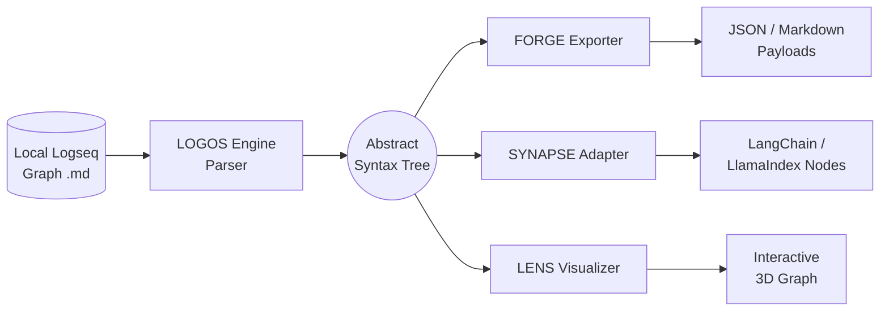
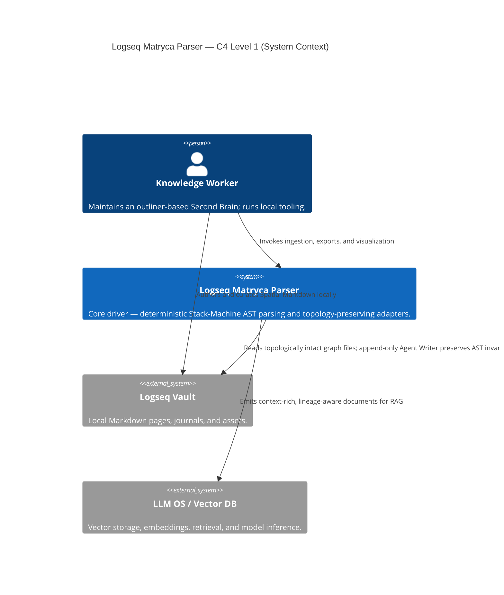
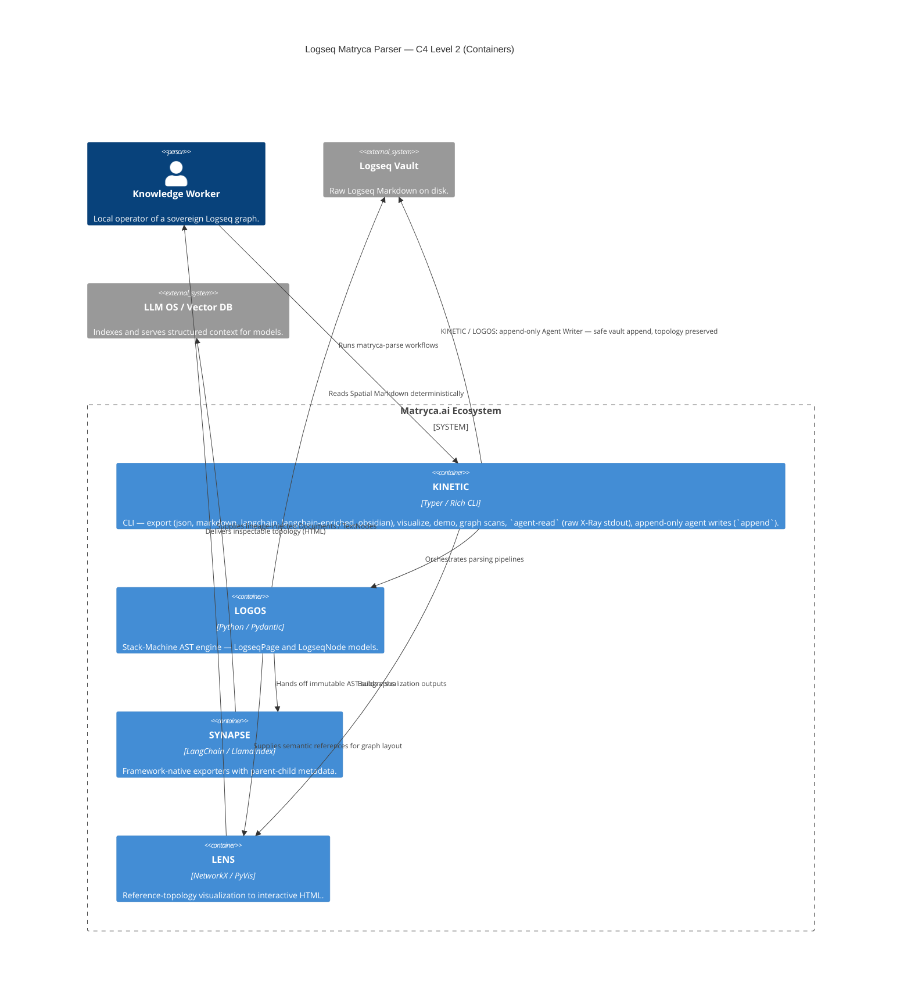
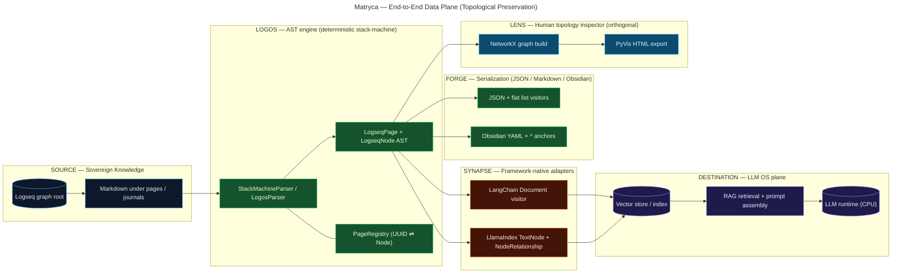
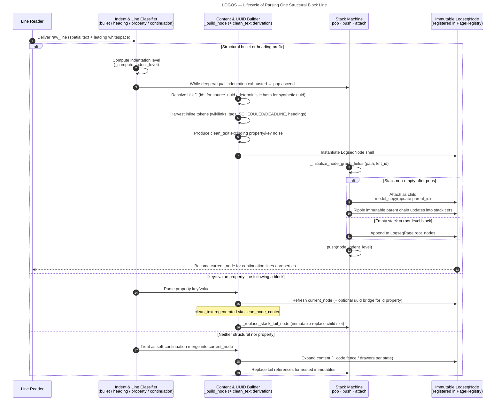

# Logseq Matryca Parser — Architecture (The Logos Protocol)

## System Architecture

High-level data flow from sovereign graph files through deterministic parsing to AST-backed exporters and adapters.



## 1. Title & High-Level Philosophy

### 1.1 The LLM operating system metaphor

Treat the intelligent stack not as an isolated language model but as **an operating system**:

| Layer              | Analogue in this architecture |
| ------------------ | ----------------------------- |
| **CPU**            | The LLM (reasoning, planning, generation). |
| **RAM**            | The **context window** — bounded, volatile working memory loaded from structured retrieval. |
| **Hard disk**      | The **Logseq graph** — durable, hierarchical, sovereign knowledge stored as outliner **Spatial Markdown** on disk. |

The Matryca Parser is the **deterministic translation layer**: it reads the hierarchical “filesystem” representation of thought (blocks, indentation, identities) without corrupting topology, so retrieval and prompting can assemble **faithful subgraphs** into RAM rather than brittle text shards.

### 1.2 “Blender RAG” vs. a topological file-system driver

**Naive / standard RAG** routinely applies **recursive or fixed-size chunkers** to raw Markdown. For Logseq-style graphs this behaves like dropping the disk into a blender: contiguous bytes are diced by character budgets, sibling blocks are fused with unrelated parents, and indentation semantics are erased. The result is embeddings of **ambiguous fragments** disconnected from lineage — a lossy projection of structured storage into unstructured bags of text.

The **Matryca (Logos) approach** rejects that erosion of structure. Implementation-wise, **`StackMachineParser` (alias `LogosParser`)** performs **O(N) deterministic parsing** using spatial indentation as the sole arbiter of parent–child linkage, yielding a rigorous **Abstract Syntax Tree (AST)** (`LogseqPage`, `LogseqNode`). **`SYNAPSE`** acts as driver-level output: adapters emit **LangChain `Document`** and **LlamaIndex `TextNode`** objects whose **metadata encodes lineage** (`parent_id`, `path`, `left_id`, graph tokens), preserving the **exact topological semantics** expected by Sovereign AI and local pipelines.

Together, LOGOS + SYNAPSE implement **Document-Driven Development** principles. Historical specifications and blueprints are preserved in [`/docs/design-docs/`](./design-docs/) to constrain behavior, while the runtime code enforces deterministic invariants matching those documents.

---

## 2. System Context Diagram

This section pairs a **C4 Model** view (Levels 1–2) with a **logical data-plane** flowchart. Together they document how Sovereign AI pipelines move from raw Spatial Markdown through deterministic parsing to structured context for retrieval and inference — and how **append-only, sandboxed writes** (Agent Writer / KINETIC) can extend the vault without re-parsing or rewriting existing structure on behalf of agents.

### 2.1 C4 Level 1 — System context

Actors and external systems framing **Logseq Matryca Parser** as the deterministic “driver” between the sovereign **Logseq Vault** and **LLM OS / Vector DB** runtimes.



### 2.2 C4 Level 2 — Containers

Containers live inside the **Matryca.ai Ecosystem** boundary: **KINETIC** is the operator entry point (including **append-only** agent writes to the vault); **LOGOS** rebuilds the AST; **SYNAPSE** projects the AST into framework-native AI types; **LENS** renders topology for human inspection.



### 2.3 Supplementary logical data-plane (flowchart)

The following pipeline is the complementary **logical** view for readers who prefer LR flow over C4 boxing: ingestion from raw graph markdown, deterministic AST construction, adapter emission, then downstream **vector store indexing** / **LLM OS** retrieval.



Auxiliary **FORGE** serialization (JSON / flat Markdown / Obsidian) appears as a parallel branch in **§2.3**; **KINETIC** orchestrates all surfaces but the operator CLI box is omitted from the RAG→LLM spine so the vector path stays legible.

---

## 3. Core Components Detail

### 3.1 LOGOS — deterministic stack-machine parsing

**LOGOS** is the strict parser core ([`StackMachineParser`](../src/logseq_matryca_parser/logos_parser.py)).

- **Stack-machine semantics.** For each line, indentation is quantized (spaces plus tab-width scaling) into a discrete **logical level**. The parser maintains parallel stacks (`stack`, `stack_columns`, `stack_indents`). When a new bullet or heading block appears:
  - **Pop** ancestors while `stack_columns[-1] >= indent_level` (exit deeper subtrees).
  - **Maintain or nest** relative to the remaining top-of-stack (`stack[-1]`).
  - **Push** the freshly built `LogseqNode` onto the stack and register its UUID with `PageRegistry` for deterministic identity and future block-reference linkage.
  This yields **finite-state, linear-time** traversal with explicit ascend/descend behavior — not regex-driven whole-document guessing.

- **Spatial indentation rules.** In Logseq, **indentation defines the AST**, not list decoration. Heading blocks and bullets both participate as first-class structural lines. Levels are **normalized post-pass** to tree depth (`_normalize_indent_levels`) so persisted `indent_level` reflects hierarchical depth independent of authoring quirks after stack repair.

- **Block properties & `id::`.** Subsequent lines matching `key:: value` attach to **`current_node`** (or accumulate into **frontmatter-derived page properties** when no node exists yet). Parsed properties live in **`LogseqNode.properties`**. Native **`id::`** values are preserved in **`source_uuid`** (and in **`properties["id"]`** when applicable) so **`((uuid))`** references match Logseq; the parser’s stable **`uuid`** field remains the synthetic identity used for AST wiring and adapters.

#### Sovereign UUID architecture and zero-corruption guarantee

One of the most critical aspects of parsing a Logseq graph for AI is maintaining the integrity of block references (`((uuid))`) without causing infinite loops or polluting a vector database with duplicates.

The Logos protocol uses a **dual-track identity system** so vanilla Logseq compatibility and RAG-stable keys coexist:

1. **Native Logseq identity (absolute priority).** During AST traversal, the parser scans for Logseq’s native `id:: <uuid>` properties or inline IDs. If a block has been explicitly referenced in Logseq, that value is adopted as **`source_uuid`** — the absolute source of truth for cross-page block references and registry lookups.

2. **Topological deterministic hashing (AI fallback).** For blocks that do not carry a physical UUID in the Markdown file, Matryca generates a **deterministic SHA-256–based** synthetic UUID from strict coordinates: **page title**, **physical line number**, **exact plain-text content**, and the **parent node’s synthetic UUID** (a sentinel when the block is page-root level). Re-parsing therefore yields the same synthetic identities without random UUID v4 churn, while sibling branches cannot collide when only title, line, and text coincide.

- **`clean_text` isolation.** Embedding-facing text (`clean_text`) is produced by stripping property lines, timelines, markup noise appropriate to vector use, bullet prefixes, etc. **`content`** retains richer raw semantics; **`clean_text`** strips **collapsed::** and inline **SCHEDULED** / **DEADLINE** marker text (via `TIME_PATTERN`) so prose embeddings stay clean—while the same parse pass **promotes** decoded times to first-class node fields (below), avoiding the classic failure mode where temporal tokens pollute vectors yet remain unqueryable as data.

- **Task priority (`PRIORITY_PATTERN`).** Priority tags match `\[#([A-Z])\]` (Logseq’s A/B/C style). On the **first line** of a block, a match sets **`LogseqNode.task_priority`** to the captured letter and **`PRIORITY_PATTERN.sub("", …)`** removes the marker from **`clean_text`** so priority is a **typed attribute**, not redundant surface noise in retrieval text.

- **Temporal markers (`TIME_PATTERN`) → epoch fields.** Lines matching `\b(SCHEDULED|DEADLINE):\s*(<[^>]+>)` are parsed by **`_extract_time_properties`**: the `<…>` payload is interpreted through **`_parse_logseq_datetime`** (multiple Logseq date formats), then normalized to **UTC Unix epoch seconds** and assigned to **`LogseqNode.scheduled_at`** and **`LogseqNode.deadline_at`** respectively. Auxiliary keys (`scheduled_iso`, `deadline_journal_day`, repeaters, etc.) may still land in **`properties`** for human/debug parity, but the **integer epoch pair on the node** is the stable contract for **temporal graph edges**, range filters, and **GraphRAG** planners—without forcing downstream graph databases to re-scan Markdown.

#### Node anatomy — raw Markdown to temporal `LogseqNode`

```mermaid
classDiagram
  direction LR
  class RawMarkdown {
      <<Input>>
      String: "- TODO [#A] Ship new feature SCHEDULED: <2026-05-15>"
  }
  
  class LogseqNode {
      <<AST Output>>
      +uuid: String
      +clean_text: "Ship new feature"
      +task_status: "TODO"
      +task_priority: "A"
      +scheduled_at: 1778803200 (Epoch)
      +children: List~LogseqNode~
  }
  
  RawMarkdown --> LogseqNode : Parsing & Extraction
```



### 3.2 SYNAPSE — AST → LangChain / LlamaIndex with lineage injection

**SYNAPSE** (`logseq_matryca_parser.synapse`) implements **`ASTVisitor`** harnesses rather than brittle string serializers.

- **LangChain.** [`LangChainVisitor`](../src/logseq_matryca_parser/synapse.py) emits one **`Document`** per node with `page_content=node.clean_text` and metadata unioning **`node.properties`** with lineage fields (`uuid`, `parent_id`, `indent_level`, `source`, **`path`** — the UUID ancestry chain — `left_id`, `refs`, `task_status`, repeater, `created_at`). The underlying **`LogseqNode`** additionally carries **`task_priority`**, **`scheduled_at`**, and **`deadline_at`** (§3.1); adapters or custom visitors can project those into metadata when feeding **downstream graph databases** or **GraphRAG** filters. This preserves **parent context** explicitly in retrieval filters and re-ranking.

- **LlamaIndex.** [`LlamaIndexVisitor`](../src/logseq_matryca_parser/synapse.py) constructs **`TextNode`** instances keyed by **`id_=node.uuid`**. It wires **`NodeRelationship.PARENT`** and **`CHILD`** via **`RelatedNodeInfo`**, back-linking when the parent appears earlier in preorder traversal — encoding **topology as first-class edges** beyond flat metadata dictionaries.

Together, adapters guarantee that **embedding units align with intentional block boundaries**, not splitter accidents.

#### 3.2.1 Context-enriched RAG — `SynapseAdapter.to_context_enriched_chunks`

Beyond flat `Document` emission, **`to_context_enriched_chunks`** targets **vector pipelines that would otherwise lose outline semantics**. For each flattened block it builds `page_content` from a configurable template (default **`[{breadcrumbs}] {content}`**):

1. **Breadcrumbs.** [`_build_breadcrumbs`](../src/logseq_matryca_parser/synapse.py) walks the owning `LogseqPage` and the node’s UUID `path` so the chunk’s visible text carries **human-readable lineage** (page title + ancestor outline), not just an opaque `parent_id`.

2. **Recursive macro / embed expansion.** [`_expand_macros_and_embeds`](../src/logseq_matryca_parser/synapse.py) operates on **`node.content`** (not `clean_text`) so tokens hidden from embeddings—such as `((uuid))` inside `{{embed ((uuid))}}`—remain visible to the scanner. It expands **`{{embed ((uuid))}}`** by inlining the target block’s content (with **per-UUID cycle detection**) and **`{{embed [[Page]]}}`** by inlining page bodies (with **per-title cycle detection**), preventing silent context loss when macros nest.

3. **Org-mode-style property inheritance.** Metadata includes **`effective_properties`**: the merge produced by [`LogseqGraph.get_effective_properties`](../src/logseq_matryca_parser/graph.py) — **page frontmatter first**, then each ancestor on `node.path` **top-down**, with deeper `LogseqNode.properties` **overriding** shallower keys. Downstream filters can therefore key off inherited `type::`, `status::`, etc., without re-walking the outline at query time.

The KINETIC **`export --format langchain-enriched`** path serializes these documents for offline inspection or ingestion.

### 3.3 LENS — NetworkX topology + PyVis interactive visualization

**LENS** (`logseq_matryca_parser.lens.GraphVisualizer`) builds a **`networkx.Graph`** over **page ⇄ wiki/tag reference** projections using `NetworkXVisitor` during AST preorder walks. Nodes receive **degree-based sizing** (“sun” hotspots) and subgroup classification (`page`, `tag`, `journal`, etc.).

Visualization export uses **`pyvis`** with **`force_atlas_2based`** physics, fullscreen canvas, HUD filters, glassmorphism control chrome, and stabilized layout configuration suitable for **large graphs at interactive frame rates** in the browser (product positioning targets fluid exploration of graphs on the order of **10⁴ nodes**).

### 3.4 AGENT WRITER — Append-Only Sandboxing

In the **LLM OS** metaphor, **LOGOS** is the **read path** into the hierarchical “disk”: it materializes Spatial Markdown into a **deterministic AST** that downstream adapters trust. **`agent_writer`** ([`logseq_matryca_parser.agent_writer`](../src/logseq_matryca_parser/agent_writer.py)) is the complementary **bounded write syscall**: a **deterministic**, **configuration-aware** channel that **dynamically reads `config.edn`** (for example **`:journal/page-title-format`**) so filenames and titles align with the vault’s own conventions. Writes use **`open(..., mode="a")`** **append-only** I/O — agents **append** new block material **after** existing bytes; they do **not** rewrite, merge, or re-indent prior content. That discipline keeps **existing topology intact** and avoids corrupting the graph in ways that would break a subsequent **LOGOS** parse or violate the **deterministic AST** contract. Surfaced through the **`append`** command in **KINETIC**, this yields an **enterprise-grade**, inspectable path for agent contributions while **read/export** flows remain the authoritative, topology-preserving contract with the vault.

### 3.5 FORGE — multi-target serialization (JSON, Markdown, Obsidian)

**FORGE** ([`forge.py`](../src/logseq_matryca_parser/forge.py)) hosts **AST visitors** that project the same immutable `LogseqNode` trees into transport-friendly artifacts. Besides nested **JSON** and hierarchy-preserving **clean Markdown**, **`ObsidianForgeVisitor`** emits **Obsidian-flavored Markdown**: a YAML **`---` frontmatter** block from merged page properties, list lines derived from the first line of each block’s **`content`** (so `((uuid))` survives when stripped from `clean_text`), **`[[Page#^anchor]]`** link rewriting via an optional embed resolver, and trailing **`^`** anchors on blocks that are referenced anywhere in the vault. **KINETIC** exposes this as **`matryca-parse export … --format obsidian`**, writing one file per page and mirroring **namespace segments** as nested directories.

### 3.6 `LogseqGraph` — namespace scoping, O(1) invalidation, live watch

The **in-memory graph** ([`graph.py`](../src/logseq_matryca_parser/graph.py)) is the runtime **RAM image** of the sovereign vault: `pages: dict[str, LogseqPage]`, a private **`_node_registry`** keyed by synthetic block UUID, and a **`_backlink_registry`** mapping normalized link targets to source node UUIDs.

#### Namespace shadowing (`resolve_relative_page_link`)

Relative page resolution follows **Logseq-style longest-prefix wins**: for a current page title split on **`/`** (namespace segments), the resolver tries candidates **`prefix + "/" + link_target`** for prefixes from **full namespace down to empty**, and returns the **first title that exists** in `pages`. Only if no contextual page exists does it fall back to a **global** title match. Thus a contextual page **`Progetti/AI/Sviluppo`** **shadows** a global **`Sviluppo`** when resolving from **`Progetti/AI/Matryca`** — matching the **nested-namespace shadowing** semantics described in the scoping roadmap.

#### Incremental file invalidation (`invalidate_and_reload_page`)

Full-directory loads are expensive for always-on agents. **`invalidate_and_reload_page(path)`** implements **page-level surgical refresh**:

1. Ignore paths outside tracked **`pages/*.md`** and **`journals/*.md`**.
2. Re-parse the file with **`StackMachineParser.parse_page_file`**, producing a fresh `LogseqPage`.
3. If the path previously mapped to a page, collect **all synthetic UUIDs** from the old tree and call **`_purge_stale_page_uuids`**: remove each UUID from **`_node_registry`**, scrub those UUIDs from every **`_backlink_registry`** source list, and delete backlink keys that become empty.
4. Replace the **`pages`** dict entry (title may change if the file moved), then **`_register_page_nodes`** and **`_append_page_backlinks`** for the new AST.

This keeps **global indexes consistent** without rebuilding the entire graph.

#### Live filesystem watcher (`start_watching`)

**`LogseqGraph.start_watching(callback=None)`** (optional **`watchdog`** install) returns a **`LogseqGraphWatcher`** that schedules a recursive **`Observer`** on the graph root. **`on_modified` / `on_created`** events for tracked Markdown call **`invalidate_and_reload_page`**, then optionally invoke **`callback(path)`** — the intended hook for **vector store patch**, **re-embedding**, or UI refresh. Event routing ignores directories and non-tracked extensions so the hot path stays tight.

#### Fluent topological queries (`GraphQuery`)

**`graph.query()`** seeds a [`GraphQuery`](../src/logseq_matryca_parser/graph.py) with **all registered nodes**, then applies chainable filters: **`has_tag`**, **`with_priority`**, **`under_parent(parent_uuid)`** (ancestor chain on `path`), **`is_task_state`**, and **`execute()`** returning a materialized list. This is the **programmatic complement** to SQL-less graph inspection — ideal for **batch exporters**, **lint rules**, and **agent planners** that need a typed slice of the outline without ad-hoc traversal code.

### 3.7 AGENT PRESS — Agent-native printing press & X-Ray mode

Human-facing RAG (SYNAPSE enriched chunks, breadcrumbs, inherited properties) optimizes for **embedding geometry** and **retrieval filters**. Autonomous agents running tight **read → plan → write** loops need a different projection: **the fewest tokens per topological fact**. **`agent_press.py`** ([`logseq_matryca_parser.agent_press`](../src/logseq_matryca_parser/agent_press.py)) implements the **Printing Press** paradigm: compress the in-memory AST for machine consumption **without** sacrificing parent–child shape.

#### Session alias mechanics (`SessionAliasRegistry`)

`SessionAliasRegistry` is a **session-scoped, in-RAM translation table** between lightweight aliases and sovereign block identities:

| Operation | Role |
| --------- | ---- |
| **`generate_aliases(nodes)`** | Depth-first over each input forest; assigns **`0..n-1`** to every distinct `LogseqNode.uuid`; returns **`dict[int, str]`** (alias → real UUID). |
| **`resolve_alias(alias)`** | Inverse lookup for **targeted writes** — e.g. the agent says *“modify block `[12]`”* and the driver resolves `[12]` → `64a8b0c1-…` without ever loading 36-char IDs into the prompt. |
| **`alias_for_uuid`** | Used by the renderer to stamp `[n]` on each outline line. |

Heavy Logseq identifiers (`id:: 64a8b0c1-d33b-4448-a261-e4dc2bbe12d3`, synthetic `uuid` fields, property keys) **never appear** in the X-Ray stream. The agent reasons over **`[n]`** tokens; the Matryca stack retains the **authoritative UUID map** off-context — the same dual-track identity model as LOGOS (§3.1), but **projected for RAM-efficient agent turns**.

#### Ultra-dense export (`to_xray_markdown`)

**`to_xray_markdown(nodes, registry)`** serializes only:

```text
{indent}[{alias}] {clean_text}
```

- **`indent`** — two spaces × `LogseqNode.indent_level` (outline depth preserved).
- **`alias`** — integer from the registry, not a UUID string.
- **`clean_text`** — embedding-grade prose (properties, drawers, `collapsed::`, and schedule markers already stripped at parse time).

No YAML, no JSON wrappers, no collapsed-state metadata, no blank separator lines — **pure topology + semantics** for the LLM “CPU” to load into its context window.

#### KINETIC `agent-read` — Rich bypass for machine stdout

The compound CLI command **`agent_read`** in [`kinetic.py`](../src/logseq_matryca_parser/kinetic.py) (`matryca-parse agent-read`) is the operator surface for X-Ray ingestion:

1. **`LogseqGraph.load_directory`** — materialize the RAM image of the vault.
2. **Filter** — `graph.query().has_tag(tag).execute()` when `--tag` is set; otherwise `search_content(query)` when `--query` is set; otherwise all registered nodes.
3. **`SessionAliasRegistry.generate_aliases`** → **`to_xray_markdown`**.
4. **Emit via `sys.stdout.write`** — deliberately **not** Typer’s Rich `Console`.

Rich styling injects **ANSI escape sequences** that waste tokens and can cause models to **hallucinate markup** as content. `agent-read` is **stdout-pure** so shell pipelines, MCP tools, and headless agents receive **unescaped plain text** only. Human-oriented commands (`scan`, `export`, `visualize`) keep Rich; the **machine-native read path** opts out.

This complements §3.4 **AGENT WRITER** (append-only human/agent notes) and §3.2 **SYNAPSE** (human/RAG chunking): one stack, three projections — **enriched chunks for vectors**, **X-Ray for agent context**, **append for durable writes**.

---

## 4. Data Flow Sequence

Lifecycle of introducing **one structural block line** after prior context established (bullet path; heading path symmetrically analogous).



---

## 5. The Matryca Moat — Why Standard RAG Fails on Outliner Markdown

Recursive and character-budget chunkers assume **approximately flat prose**. Logseq violates that assumption fundamentally:

| Failure mode                         | Impact on sovereign knowledge |
| ------------------------------------ | ------------------------------ |
| **Mid-block splits**                  | Fragments multimodal bullets; orphans soft-line continuations. |
| **Loss of indentation topology**      | Child insights appear unrelated to hypotheses in parent bullets. |
| **Property ingestion as prose**       | `collapsed:: true`, SCHEDULED markers, drawer noise degrade embedding geometry. |
| **UUID / reference desynchronization**| Block anchors no longer correspond to embeddings; graph-native references `((uuid))` become orphaned strings. |

**Deterministic AST parsing plus SYNAPSE metadata** restores **semantic sovereignty**: each retrieval unit inherits explicit **ancestor identity** (`parent_id`, cumulative `path`) and optional graph-native LlamaIndex **edges**, enabling **topology-aware augmentation** aligned with Andrej Karpathy’s mental model — the LLM “CPU” issues reads against a hierarchical disk through a **faithful driver**, not a stochastic blender.

---

*This document reflects the implementations in `src/logseq_matryca_parser/logos_parser.py`, `synapse.py`, `graph.py`, `forge.py`, `lens.py`, `logos_core.py`, `agent_writer.py`, and `agent_press.py`, and complements narrative primers such as [`logseq_ast_primer.md`](logseq_ast_primer.md).* 
