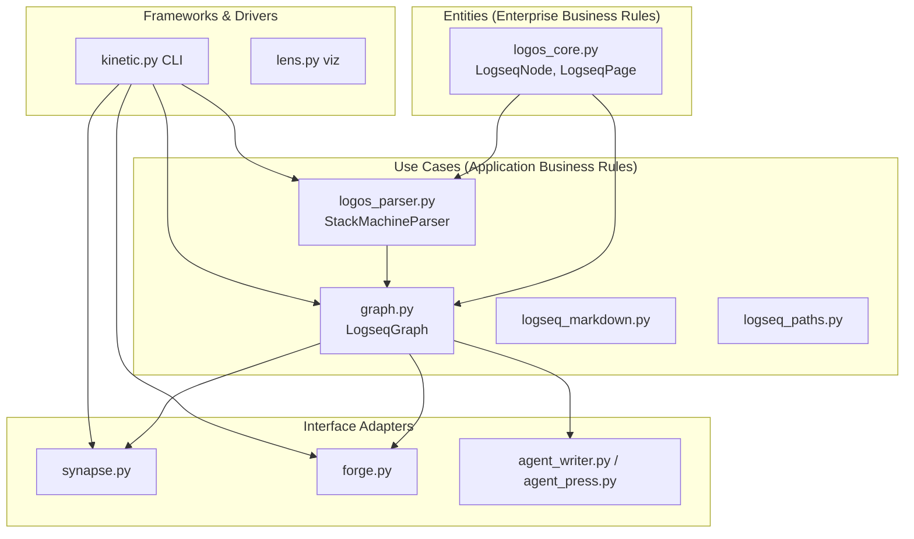

# Bug Hunt Report — logseq-matryca-parser

**Data:** 2026-06-23 (audit) · **Risoluzione:** 2026-06-23  
**Scope:** audit statico + dinamico del repository (The Logos Protocol)  
**Strumenti:** analisi statica locale (graph-based), `make all`, `scripts/debug_pre_release.py`, probe Python ad hoc  
**Riferimenti architetturali:** [Clean Architecture](https://blog.cleancoder.com/uncle-bob/2012/08/13/the-clean-architecture.html) (R. C. Martin), [`ARCHITECTURE.md`](ARCHITECTURE.md)

> **Stato risoluzione (2026-06-23):** tutti i **BUG-001…031** e le limitazioni **LIM-001/002** sono stati affrontati nel codice (vedi `CHANGELOG.md` **v1.4.0**). **DEBT-001** (`iter_canonical_pages`, `page_for_node`) è implementato; debito architetturale residuo (SRP su `kinetic.py`, OCP embed strategy) resta backlog non bloccante.
>
> **Aggiornamento test (2026-06-24, v1.4.1):** GFI-04 (`logseq_paths` fallback), GFI-14 (`normalize_logseq_timestamp`), GFI-03/05/06/09/12/13 e suite totale **378** pytest — vedi `CHANGELOG.md` **v1.4.1**.

---

## 1. Executive summary

| Metrica | Esito |
| :--- | :--- |
| `make all` (Ruff + Mypy + 378 pytest) | **PASS** |
| Coverage | **90.18%** (soglia 80%; **378** pytest, v1.4.1) |
| Round-trip corpus (`debug_pre_release.py`) | **19/19 OK** |
| analisi statica `check` (cicli IMPORTS) | **0 cicli** |
| analisi statica index | `logseq-matryca-parser` — 1074 embeddings, commit `7d3f77b` |

Nonostante la suite verde, l’analisi guidata da analisi statica e da probe runtime ha individuato **31 bug/issue ID** (3 Critical parser-crash, 15 Medium/High, 13 Low) e debiti architetturali (violazione *Interface Segregation* su `graph.pages`).

**Priorità immediata:** (1) **BUG-017** — `IndexError` su bullet vuoto + proprietà (crash `load_directory` / `scan`); (2) SYNAPSE embed hang (BUG-001); (3) collisione titoli in `load_directory` (BUG-010/013); (4) **grafo in-memory stale dopo `agent-write`** (BUG-016); (5) delete-safe invalidate (BUG-005).

**Wave 2 (2026-06-23):** +4 bug confermati via analisi statica `query` su `_enrich_pages_index` / `invalidate_and_reload_page` e probe alias-heavy vaults.

**Wave 3 (2026-06-23):** +3 bug confermati via analisi statica `context(load_directory)`, `impact(get_node_by_embed_ref)`, `query(append_child_to_node)` — integrità indice graph e headless writer.

**Wave 4 (2026-06-23):** +4 bug via analisi statica `query(forge/agent_write)`, `context(LogseqGraphWatcher)` — grafo in-memory stale, watcher incompleto, `title::` collision cross-file.

**Wave 5–6 (2026-06-23):** +4 bug via analisi statica `impact(_refresh_node)` risk **CRITICAL**, probe `load_directory` / `_parse_graph` / LENS / SYNAPSE — crash parser su outline Logseq reale, metadata RAG errati, statistiche LENS duplicate.

**Wave 7 (2026-06-23):** +5 bug via analisi statica `impact(search_content)` → `agent_read`, probe serialize / export markdown / ghost registry — round-trip 4 spazi, nodi orfani in search/agent-read/RAG, export markdown duplicato, `strict_refs` solo same-page.

**Wave 8 (2026-06-23):** +6 bug via analisi statica `query(resolve_relative_page_link)`, `query(agent_press)`, probe backlink/namespace/tag case, `_export_json`, `resolve_asset_path` — chiusura mappatura moduli core.

---

## 2. Metodologia (Clean Architecture lens)

### 2.1 Anelli concentrici del progetto

Il codice mappa ragionevolmente sugli anelli di Clean Architecture:



**Regola delle dipendenze:** le frecce puntano verso l’interno. Violazioni osservate (vedi §6) sono concentrate negli adapter che aggirano API pubbliche del dominio.

### 2.2 Pipeline di indagine

1. **Bootstrap analisi statica locale** — `check(cycles)`, `query`, `impact`, `context` su `StackMachineParser`, `serialize_logseq_page`, `LogseqGraph`, `logseq_agent_write`.
2. **Gate qualità** — `make all`.
3. **Corpus round-trip** — `uv run python scripts/debug_pre_release.py`.
4. **Probe mirati** — script Python isolati con `SIGALRM` per rilevare hang; confronto semantico settimane ISO vs `%W`.
5. **Mappatura coverage** — linee non coperte vs rischio (vedi §7).

---

## 3. Evidenze strutturali (analisi statica locale)

| Query / tool | Risultato | Implicazione |
| :--- | :--- | :--- |
| `check(cycles)` | `cycleCount: 0` | Nessun ciclo di import tra file; layering import è sano. |
| `impact(StackMachineParser, upstream)` | risk **MEDIUM**, 6 caller diretti | Refactor parser = blast radius moderato; serve `impact` prima di ogni modifica FSM. |
| `impact(serialize_logseq_page, upstream)` | risk **LOW**, 1 caller | Serialization è confinata; round-trip testabile in isolamento. |
| `context(LogseqGraph)` | Importato da `kinetic`, `synapse`, `agent_writer`, `__init__` | Hub applicativo — API graph devono restare stabili e complete. |
| `impact(logseq_agent_write, downstream)` | 2 processi (`logseq_agent_write`, `_demo`) | Cambio naming file settimanale impatta solo KINETIC/agent path. |
| `impact(_refresh_node, upstream)` | risk **CRITICAL**, 5 processi (`scan`, `load_and_convert`, `parse`) | BUG-017 — un guard mancante blocca tutti gli entrypoint parse. |
| `impact(load_directory, upstream)` | risk **HIGH**, `agent_read` / `export` / `agent_write` | BUG-010/013/017 condividono il percorso `load_directory`. |
| `query(to_llamaindex_nodes SOURCE)` | `LlamaIndexVisitor`, `page_source_node_id` | BUG-018 — SOURCE singolo su root multi-pagina. |
| `query(get_deep_statistics largest_pages)` | `GraphVisualizer._count_page_blocks` | BUG-019 — lista `_pages` senza dedup alias. |
| `impact(search_content, upstream)` | risk **LOW**, processo `agent_read` | BUG-022 — scan su `_node_registry` include nodi fantasma. |
| `query(strict_refs BlockReferenceError)` | `_validate_references`, `BlockReferenceError` | BUG-025 — validazione solo intra-pagina. |
| `impact(resolve_relative_page_link)` | **0 caller** upstream | API pubblica ma non usata internamente; BUG-029 gap `../`. |
| `query(agent_press to_xray_markdown)` | `SessionAliasRegistry`, `agent_read` | Dup X-Ray solo se consumer passa `pages.values()` roots. |

**Staleness:** l’indice locale è allineato al commit indicizzato; dopo merge significativi eseguire `refresh dell'indice locale`.

---

## 4. Findings — bug confermati (runtime evidence)

### BUG-001 — CRITICAL: loop infinito in espansione page embed (SYNAPSE)

| Campo | Valore |
| :--- | :--- |
| **File** | `src/logseq_matryca_parser/synapse.py` |
| **Funzione** | `_expand_macros_and_embeds_impl` (circa L164–217) |
| **Severità** | **Critical** (hang / CPU 100% su export RAG) |
| **Clean Architecture** | Violazione *robustness* nel adapter; il use case `LogseqGraph.get_page` esiste ma non viene usato. |

**Root cause:** quando `graph.pages.get(title)` non trova la pagina, `replacement = match.group(0)` lascia la stringa **identica**. Il `while True` ri-matcha lo stesso embed all’infinito.

**Evidenza runtime:**

```text
# Pagina inesistente → hang confermato (SIGALRM 3s)
missing page INFINITE_LOOP

# Casing errato (Logseq routing case-insensitive via get_page)
embed [[target]] con pagina "Target" → INFINITE_LOOP
embed [[Target]] → OK: 'x shared content'

# UUID block valido ma assente nel grafo → hang
double-brace missing uuid INFINITE_LOOP
```

**Percorso utente:** `SynapseAdapter.to_context_enriched_chunks` → `kinetic export --format langchain-enriched` su un grafo con embed irrisolti.

**Fix raccomandato (SRP + fail-safe):**

1. Usare `graph.get_page(title)` al posto di `graph.pages.get(title)` (case-insensitive).
2. Su risoluzione fallita: sostituire con stringa vuota o placeholder, **mai** con `match.group(0)`.
3. Aggiungere test regressione in `tests/test_synapse.py` per: pagina mancante, casing errato, UUID block assente.

**Blast radius (analisi statica):** `impact(SynapseAdapter.to_context_enriched_chunks, upstream)` prima del fix.

---

### BUG-005 — HIGH: `invalidate_and_reload_page` crash su file cancellato

| Campo | Valore |
| :--- | :--- |
| **File** | `src/logseq_matryca_parser/graph.py` L641–647 |
| **Severità** | **High** (watcher / incremental index) |
| **Clean Architecture** | Use case non gestisce evento *delete* del driver filesystem. |

**Root cause:** `invalidate_and_reload_page` chiama sempre `parse_page_file(resolved)` senza verificare `resolved.exists()`. Su cancellazione pagina → `FileNotFoundError`.

**Evidenza runtime:**

```text
BUG-005 exception: FileNotFoundError .../pages/Gone.md
```

**Percorso utente:** `LogseqGraphWatcher` → `_route_event` → `invalidate_and_reload_page` quando l’utente elimina un `.md` in Logseq.

**Fix raccomandato:** se `not resolved.exists()`, purgare chiavi/backlink/nodi per quel `source_path` (simmetrico a reload) e uscire senza parse.

**Analisi statica:** `context(invalidate_and_reload_page)` — caller diretto: watcher handler; test esistente copre solo *edit*, non *delete*.

---

### BUG-006 — MEDIUM: `langchain-enriched` export duplica chunk per alias pagina

| Campo | Valore |
| :--- | :--- |
| **File** | `src/logseq_matryca_parser/kinetic.py` L347–349 |
| **Severità** | **Medium** (RAG embeddings duplicati, costo/token doppio) |

**Root cause:** `_export_langchain_enriched` fa `for page in graph.pages.values()`; `_enrich_pages_index` duplica la stessa `LogseqPage` sotto chiavi alias (`alias::`). `all_roots.extend(page.root_nodes)` inserisce gli stessi blocchi N volte.

**Evidenza runtime:**

```text
# alias:: Alt su pagina con 1 blocco
BUG-006 chunk count: 2 payload len: 2
BUG-006 duplicate contents: ['[P] only block', '[P] only block']
```

**Fix raccomandato:** introdurre `LogseqGraph.iter_canonical_pages()` (pattern già in `_enrich_pages_index` L219: `key == page.title` + dedup `id(page)`).

---

### BUG-007 — MEDIUM: `get_namespace_children` restituisce duplicati con alias namespace-like

| Campo | Valore |
| :--- | :--- |
| **File** | `src/logseq_matryca_parser/graph.py` L558–577 |
| **Severità** | **Medium** (API graph errata per tooling namespace) |

**Root cause:** itera `self.pages.items()` senza dedup per oggetto pagina. Un `alias:: NS/AliasLeaf` crea una chiave `NS/AliasLeaf` che matcha il prefisso `NS/` oltre alla chiave canonica `NS/Leaf`.

**Evidenza runtime:**

```text
H17 ns children count: 2 ['NS/Leaf', 'NS/Leaf']
```

**Fix raccomandato:** stesso helper `iter_canonical_pages()` o `seen_page_ids` come in `_build_backlink_registry`.

---

### BUG-008 — LOW: `search_content` case-sensitive vs routing case-insensitive

| Campo | Valore |
| :--- | :--- |
| **File** | `src/logseq_matryca_parser/graph.py` L521–528 |
| **Severità** | **Low** (inconsistenza API) |

**Evidenza:**

```text
search_content('hello') → 0 risultati
search_content('Hello') → 1 risultato
```

`get_page` e `get_backlinks` sono case-insensitive; `search_content` no. Documentare o allineare.

---

### BUG-009 — LOW: `SessionAliasRegistry.load_from_disk` stato inconsistente con UUID duplicati

| Campo | Valore |
| :--- | :--- |
| **File** | `src/logseq_matryca_parser/agent_press.py` L70–78 |
| **Severità** | **Low** (agent session corrupta su disco) |

**Evidenza:**

```text
load {"0": "uuid-a", "1": "uuid-a"}
resolve_alias(0) → uuid-a, resolve_alias(1) → uuid-a
alias_for_uuid('uuid-a') → 1  # alias 0 “orfano” per reverse lookup
```

**Fix raccomandato:** validazione al load (rifiuta o merge duplicati); test regressione.

---

### BUG-010 — HIGH: collisione titolo `pages/` vs `journals/` + nodi fantasma nel registry

| Campo | Valore |
| :--- | :--- |
| **File** | `src/logseq_matryca_parser/graph.py` L384–387 |
| **Severità** | **High** (integrità indice, agent-read, RAG) |
| **Clean Architecture** | Use case `load_directory` viola invariante “un titolo → una pagina indexata”. |

**Root cause:** `pages[page.title] = page` usa solo il titolo come chiave. File distinti con lo stesso stem (es. `pages/Daily.md` e `journals/Daily.md`) collidono; l’ultimo path ordinato vince nel dizionario, ma **entrambi** i nodi restano in `_node_registry` (registrati nel loop precedente L386–387).

**Evidenza runtime:**

```text
# pages/Daily.md + journals/Daily.md (stesso titolo "Daily")
registry nodes: ['from-journals', 'from-pages']  # count: 2
pages['Daily'] → pages/Daily.md (vincitore)
_page_for_node(journal_node) → None  # fantasma
query().execute() → 2 nodi, uno orfano
```

**Percorso utente:** `agent-read` senza filtri include nodi journal non collegati a nessuna `LogseqPage`; export enriched indicizza contenuto “fantasma”.

**Fix raccomandato:** chiave composta `(source_kind, title)` o namespace titoli journal (`[[Apr 25th, 2024]]`); oppure purge registry nodes non appartenenti alla pagina vincitrice dopo merge.

**Analisi statica:** `context(load_directory)` — 25+ test caller; `impact` risk alto su refactor.

---

### BUG-011 — MEDIUM: `append_child_to_node` ignora indentazione reale del file

| Campo | Valore |
| :--- | :--- |
| **File** | `src/logseq_matryca_parser/agent_writer.py` L192–194 |
| **Severità** | **Medium** (headless writer corrompe outline) |

**Root cause:** indent calcolato come `graph.tab_size` (hardcoded 2) × `indent_level`, non dagli spazi effettivi nel sorgente. Vault con indentazione 4 spazi (o mista) ricevono bullet figli con 2 spazi.

**Evidenza runtime:**

```text
# File: '- root\n    - four-space child\n'
append_child_to_node(..., 'appended')
→ ['- root', '    - four-space child', '  - appended']  # 2 spazi, non 4
```

**Fix raccomandato:** derivare indent dal bullet parent nel file (`line_start` / regex sulle leading spaces) o da `node.indent_level` × indent width rilevato per pagina.

**Analisi statica:** `impact(append_child_to_node)` → `agent_write` CLI (7 process hits).

---

### BUG-012 — MEDIUM: `get_node_by_embed_ref` case-sensitive su UUID

| Campo | Valore |
| :--- | :--- |
| **File** | `src/logseq_matryca_parser/graph.py` L432–445 |
| **Severità** | **Medium** (embed Obsidian / Synapse falliscono) |

**Root cause:** lookup diretto `get_node_by_uuid(stripped)` e confronto `node.source_uuid == stripped` senza normalizzazione case; Logseq/OS spesso usano UUID lowercase negli embed `((...))` mentre `id::` nel file può essere uppercase.

**Evidenza runtime:**

```text
id:: AAAAAAAA-AAAA-AAAA-AAAA-AAAAAAAAAAAA
get_node_by_embed_ref(upper) → hit
get_node_by_embed_ref(lower) → miss
```

**Fix raccomandato:** normalizzare a lowercase per confronto UUID (come `_node_identity_keys` in `forge.py`).

**Analisi statica:** `impact(get_node_by_embed_ref)` → `to_context_enriched_chunks`, `embed_resolver` Obsidian.

---

### BUG-013 — HIGH: collisione `title::` identico su file diversi (variante BUG-010)

| Campo | Valore |
| :--- | :--- |
| **File** | `src/logseq_matryca_parser/graph.py` L384–387 |
| **Severità** | **High** (stesso meccanismo di BUG-010) |

**Scenario:** `pages/A.md` e `pages/B.md` entrambi con `title:: Shared`. Il dizionario `pages` conserva un solo vincitore (`B.md` per sort path), ma **entrambi** i nodi (`from-A`, `from-B`) restano in `_node_registry`.

**Evidenza runtime:**

```text
shared title pages dict: 1
registry nodes: ['a', 'b']   # o ['from-A', 'from-B']
winner: B.md / from-B
```

**Fix:** unificare con BUG-010 — chiave indice = `source_path` o `(kind, canonical_title)`; purge registry orphan.

---

### BUG-014 — MEDIUM: `LogseqGraphWatcher` senza `on_deleted` / `on_moved`

| Campo | Valore |
| :--- | :--- |
| **File** | `src/logseq_matryca_parser/graph.py` L725–730 |
| **Severità** | **Medium** (indice stale finché non si riavvia) |

**Root cause:** handler registra solo `on_modified` e `on_created`. Cancellazione o rename di `.md` non invalida l’indice (a differenza di Logseq che aggiorna il DB).

**Evidenza:** ispezione sorgente `start()` — assenza `on_deleted`/`on_moved`; combinato con BUG-005 se un evento successivo tenta reload su path sparito.

**Analisi statica:** `context(LogseqGraphWatcher)` — processi `on_modified`/`on_created` only.

**Fix:** aggiungere `on_deleted` → purge per `source_path`; `on_moved` → invalidate old + new path.

---

### BUG-015 — LOW: `GraphQuery.has_tag` non accetta prefisso `#`

| Campo | Valore |
| :--- | :--- |
| **File** | `src/logseq_matryca_parser/graph.py` L93–96 |
| **Severità** | **Low** (UX API / CLI) |

**Evidenza:**

```text
node.tags: ['mytag']
has_tag('mytag') → 1
has_tag('#mytag') → 0
```

Il parser normalizza `#` via `tags`; `has_tag` confronta literal. Stessa classe di inconsistenza di BUG-008 (`search_content` case).

**Fix:** strip `#` in `has_tag` (e opzionalmente `search_content` casefold).

---

### BUG-016 — HIGH: `append_child_to_node` non aggiorna il grafo in-memory

| Campo | Valore |
| :--- | :--- |
| **File** | `src/logseq_matryca_parser/agent_writer.py` L181–228; `kinetic.py` `agent_write` L641 |
| **Severità** | **High** (workflow agente incoerente) |

**Root cause:** splice scrive solo su disco. `LogseqGraph` caricato prima della scrittura resta con AST/registry obsoleti; nessuna chiamata a `invalidate_and_reload_page`.

**Evidenza runtime:**

```text
registry before/after append: 1 1
parent.children after append: 0   # AST non aggiornato
# file on disk contiene il nuovo bullet
```

**Percorso utente:** `agent-read` → `agent-write` nella stessa sessione Python / pipeline che riusa `LogseqGraph` → export o query ignorano il blocco appena scritto.

**Fix:** dopo splice, `graph.invalidate_and_reload_page(source_path)` (o parse incrementale del sottoalbero).

**Analisi statica:** `impact(append_child_to_node)` → `agent_write` (7 process hits).

---

### BUG-017 — CRITICAL: `IndexError` in `_refresh_node` su bullet vuoto con proprietà blocco

| Campo | Valore |
| :--- | :--- |
| **File** | `src/logseq_matryca_parser/logos_parser.py` L1376–1379 |
| **Funzione** | `StackMachineParser._refresh_node` |
| **Severità** | **Critical** (crash parse — intero grafo non caricabile) |
| **Clean Architecture** | Use case parser non rispetta invariante “outline Logseq valido”; nessun fail-soft su contenuto vuoto dopo strip proprietà. |

**Root cause:** alla riga 1376 `first_line` usa un guard `if content.splitlines() else ""`, ma alla riga 1379 `_extract_task_status(content.splitlines()[0].strip())` **non** ha lo stesso guard. Quando il bullet parent ha solo spazi dopo `-` e le proprietà (`id::`, `tags::`, …) sono su righe figlie indentate, `content` risulta stringa vuota → `splitlines()[0]` → `IndexError`.

**Evidenza runtime:**

```text
Input: '- \n  id:: abc\n  - real\n'
parse() → IndexError: list index out of range  (L1379)

Varianti che crashano (senza figlio obbligatorio):
  '- \n  id:: abc\n'
  '- \n  tags:: foo\n  - c\n'
  'id:: page\n\n- \n  id:: block\n  - c\n'

load_directory con 1 file valido + 1 file bad → IndexError (nessuna pagina caricata)
_parse_graph (kinetic scan) → IndexError a metà progress bar
```

**Percorso utente:** vault Logseq con bullet “contenitore” vuoto e `id::` / metadati sul blocco (pattern comune per block embed); `logseq-matryca-parser scan`, `export`, `agent-read` su grafo intero.

**Fix raccomandato:** riusare `first_line` (o `content.splitlines()[0] if content.splitlines() else ""`) anche per `_extract_task_status`; test regressione `test_empty_bullet_with_block_properties` (distinto da `test_empty_bullet_without_trailing_space` che copre solo `"-"`).

**Analisi statica:** `impact(_refresh_node, upstream)` → risk **CRITICAL**, processi `load_and_convert`, `scan`, `parse`, `parse_file`, `main` (debug_pre_release).

---

### BUG-018 — MEDIUM: `to_llamaindex_nodes` con radici multi-pagina condivide un solo `SOURCE`

| Campo | Valore |
| :--- | :--- |
| **File** | `src/logseq_matryca_parser/synapse.py` L354–359 |
| **Severità** | **Medium** (metadata RAG errati se si passano root di più pagine) |

**Root cause:** se `page_source_id` non è fornito, viene calcolato una sola volta dal `first_path` del primo nodo in ordine preorder. Tutti i nodi LlamaIndex ricevono lo stesso `NodeRelationship.SOURCE`.

**Evidenza runtime:**

```text
# Root da pages A.md e B.md in un'unica lista
to_llamaindex_nodes(all_roots) → SOURCE count: 1, nodes: 2
```

**Percorso utente:** integrazione custom che aggrega `graph.pages.values()` root_nodes (stesso anti-pattern di BUG-006) prima di `to_llamaindex_nodes`. KINETIC non espone oggi export LlamaIndex bulk, ma l’API pubblica è fuorviante.

**Fix raccomandato:** documentare che `to_llamaindex_nodes` è per-page; oppure derivare `SOURCE` per nodo da `node.source_path` / `page_source_node_id(page_title, path)`.

**Analisi statica:** `query(to_llamaindex_nodes SOURCE)` → `LlamaIndexVisitor`, test `test_to_llamaindex_nodes_injects_parent_child_relationships`.

---

### BUG-019 — LOW/MEDIUM: `get_deep_statistics` duplica `largest_pages` con alias in `_pages`

| Campo | Valore |
| :--- | :--- |
| **File** | `src/logseq_matryca_parser/lens.py` L109–117 |
| **Severità** | **Low/Medium** (statistiche HTML/KINETIC visualize se alimentate da `graph.pages.values()`) |

**Root cause:** `largest_pages` itera `self._pages` senza dedup; stesso oggetto `LogseqPage` compare due volte se la lista proviene da `list(graph.pages.values())` (chiave canonica + alias).

**Evidenza runtime:**

```text
# alias:: Alt, _pages = list(graph.pages.values())
largest_pages: [{'page': 'P', 'block_count': 2}, {'page': 'P', 'block_count': 2}]
```

**Nota:** `kinetic visualize` usa `_parse_graph` (una entry per file) — non colpito di default. Colpito se un consumer passa il dizionario graph arricchito.

**Fix:** dedup per `id(page)` o `iter_canonical_pages()` (DEBT-001).

---

### BUG-020 — LOW: LENS crea nodo “pagina fantasma” per alias wikilink

| Campo | Valore |
| :--- | :--- |
| **File** | `src/logseq_matryca_parser/lens.py` `NetworkXVisitor.visit_node` L26–30 |
| **Severità** | **Low** (visualizzazione fuorviante) |

**Root cause:** ogni `ref` in `node.refs` diventa nodo grafo con `group="page"`. Un wikilink `[[Alt]]` dove `Alt` è solo `alias::` della pagina `P` crea nodo `Alt` separato da `P`, con arco `P → Alt`.

**Evidenza runtime:**

```text
# pages/P.md: alias:: Alt, contenuto - [[Alt]]
lens nodes: ['P', 'Alt'], edges: 1
```

**Fix opzionale:** risolvere ref via `graph.get_page(ref)` e usare `page.title` canonico come nodo destinazione (richiede passare `LogseqGraph` al visualizer).

---

### BUG-021 — MEDIUM: `serialize_logseq_page` forza `tab_size=2` e corrompe vault a 4 spazi

| Campo | Valore |
| :--- | :--- |
| **File** | `src/logseq_matryca_parser/logseq_markdown.py` L168–186, L211 |
| **Severità** | **Medium** (round-trip altera indentazione reale) |

**Root cause:** la serializzazione calcola indent come `node.indent_level * tab_size` con default `tab_size=2`. Il parser registra solo `indent_level` (0, 1, 2…), non la larghezza effettiva in spazi del sorgente. Un file con figli a 4 spazi viene riscritto a 2 spazi.

**Evidenza runtime:**

```text
Input file:  '- root\n    - child\n'   # 4 spazi
parse → indent_level root=0 child=1
serialize_logseq_page(page) → '- root\n  - child\n'   # 2 spazi — match=False
serialize_logseq_page(page, tab_size=4) → match=True   # ma tab_size non è auto-rilevato
```

**Percorso utente:** `write_logseq_page`, round-trip test, qualsiasi pipeline che riscrive AST senza conoscere `tab_size` del vault.

**Fix raccomandato:** rilevare `tab_size` per pagina al parse (GCD degli incrementi di indent) e propagarlo su `LogseqPage` / `LogseqGraph.tab_size`; oppure memorizzare leading spaces originali.

**Relazione:** stessa famiglia di BUG-011 (`append_child_to_node`); analisi statica `impact(serialize_logseq_page)` risk **LOW**.

---

### BUG-022 — HIGH: `search_content` / `GraphQuery` / `agent-read` includono nodi fantasma

| Campo | Valore |
| :--- | :--- |
| **File** | `src/logseq_matryca_parser/graph.py` L521–528; `kinetic.py` `agent_read` L567–573 |
| **Severità** | **High** (manifestazione user-visible di BUG-010/013) |

**Root cause:** `search_content` e `GraphQuery.execute()` iterano `self._node_registry.values()` senza filtrare nodi il cui `_page_for_node(node)` è `None`. Dopo collisione `pages/` vs `journals/` (o `title::` duplicato), i nodi del file “perdente” restano nel registry ma non in `pages`.

**Evidenza runtime:**

```text
# pages/Daily.md + journals/Daily.md (collisione titolo)
search_content('journals-only') → 1 hit ['journals-only-text']   # nodo fantasma
query().execute() → 2 nodi, 1 orfano
agent-read (no filter) → X-Ray include 'GHOST-UNIQUE' dal journal perdente
get_nodes_by_tag('orphan') → 1 hit su nodo fantasma
```

**Percorso utente:** `logseq-matryca-parser agent-read` su vault con journal + page stesso stem; `--query` trova contenuto “fantasma” non collegato a nessuna pagina indicizzata.

**Fix raccomandato:** unificare con BUG-010 purge; oppure `iter_attached_nodes()` che esclude orfani; `agent_read` dovrebbe usarlo di default.

**Analisi statica:** `impact(search_content, upstream)` → `agent_read` (6 process hits).

---

### BUG-023 — MEDIUM: SYNAPSE enriched chunk su nodo fantasma — metadata incompleti

| Campo | Valore |
| :--- | :--- |
| **File** | `src/logseq_matryca_parser/synapse.py` `_build_breadcrumbs`, `to_context_enriched_chunks` |
| **Severità** | **Medium** (RAG chunk senza contesto pagina) |

**Root cause:** per nodi orfani `_page_for_node` → `None`; breadcrumbs vuoti, `page_title` metadata `""`, ma `get_effective_properties` eredita ancora proprietà dagli antenati nel registry.

**Evidenza runtime:**

```text
# journals/T.md vince su pages/T.md; child 'child' con tags:: inherited è fantasma
_build_breadcrumbs(ghost) → ('', None)
to_context_enriched_chunks([ghost_child], graph):
  metadata page_title=''  effective_properties={'tags': 'inherited'}
```

**Fix:** dipende da BUG-010 purge; in alternativa saltare nodi orfani in export enriched.

**Analisi statica:** `impact(get_effective_properties)` → `to_context_enriched_chunks`.

---

### BUG-024 — MEDIUM: `_export_markdown` duplica sezioni `# Title` con alias

| Campo | Valore |
| :--- | :--- |
| **File** | `src/logseq_matryca_parser/kinetic.py` L318–325 |
| **Severità** | **Medium** (export markdown ridondante) |

**Root cause:** `_export_markdown(pages)` riceve `list(graph.pages.values())` con alias duplicati; ogni entry genera `# {page.title}` anche se stesso oggetto.

**Evidenza runtime:**

```text
# alias:: Alt su pagina P
_export_markdown(list(g.pages.values()), out)
graph.md → '# P' compare 2 volte, stesso body 'body'
```

**Fix:** `iter_canonical_pages()` (DEBT-001) — stesso pattern di BUG-002/006.

---

### BUG-025 — LOW: `strict_refs=True` valida solo ref intra-pagina

| Campo | Valore |
| :--- | :--- |
| **File** | `src/logseq_matryca_parser/logos_parser.py` `_validate_references` L1329–1342 |
| **Severità** | **Low** (inconsistenza API / documentazione) |

**Root cause:** `strict_refs` solleva `BlockReferenceError` solo per `((uuid))` irrisolti **nella stessa pagina**. Ref cross-page verso UUID assente passano silenziosamente.

**Evidenza runtime:**

```text
parse_page_file('- ((missing-uuid))') strict_refs=True → OK (no raise)
parse_page_file('- ((aaaaaaaa-...))') same-page missing strict_refs=True → BlockReferenceError
```

**Fix:** documentare il comportamento o estendere validazione cross-graph (con `LogseqGraph` caricato).

**Analisi statica:** `query(strict_refs BlockReferenceError)` → test `test_strict_refs_raises_on_unresolved_block_reference` copre solo same-page.

---

### BUG-026 — MEDIUM: `get_backlinks` non risolve alias → titolo canonico

| Campo | Valore |
| :--- | :--- |
| **File** | `src/logseq_matryca_parser/graph.py` `_append_page_backlinks` L626–631, `get_backlinks` L465–481 |
| **Severità** | **Medium** (API graph incoerente con `get_page`) |

**Root cause:** i backlink sono indicizzati sulla stringa letterale del wikilink (`node.wikilinks`), normalizzata in lowercase. `get_page('Alt')` e `get_page('P')` risolvono entrambi la stessa pagina con `alias::`, ma `get_backlinks('P')` non trova link scritti come `[[Alt]]` e viceversa.

**Evidenza runtime:**

```text
# P.md: alias:: Alt; Src.md: - [[Alt]]
get_backlinks('Alt') → 1
get_backlinks('P')   → 0

# Src.md: - [[P]]  (link al titolo canonico)
get_backlinks('P')   → 1
get_backlinks('Alt') → 0
```

**Fix raccomandato:** all’indicizzazione, risolvere ogni wikilink via `get_page` e registrare il backlink anche sotto `page.title` e tutti gli alias.

---

### BUG-027 — MEDIUM: `_export_json` duplica entry pagina con `alias::`

| Campo | Valore |
| :--- | :--- |
| **File** | `src/logseq_matryca_parser/kinetic.py` `_export_json` (passa `list(graph.pages.values())`) |
| **Severità** | **Medium** (payload JSON doppio, stessi UUID blocco) |

**Evidenza runtime:**

```text
# alias:: Alt, un solo blocco
_export_json(list(g.pages.values()), out)
→ len(graph.json pages) = 2
→ block UUIDs nel payload: 2 entry, 1 unique uuid
```

**Fix:** `iter_canonical_pages()` (DEBT-001).

---

### BUG-028 — LOW: `get_namespace_children` case-sensitive

| Campo | Valore |
| :--- | :--- |
| **File** | `src/logseq_matryca_parser/graph.py` L558–571 |
| **Severità** | **Low** (inconsistenza con `get_page` case-insensitive) |

**Evidenza:**

```text
pages/MyNS/Page.md
get_namespace_children('MyNS') → ['MyNS/Page']
get_namespace_children('myns') → []
```

**Fix:** casefold del prefisso o lookup via `lower_title_map`.

---

### BUG-029 — LOW/MEDIUM: `resolve_relative_page_link` ignora `../` e `./`

| Campo | Valore |
| :--- | :--- |
| **File** | `src/logseq_matryca_parser/graph.py` L531–556 |
| **Severità** | **Low/Medium** (API incompleta vs Logseq OG) |

**Evidenza:**

```text
current='NS/Child', target='Global'   → 'Global'
current='NS/Child', target='../Global' → None
current='NS/Child', target='./Global'  → None
```

**Nota analisi statica:** `impact(resolve_relative_page_link)` → 0 caller diretti; API pubblica non usata internamente.

**Fix:** normalizzare path relativi Logseq (`../`, `./`) prima del loop namespace.

---

### BUG-030 — LOW: `resolve_asset_path` risolve path assoluti fuori dal vault

| Campo | Valore |
| :--- | :--- |
| **File** | `src/logseq_matryca_parser/logos_core.py` L125–128 |
| **Severità** | **Low** (superficie security per tooling automatizzato) |

**Root cause:** `(Path(page.parent) / '/etc/passwd').resolve()` → `/etc/passwd`; se il path esiste, viene restituito senza vincolo al `graph_root`.

**Evidenza:**

```text
content: - 
resolve_asset_path('/etc/passwd') → '/private/etc/passwd'  (se file esiste)
```

**Fix:** rifiutare link assoluti o richiedere che il risultato risieda sotto `graph_root`.

---

### BUG-031 — LOW: `get_nodes_by_tag` case-sensitive

| Campo | Valore |
| :--- | :--- |
| **File** | `src/logseq_matryca_parser/graph.py` L513–518 |
| **Severità** | **Low** (stessa famiglia BUG-008 / BUG-015) |

**Evidenza:**

```text
content: - #MyTag
get_nodes_by_tag('MyTag') → 1
get_nodes_by_tag('mytag') → 0
```

**Fix:** casefold tag in query e in parser, o documentare.

---

### Pattern architetturale — DEBT-001: leaky `graph.pages` dict

| Campo | Valore |
| :--- | :--- |
| **Severità** | **Design debt** (causa radice di BUG-002, BUG-006, BUG-007, BUG-024, BUG-027) |
| **Principio Uncle Bob** | **ISP** — i consumer non dovrebbero conoscere alias vs chiavi canoniche. |

**Sintomo:** `_enrich_pages_index` espone un `dict[str, LogseqPage]` con più chiavi per la stessa pagina (feature per `get_page` / backlink). I consumer che iterano `.values()` senza dedup violano la *dependency rule* verso l’invariante “una pagina = un oggetto”.

**Raccomandazione Clean Architecture:** aggiungere al use case `LogseqGraph`:

```python
def iter_canonical_pages(self) -> Iterator[LogseqPage]:
    """Yield each physical page once (title key == page.title, dedupe by id)."""
```

Usarlo in `kinetic._export_*`, `get_namespace_children`, e documentarlo in `ARCHITECTURE.md`.

**Analisi statica:** `query("pages.values alias enrich_pages_index")` → hub `_enrich_pages_index` collegato ad `agent_write`, `scan`, `_export_langchain_enriched`.

---

### BUG-002 — MEDIUM: export Obsidian conta e processa alias duplicati (KINETIC)

| Campo | Valore |
| :--- | :--- |
| **File** | `src/logseq_matryca_parser/kinetic.py` |
| **Funzione** | `_export_obsidian` (circa L380–414) |
| **Severità** | **Medium** (conteggio errato, lavoro ridondante; possibile overwrite) |

**Root cause:** `for page in graph.pages.values()` itera **tutte** le chiavi del dizionario, incluse **alias** (`alias::`) che puntano allo stesso oggetto `LogseqPage`. `_enrich_pages_index` in `graph.py` inietta alias come chiavi aggiuntive.

**Evidenza runtime:**

```text
# Pagina con alias:: Alt
obsidian files: ['Real.md'] count= 2
# count=2 ma un solo file — stessa page.title "Real" scritta due volte
```

**Fix raccomandato:** iterare pagine canoniche (es. `title == page.title` e `source_path` unico), pattern già usato in `_build_backlink_registry`.

---

### BUG-003 — MEDIUM: page embed case-sensitive in SYNAPSE (sottoinsieme di BUG-001)

| Campo | Valore |
| :--- | :--- |
| **File** | `src/logseq_matryca_parser/synapse.py` L197 |
| **Severità** | **Medium** (comportamento diverso da `LogseqGraph.get_page`) |

**Evidenza:**

```text
get_page('mypage') → True   # case-insensitive
pages.get('mypage') → None  # usato da synapse
```

**Principio Uncle Bob:** *Consistency* — un solo modo di risolvere i titoli (API graph pubblica).

---

### BUG-004 — LOW / design ambiguity: week file agent usa `%W` non settimana ISO

| Campo | Valore |
| :--- | :--- |
| **File** | `src/logseq_matryca_parser/agent_writer.py` L144 |
| **Codice** | `week_id = now.strftime("%Y-W%W")` |
| **Severità** | **Low** (comportamento documentato dai test, ma semanticamente ambiguo) |

**Evidenza:**

```text
2026-05-10  isocal=2026-W19  strftime_W=2026-W18  match=False
2026-01-01  isocal=2026-W01  strftime_W=2026-W00  match=False
```

Il test `test_logseq_agent_write_append_only` **codifica** `2026-W18-agent.md` per il 2026-05-10 (`%W` US week). Se l’operatore si aspetta **ISO 8601** (comune in tooling europeo), i file settimanali finiscono nella settimana sbagliata a inizio/fine anno.

**Raccomandazione:** decisione di prodotto esplicita in `ARCHITECTURE.md`; se ISO → `isocalendar()` + aggiornamento test.

---

## 5. Findings — limiti noti (non classificati come bug di regressione)

### LIM-001 — Round-trip titoli con punto letterale

`filename_to_page_title` applica la regola **legacy Dendron** `.` → `/` (documentata in `ARCHITECTURE.md` § path encoding).

```text
'Dr. Smith' → back='Dr/ Smith'  (round-trip FAIL)
'Projects.Secret' → 'Projects/Secret'  (intenzionale legacy)
```

**Status:** comportamento documentato; non è un bug se il vault usa solo namespace `___` o cartelle. È un **trade-off** esplicito tra compatibilità Dendron e titoli con punti letterali.

### LIM-002 — Titolo pagina vuoto → `untitled.md`

```text
page_title_to_filename('') → ''
page_title_to_relative_path('') → PosixPath('untitled.md')
write_logseq_page(page, dest) → scrive su pages/untitled.md (non crash)
```

Comportamento diverso dalla nota precedente (non più `Errno 21` su path vuoto grazie al fallback `untitled.md`). Resta ambiguo per vault reali. **Copertura:** GFI-04 chiuso in **v1.4.1** (`tests/test_logseq_paths.py`).

---

## 6. Debito architetturale (Clean Code / SOLID)

Valutazione secondo i principi di R. C. Martin, senza implicare che il codice sia “sporco” in senso assoluto — il progetto è maturo — ma con margini di miglioramento mirati.

| Principio | Osservazione | File / area | Raccomandazione |
| :--- | :--- | :--- | :--- |
| **SRP** | `kinetic.py` (~655 righe) orchestra parse, export, stats, agent CLI | `kinetic.py` | Estrarre `export_handlers.py` o visitor registry (già parzialmente fattorizzato con `_export_*`). |
| **OCP** | Espansione embed in SYNAPSE è un `while` monolitico | `synapse.py` | Strategy per tipo embed (block/page/macro) estendibile senza modificare il loop. |
| **LSP** | `LogosNode` mutabile vs `LogseqNode` frozen | `logos_core.py` | Mantenere `LogosNode` solo per legacy; evitare nuovi consumer. |
| **ISP** | Adapter SYNAPSE accede a `graph._page_for_node` (privato) | `synapse.py` L222 | Esporre `graph.page_for_node()` pubblico o protocol `GraphLookup`. |
| **DIP** | Import lazy `logseq_paths` dentro metodo entity | `logos_core.py` L144 | Accettabile per evitare cicli; alternativa: spostare `resolve_asset_path` in use case layer. |
| **Boundaries** | `assert bm is not None` in produzione | `synapse.py` L171, L190 | Sostituire con guard espliciti (Clean Code: fail fast leggibile, no assert in `-O`). |
| **Error handling** | `except ValueError: pass` in normalizzazione timestamp | `logos_parser.py` L500 | Accettabile come fallback chain; **GFI-14 chiuso in v1.4.1** (`tests/test_logos_parser.py`). |
| **ISP / encapsulation** | Consumer iterano `graph.pages.values()` raw | `kinetic.py`, `graph.py` | `iter_canonical_pages()` — DEBT-001; radice di BUG-002/006/007. |
| **Use case completeness** | Nessun ramo *delete* in invalidazione incrementale | `graph.py` L641 | BUG-005; watcher senza delete/move — BUG-014 |

**Dependency rule:** nessun ciclo di import (analisi statica `check`); la violazione principale è **leaky abstraction** (accesso a membri privati e dizionario `pages` raw).

---

## 7. Gap di copertura test (risk-based)

Linee non coperte con **alto rischio funzionale** (non solo numeri):

| Modulo | Miss | Rischio |
| :--- | :--- | :--- |
| `logos_parser.py` | `_refresh_node` empty bullet + properties | **Critico** — BUG-017 non intercettato |
| `synapse.py` | embed irrisolti, cicli page | **Alto** — BUG-001 non intercettato |
| `kinetic.py` | `_export_obsidian`, `_resolve_graph_path` error paths | **Medio** — GFI-01, GFI-19 |
| `logseq_markdown.py` | round-trip 4-space indent | **Alto** — BUG-021 |
| `graph.py` | ghost nodes in search/query | **Alto** — BUG-022 (con BUG-010) |
| `graph.py` | delete invalidate, alias dupes, **pages/journals collision** | **Alto** — BUG-005, BUG-007, **BUG-010** |
| `agent_writer.py` | **in-memory stale after append**, indent mismatch | **Alto** — BUG-016, BUG-011 |
| `logseq_markdown.py` | round-trip 4-space indent | **Alto** — BUG-021 |
| `graph.py` | ghost nodes in search/query/agent-read | **Alto** — BUG-022 (con BUG-010) |
| `kinetic.py` | `_export_langchain_enriched` alias dupes | **Alto** — BUG-006 |
| `logseq_paths.py` | titolo vuoto, fallback graph root | **Risolto (v1.4.1)** — GFI-04 |

---

## 8. Piano di remediation (ordine suggerito)

| Priorità | ID | Azione | Stima |
| :--- | :--- | :--- | :--- |
| P0 | BUG-017 | Guard `first_line` in `_refresh_node` + test outline reale | 1 h |
| P0 | BUG-001 | Fix loop embed + test synapse | 2–4 h |
| P0 | BUG-016 | Reload graph dopo `append_child_to_node` | 1–2 h |
| P0 | BUG-010, BUG-013 | Chiave univoca load_directory + purge ghost registry | 3–4 h |
| P0 | BUG-005 | Delete-safe `invalidate_and_reload_page` + test watcher | 1–2 h |
| P1 | BUG-003 | `get_page` in synapse (incluso in P0) | — |
| P1 | BUG-011, BUG-021 | Indent reale: append + serialize (`tab_size` detection) | 3–4 h |
| P1 | BUG-022, BUG-023 | Filtro nodi fantasma in search/agent-read/export | con BUG-010 |
| P1 | BUG-012 | UUID case-normalize in `get_node_by_embed_ref` | 1 h |
| P1 | DEBT-001 | `iter_canonical_pages()` + usarlo in export/namespace | 2–3 h |
| P2 | BUG-002, BUG-006, BUG-007 | Deduplica via helper canonico | incluso in P1 |
| P2 | BUG-026 | Backlink index alias-aware | 2 h |
| P2 | BUG-014 | Watcher `on_deleted` / `on_moved` | 2 h |
| P3 | BUG-004 | Decisione ISO vs `%W` + doc/test | 1 h |
| P4 | BUG-008, BUG-009, BUG-015, BUG-018–020, BUG-024–025, BUG-028–031 | case/`#`/namespace; export dup; asset path | backlog |
| P5 | Debito | `graph.page_for_node` pubblico; rimuovere `assert` | 2 h |
| P6 | Coverage | Chiudere GFI-01, GFI-02; wave 2 ([#43](https://github.com/MarcoPorcellato/logseq-matryca-parser/issues/43)–[#52](https://github.com/MarcoPorcellato/logseq-matryca-parser/issues/52)) | backlog |

Dopo ogni fix: `make all` + `refresh dell'indice locale` + `impact` sul simbolo modificato.

---

## 9. Script di riproduzione rapida

Salvare come `scripts/repro_bug_hunt.py` (opzionale) o eseguire inline:

```python
# BUG-001: hang page embed mancante
import signal, tempfile
from pathlib import Path
from logseq_matryca_parser.graph import LogseqGraph
from logseq_matryca_parser.synapse import _expand_macros_and_embeds_impl

signal.signal(signal.SIGALRM, lambda *_: (_ for _ in ()).throw(TimeoutError("hang")))
with tempfile.TemporaryDirectory() as d:
    root = Path(d)
    (root / "pages").mkdir()
    (root / "pages" / "P.md").write_text("- x {{embed [[NoSuchPage]]}}\n", encoding="utf-8")
    g = LogseqGraph.load_directory(root)
    text = g.pages["P"].root_nodes[0].content
    signal.alarm(3)
    try:
        _expand_macros_and_embeds_impl(text, g, set(), set())
        print("unexpected: completed")
    except TimeoutError:
        print("BUG-001 reproduced: infinite loop")
```

```python
# BUG-002: obsidian duplicate count
import tempfile
from pathlib import Path
from logseq_matryca_parser.graph import LogseqGraph
from logseq_matryca_parser.kinetic import _export_obsidian

with tempfile.TemporaryDirectory() as d:
    root = Path(d)
    (root / "pages").mkdir()
    (root / "pages" / "Real.md").write_text("alias:: Alt\n\n- body\n", encoding="utf-8")
    g = LogseqGraph.load_directory(root)
    out = Path(d) / "out"
    n = _export_obsidian(g, out)
    print("export count:", n, "files:", list(out.rglob("*.md")))
```

```python
# BUG-005: crash on deleted page
import tempfile
from pathlib import Path
from logseq_matryca_parser.graph import LogseqGraph

with tempfile.TemporaryDirectory() as d:
    root = Path(d)
    (root / "pages").mkdir()
    f = root / "pages" / "Gone.md"
    f.write_text("- x\n", encoding="utf-8")
    g = LogseqGraph.load_directory(root)
    f.unlink()
    g.invalidate_and_reload_page(f)  # today: FileNotFoundError
```

```python
# BUG-006: duplicate langchain-enriched chunks
import tempfile
from pathlib import Path
from logseq_matryca_parser.graph import LogseqGraph
from logseq_matryca_parser.kinetic import _export_langchain_enriched

with tempfile.TemporaryDirectory() as d:
    root = Path(d)
    (root / "pages").mkdir()
    (root / "out").mkdir()
    (root / "pages" / "P.md").write_text("alias:: Alt\n\n- only block\n", encoding="utf-8")
    g = LogseqGraph.load_directory(root)
    _, count = _export_langchain_enriched(g, Path(d) / "out")
    print("chunks:", count)  # bug: 2; fixed: 1
```

```python
# BUG-007: duplicate namespace children
import tempfile
from pathlib import Path
from logseq_matryca_parser.graph import LogseqGraph

with tempfile.TemporaryDirectory() as d:
    root = Path(d)
    (root / "pages" / "NS").mkdir(parents=True)
    (root / "pages" / "NS" / "Leaf.md").write_text("alias:: NS/AliasLeaf\n\n- x\n", encoding="utf-8")
    g = LogseqGraph.load_directory(root)
    kids = g.get_namespace_children("NS")
    print(len(kids), [p.title for p in kids])  # bug: 2 dupes
```

```python
# BUG-010: pages/journals title collision + ghost registry nodes
import tempfile
from pathlib import Path
from logseq_matryca_parser.graph import LogseqGraph

with tempfile.TemporaryDirectory() as d:
    root = Path(d)
    (root / "pages").mkdir()
    (root / "journals").mkdir()
    (root / "pages" / "Daily.md").write_text("- from-pages\n", encoding="utf-8")
    (root / "journals" / "Daily.md").write_text("- from-journals\n", encoding="utf-8")
    g = LogseqGraph.load_directory(root)
    print("registry:", [n.clean_text for n in g._node_registry.values()])
    print("orphan:", g._page_for_node(next(n for n in g._node_registry.values() if "journal" in (n.source_path or ""))))
```

```python
# BUG-011: append indent mismatch on 4-space vault
import tempfile
from pathlib import Path
from logseq_matryca_parser.graph import LogseqGraph
from logseq_matryca_parser.agent_writer import append_child_to_node

with tempfile.TemporaryDirectory() as d:
    root = Path(d)
    (root / "pages").mkdir()
    f = root / "pages" / "P.md"
    f.write_text("- root\n    - four-space child\n", encoding="utf-8")
    g = LogseqGraph.load_directory(root)
    append_child_to_node(g, g.pages["P"].root_nodes[0].uuid, "appended")
    print(f.read_text(encoding="utf-8"))  # appended line uses 2 spaces, not 4
```

```python
# BUG-012: embed ref UUID case
import tempfile
from pathlib import Path
from logseq_matryca_parser.graph import LogseqGraph

uid = "AAAAAAAA-AAAA-AAAA-AAAA-AAAAAAAAAAAA"
with tempfile.TemporaryDirectory() as d:
    root = Path(d)
    (root / "pages").mkdir()
    (root / "pages" / "P.md").write_text(f"- x\n  id:: {uid}\n", encoding="utf-8")
    g = LogseqGraph.load_directory(root)
    print("lower:", g.get_node_by_embed_ref(uid.lower()) is not None)  # False today
```

```python
# BUG-016: in-memory graph stale after append_child_to_node
import tempfile
from pathlib import Path
from logseq_matryca_parser.graph import LogseqGraph
from logseq_matryca_parser.agent_writer import append_child_to_node

with tempfile.TemporaryDirectory() as d:
    root = Path(d)
    (root / "pages").mkdir()
    f = root / "pages" / "P.md"
    f.write_text("- root\n", encoding="utf-8")
    g = LogseqGraph.load_directory(root)
    parent = g.pages["P"].root_nodes[0]
    append_child_to_node(g, parent.uuid, "new child")
    print("children in AST:", len(g.pages["P"].root_nodes[0].children))  # 0 today
    print("on disk:", "new child" in f.read_text(encoding="utf-8"))      # True
```

```python
# BUG-017: IndexError on empty bullet with block properties
from logseq_matryca_parser.logos_parser import LogosParser
from logseq_matryca_parser.graph import LogseqGraph
import tempfile
from pathlib import Path

# Direct parse
try:
    LogosParser().parse("- \n  id:: abc\n  - real\n", page_title="T")
except IndexError:
    print("BUG-017 reproduced: IndexError in _refresh_node")

# Full graph load (one bad file blocks all)
with tempfile.TemporaryDirectory() as d:
    root = Path(d)
    (root / "pages").mkdir()
    (root / "pages" / "Good.md").write_text("- ok\n", encoding="utf-8")
    (root / "pages" / "Bad.md").write_text("- \n  id:: x\n  - c\n", encoding="utf-8")
    try:
        LogseqGraph.load_directory(root)
    except IndexError:
        print("BUG-017 reproduced: load_directory aborted")
```

```python
# BUG-013: duplicate title:: across files
import tempfile
from pathlib import Path
from logseq_matryca_parser.graph import LogseqGraph

with tempfile.TemporaryDirectory() as d:
    root = Path(d)
    (root / "pages").mkdir()
    (root / "pages" / "A.md").write_text("title:: Shared\n\n- from-A\n", encoding="utf-8")
    (root / "pages" / "B.md").write_text("title:: Shared\n\n- from-B\n", encoding="utf-8")
    g = LogseqGraph.load_directory(root)
    print("pages dict:", len(g.pages), "registry:", len(g._node_registry))
```

```python
# BUG-021: serialize collapses 4-space indent to 2
from logseq_matryca_parser.logos_parser import LogosParser
from logseq_matryca_parser.logseq_markdown import serialize_logseq_page

raw = "- root\n    - child\n"
page = LogosParser().parse(raw, page_title="P")
out = serialize_logseq_page(page)
print("match:", out == raw)  # False today; child line becomes "  - child"
```

```python
# BUG-022: search_content finds ghost journal nodes after title collision
import tempfile
from pathlib import Path
from logseq_matryca_parser.graph import LogseqGraph

with tempfile.TemporaryDirectory() as d:
    root = Path(d)
    (root / "pages").mkdir()
    (root / "journals").mkdir()
    (root / "pages" / "Daily.md").write_text("- from-pages\n", encoding="utf-8")
    (root / "journals" / "Daily.md").write_text("- journals-only-text\n", encoding="utf-8")
    g = LogseqGraph.load_directory(root)
    hits = g.search_content("journals-only")
    print("ghost hits:", len(hits), [h.clean_text for h in hits])  # 1 hit today
```

```python
# BUG-024: export markdown duplicates # Title with alias
import tempfile
from pathlib import Path
from logseq_matryca_parser.graph import LogseqGraph
from logseq_matryca_parser.kinetic import _export_markdown

with tempfile.TemporaryDirectory() as d:
    root = Path(d)
    (root / "pages").mkdir()
    out = Path(d) / "out"
    out.mkdir()
    (root / "pages" / "P.md").write_text("alias:: Alt\n\n- body\n", encoding="utf-8")
    g = LogseqGraph.load_directory(root)
    _export_markdown(list(g.pages.values()), out)
    md = (out / "graph.md").read_text(encoding="utf-8")
    print("# P count:", md.count("# P"))  # 2 today
```

```python
# BUG-026: get_backlinks misses canonical title when link uses alias
import tempfile
from pathlib import Path
from logseq_matryca_parser.graph import LogseqGraph

with tempfile.TemporaryDirectory() as d:
    root = Path(d)
    (root / "pages").mkdir()
    (root / "pages" / "P.md").write_text("alias:: Alt\n\n- body\n", encoding="utf-8")
    (root / "pages" / "Src.md").write_text("- [[Alt]]\n", encoding="utf-8")
    g = LogseqGraph.load_directory(root)
    print("Alt:", len(g.get_backlinks("Alt")), "P:", len(g.get_backlinks("P")))  # 1, 0
```

---

## 10. Inventario copertura moduli (mappatura completa)

Audit esauriente su tutti i moduli in `src/logseq_matryca_parser/` (wave 1–8). **Stato:** nessun sotto-sistema core rimasto senza probe mirato.

| Modulo | Probe / analisi statica | Esito |
| :--- | :--- | :--- |
| `logos_parser.py` | `_refresh_node`, strict_refs, indent, deep nest, properties | BUG-017, BUG-025; altrimenti solido |
| `logseq_markdown.py` | round-trip 4sp, list props | BUG-021; list props OK |
| `graph.py` | load, invalidate, query, backlinks, namespace, search | BUG-005,010,013,022,026,028,029,031 |
| `synapse.py` | embed hang, cycle, enriched | BUG-001,003,018,023 |
| `kinetic.py` | export `_*`, scan, agent CLI | BUG-002,006,024,027 |
| `agent_writer.py` | append, indent | BUG-011,016 |
| `agent_press.py` | X-Ray, alias registry | BUG-009; agent_read path OK (no dup) |
| `forge.py` | Obsidian suffix, embed resolver | OK (suffix collision non riprodotto) |
| `lens.py` | network, stats | BUG-019,020 |
| `logseq_paths.py` | encode, discover, legacy dot | LIM-001; `.recycle` skip OK |
| `logos_core.py` | `resolve_asset_path` | BUG-030 |
| `exceptions.py` | — | Nessun issue (tipi sottili) |
| `__init__.py` / `__main__.py` | — | Nessun issue |

**Comportamenti verificati OK (non bug):** purge UUID su `invalidate_and_reload_page`; catena embed pagina profonda 5 livelli; ciclo A↔B page embed; block backlink registry; `discover_graph_files` esclude `.recycle`; `title::` reload purga vecchia chiave; tab/mixed indent parse; nesting 200 livelli.

**Famiglie consolidate (fix unificati):**

| Famiglia | Bug ID | Fix unico |
| :--- | :--- | :--- |
| Ghost registry | 010, 013, 022, 023 | Purge `_node_registry` + `iter_attached_nodes()` |
| `pages.values()` dup | 002, 006, 019, 024, 027 | `iter_canonical_pages()` (DEBT-001) |
| Case / `#` tag API | 008, 015, 028, 031 | Normalizzazione unificata in `GraphQuery` / search |
| Indent / tab_size | 011, 021 | Rilevamento `tab_size` per pagina |
| SYNAPSE embed | 001, 003, 013-block | Fail-safe + `get_page()` |

---

## 11. Conclusione

Il progetto rispetta solidi invarianti deterministici (parser stack-machine, round-trip corpus, assenza cicli di import). I bug più gravi sono:

1. **LOGOS Parser** — crash `IndexError` su bullet vuoto + proprietà (BUG-017); un solo file malformato blocca `load_directory` e `scan`.
2. **SYNAPSE** — hang su embed irrisolti (BUG-001).
3. **LOGOS Graph load** — collisioni titolo e nodi fantasma (BUG-010, BUG-013).
4. **Agent Writer** — disco aggiornato ma AST stale (BUG-016); indent errato (BUG-011).
5. **LOGOS Graph / Watcher** — crash su delete (BUG-005); eventi delete/move assenti (BUG-014).
6. **Ghost registry leak** — `search_content`, `agent-read`, SYNAPSE enriched vedono nodi orfani (BUG-022, BUG-023); radice BUG-010/013.
7. **Serialization** — round-trip 4 spazi → 2 spazi (BUG-021); export markdown duplicato (BUG-024).
8. **KINETIC export / LENS** — duplicazione con `alias::` (BUG-006, BUG-002, BUG-019, BUG-027) → `iter_canonical_pages()` (DEBT-001).
9. **API graph incoerenti** — backlinks alias (BUG-026), namespace/tag case (BUG-028, BUG-031).

**Mappatura:** 31 bug ID + 2 limitazioni documentate (LIM-001/002) + DEBT-001. Nessun modulo core senza copertura.

Prossima fase consigliata: **implementazione fix** — partire da BUG-017 → BUG-010/013 → BUG-001/016 (vedi §8 priorità).

---

*Report generato con assistenza da analisi statica locale. Per aggiornare l'indice dopo fix: `refresh dell'indice locale`.*
