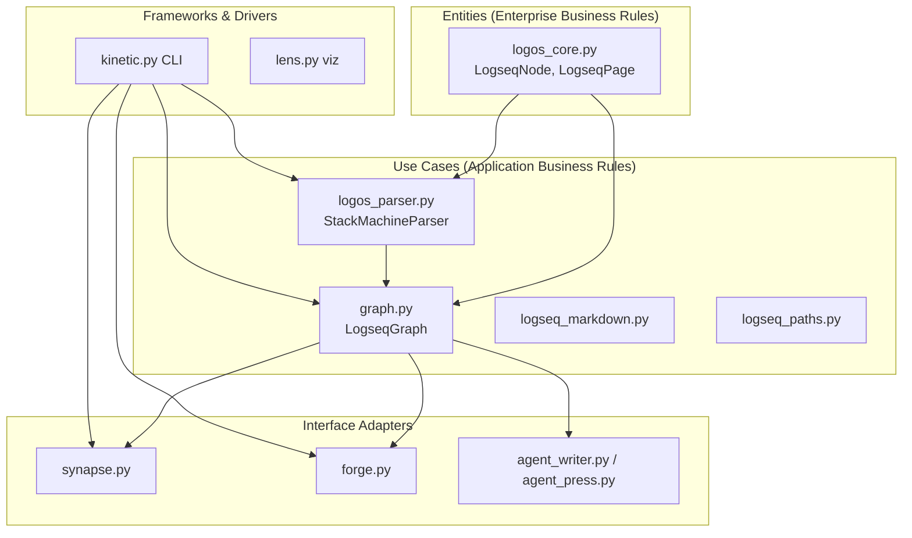

# Bug Hunt Report — logseq-matryca-parser

**Date:** 2026-06-23 (audit) · **Resolution:** 2026-06-23
**Scope:** static + dynamic repository audit (The Logos Protocol)
**Tools:** local graph-based static analysis, `make all`, `scripts/debug_pre_release.py`, ad-hoc Python probes
**Architecture references:** [Clean Architecture](https://blog.cleancoder.com/uncle-bob/2012/08/13/the-clean-architecture.html) (R. C. Martin), [`ARCHITECTURE.md`](ARCHITECTURE.md)

> **Resolution status (2026-06-23):** all **BUG-001…031** and limitations **LIM-001/002** were addressed in code (see `CHANGELOG.md` **v1.4.0**). **DEBT-001** (`iter_canonical_pages`, `page_for_node`) is implemented; residual architectural debt (SRP in `kinetic.py`, OCP embed strategy) remains as non-blocking backlog.
>
> **Test update (2026-06-24, v1.4.1):** GFI-04 (`logseq_paths` fallback), GFI-14 (`normalize_logseq_timestamp`), GFI-03/05/06/09/12/13 and total suite **378** pytest — see `CHANGELOG.md` **v1.4.1**.

---

## 1. Executive summary

| Metric | Result |
| :--- | :--- |
| `make all` (Ruff + Mypy + 378 pytest) | **PASS** |
| Coverage | **90.18%** (threshold 80%; **378** pytest, v1.4.1) |
| Round-trip corpus (`debug_pre_release.py`) | **19/19 OK** |
| Static `check` analysis (IMPORT cycles) | **0 cycles** |
| Static index analysis | `logseq-matryca-parser` — 1074 embeddings, commit `7d3f77b` |

Despite a green suite, static analysis and runtime probes identified **31 bug/issue IDs** (3 Critical parser crashes, 15 Medium/High, 13 Low) and architectural debt (Interface Segregation violation on `graph.pages`).

**Immediate priority:** (1) **BUG-017** — `IndexError` on empty bullet + properties (crash in `load_directory` / `scan`); (2) SYNAPSE embed hang (BUG-001); (3) title collisions in `load_directory` (BUG-010/013); (4) **in-memory graph stale after `agent-write`** (BUG-016); (5) delete-safe invalidate (BUG-005).

**Wave 2 (2026-06-23):** +4 confirmed bugs via static `query` analysis on `_enrich_pages_index` / `invalidate_and_reload_page` and alias-heavy vault probes.

**Wave 3 (2026-06-23):** +3 confirmed bugs via static `context(load_directory)`, `impact(get_node_by_embed_ref)`, `query(append_child_to_node)` — graph index integrity and headless writer.

**Wave 4 (2026-06-23):** +4 bugs via static `query(forge/agent_write)`, `context(LogseqGraphWatcher)` — stale in-memory graph, incomplete watcher, cross-file `title::` collision.

**Wave 5–6 (2026-06-23):** +4 bugs via static `impact(_refresh_node)` risk **CRITICAL**, probes on `load_directory` / `_parse_graph` / LENS / SYNAPSE — parser crash on real Logseq outline, incorrect RAG metadata, duplicate LENS statistics.

**Wave 7 (2026-06-23):** +5 bugs via static `impact(search_content)` → `agent_read`, serialize/export markdown/ghost registry probes — 4-space round-trip, orphan nodes in search/agent-read/RAG, duplicate markdown export, `strict_refs` only same-page.

**Wave 8 (2026-06-23):** +6 bugs via static `query(resolve_relative_page_link)`, `query(agent_press)`, namespace/tag/backlink case probes, `_export_json`, `resolve_asset_path` — completion of core module mapping.

**Wave 9–10 (2026-06-29):** GitHub issues [#59](https://github.com/MarcoPorcellato/logseq-matryca-parser/issues/59)–[#71](https://github.com/MarcoPorcellato/logseq-matryca-parser/issues/71) — LENS ghost wikilinks, corrupted X-Ray state, SYNAPSE cyclic embed / unresolved semantics, kinetic dead code, watcher DIP, English DX, OCP embed refactor. See `CHANGELOG.md` [Unreleased].

**Wave 11 (2026-06-29):** [#72](https://github.com/MarcoPorcellato/logseq-matryca-parser/issues/72) — `append_child_to_node` corrupts markdown when the source file last line **does not** end with `\n` (same-line splice → corrupted outline after `agent-write`). Probe: `impact(append_child_to_node)` → CLI `agent_write`. Paired test issue [#73](https://github.com/MarcoPorcellato/logseq-matryca-parser/issues/73).

---

## 2. Methodology (Clean Architecture lens)

### 2.1 Project concentric layers

The code maps reasonably to Clean Architecture rings:


```mermaid
flowchart TB
    subgraph entities ["Entities (Enterprise Business Rules)"]
        LC[logos_core.py<br/>LogseqNode, LogseqPage]
    end
    subgraph usecases ["Use Cases (Application Business Rules)"]
        LP[logos_parser.py<br/>StackMachineParser]
        LG[graph.py<br/>LogseqGraph]
        LM[logseq_markdown.py]
        LPaths[logseq_paths.py]
    end
    subgraph adapters ["Interface Adapters"]
        SY[synapse.py]
        FG[forge.py]
        AW[agent_writer.py / agent_press.py]
    end
    subgraph drivers ["Frameworks & Drivers"]
        KN[kinetic.py CLI]
        LN[lens.py viz]
    end
    LC --> LP
    LC --> LG
    LP --> LG
    LG --> SY
    LG --> FG
    LG --> AW
    KN --> LP
    KN --> LG
    KN --> SY
    KN --> FG
```

**Dependency rule:** arrows point inward. Observed violations (see §6) are concentrated in adapters that bypass public domain APIs.

### 2.2 Investigation pipeline

1. **Local static analysis bootstrap** — `check(cycles)`, `query`, `impact`, `context` on `StackMachineParser`, `serialize_logseq_page`, `LogseqGraph`, `logseq_agent_write`.
2. **Quality gate** — `make all`.
3. **Round-trip corpus** — `uv run python scripts/debug_pre_release.py`.
4. **Targeted probes** — isolated Python scripts with `SIGALRM` to detect hangs; semantic comparison of ISO weeks vs `%W`.
5. **Coverage mapping** — uncovered lines vs risk (see §7).

---

## 3. Static evidence (local analysis)

| Query / tool | Result | Implication |
| :--- | :--- | :--- |
| `check(cycles)` | `cycleCount: 0` | No import cycles between files; layering is healthy. |
| `impact(StackMachineParser, upstream)` | risk **MEDIUM**, 6 direct callers | Parser refactor has moderate blast radius; run `impact` before any FSM change. |
| `impact(serialize_logseq_page, upstream)` | risk **LOW**, 1 caller | Serialization is contained; round-trip can be tested in isolation. |
| `context(LogseqGraph)` | Imported by `kinetic`, `synapse`, `agent_writer`, `__init__` | Application hub — graph APIs must stay stable and complete. |
| `impact(logseq_agent_write, downstream)` | 2 processes (`logseq_agent_write`, `_demo`) | Weekly file naming change impacts only KINETIC/agent path. |
| `impact(_refresh_node, upstream)` | risk **CRITICAL**, 5 processes (`scan`, `load_and_convert`, `parse`) | BUG-017 — missing guard blocks all parse entrypoints. |
| `impact(load_directory, upstream)` | risk **HIGH**, `agent_read` / `export` / `agent_write` | BUG-010/013/017 share the `load_directory` path. |
| `query(to_llamaindex_nodes SOURCE)` | `LlamaIndexVisitor`, `page_source_node_id` | BUG-018 — single SOURCE for multi-page root. |
| `query(get_deep_statistics largest_pages)` | `GraphVisualizer._count_page_blocks` | BUG-019 — `_pages` list without alias dedup. |
| `impact(search_content, upstream)` | risk **LOW**, process `agent_read` | BUG-022 — scan on `_node_registry` includes orphan nodes. |
| `query(strict_refs BlockReferenceError)` | `_validate_references`, `BlockReferenceError` | BUG-025 — validation only intra-page. |
| `impact(resolve_relative_page_link)` | **0 caller** upstream | Public API currently unused internally; BUG-029 gap for `../`. |
| `query(agent_press to_xray_markdown)` | `SessionAliasRegistry`, `agent_read` | X-Ray duplicates only when consumer passes `pages.values()` roots. |

**Staleness:** local index is aligned to indexed commit; after significant merges, run a local index refresh.

---

## 4. Findings — confirmed bugs (runtime evidence)

### BUG-001 — CRITICAL: infinite loop during page embed expansion (SYNAPSE)

| Field | Value |
| :--- | :--- |
| **File** | `src/logseq_matryca_parser/synapse.py` |
| **Function** | `_expand_macros_and_embeds_impl` (around L164–217) |
| **Severity** | **Critical** (hang / CPU at 100% on RAG export) |
| **Clean Architecture** | Robustness violation in adapter; use case `LogseqGraph.get_page` exists but is not used. |

**Root cause:** when `graph.pages.get(title)` fails, `replacement = match.group(0)` keeps the same string. The `while True` loop rematches the same embed indefinitely.

**Runtime evidence:**

```text
# Missing page → hang confirmed (SIGALRM 3s)
missing page INFINITE_LOOP

# Wrong case (Logseq routing case-insensitive via get_page)
embed [[target]] with page "Target" → INFINITE_LOOP
embed [[Target]] → OK: 'x shared content'

# Valid block UUID missing from graph → hang
double-brace missing uuid INFINITE_LOOP
```

**User path:** `SynapseAdapter.to_context_enriched_chunks` → `kinetic export --format langchain-enriched` on a graph with unresolved embeds.

**Recommended fix (SRP + fail-safe):**

1. Use `graph.get_page(title)` instead of `graph.pages.get(title)` (case-insensitive).
2. On failed resolution, replace with empty string or placeholder, **never** with `match.group(0)`.
3. Add regression tests in `tests/test_synapse.py` for: missing page, wrong case, missing UUID block.

**Blast radius (static analysis):** `impact(SynapseAdapter.to_context_enriched_chunks, upstream)` before fix.

---

### BUG-005 — HIGH: `invalidate_and_reload_page` crashes on deleted file

| Field | Value |
| :--- | :--- |
| **File** | `src/logseq_matryca_parser/graph.py` L641–647 |
| **Severity** | **High** (watcher / incremental index) |
| **Clean Architecture** | Use case does not handle filesystem *delete* event. |

**Root cause:** `invalidate_and_reload_page` always calls `parse_page_file(resolved)` without checking `resolved.exists()`. On page deletion → `FileNotFoundError`.

**Runtime evidence:**

```text
BUG-005 exception: FileNotFoundError .../pages/Gone.md
```

**User path:** `LogseqGraphWatcher` → `_route_event` → `invalidate_and_reload_page` when user deletes a `.md` in Logseq.

**Recommended fix:** if `not resolved.exists()`, purge key/backlink/node entries for that `source_path` (symmetrical with reload) and return without parse.

**Static analysis:** `context(invalidate_and_reload_page)` — direct caller is watcher handler; existing test only covers *edit*, not *delete*.

---

### BUG-006 — MEDIUM: `langchain-enriched` export duplicates chunks per page alias

| Field | Value |
| :--- | :--- |
| **File** | `src/logseq_matryca_parser/kinetic.py` L347–349 |
| **Severity** | **Medium** (duplicate RAG embeddings, token / cost overhead) |

**Root cause:** `_export_langchain_enriched` does `for page in graph.pages.values()`; `_enrich_pages_index` duplicates the same `LogseqPage` under alias keys (`alias::`). `all_roots.extend(page.root_nodes)` inserts the same blocks N times.

**Runtime evidence:**

```text
# alias:: Alt on a page with 1 block
BUG-006 chunk count: 2 payload len: 2
BUG-006 duplicate contents: ['[P] only block', '[P] only block']
```

**Recommended fix:** introduce `LogseqGraph.iter_canonical_pages()` (pattern already in `_enrich_pages_index` L219: `key == page.title` + `id(page)` dedup).

---

### BUG-007 — MEDIUM: `get_namespace_children` duplicates entries with namespace-like aliases

| Field | Value |
| :--- | :--- |
| **File** | `src/logseq_matryca_parser/graph.py` L558–577 |
| **Severity** | **Medium** (incorrect namespace API) |

**Root cause:** iterates `self.pages.items()` without dedup by page object. `alias:: NS/AliasLeaf` creates key `NS/AliasLeaf` that also matches prefix `NS/` in addition to canonical `NS/Leaf`.

**Runtime evidence:**

```text
H17 ns children count: 2 ['NS/Leaf', 'NS/Leaf']
```

**Recommended fix:** reuse `iter_canonical_pages()` helper or `seen_page_ids` like `_build_backlink_registry`.

---

### BUG-008 — LOW: `search_content` is case-sensitive while routing is case-insensitive

| Field | Value |
| :--- | :--- |
| **File** | `src/logseq_matryca_parser/graph.py` L521–528 |
| **Severity** | **Low** (API inconsistency) |

**Evidence:**

```text
search_content('hello') → 0 results
search_content('Hello') → 1 result
```

`get_page` and `get_backlinks` are case-insensitive; `search_content` is not. Document or align.

---

### BUG-009 — LOW: `SessionAliasRegistry.load_from_disk` inconsistent state with duplicate UUIDs

| Field | Value |
| :--- | :--- |
| **File** | `src/logseq_matryca_parser/agent_press.py` L70–78 |
| **Severity** | **Low** (corrupt on-disk agent session) |

**Evidence:**

```text
load {"0": "uuid-a", "1": "uuid-a"}
resolve_alias(0) → uuid-a, resolve_alias(1) → uuid-a
alias_for_uuid('uuid-a') → 1  # alias 0 is “orphan” in reverse lookup
```

**Recommended fix:** validate on load (reject or merge duplicates); add regression test.

---

### BUG-010 — HIGH: `pages/` vs `journals/` title collision + ghost registry nodes

| Field | Value |
| :--- | :--- |
| **File** | `src/logseq_matryca_parser/graph.py` L384–387 |
| **Severity** | **High** (index integrity, agent-read, RAG) |
| **Clean Architecture** | `load_directory` use case violates invariant “one title → one indexed page”. |

**Root cause:** `pages[page.title] = page` uses title as only key. Distinct files with same stem (e.g., `pages/Daily.md` and `journals/Daily.md`) collide. The sorted later path wins in dict; **both** nodes remain in `_node_registry` (registered in previous loop L386–387).

**Runtime evidence:**

```text
# pages/Daily.md + journals/Daily.md (same title "Daily")
registry nodes: ['from-journals', 'from-pages']  # count: 2
pages['Daily'] → pages/Daily.md (winner)
_page_for_node(journal_node) → None  # ghost
query().execute() → 2 nodes, one orphan
```

**User path:** unfiltered `agent-read` includes journal nodes not linked to any `LogseqPage`; enriched export indexes ghost content.

**Recommended fix:** use composite key `(source_kind, title)` or journal title namespace (`[[Apr 25th, 2024]]`); alternatively purge non-winning `_node_registry` nodes after merge.

**Static analysis:** `context(load_directory)` — 25+ test callers; high `impact` risk on refactor.

---

### BUG-011 — MEDIUM: `append_child_to_node` ignores real file indentation

| Field | Value |
| :--- | :--- |
| **File** | `src/logseq_matryca_parser/agent_writer.py` L192–194 |
| **Severity** | **Medium** (headless writer corrupts outline) |

**Root cause:** indentation is computed as hardcoded `graph.tab_size` (2) × `indent_level`, not actual spaces in source. Vaults using 4-space or mixed indentation add children with 2 spaces.

**Runtime evidence:**

```text
# File: '- root\n    - four-space child\n'
append_child_to_node(..., 'appended')
→ ['- root', '    - four-space child', '  - appended']  # 2 spaces, not 4
```

**Recommended fix:** derive indentation from parent bullet in source (`line_start` / leading-space regex) or from `node.indent_level` × detected per-page indent width.

**Static analysis:** `impact(append_child_to_node)` → `agent_write` CLI (7 process hits).

---

### BUG-012 — MEDIUM: `get_node_by_embed_ref` is case-sensitive for UUID

| Field | Value |
| :--- | :--- |
| **File** | `src/logseq_matryca_parser/graph.py` L432–445 |
| **Severity** | **Medium** (Obsidian / Synapse embeds fail) |

**Root cause:** direct lookup `get_node_by_uuid(stripped)` and `node.source_uuid == stripped` compare without case normalization. Logseq/Obsidian often uses lowercase UUIDs in `((...))` while page `id::` may be uppercase.

**Runtime evidence:**

```text
id:: AAAAAAAA-AAAA-AAAA-AAAA-AAAAAAAAAAAA
get_node_by_embed_ref(upper) → hit
get_node_by_embed_ref(lower) → miss
```

**Recommended fix:** normalize UUID comparisons to lowercase (as with `_node_identity_keys` in `forge.py`).

**Static analysis:** `impact(get_node_by_embed_ref)` → `to_context_enriched_chunks`, Obsidian `embed_resolver`.

---

### BUG-013 — HIGH: identical `title::` collision across files (BUG-010 variant)

| Field | Value |
| :--- | :--- |
| **File** | `src/logseq_matryca_parser/graph.py` L384–387 |
| **Severity** | **High** (same mechanism as BUG-010) |

**Scenario:** `pages/A.md` and `pages/B.md` both have `title:: Shared`. Dict keeps one winner (`B.md` by path order), but both nodes (`from-A`, `from-B`) remain in `_node_registry`.

**Runtime evidence:**

```text
shared title pages dict: 1
registry nodes: ['a', 'b']   # or ['from-A', 'from-B']
winner: B.md / from-B
```

**Fix:** unify with BUG-010 — index key should be `source_path` or `(kind, canonical_title)`; purge orphan registry entries.

---

### BUG-014 — MEDIUM: `LogseqGraphWatcher` without `on_deleted` / `on_moved`

| Field | Value |
| :--- | :--- |
| **File** | `src/logseq_matryca_parser/graph.py` L725–730 |
| **Severity** | **Medium** (stale index until restart) |

**Root cause:** handler registers only `on_modified` and `on_created`. Deleted/renamed `.md` files do not invalidate index (unlike Logseq DB updates).

**Evidence:** source inspection of `start()` shows missing `on_deleted`/`on_moved`; combined with BUG-005 if a later event attempts reload on missing path.

**Static analysis:** `context(LogseqGraphWatcher)` — only `on_modified`/`on_created` processes.

**Fix:** add `on_deleted` → purge by `source_path`; `on_moved` → invalidate old + new path.

---

### BUG-015 — LOW: `GraphQuery.has_tag` does not accept `#` prefix

| Field | Value |
| :--- | :--- |
| **File** | `src/logseq_matryca_parser/graph.py` L93–96 |
| **Severity** | **Low** (API / CLI UX) |

**Evidence:**

```text
node.tags: ['mytag']
has_tag('mytag') → 1
has_tag('#mytag') → 0
```

Parser normalizes `#` via `tags`; `has_tag` does literal comparison. Same inconsistency class as BUG-008 (`search_content` case).

**Fix:** strip `#` in `has_tag` (and optionally casefold `search_content`).

---

### BUG-016 — HIGH: `append_child_to_node` does not update in-memory graph

| Field | Value |
| :--- | :--- |
| **File** | `src/logseq_matryca_parser/agent_writer.py` L181–228; `kinetic.py` `agent_write` L641 |
| **Severity** | **High** (inconsistent agent workflow) |

**Root cause:** splice writes to disk only. A `LogseqGraph` loaded before write keeps stale AST/registry; no call to `invalidate_and_reload_page`.

**Runtime evidence:**

```text
registry before/after append: 1 1
parent.children after append: 0   # AST not updated
# file on disk contains new bullet
```

**User path:** `agent-read` → `agent-write` in same Python session/pipeline reusing `LogseqGraph` → export/query ignores just-written block.

**Fix:** after splice, call `graph.invalidate_and_reload_page(source_path)` (or incremental subtree parse).

**Static analysis:** `impact(append_child_to_node)` → `agent_write` (7 process hits).

---

### BUG-017 — CRITICAL: `IndexError` in `_refresh_node` on empty bullet with block properties

| Field | Value |
| :--- | :--- |
| **File** | `src/logseq_matryca_parser/logos_parser.py` L1376–1379 |
| **Function** | `StackMachineParser._refresh_node` |
| **Severity** | **Critical** (parse crash — full graph cannot load) |
| **Clean Architecture** | Parser use case violates invariant “valid Logseq outline”; no fail-soft on empty content after property strip. |

**Root cause:** at line 1376 `first_line` uses guard `if content.splitlines() else ""`, but line 1379 `_extract_task_status(content.splitlines()[0].strip())` does not use the same guard. When a parent bullet has only spaces after `-` and child properties (`id::`, `tags::`, …) are on indented child lines, `content` becomes empty string → `splitlines()[0]` raises `IndexError`.

**Runtime evidence:**

```text
Input: '- \n  id:: abc\n  - real\n'
parse() → IndexError: list index out of range  (L1379)

Variants that crash (without mandatory child):
  '- \n  id:: abc\n'
  '- \n  tags:: foo\n  - c\n'
  'id:: page\n\n- \n  id:: block\n  - c\n'

load_directory with 1 valid + 1 bad file → IndexError (no pages loaded)
_parse_graph (kinetic scan) → IndexError mid progress bar
```

**User path:** Logseq vault with empty “container” bullet and `id::` / metadata on block (common for block embed); `logseq-matryca-parser scan`, `export`, `agent-read` on full graph.

**Recommended fix:** reuse `first_line` (or `content.splitlines()[0] if content.splitlines() else ""`) for `_extract_task_status` too; add regression test `test_empty_bullet_with_block_properties` (separate from `test_empty_bullet_without_trailing_space` which covers only `"-"`).

**Static analysis:** `impact(_refresh_node, upstream)` → risk **CRITICAL**, processes `load_and_convert`, `scan`, `parse`, `parse_file`, `main` (debug_pre_release).

---

### BUG-018 — MEDIUM: `to_llamaindex_nodes` assigns one `SOURCE` for multi-page roots

| Field | Value |
| :--- | :--- |
| **File** | `src/logseq_matryca_parser/synapse.py` L354–359 |
| **Severity** | **Medium** (incorrect RAG metadata when passing multi-page roots) |

**Root cause:** if `page_source_id` omitted, it is computed once from first path among first node in preorder. All LlamaIndex nodes receive same `NodeRelationship.SOURCE`.

**Runtime evidence:**

```text
# Root from A.md and B.md in one list
to_llamaindex_nodes(all_roots) → SOURCE count: 1, nodes: 2
```

**User path:** custom integration aggregates `graph.pages.values()` roots (same anti-pattern as BUG-006) before calling `to_llamaindex_nodes`. KINETIC does not currently expose bulk LlamaIndex export, but the public API is misleading.

**Fix:** document `to_llamaindex_nodes` as per-page, or derive `SOURCE` from `node.source_path` / `page_source_node_id(page_title, path)`.

**Static analysis:** `query(to_llamaindex_nodes SOURCE)` → `LlamaIndexVisitor`, test `test_to_llamaindex_nodes_injects_parent_child_relationships`.

---

### BUG-019 — LOW/MEDIUM: `get_deep_statistics` duplicates `largest_pages` for alias entries in `_pages`

| Field | Value |
| :--- | :--- |
| **File** | `src/logseq_matryca_parser/lens.py` L109–117 |
| **Severity** | **Low/Medium** (HTML/LENS stats can be incorrect if fed alias-expanded `graph.pages.values()`) |

**Root cause:** `largest_pages` iterates `self._pages` without dedup; same `LogseqPage` appears multiple times when list originates from `list(graph.pages.values())` (canonical key + alias).

**Runtime evidence:**

```text
# alias:: Alt, _pages = list(graph.pages.values())
largest_pages: [{'page': 'P', 'block_count': 2}, {'page': 'P', 'block_count': 2}]
```

**Note:** `kinetic visualize` uses `_parse_graph` (one entry per file), so default flow is not affected. Affected only when consumer passes enriched graph dict.

**Fix:** dedup by `id(page)` or `iter_canonical_pages()` (DEBT-001).

---

### BUG-020 — LOW: LENS creates “ghost page” node for alias wikilink

| Field | Value |
| :--- | :--- |
| **File** | `src/logseq_matryca_parser/lens.py` `NetworkXVisitor.visit_node` L26–30 |
| **Severity** | **Low** (misleading visualization) |

**Root cause:** every `ref` in `node.refs` becomes a graph node with `group="page"`. A wikilink `[[Alt]]` where `Alt` is only `alias::` for page `P` creates separate `Alt` node and edge `P → Alt`.

**Runtime evidence:**

```text
# pages/P.md: alias:: Alt, content - [[Alt]]
lens nodes: ['P', 'Alt'], edges: 1
```

**Optional fix:** resolve refs via `graph.get_page(ref)` and use canonical `page.title` as destination node (requires passing `LogseqGraph` to visualizer).

---

### BUG-021 — MEDIUM: `serialize_logseq_page` hardcodes `tab_size=2` and corrupts 4-space vaults

| Field | Value |
| :--- | :--- |
| **File** | `src/logseq_matryca_parser/logseq_markdown.py` L168–186, L211 |
| **Severity** | **Medium** (round-trip changes real indentation) |

**Root cause:** serialization computes indent as `node.indent_level * tab_size` with default `tab_size=2`. Parser stores only indent level (0, 1, 2, …), not original width in source spaces. 4-space child file is rewritten to 2-space indentation.

**Runtime evidence:**

```text
Input file:  '- root\n    - child\n'   # 4 spaces
parse → root indent=0 child=1
serialize_logseq_page(page) → '- root\n  - child\n'   # 2 spaces — match=False
serialize_logseq_page(page, tab_size=4) → match=True   # tab_size is not auto-detected
```

**User path:** `write_logseq_page`, round-trip tests, any pipeline re-writing AST without knowing vault tab size.

**Recommended fix:** detect `tab_size` per page at parse time (GCD of indent increments) and propagate to `LogseqPage` / `LogseqGraph.tab_size`, or store leading spaces.

**Relation:** same family as BUG-011 (`append_child_to_node`); static `impact(serialize_logseq_page)` risk **LOW**.

---

### BUG-022 — HIGH: `search_content` / `GraphQuery` / `agent-read` include ghost nodes

| Field | Value |
| :--- | :--- |
| **File** | `src/logseq_matryca_parser/graph.py` L521–528; `kinetic.py` `agent_read` L567–573 |
| **Severity** | **High** (user-visible manifestation of BUG-010/013) |

**Root cause:** `search_content` and `GraphQuery.execute()` iterate `self._node_registry.values()` without filtering nodes where `_page_for_node(node)` is `None`. After page collision (`pages/` vs `journals/` or duplicate `title::`), losing-file nodes remain in registry but not in `pages`.

**Runtime evidence:**

```text
# pages/Daily.md + journals/Daily.md (title collision)
search_content('journals-only') → 1 hit ['journals-only-text']   # ghost node
query().execute() → 2 nodes, 1 orphan
agent-read (no filter) → X-Ray includes 'GHOST-UNIQUE' from losing journal
get_nodes_by_tag('orphan') → 1 hit on ghost node
```

**User path:** `logseq-matryca-parser agent-read` on vault with same-stem page/journal; `--query` surfaces ghost content not attached to any indexed page.

**Recommended fix:** align with BUG-010 purge, or provide `iter_attached_nodes()` excluding orphans; make `agent_read` use that by default.

**Static analysis:** `impact(search_content, upstream)` → `agent_read` (6 process hits).

---

### BUG-023 — MEDIUM: SYNAPSE enriched chunk on ghost node has incomplete metadata

| Field | Value |
| :--- | :--- |
| **File** | `src/logseq_matryca_parser/synapse.py` `_build_breadcrumbs`, `to_context_enriched_chunks` |
| **Severity** | **Medium** (RAG chunk without page context) |

**Root cause:** for ghost nodes, `_page_for_node` → `None`; breadcrumbs empty, `page_title` metadata `""`, but `get_effective_properties` still inherits ancestor properties from registry.

**Runtime evidence:**

```text
# journals/T.md wins over pages/T.md; child 'child' with inherited tags is ghost
_build_breadcrumbs(ghost) → ('', None)
to_context_enriched_chunks([ghost_child], graph):
  metadata page_title=''  effective_properties={'tags': 'inherited'}
```

**Fix:** depends on BUG-010 purge; alternatively skip ghost nodes in enriched export.

**Static analysis:** `impact(get_effective_properties)` → `to_context_enriched_chunks`.

---

### BUG-024 — MEDIUM: `_export_markdown` duplicates `# Title` sections with alias

| Field | Value |
| :--- | :--- |
| **File** | `src/logseq_matryca_parser/kinetic.py` L318–325 |
| **Severity** | **Medium** (duplicated markdown output) |

**Root cause:** `_export_markdown(pages)` receives `list(graph.pages.values())` with alias duplicates; each entry renders `# {page.title}` even for same object.

**Runtime evidence:**

```text
# alias:: Alt
_export_markdown(list(g.pages.values()), out)
graph.md → '# P' appears 2 times with same body 'body'
```

**Fix:** use `iter_canonical_pages()` (DEBT-001), same pattern as BUG-002/006.

---

### BUG-025 — LOW: `strict_refs=True` validates only same-page references

| Field | Value |
| :--- | :--- |
| **File** | `src/logseq_matryca_parser/logos_parser.py` `_validate_references` L1329–1342 |
| **Severity** | **Low** (API / docs inconsistency) |

**Root cause:** `strict_refs` raises `BlockReferenceError` only for unresolved `((uuid))` **inside the same page**. Cross-page `((uuid))` errors pass silently.

**Runtime evidence:**

```text
parse_page_file('- ((missing-uuid))') strict_refs=True → OK (no raise)
parse_page_file('- ((aaaaaaaa-...))') same-page missing strict_refs=True → BlockReferenceError
```

**Fix:** document current behavior or expand cross-graph validation with loaded `LogseqGraph`.

**Static analysis:** `query(strict_refs BlockReferenceError)` → `test_strict_refs_raises_on_unresolved_block_reference` covers same-page only.

---

### BUG-026 — MEDIUM: `get_backlinks` does not resolve aliases to canonical title

| Field | Value |
| :--- | :--- |
| **File** | `src/logseq_matryca_parser/graph.py` `_append_page_backlinks` L626–631, `get_backlinks` L465–481 |
| **Severity** | **Medium** (API inconsistency with `get_page`) |

**Root cause:** backlinks are indexed using literal wikilink string (`node.wikilinks`) lowercased. `get_page('Alt')` and `get_page('P')` both resolve to same page via `alias::`, but `get_backlinks('P')` does not match links written as `[[Alt]]`, and vice versa.

**Runtime evidence:**

```text
# P.md: alias:: Alt; Src.md: - [[Alt]]
get_backlinks('Alt') → 1
get_backlinks('P')   → 0

# Src.md: - [[P]] (canonical link)
get_backlinks('P')   → 1
get_backlinks('Alt') → 0
```

**Recommended fix:** during index build, resolve each wikilink through `get_page` and record backlinks under both `page.title` and aliases.

---

### BUG-027 — MEDIUM: `_export_json` duplicates page entry with `alias::`

| Field | Value |
| :--- | :--- |
| **File** | `src/logseq_matryca_parser/kinetic.py` `_export_json` (passes `list(graph.pages.values())`) |
| **Severity** | **Medium** (duplicated JSON payload, same block UUIDs) |

**Runtime evidence:**

```text
# alias:: Alt, one block
_export_json(list(g.pages.values()), out)
→ len(graph.json pages) = 2
→ block UUIDs in payload: 2 entries, 1 unique uuid
```

**Fix:** use `iter_canonical_pages()` (DEBT-001).

---

### BUG-028 — LOW: `get_namespace_children` is case-sensitive

| Field | Value |
| :--- | :--- |
| **File** | `src/logseq_matryca_parser/graph.py` L558–571 |
| **Severity** | **Low** (inconsistency with case-insensitive `get_page`) |

**Evidence:**

```text
pages/MyNS/Page.md
get_namespace_children('MyNS') → ['MyNS/Page']
get_namespace_children('myns') → []
```

**Fix:** casefold namespace prefix or lookup via `lower_title_map`.

---

### BUG-029 — LOW/MEDIUM: `resolve_relative_page_link` ignores `../` and `./`

| Field | Value |
| :--- | :--- |
| **File** | `src/logseq_matryca_parser/graph.py` L531–556 |
| **Severity** | **Low/Medium** (public API incomplete vs Logseq OG semantics) |

**Evidence:**

```text
current='NS/Child', target='Global'   → 'Global'
current='NS/Child', target='../Global' → None
current='NS/Child', target='./Global'  → None
```

**Static analysis note:** `impact(resolve_relative_page_link)` → 0 direct callers; API is currently unused internally.

**Fix:** normalize Logseq relative paths (`../`, `./`) before namespace loop.

---

### BUG-030 — LOW: `resolve_asset_path` resolves absolute paths outside vault

| Field | Value |
| :--- | :--- |
| **File** | `src/logseq_matryca_parser/logos_core.py` L125–128 |
| **Severity** | **Low** (security surface for automation tooling) |

**Root cause:** `(Path(page.parent) / '/etc/passwd').resolve()` becomes `/etc/passwd`; if file exists, it is returned without `graph_root` containment enforcement.

**Evidence:**

```text
content: - 
resolve_asset_path('/etc/passwd') → '/private/etc/passwd'  (if file exists)
```

**Fix:** reject absolute links or require resolved path to stay under `graph_root`.

---

### BUG-031 — LOW: `get_nodes_by_tag` is case-sensitive

| Field | Value |
| :--- | :--- |
| **File** | `src/logseq_matryca_parser/graph.py` L513–518 |
| **Severity** | **Low** (same family as BUG-008 / BUG-015) |

**Evidence:**

```text
content: - #MyTag
get_nodes_by_tag('MyTag') → 1
get_nodes_by_tag('mytag') → 0
```

**Fix:** casefold tags in query and parser, or document behavior.

---

### Architectural pattern — DEBT-001: leaky `graph.pages` dict

| Field | Value |
| :--- | :--- |
| **Severity** | **Design debt** (root cause of BUG-002, BUG-006, BUG-007, BUG-024, BUG-027) |
| **Uncle Bob principle** | **ISP** — consumers should not rely on alias-aware keys in public dict internals. |

**Symptom:** `_enrich_pages_index` exposes `dict[str, LogseqPage]` with multiple keys per page (feature for `get_page` / backlinks). Consumers iterating `.values()` without dedup are bypassing dependency rule for invariant “one physical page = one object”.

**Clean Architecture recommendation:** add to `LogseqGraph` use case:

```python
def iter_canonical_pages(self) -> Iterator[LogseqPage]:
    """Yield each physical page once (key title equals page.title), deduplicating by id."""
```

Use it in `kinetic._export_*`, `get_namespace_children`, and document in `ARCHITECTURE.md`.

**Static analysis:** `query("pages.values alias enrich_pages_index")` → `_enrich_pages_index` hub connected to `agent_write`, `scan`, `_export_langchain_enriched`.

---

### BUG-002 — MEDIUM: Obsidian export counts and processes alias duplicates (KINETIC)

| Field | Value |
| :--- | :--- |
| **File** | `src/logseq_matryca_parser/kinetic.py` |
| **Function** | `_export_obsidian` (around L380–414) |
| **Severity** | **Medium** (wrong counts, redundant processing, possible overwrite) |

**Root cause:** `for page in graph.pages.values()` iterates all dictionary keys, including alias entries (`alias::`) that point to same `LogseqPage`. `_enrich_pages_index` inserts aliases as extra keys.

**Runtime evidence:**

```text
# page with alias:: Alt
obsidian files: ['Real.md'] count= 2
# count=2 but single file — same page.title "Real" written twice
```

**Recommended fix:** iterate canonical pages only (e.g., `title == page.title` and unique `source_path`), pattern already used in `_build_backlink_registry`.

---

### BUG-003 — MEDIUM: SYNAPSE page embed resolution is case-sensitive (BUG-001 subset)

| Field | Value |
| :--- | :--- |
| **File** | `src/logseq_matryca_parser/synapse.py` L197 |
| **Severity** | **Medium** (different behavior from `LogseqGraph.get_page`) |

**Evidence:**

```text
get_page('mypage') → True   # case-insensitive
pages.get('mypage') → None  # used by synapse
```

**Uncle Bob principle:** *Consistency* — one title resolution path via public graph API.

---

### BUG-004 — LOW / design ambiguity: agent week file uses `%W` not ISO week

| Field | Value |
| :--- | :--- |
| **File** | `src/logseq_matryca_parser/agent_writer.py` L144 |
| **Code** | `week_id = now.strftime("%Y-W%W")` |
| **Severity** | **Low** (documented in tests, but semantically ambiguous) |

**Evidence:**

```text
2026-05-10  isocal=2026-W19  strftime_W=2026-W18  match=False
2026-01-01  isocal=2026-W01  strftime_W=2026-W00  match=False
```

`test_logseq_agent_write_append_only` currently encodes `2026-W18-agent.md` for 2026-05-10 (`%W` US week). If users expect **ISO 8601** (common in European tooling), weekly files land in wrong week around year boundaries.

**Recommendation:** make explicit product decision in `ARCHITECTURE.md`; if ISO is required, use `isocalendar()` and update tests.

---

## 5. Findings — known limitations (not classified as regressions)

### LIM-001 — Round-trip behavior for literal dots in titles

`filename_to_page_title` applies legacy Dendron rule `.` → `/` (documented in `ARCHITECTURE.md` § path encoding).

```text
'Dr. Smith' → back='Dr/ Smith'  (round-trip FAIL)
'Projects.Secret' → 'Projects/Secret'  (intentional legacy behavior)
```

**Status:** documented behavior; not a bug when vault uses only `___` namespace or folders. It is an explicit trade-off between Dendron compatibility and literal-dot titles.

### LIM-002 — Empty page title maps to `untitled.md`

```text
page_title_to_filename('') → ''
page_title_to_relative_path('') → PosixPath('untitled.md')
write_logseq_page(page, dest) → writes to pages/untitled.md (no crash)
```

Behavior differs from prior note (no longer `Errno 21` on empty path due to `untitled.md` fallback). Still ambiguous for real vaults. **Coverage:** GFI-04 closed in **v1.4.1** (`tests/test_logseq_paths.py`).

---

## 6. Architectural debt (Clean Code / SOLID)

Evaluation is by Uncle Bob principles and does not imply the code is “dirty”; the project is mature but has precise improvement targets.

| Principle | Observation | File / area | Recommendation |
| :--- | :--- | :--- | :--- |
| **SRP** | `kinetic.py` (~655 lines) orchestrates parse, export, stats, agent CLI | `kinetic.py` | Extract `export_handlers.py` or visitor registry (already partially factored with `_export_*`). |
| **OCP** | SYNAPSE embed expansion is monolithic `while` loop | `synapse.py` | Introduce embed-type strategy (block/page/macro) to extend without changing loop. |
| **LSP** | Mutable `LogosNode` vs frozen `LogseqNode` | `logos_core.py` | Keep `LogosNode` legacy-only; avoid new consumers. |
| **ISP** | SYNAPSE adapter reads `graph._page_for_node` (private) | `synapse.py` L222 | Expose public `graph.page_for_node()` or `GraphLookup` protocol. |
| **DIP** | Lazy import `logseq_paths` inside entity method | `logos_core.py` L144 | Acceptable to avoid cycles; alternative is moving `resolve_asset_path` into use-case layer. |
| **Boundaries** | `assert bm is not None` in production | `synapse.py` L171, L190 | Replace with explicit guards (Clean Code: readable fail-fast, avoid asserts under `-O`). |
| **Error handling** | `except ValueError: pass` in timestamp normalization | `logos_parser.py` L500 | Acceptable fallback chain; **GFI-14 closed in v1.4.1** (`tests/test_logos_parser.py`). |
| **ISP / encapsulation** | Consumers iterate raw `graph.pages.values()` | `kinetic.py`, `graph.py` | `iter_canonical_pages()` — DEBT-001; root of BUG-002/006/007. |
| **Use case completeness** | No delete branch in incremental invalidation | `graph.py` L641 | BUG-005; watcher without delete/move — BUG-014 |

**Dependency rule:** no import cycles (static `check`); main violation remains **leaky abstraction** (private member and raw `pages` dict access).

---

## 7. High-risk coverage gap mapping

Uncovered lines with **high functional risk** (not just counts):

| Module | Miss | Risk |
| :--- | :--- | :--- |
| `logos_parser.py` | `_refresh_node` empty bullet + properties | **Critical** — BUG-017 not covered |
| `synapse.py` | unresolved embeds, page cycles | **High** — BUG-001 not covered |
| `kinetic.py` | `_export_obsidian`, `_resolve_graph_path` error paths | **Medium** — GFI-01, GFI-19 |
| `logseq_markdown.py` | round-trip 4-space indentation | **High** — BUG-021 |
| `graph.py` | ghost nodes in search/query | **High** — BUG-022 (with BUG-010) |
| `graph.py` | delete invalidate, alias duplicates, **pages/journals collision** | **High** — BUG-005, BUG-007, **BUG-010** |
| `agent_writer.py` | **in-memory stale after append**, indent mismatch | **High** — BUG-016, BUG-011 |
| `logseq_markdown.py` | round-trip 4-space indentation | **High** — BUG-021 |
| `graph.py` | ghost nodes in search/query/agent-read | **High** — BUG-022 (with BUG-010) |
| `kinetic.py` | `_export_langchain_enriched` alias duplicates | **High** — BUG-006 |
| `logseq_paths.py` | empty title, fallback graph root | **Fixed (v1.4.1)** — GFI-04 |

---

## 8. Remediation plan (suggested order)

| Priority | ID | Action | Estimate |
| :--- | :--- | :--- | :--- |
| P0 | BUG-017 | Guard `first_line` in `_refresh_node` + real outline test | 1 h |
| P0 | BUG-001 | Fix embed loop + synapse test | 2–4 h |
| P0 | BUG-016 | Reload graph after `append_child_to_node` | 1–2 h |
| P0 | BUG-010, BUG-013 | Unique load_directory key + ghost registry purge | 3–4 h |
| P0 | BUG-005 | Delete-safe `invalidate_and_reload_page` + watcher test | 1–2 h |
| P1 | BUG-003 | `get_page` in synapse (included in P0) | — |
| P1 | BUG-011, BUG-021 | Real indentation handling (`append` + serialize, `tab_size` detection) | 3–4 h |
| P1 | BUG-022, BUG-023 | Filter ghost nodes in search/agent-read/export | with BUG-010 |
| P1 | BUG-012 | UUID case normalization in `get_node_by_embed_ref` | 1 h |
| P1 | DEBT-001 | `iter_canonical_pages()` + use in export/namespace | 2–3 h |
| P2 | BUG-002, BUG-006, BUG-007 | Canonical dedup via helper | included in P1 |
| P2 | BUG-026 | Alias-aware backlink index | 2 h |
| P2 | BUG-014 | Watcher `on_deleted` / `on_moved` | 2 h |
| P3 | BUG-004 | ISO vs `%W` decision + docs/tests | 1 h |
| P4 | BUG-008, BUG-009, BUG-015, BUG-018–020, BUG-024–025, BUG-028–031 | case/`#`/namespace; export duplicates; asset path | backlog |
| P5 | Debt | Public `graph.page_for_node`; remove `assert` | 2 h |
| P6 | Coverage | Close GFI-01, GFI-02; wave 2 ([#43](https://github.com/MarcoPorcellato/logseq-matryca-parser/issues/43)–[#52](https://github.com/MarcoPorcellato/logseq-matryca-parser/issues/52)) | backlog |

After each fix: `make all` + local index refresh + `impact` on changed symbol.

---

## 9. Fast reproduction scripts

Save as `scripts/repro_bug_hunt.py` (optional) or execute inline:

```python
# BUG-001: missing page embed hang
import signal, tempfile
from pathlib import Path
from logseq_matryca_parser.graph import LogseqGraph
from logseq_matryca_parser.synapse import _expand_macros_and_embeds_impl

signal.signal(signal.SIGALRM, lambda *_: (_ for _ in ()).throw(TimeoutError("hang")))
with tempfile.TemporaryDirectory() as d:
    root = Path(d)
    (root / "pages").mkdir()
    (root / "pages" / "P.md").write_text("- x {{embed [[NoSuchPage]]}}\n", encoding="utf-8")
    g = LogseqGraph.load_directory(root)
    text = g.pages["P"].root_nodes[0].content
    signal.alarm(3)
    try:
        _expand_macros_and_embeds_impl(text, g, set(), set())
        print("unexpected: completed")
    except TimeoutError:
        print("BUG-001 reproduced: infinite loop")
```

```python
# BUG-002: obsidian duplicate count
import tempfile
from pathlib import Path
from logseq_matryca_parser.graph import LogseqGraph
from logseq_matryca_parser.kinetic import _export_obsidian

with tempfile.TemporaryDirectory() as d:
    root = Path(d)
    (root / "pages").mkdir()
    (root / "pages" / "Real.md").write_text("alias:: Alt\n\n- body\n", encoding="utf-8")
    g = LogseqGraph.load_directory(root)
    out = Path(d) / "out"
    n = _export_obsidian(g, out)
    print("export count:", n, "files:", list(out.rglob("*.md")))
```

```python
# BUG-005: crash on deleted page
import tempfile
from pathlib import Path
from logseq_matryca_parser.graph import LogseqGraph

with tempfile.TemporaryDirectory() as d:
    root = Path(d)
    (root / "pages").mkdir()
    f = root / "pages" / "Gone.md"
    f.write_text("- x\n", encoding="utf-8")
    g = LogseqGraph.load_directory(root)
    f.unlink()
    g.invalidate_and_reload_page(f)  # today: FileNotFoundError
```

```python
# BUG-006: duplicate langchain-enriched chunks
import tempfile
from pathlib import Path
from logseq_matryca_parser.graph import LogseqGraph
from logseq_matryca_parser.kinetic import _export_langchain_enriched

with tempfile.TemporaryDirectory() as d:
    root = Path(d)
    (root / "pages").mkdir()
    (root / "out").mkdir()
    (root / "pages" / "P.md").write_text("alias:: Alt\n\n- only block\n", encoding="utf-8")
    g = LogseqGraph.load_directory(root)
    _, count = _export_langchain_enriched(g, Path(d) / "out")
    print("chunks:", count)  # bug: 2; fixed: 1
```

```python
# BUG-007: duplicate namespace children
import tempfile
from pathlib import Path
from logseq_matryca_parser.graph import LogseqGraph

with tempfile.TemporaryDirectory() as d:
    root = Path(d)
    (root / "pages" / "NS").mkdir(parents=True)
    (root / "pages" / "NS" / "Leaf.md").write_text("alias:: NS/AliasLeaf\n\n- x\n", encoding="utf-8")
    g = LogseqGraph.load_directory(root)
    kids = g.get_namespace_children("NS")
    print(len(kids), [p.title for p in kids])  # bug: 2 dupes
```

```python
# BUG-010: pages/journals title collision + ghost registry nodes
import tempfile
from pathlib import Path
from logseq_matryca_parser.graph import LogseqGraph

with tempfile.TemporaryDirectory() as d:
    root = Path(d)
    (root / "pages").mkdir()
    (root / "journals").mkdir()
    (root / "pages" / "Daily.md").write_text("- from-pages\n", encoding="utf-8")
    (root / "journals" / "Daily.md").write_text("- from-journals\n", encoding="utf-8")
    g = LogseqGraph.load_directory(root)
    print("registry:", [n.clean_text for n in g._node_registry.values()])
    print("orphan:", g._page_for_node(next(n for n in g._node_registry.values() if "journal" in (n.source_path or ""))))
```

```python
# BUG-011: append indent mismatch on 4-space vault
import tempfile
from pathlib import Path
from logseq_matryca_parser.graph import LogseqGraph
from logseq_matryca_parser.agent_writer import append_child_to_node

with tempfile.TemporaryDirectory() as d:
    root = Path(d)
    (root / "pages").mkdir()
    f = root / "pages" / "P.md"
    f.write_text("- root\n    - four-space child\n", encoding="utf-8")
    g = LogseqGraph.load_directory(root)
    append_child_to_node(g, g.pages["P"].root_nodes[0].uuid, "appended")
    print(f.read_text(encoding="utf-8"))  # appended line uses 2 spaces, not 4
```

```python
# BUG-012: embed ref UUID case
import tempfile
from pathlib import Path
from logseq_matryca_parser.graph import LogseqGraph

uid = "AAAAAAAA-AAAA-AAAA-AAAA-AAAAAAAAAAAA"
with tempfile.TemporaryDirectory() as d:
    root = Path(d)
    (root / "pages").mkdir()
    (root / "pages" / "P.md").write_text(f"- x\n  id:: {uid}\n", encoding="utf-8")
    g = LogseqGraph.load_directory(root)
    print("lower:", g.get_node_by_embed_ref(uid.lower()) is not None)  # False today
```

```python
# BUG-016: in-memory graph stale after append_child_to_node
import tempfile
from pathlib import Path
from logseq_matryca_parser.graph import LogseqGraph
from logseq_matryca_parser.agent_writer import append_child_to_node

with tempfile.TemporaryDirectory() as d:
    root = Path(d)
    (root / "pages").mkdir()
    f = root / "pages" / "P.md"
    f.write_text("- root\n", encoding="utf-8")
    g = LogseqGraph.load_directory(root)
    parent = g.pages["P"].root_nodes[0]
    append_child_to_node(g, parent.uuid, "new child")
    print("children in AST:", len(g.pages["P"].root_nodes[0].children))  # 0 today
    print("on disk:", "new child" in f.read_text(encoding="utf-8"))      # True
```

```python
# BUG-017: IndexError on empty bullet with block properties
from logseq_matryca_parser.logos_parser import LogosParser
from logseq_matryca_parser.graph import LogseqGraph
import tempfile
from pathlib import Path

# Direct parse
try:
    LogosParser().parse("- \n  id:: abc\n  - real\n", page_title="T")
except IndexError:
    print("BUG-017 reproduced: IndexError in _refresh_node")

# Full graph load (one bad file blocks all)
with tempfile.TemporaryDirectory() as d:
    root = Path(d)
    (root / "pages").mkdir()
    (root / "pages" / "Good.md").write_text("- ok\n", encoding="utf-8")
    (root / "pages" / "Bad.md").write_text("- \n  id:: x\n  - c\n", encoding="utf-8")
    try:
        LogseqGraph.load_directory(root)
    except IndexError:
        print("BUG-017 reproduced: load_directory aborted")
```

```python
# BUG-013: duplicate title:: across files
import tempfile
from pathlib import Path
from logseq_matryca_parser.graph import LogseqGraph

with tempfile.TemporaryDirectory() as d:
    root = Path(d)
    (root / "pages").mkdir()
    (root / "pages" / "A.md").write_text("title:: Shared\n\n- from-A\n", encoding="utf-8")
    (root / "pages" / "B.md").write_text("title:: Shared\n\n- from-B\n", encoding="utf-8")
    g = LogseqGraph.load_directory(root)
    print("pages dict:", len(g.pages), "registry:", len(g._node_registry))
```

```python
# BUG-021: serialize collapses 4-space indent to 2
from logseq_matryca_parser.logos_parser import LogosParser
from logseq_matryca_parser.logseq_markdown import serialize_logseq_page

raw = "- root\n    - child\n"
page = LogosParser().parse(raw, page_title="P")
out = serialize_logseq_page(page)
print("match:", out == raw)  # False today; child line becomes "  - child"
```

```python
# BUG-022: search_content finds ghost journal nodes after title collision
import tempfile
from pathlib import Path
from logseq_matryca_parser.graph import LogseqGraph

with tempfile.TemporaryDirectory() as d:
    root = Path(d)
    (root / "pages").mkdir()
    (root / "journals").mkdir()
    (root / "pages" / "Daily.md").write_text("- from-pages\n", encoding="utf-8")
    (root / "journals" / "Daily.md").write_text("- journals-only-text\n", encoding="utf-8")
    g = LogseqGraph.load_directory(root)
    hits = g.search_content("journals-only")
    print("ghost hits:", len(hits), [h.clean_text for h in hits])  # 1 hit today
```

```python
# BUG-024: export markdown duplicates # Title with alias
import tempfile
from pathlib import Path
from logseq_matryca_parser.graph import LogseqGraph
from logseq_matryca_parser.kinetic import _export_markdown

with tempfile.TemporaryDirectory() as d:
    root = Path(d)
    (root / "pages").mkdir()
    out = Path(d) / "out"
    out.mkdir()
    (root / "pages" / "P.md").write_text("alias:: Alt\n\n- body\n", encoding="utf-8")
    g = LogseqGraph.load_directory(root)
    _export_markdown(list(g.pages.values()), out)
    md = (out / "graph.md").read_text(encoding="utf-8")
    print("# P count:", md.count("# P"))  # 2 today
```

```python
# BUG-026: get_backlinks misses canonical title when link uses alias
import tempfile
from pathlib import Path
from logseq_matryca_parser.graph import LogseqGraph

with tempfile.TemporaryDirectory() as d:
    root = Path(d)
    (root / "pages").mkdir()
    (root / "pages" / "P.md").write_text("alias:: Alt\n\n- body\n", encoding="utf-8")
    (root / "pages" / "Src.md").write_text("- [[Alt]]\n", encoding="utf-8")
    g = LogseqGraph.load_directory(root)
    print("Alt:", len(g.get_backlinks("Alt")), "P:", len(g.get_backlinks("P")))  # 1, 0
```

## 10. Full module coverage inventory

Audited all core modules in `src/logseq_matryca_parser/` (waves 1–8). **Status:** no core subsystem without targeted probe.

| Module | Probe / static analysis | Outcome |
| :--- | :--- | :--- |
| `logos_parser.py` | `_refresh_node`, strict_refs, indent, deep nest, properties | BUG-017, BUG-025; otherwise stable |
| `logseq_markdown.py` | 4-space round-trip, list props | BUG-021; list props OK |
| `graph.py` | load, invalidate, query, backlinks, namespace, search | BUG-005,010,013,022,026,028,029,031 |
| `synapse.py` | embed hang, cycles, enriched | BUG-001,003,018,023 |
| `kinetic.py` | export `_ *`, scan, agent CLI | BUG-002,006,024,027 |
| `agent_writer.py` | append, indent | BUG-011,016 |
| `agent_press.py` | X-Ray, alias registry | BUG-009; agent_read path OK (no dup) |
| `forge.py` | Obsidian suffix, embed resolver | OK (suffix collision not reproduced) |
| `lens.py` | network, stats | BUG-019,020 |
| `logseq_paths.py` | encode, discover, legacy dot | LIM-001; `.recycle` skip OK |
| `logos_core.py` | `resolve_asset_path` | BUG-030 |
| `exceptions.py` | — | No issues (type edge cases) |
| `__init__.py` / `__main__.py` | — | No issues |

**Verified OK behavior (not bugs):** UUID purge during `invalidate_and_reload_page`; deep page-chain embed of 5 levels; 5-level cyclical embed A↔B; block backlink registry; `discover_graph_files` excludes `.recycle`; `title::` reload purges old key; mixed/tab indentation parse; nesting depth 200.

**Consolidated families (unified fixes):**

| Family | Bug ID | Single fix |
| :--- | :--- | :--- |
| Ghost registry | 010, 013, 022, 023 | Purge `_node_registry` + `iter_attached_nodes()` |
| `pages.values()` duplicates | 002, 006, 019, 024, 027 | `iter_canonical_pages()` (DEBT-001) |
| Case / `#` tag API | 008, 015, 028, 031 | Unified normalization in `GraphQuery` / search |
| Indent / tab_size | 011, 021 | Per-page `tab_size` detection |
| SYNAPSE embed | 001, 003, 013-block | Fail-safe + `get_page()` |

---

## 11. Conclusion

The project maintains strong deterministic invariants (stack-machine parser, round-trip corpus, no import cycles). The most serious bugs are:

1. **LOGOS Parser** — `IndexError` on empty bullet + properties (BUG-017); a single malformed file blocks `load_directory` and `scan`.
2. **SYNAPSE** — hang on unresolved embeds (BUG-001).
3. **LOGOS Graph load** — title collisions and ghost nodes (BUG-010, BUG-013).
4. **Agent Writer** — disk update succeeds but AST remains stale (BUG-016); wrong indentation (BUG-011).
5. **LOGOS Graph / Watcher** — crash on delete (BUG-005); delete/move events missing (BUG-014).
6. **Ghost registry leak** — `search_content`, `agent-read`, SYNAPSE enriched see orphan nodes (BUG-022, BUG-023); root cause BUG-010/013.
7. **Serialization** — round-trip 4-space → 2-space (BUG-021); duplicate markdown export (BUG-024).
8. **KINETIC export / LENS** — duplication with `alias::` (BUG-006, BUG-002, BUG-019, BUG-027) → `iter_canonical_pages()` (DEBT-001).
9. **Inconsistent graph API** — alias backlinks (BUG-026), namespace/tag case (BUG-028, BUG-031).

**Coverage:** 31 bug IDs + 2 documented limitations (LIM-001/002) + DEBT-001. No core module lacks coverage.

Next recommended phase: **implement fixes** — start with BUG-017 → BUG-010/013 → BUG-001/016 (see §8 priority).

---

*Report generated with local static analysis support. To refresh index after fixes: local index refresh.*
