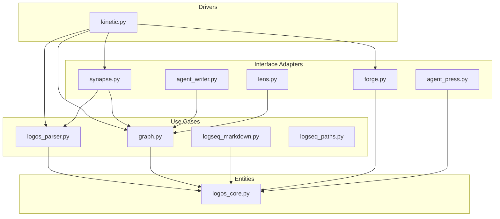
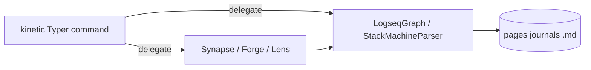

# Clean Code & Clean Architecture — Logseq Matryca Parser

**Version:** documents **v1.6.0** maintainer contracts (v1 structural backlog complete)  
**Audience:** contributors and Cursor agents patching `src/logseq_matryca_parser/`  
**Companion:** [`ARCHITECTURE.md`](ARCHITECTURE.md) (LOGOS domain contract) · [`BUG_HUNT_REPORT.md`](BUG_HUNT_REPORT.md) (audit evidence) · [`CONTRIBUTING.md`](../CONTRIBUTING.md)

This document applies **Robert C. Martin's** *Clean Architecture* (dependency rule, boundaries, use cases) and *Clean Code* (SRP, meaningful names, tests as specification) to the **entire** logseq-matryca-parser codebase.

**Adoption model:** **incremental v1**. A full hexagonal package split (`domain/ports.py`, separate driver packages) is **out of scope** for routine PRs. Uncle Bob here is a **quality contract**, not a mandate to rewrite the flat `src/logseq_matryca_parser/` layout in one change.

**Downstream consumer:** [Matryca Plumber](https://github.com/MarcoPorcellato/matryca-plumber) depends on this library as the inner AST ring. Public APIs (`LogseqGraph`, `StackMachineParser`, `SynapseAdapter`, agent write helpers) must stay stable and framework-agnostic.

---

## Concentric boundaries (Clean Architecture)

```text
        ┌─────────────────────────────────────────────────────────┐
        │  Frameworks & drivers (Typer / Rich CLI — kinetic.py)    │
        ├─────────────────────────────────────────────────────────┤
        │  Interface adapters (synapse, forge, agent_*, lens)    │
        ├─────────────────────────────────────────────────────────┤
        │  Application use cases (parser, graph, markdown, paths) │
        ├─────────────────────────────────────────────────────────┤
        │  Entities (logos_core — LogseqNode, LogseqPage)         │
        └─────────────────────────────────────────────────────────┘
                              ▲
                    dependencies point inward
```

| Ring | Module(s) | Single reason to change |
|------|-----------|-------------------------|
| **Entities** | `logos_core.py`, `exceptions.py` | AST shape, Pydantic invariants, typed errors |
| **Use cases** | `logos_parser.py`, `graph.py`, `logseq_markdown.py`, `logseq_paths.py` | Parse, index, serialize, path translation — **no** CLI or optional AI/viz imports |
| **Adapters** | `synapse.py`, `forge.py`, `agent_writer.py`, `agent_press.py`, `lens.py` | Framework projections (LangChain, LlamaIndex, Obsidian, PyVis) |
| **Drivers** | `kinetic.py`, `kinetic_commands.py`, `kinetic_export.py`, `__main__.py` | Operator CLI — orchestrates use cases and adapters |



### Dependency Rule (enforced in CI)

| Rule | Enforcement |
|------|-------------|
| Entities + use cases must not import Typer, Rich, LangChain, LlamaIndex, NetworkX, PyVis | [`tests/test_layer_boundary.py`](../tests/test_layer_boundary.py) |
| Use cases must not import adapters or `kinetic` | same |
| Adapters must not import `kinetic` | same |
| Import cycles between `src/` modules | `0` expected — verify via local graph study (`check` cycles) |
| Adapters use **public** `LogseqGraph` APIs | Code review + audit SOP |

### v1 by design (do not "fix" without an epic)

| Pattern | Why it exists | Tracking |
|---------|---------------|----------|
| Flat module layout (no `domain/` package) | Library shipped as one PyPI package; low ceremony for contributors | This doc — incremental slices only |
| `kinetic.py` ~230 lines | Typer app factory + `export` orchestration | **Shipped** — handlers in `kinetic_export.py`, subcommands in `kinetic_commands.py` |
| Monolithic SYNAPSE embed `while` loop | Deterministic expansion with cycle guards | **Shipped** — `synapse_embed.py` strategy ([#70](https://github.com/MarcoPorcellato/logseq-matryca-parser/issues/70)) |
| `LogseqGraph.pages` dict with alias keys | Logseq `alias::` / `title::` parity | Consumers must use `iter_canonical_pages()` — DEBT-001 **shipped** |

Audit backlog: [`quality/CLEAN_ARCH_BACKLOG.md`](quality/CLEAN_ARCH_BACKLOG.md). Historical runtime evidence: [`BUG_HUNT_REPORT.md`](BUG_HUNT_REPORT.md).

---

## Module maps (fat modules)

### `logos_parser.py` (~1,440 lines) — LOGOS stack machine

| Area | Responsibility |
|------|----------------|
| Indent / bullet FSM | `_compute_indent_level`, stack push/pop, `_refresh_node` |
| Token harvest | Wikilinks, tags, block refs, shields (code, LaTeX, query blocks) |
| Identity | `source_uuid` vs deterministic synthetic `uuid` |
| Entry | `parse_page_file`, `parse_page_content` |

**Rule:** parser changes require `impact(StackMachineParser._refresh_node)` before merge — **CRITICAL** blast radius (all `load_directory` / `scan` paths).

**Verification:**

```bash
uv run pytest tests/test_logos_parser.py -q
make check
```

### `graph.py` (~920 lines) — in-memory graph RAM image

| Area | Responsibility |
|------|----------------|
| Bulk load | `load_directory`, `_enrich_pages_index` |
| Incremental | `invalidate_and_reload_page`, watcher |
| Query | `GraphQuery`, `search_content`, backlinks |
| Public iteration | `iter_canonical_pages`, `page_for_node`, `iter_attached_nodes`, `is_tracked_markdown_path` |

**Rule:** new index mutations belong here or in `logos_parser.py`, not in KINETIC or SYNAPSE.

### `kinetic.py` (~230 lines) — KINETIC app factory

| Area | Responsibility | Module |
|------|----------------|--------|
| Global `--graph` / `--verbose` callback | CLI wiring | `kinetic.py` |
| `export` command | format dispatch | `kinetic.py` → `kinetic_export.py` |
| `scan`, `visualize`, `demo`, agent CLI | operator UX | `kinetic_commands.py` |
| Format handlers | JSON, markdown, obsidian, langchain | `kinetic_export.py` |

**Rule:** no new parsing logic in KINETIC modules — call `LogseqGraph.load_directory` or `StackMachineParser`.

### `synapse.py` + `synapse_embed.py` — SYNAPSE adapters

| Area | Responsibility |
|------|----------------|
| Visitors | `LangChainVisitor`, `LlamaIndexVisitor` |
| Enriched RAG | `to_context_enriched_chunks`, embed expansion via `synapse_embed` |

**OCP:** `BlockEmbedExpander` / `PageEmbedExpander` in `synapse_embed.py` — [#70](https://github.com/MarcoPorcellato/logseq-matryca-parser/issues/70) **shipped**.

---

## SOLID applied to Logos

| Principle | Logos application |
|-----------|---------------------|
| **S**ingle Responsibility | One cognitive concern per module; KINETIC delegates parse/index to `graph` / `logos_parser` |
| **O**pen/Closed | New export formats via new FORGE visitors or SYNAPSE strategies — not new `if` chains in KINETIC |
| **L**iskov Substitution | `LogosNode` legacy vs frozen `LogseqNode` — do not add new `LogosNode` consumers |
| **I**nterface Segregation | Exporters use `iter_canonical_pages()`; SYNAPSE uses `page_for_node()` — not raw `pages.values()` |
| **D**ependency Inversion | Optional deps (LangChain, watchdog, pyvis) lazy-imported in adapters; core installs stay lean |

Residual debt table: [`quality/CLEAN_ARCH_BACKLOG.md`](quality/CLEAN_ARCH_BACKLOG.md) § SOLID.

---

## Clean Code practices

| Principle | Implementation |
|-----------|----------------|
| **Meaningful names** | `iter_canonical_pages`, `invalidate_and_reload_page`, `append_child_to_node` |
| **Small functions** | Extract when a function mixes I/O, business rules, and logging |
| **SRP** | MCP/CLI consumers live outside this repo; `kinetic` stays a thin driver |
| **Tests as specification** | pytest + `tmp_path` vault fixtures; boundary import tests |
| **Boy Scout Rule** | Within PR scope: migrate one leaky `graph.pages` iteration to `iter_canonical_pages()` |
| **Error handling** | `logging` in `src/` — no bare `print`; no production `assert` (`python -O` strips them) |
| **Determinism** | Same `.md` → same AST and UUIDs; no unseeded randomness in models |
| **Early exit** | Empty / whitespace-only files must not crash parsers |

### Anti-patterns (reject in review)

| Anti-pattern | Preferred fix |
|--------------|---------------|
| Adapter calls `graph._node_registry` or `graph._page_for_node` | Public `get_node_by_uuid`, `page_for_node` |
| Driver iterates `graph.pages.values()` for export stats | `graph.iter_canonical_pages()` |
| Use case imports `typer` / `rich` / `langchain` | Move to `kinetic` or adapter |
| Inline parse loop in KINETIC | `LogseqGraph.load_directory` |
| `assert` in production CLI or adapter paths | Explicit guard + `typer.Exit` or raised domain error |
| Naming vendor AST tools in public issues/CHANGELOG | "Local code study" / "graph-based analysis" — see [Ghost Tooling](#ghost-tooling-vs-maintainer-local-study) |

---

## Fat modules, thin edges



**Contributor checklist before opening a PR:**

1. Does new behavior live in the correct ring (parser/graph vs adapter vs kinetic)?
2. Run `uv run pytest tests/test_layer_boundary.py -q`.
3. If touching a hub symbol, run local code study (below) before editing.
4. If changing operator-visible behavior, update [`CHANGELOG.md`](../CHANGELOG.md) under `[Unreleased]`.
5. Run **`make all`** — non-negotiable merge bar.

---

## High-risk symbols (re-validate after changes)

Always run impact analysis + targeted pytest when touching:

| Symbol | Risk |
|--------|------|
| `StackMachineParser._refresh_node` | Parser crash — blocks `load_directory` / `scan` |
| `_expand_macros_and_embeds_impl` | RAG content correctness |
| `LogseqGraph.load_directory` / `_enrich_pages_index` | Ghost registry / alias keys |
| `invalidate_and_reload_page` | Watcher + agent-write freshness |
| `_resolve_graph_path` (kinetic) | All KINETIC subcommands |
| `SessionAliasRegistry.load_from_disk` | Agent session continuity |

---

## Local code study workflow

Use **graph-based local code study** (call-chain + impact analysis) before refactors or bug hunts. In public artifacts (issues, PRs, CHANGELOG), use generic terms: **local code study**, **graph-based code analysis**, **AST tooling**.

### Contributor workflow (tool-agnostic)

1. **Structural check** — import cycles; hub symbols with upstream impact.
2. **Query** — execution flows for the feature (parse, export, agent-read, watcher).
3. **Impact** — list direct callers before editing a symbol.
4. **Runtime probe** — minimal `uv run python` repro in `tmp_path`; table-driven pytest.
5. **Gate** — `make all`; append `CHANGELOG.md` when user-visible.

Index staleness: if the local study index lags `main`, note it in the issue but **confirm with live probes**.

### Maintainer workflow (named local tools)

Maintainers may use **local-only** indexers and MCP servers that are **not** wired into CI. Practical recipes for graph-based code audit (`list_repos`, `query`, `context`, `impact`, `check`) live in [`internal/LOCAL_CODE_STUDY.md`](internal/LOCAL_CODE_STUDY.md).

License and CI boundaries: [`internal/STATIC_ANALYSIS_POLICY.md`](internal/STATIC_ANALYSIS_POLICY.md) (Ghost Tooling).

---

## Ghost Tooling vs maintainer local study

| Surface | Vendor tool names |
|---------|-------------------|
| Public docs, issues, PRs, CHANGELOG | **Forbidden** — use "local code study" |
| `docs/internal/*` | **Allowed** — maintainer runbooks (generic code-audit MCP setup) |
| `.cursor/rules/*` | Generic in always-applied rules; optional maintainer rules may link `internal/` |
| CI / `pyproject.toml` | **Zero tolerance** — Ruff, Mypy, Pytest, CodeQL only |

---

## Filing GitHub issues (audit template)

Every bug/enhancement issue from an architecture audit should include:

1. **Bug / problem** — one paragraph, operator-visible when possible.
2. **Clean Architecture lens** — table: Ring, SOLID violation, dependency-rule note.
3. **Reproduction** — minimal markdown fixture or Python snippet.
4. **Expected vs actual** — precise strings/counts.
5. **Suggested fix** — stay inside the correct ring; no drive-by refactors.
6. **Context** — link `BUG_HUNT_REPORT.md` ID if related; cite "local code study wave N".

Labels: `bug`, `enhancement`, `good first issue` + `tests` (repro-only), `clean-code` (boundary/DRY slices).

Update [`GOOD_FIRST_ISSUES.md`](GOOD_FIRST_ISSUES.md) when adding contributor-scoped tasks.

---

## Good first issues (Clean Architecture — Tier 4)

| Theme | Entry |
|-------|-------|
| Layer boundary tests | GFI-36 in [`GOOD_FIRST_ISSUES.md`](GOOD_FIRST_ISSUES.md) |
| SYNAPSE embed strategy (OCP) | **shipped** v1.6 — [#70](https://github.com/MarcoPorcellato/logseq-matryca-parser/issues/70) |
| KINETIC export extraction (SRP) | **shipped** v1.6 — [#80](https://github.com/MarcoPorcellato/logseq-matryca-parser/issues/80) |

---

## Verification

```bash
uv run pytest tests/test_layer_boundary.py -q
make lint
make check
make test
```

Full gate: `make all`.

Cursor agents: load [`.cursor/rules/08-clean-code-architecture.mdc`](../.cursor/rules/08-clean-code-architecture.mdc) when editing `src/`. Bug-hunt SOP: [`.cursor/rules/07-clean-architecture-audit.mdc`](../.cursor/rules/07-clean-architecture-audit.mdc).
