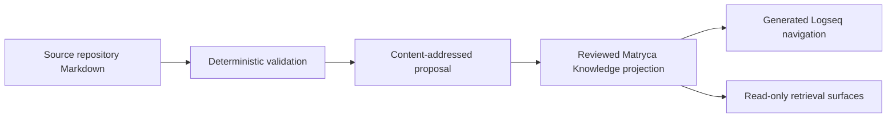

# Documentation system and evolution

This guide explains how documentation in Logseq Matryca Parser is organized,
maintained, reviewed, and projected into the private Matryca Knowledge registry.
It is the canonical operating contract for documentation contributors.

The repository uses a federated model: this source repository owns its
documentation, while Matryca Knowledge owns federation policy, source profiles,
and reviewed projections. A generated projection or Logseq view is useful for
discovery, but it never becomes the editing origin.

## 1. Design goals

The documentation system is designed to provide:

1. one stable human portal and one stable machine entry point;
2. explicit ownership, lifecycle, classification, and freshness;
3. immutable Git provenance for every federated copy;
4. deterministic validation before any LLM-assisted interpretation;
5. preserved historical evidence without treating it as current guidance;
6. ordinary Markdown links that work both on GitHub and as knowledge-graph
   edges;
7. English as the common repository language.

## 2. Authority and projection model



| Surface | Role | May be edited as authority? |
|---|---|---|
| This repository | Canonical source for parser documentation | Yes, through reviewed repository changes |
| Matryca Knowledge source profile | Federation policy and maintained entry-point declaration | Yes, in a separate private-repository change |
| Matryca Knowledge `knowledge/` | Reviewed, reproducible projection | No; regenerate it from an immutable source commit |
| Matryca Knowledge `.local/` | Ignored operator inventory, index, and proposals | No |
| Generated Logseq graph | Disposable navigation view | No |
| Read-only retrieval interfaces | Cited discovery and retrieval | No |

This separation prevents a projected copy from silently diverging from its
source. A projection is trustworthy only when repository, commit, path, and
content hash identify the exact source bytes.

## 3. Documentation surfaces

### 3.1 Maintained bundle

Maintained documents describe current behavior, governance, or decisions. They
carry the complete metadata contract and are reviewed before their freshness
date expires.

| Path | Canonical responsibility |
|---|---|
| [`index.md`](index.md) | Machine entry point and bundle map |
| [`README.md`](README.md) | Human navigation by audience and lifecycle |
| [`DOCUMENTATION_SYSTEM.md`](DOCUMENTATION_SYSTEM.md) | Documentation governance and contributor workflow |
| [`CLEAN_CODE_ARCHITECTURE.md`](CLEAN_CODE_ARCHITECTURE.md) | Architecture rings, public graph API, and dependency rules |
| [`REPOSITORY_STELLAR_ROADMAP_2026-08-06.md`](REPOSITORY_STELLAR_ROADMAP_2026-08-06.md) | Current evidence-backed repository roadmap |
| [`quality/ISSUE_RECONCILIATION_2026-08-06.md`](quality/ISSUE_RECONCILIATION_2026-08-06.md) | Dated GitHub backlog evidence |
| [`quality/README.md`](quality/README.md) | Quality and architecture navigation |
| [`decisions/index.md`](decisions/index.md) | Decision registry and ADR gaps |
| [`reference/index.md`](reference/index.md) | Provenance and ecosystem relations |
| [`log.md`](log.md) | Chronology of documentation-system changes |

The Matryca Knowledge source profile may select a smaller set of these paths as
federation entry points. Source maintenance and federation admission are
related but distinct decisions.

### 3.2 Active supporting documentation

Active supporting documents describe current APIs, operations, contributor
tasks, or draft proposals. They must be linked from the human portal. They may
adopt maintained metadata when they enter the profile allowlist, but metadata
must not be added merely to create the appearance of conformance.

### 3.3 Historical documentation

Historical audits, executed roadmaps, and superseded specifications remain in
place as evidence. They must be clearly labeled by navigation or metadata and
must point to their successor when one exists. Do not rewrite historical
claims, dates, or measured counts as though they described the present.

### 3.4 Generated documentation

Generated artifacts are rebuilt from their source and are never hand-edited.
They should declare `classification: generated` when they are admitted to a
maintained profile. A generated view must preserve source links and provenance.

## 4. Metadata contract

Maintained documents use YAML frontmatter. During the transition to an
official OKF v0.2 parser, the repository retains both the current Matryca field
`last_verified` and the forward-looking `verified` and `stale_after` fields.

```yaml
---
type: ArchitectureGuide
title: Stable discovery title
description: Short description of the document's maintained purpose.
status: draft | stable | deprecated
classification: canonical | active | historical | generated
audience: contributors
owner: logseq-matryca-parser
authority: source_repository
execution_mode: reviewed
last_verified: YYYY-MM-DD
verified: YYYY-MM-DD
stale_after: YYYY-MM-DD
okf_profile: matryca_okf_inspired_quality
okf_spec_version: null
supersedes: null
superseded_by: null
---
```

### 4.1 Field semantics

| Field | Meaning |
|---|---|
| `type` | Stable semantic role used for discovery and canonical-role checks |
| `title` | Stable human-readable title |
| `description` | Concise discovery-oriented purpose |
| `status` | OKF lifecycle only: `draft`, `stable`, or `deprecated` |
| `classification` | Matryca role: `canonical`, `active`, `historical`, or `generated` |
| `audience` | Primary reader group |
| `owner` | Repository or team accountable for review |
| `authority` | Surface that owns the document; normally `source_repository` |
| `execution_mode` | How changes become authoritative; normally `reviewed` |
| `last_verified` | Compatibility date consumed by the current deterministic validator |
| `verified` | Explicit verification date for the evolving v0.2-aligned profile |
| `stale_after` | Date after which the content requires review |
| `okf_profile` | Matryca profile name, distinct from an official specification version |
| `okf_spec_version` | Official OKF version, or `null` while conformance is not claimed |
| `supersedes` / `superseded_by` | Explicit lifecycle edges between documents |

`status` must never contain Matryca classifications such as `canonical` or
`active`. Likewise, `classification` must not be interpreted as an official
OKF lifecycle result.

## 5. Freshness policy

Freshness is evidence, not a timestamp bump.

| Document kind | Default review window | Verification expectation |
|---|---:|---|
| Canonical architecture or documentation policy | 180 days | Compare against current source, public contracts, and policy baseline |
| Active roadmap or quality index | 90 days | Reconcile live implementation and issue state |
| Dated issue ledger | 30 days | Recheck GitHub state or mark the ledger historical |
| Historical document | No recurring refresh | Verify classification and successor links only |
| Generated document | At every regeneration | Verify generator, source commit, and content hash |

If a document cannot be re-verified, keep its original evidence date and change
its classification or lifecycle truthfully. Never extend `stale_after` solely
to satisfy a gate.

## 6. Links, identity, and canonical roles

- Keep maintained Markdown paths stable.
- Use relative Markdown links for repository-local relations.
- Validate both target files and heading anchors.
- Declare only one canonical owner for each semantic `type` within a profile.
- Use explicit supersession links when replacing a maintained document.
- Do not use absolute operator paths, runtime logs, secrets, or credentials.
- Do not copy volatile metrics into several active documents. Link to a dated,
  reproducible report instead.

Renaming a maintained path is a migration. Update inbound links, preserve a
redirect or compatibility stub when readers depend on the old path, and record
the change in [`log.md`](log.md).

## 7. Contribution workflow

### 7.1 Before editing

1. Start at [`README.md`](README.md) and identify whether the target is
   maintained, active, historical, or generated.
2. Confirm the canonical document for the topic; avoid creating a parallel
   source of truth.
3. Check current implementation, issues, and immutable source references.
4. Define whether the change affects source documentation only or also requires
   a separate Matryca Knowledge profile/projection update.

### 7.2 While editing

1. Write in English.
2. Keep the existing path unless a migration is necessary.
3. Update metadata only when verification was actually performed.
4. Add ordinary Markdown links for all important relations.
5. Update [`log.md`](log.md) for documentation-system or canonical-role changes.
6. Add an `Unreleased` changelog entry for contributor-visible changes.

### 7.3 Before publication

1. Run `make vendor-name-check` and `make all`.
2. Confirm the documentation change did not mutate generated snapshots.
3. Review links, anchors, lifecycle, ownership, and freshness.
4. Inspect the staged diff and commit only intended files.
5. Record checks and Matryca/OKF impact in the pull-request description.

The source-owned [`maintained.toml`](maintained.toml) profile is the executable
inventory for this bundle. `make docs-check` validates its paths, flat scalar
frontmatter, lifecycle and classification values, verification dates, freshness,
canonical-type uniqueness, and local links and anchors. Findings are sorted and
use repository-relative paths; the explicit UTC audit date makes repeated runs
against the same checkout reproducible. The check never rewrites documentation.

`make all` and CI both execute this source gate. Full MKQ-4 status remains
pending until the private `okf_entry_points` profile and projection are active
and passing in the separate registry.

## 8. Federation workflow

After an authoritative parser documentation commit is merged:

1. update the `logseq-matryca-parser` source profile in Matryca Knowledge when
   entry points or profile rules changed;
2. operate from clean, immutable source commits;
3. run the deterministic OKF-inspired audit;
4. generate a content-addressed proposal without mutating the reviewed tree;
5. inspect its quality report, source paths, hashes, and removals;
6. apply the verified proposal atomically;
7. verify the projection manifest and every projected Markdown hash;
8. publish the projection through a separate reviewed pull request;
9. regenerate Logseq and retrieval views from the accepted projection.

This repository must not claim successful federation until the private profile
includes the entry points and the resulting projection passes its own checks.

## 9. How the documentation evolved

| Stage | Improvement | Remaining limitation at that stage |
|---|---|---|
| Original design-driven phase | Detailed architecture blueprints and domain research | Historical and current guidance were difficult to distinguish |
| Contributor-navigation phase | `docs/README.md`, cookbook, starter issues, and quality indexes | No machine entry point or lifecycle metadata |
| Clean Architecture phase | Canonical architecture SSOT and vendor-neutral maintainer policy | Documentation quality was mostly prose-enforced |
| Stellar audit phase | Evidence-backed roadmap, issue reconciliation, entry points, classification, and freshness | Private source profile still lacked parser entry points |
| English standardization | Repository documentation and maintainer text moved to one shared language | Governance needed a single explanatory contract |
| Source-enforcement phase | `docs/maintained.toml` and `make docs-check` enforce the maintained bundle in local and remote CI | Private registry admission and projection remain a separate gate |

The intended end state is not a mass rewrite. It is a small, clearly owned
maintained bundle surrounded by discoverable active material and preserved
historical evidence.

## 10. Current conformance statement

This repository uses the `matryca_okf_inspired_quality` profile. It does not
claim official OKF v0.1 or v0.2 conformance. The Matryca source-manifest version,
Matryca quality-profile version, and official OKF specification version are
separate concepts and must be reported independently.

The source-side documentation structure and deterministic CI gate implement the
intended MKQ-1 through MKQ-3 controls. MKQ-4 is reached only when the private
registry profile and projection are also active and passing against an immutable
merged source commit.

## 11. Normative references

- [Documentation portal](README.md)
- [Knowledge bundle](index.md)
- [Documentation evolution log](log.md)
- [Architecture SSOT](CLEAN_CODE_ARCHITECTURE.md)
- [Reference and provenance index](reference/index.md)
- [Matryca Knowledge](https://github.com/MarcoPorcellato/matryca-knowledge)
- [Matryca Plumber](https://github.com/MarcoPorcellato/matryca-plumber)

The Matryca Knowledge policy baseline used for this guide is commit
[`7a3ebd8`](https://github.com/MarcoPorcellato/matryca-knowledge/commit/7a3ebd8),
fetched and reviewed on 2026-08-06.
