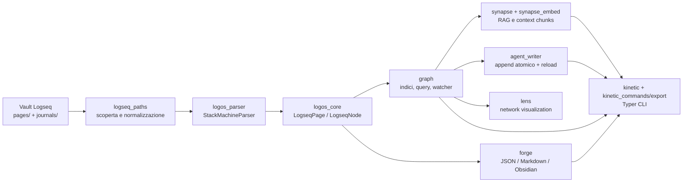
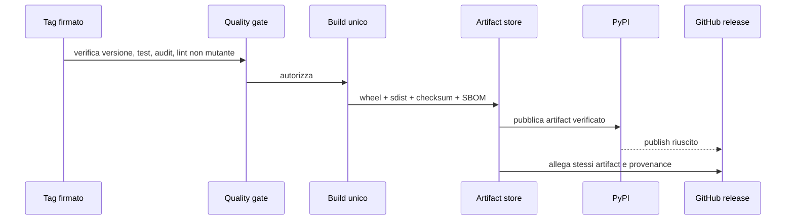
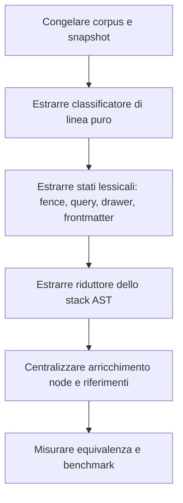

# Studio approfondito della repository — opportunità di miglioramento

> **Documento storico.** È conservato come baseline del 2026-07-28 ed è
> sostituito da [`REPOSITORY_STELLAR_ROADMAP_2026-08-06.md`](REPOSITORY_STELLAR_ROADMAP_2026-08-06.md),
> che include probe aggiuntivi, stato issue aggiornato e piano documentale MKQ-4.

**Data:** 2026-07-28  
**Scope:** architettura, correttezza, affidabilità, sicurezza, performance, test, supply chain, release engineering, documentazione e developer experience.  
**Metodo:** lettura semantica dei flussi, revisione del codice e dei workflow, controlli locali e probe isolati. Non sono state modificate parti del runtime.

## Sintesi esecutiva

Il progetto è una libreria Python matura e ben curata per convertire il Markdown spaziale di Logseq in un AST tipizzato, un indice di grafo e formati di esportazione. I suoi punti più forti sono:

- modello di dominio piccolo e tipizzato;
- parsing deterministico con copertura eccellente dei casi sintattici difficili;
- invarianti di indice già difesi (niente nodi orfani dopo reload e collisioni);
- confini architetturali testati e zero cicli di import;
- pipeline CI, dependency audit e distribuzione PyPI già presenti.

La direzione consigliata non è riscrivere la base: è rendere espliciti i contratti che oggi sono impliciti. Le priorità concrete sono: evitare perdita silenziosa nelle collisioni di titolo, rendere atomiche le operazioni concorrenti di writer/watcher, trasformare il lint CI in un vero gate non mutante, e creare un corpus di compatibilità e benchmark ripetibili.

| Priorità | Tema | Perché ora | Risultato atteso |
|---|---|---|---|
| P0 | Integrità del gate CI | Il lint usato dalla CI corregge anziché rifiutare | Un commit non formattato non può passare senza diff |
| P1 | Collisioni di pagina | Due file con lo stesso titolo perdono silenziosamente un contenuto | Conflitto diagnosticato o rifiutato in modalità strict |
| P1 | Concorrenza writer/watcher | Read-modify-write e aggiornamento indici non hanno un contratto di serializzazione | Nessun update perso e snapshot coerenti |
| P1 | Contratto di compatibilità Logseq | Molti edge case sono testati, ma manca una suite versionata di corpus e metamorphic tests | Regressioni rilevate prima del rilascio |
| P1 | Hardening release/supply chain | Workflow e artefatti possono avere prove più forti | Release verificabile, riproducibile e attribuibile |
| P2 | Osservabilità, performance e API | Buon logging, ma mancano SLO, benchmark e contratti macchina | Operatività e diagnosi più rapide |
| P3 | Modularizzazione parser | Il parser è il grande hub residuo | Cambi locali più sicuri e più leggibili |

## Evidenze raccolte

| Controllo | Esito |
|---|---:|
| Test raccolti | 462 |
| Test eseguiti | 462 passati |
| Coverage totale | 91,09% |
| Soglia coverage | 80% |
| Lint | nessun problema rilevato |
| Type check | nessun errore rilevato |
| Cicli di import in `src/` | 0 |
| Lockfile | coerente con `pyproject.toml` |
| CLI | `matryca-parse --help` operativo |
| Artefatti | sdist e wheel di `1.6.0` costruiti correttamente |
| Audit dipendenze runtime | nessuna vulnerabilità nota al momento della verifica |

Le lacune di coverage più significative non compromettono il gate globale, ma meritano attenzione mirata: `logos_core.py` (75%), `agent_writer.py` (77%) e l'entry point `__main__.py` (0%). La gravità dipende dal flusso: il writer modifica file utente ed è quindi più importante di una semplice percentuale aggregata.

## Architettura attuale



### Cosa funziona bene nella struttura

1. **Core separato dalle integrazioni.** `logos_core.py` mantiene le entità; gli adapter di RAG, visualizzazione e formati restano laterali e opzionali.
2. **Grafo come API applicativa.** `LogseqGraph` offre accessi canonici, backlink, query e reload incrementale, evitando che ogni consumer ricostruisca propri indici.
3. **Parser deterministico.** Il parser mantiene stack, indentazione, proprietà, drawer, riferimenti e normalizzazione in un singolo percorso coerente.
4. **Protezione contro regressioni già forte.** I test coprono UUID sintetici, embed ciclici, frontmatter, namespace, backlink, strict references, tab width, watcher e writer.
5. **Buona disciplina di distribuzione.** Lockfile, test su Python 3.12/3.13, audit dipendenze e pubblicazione con OIDC sono una base affidabile.

### Punto di pressione architetturale

`StackMachineParser.parse()` contiene contemporaneamente scansione, gestione stati, costruzione AST, estrazione semantica e recupero da input malformato; è un hub intenzionale, ma lungo circa 400 righe. `_refresh_node()` ricostruisce molte proiezioni derivate del nodo. È corretto preservare il comportamento, ma la prossima evoluzione del parser deve ridurre il costo cognitivo senza spezzarne la determinismo.

```text
Markdown lines
    |
    v
[classificazione] -> [stato lessicale] -> [evento tipizzato]
                                                   |
                                                   v
                  [riduttore AST] -> [arricchimento semantico] -> LogseqPage
```

Questa separazione non richiede un framework: basta introdurre confini interni e testare ogni passaggio.

## Findings e interventi raccomandati

### P0 — Rendere il lint CI non mutante

**Evidenza.** `make lint` esegue `ruff check . --fix`, e la CI invoca `make lint`. Il runner può quindi correggere il checkout e concludere con successo: il gate non prova che il commit ricevuto fosse già conforme.

**Rischio.** Si perde il ruolo di barriera preventiva; un contributor può ricevere un verde CI ma un working tree locale diverso da quello verificato. In una futura pipeline che riusi lo stesso checkout, file modificati implicitamente possono contaminare step successivi.

**Intervento.** Separare controllo e correzione, rendendo il primo l'unico usato in CI.

```make
lint:
	uv run ruff check .

lint-fix:
	uv run ruff check . --fix

format-check:
	uv run ruff format --check .

format:
	uv run ruff format .
```

**Criteri di accettazione.**

- un file con import non ordinati fa fallire CI;
- `make lint-fix` resta ergonomico localmente;
- CI esegue anche `format-check` oppure verifica esplicitamente che `git diff --exit-code` sia vuoto dopo ogni step mutante.

### P1 — Rendere esplicita la policy sulle collisioni di titolo

**Evidenza.** `LogseqGraph.load_directory()` inserisce le pagine con `pages[page.title] = page` dopo un ordinamento per path. Un probe con `pages/Daily.md` e `journals/Daily.md` ha prodotto una sola pagina canonica (`pages/Daily.md`); il comportamento è coperto intenzionalmente dai test per evitare nodi fantasma.

**Valutazione.** L'invariante attuale è internamente coerente, ma l'esclusione del file perdente è silenziosa: export, ricerca e RAG possono omettere conoscenza senza avviso. È una scelta di prodotto da trasformare in contratto esplicito.

**Proposta.** Mantenere il default retrocompatibile solo per una release minore, ma raccogliere conflitti strutturati; introdurre `strict_title_collisions=True` e una diagnostica leggibile dalla CLI.

```python
@dataclass(frozen=True)
class TitleCollision:
    title: str
    winner: Path
    loser: Path
    reason: Literal["same-derived-title", "title-frontmatter"]

def index_pages(parsed: list[tuple[Path, LogseqPage]], *, strict: bool) -> IndexResult:
    by_title: dict[str, LogseqPage] = {}
    collisions: list[TitleCollision] = []
    for path, page in sorted(parsed, key=stable_path_key):
        previous = by_title.get(page.title)
        if previous is not None:
            conflict = TitleCollision(page.title, winner_path(previous), path, reason(page))
            collisions.append(conflict)
            if strict:
                raise PageTitleCollisionError(conflict)
        by_title[page.title] = select_deterministic_winner(previous, page)
    return IndexResult(by_title, collisions)
```

**Test da aggiungere.** Collisione pages/journals, due `title::` uguali, alias che collide con titolo, CLI `scan --strict-title-collisions`, serializzazione diagnostica JSON. Documentare chiaramente il tie-breaker finché il default rimane permissivo.

### P1 — Contratto di concorrenza per watcher, writer e lettori

**Evidenza.** Il writer effettua un read-modify-write e `os.replace`, poi richiama il reload. Il watcher può aggiornare contemporaneamente gli indici; `invalidate_and_reload_page()` sostituisce `pages`, poi mappa titoli, registro nodi e backlink in passaggi distinti. L'atomic rename protegge dalla scrittura parziale, non da due writer che leggono la stessa versione e sovrascrivono modifiche reciproche.

**Rischio.** In un processo con watcher attivo e richieste simultanee, un lettore può osservare indici transitori; due append possono perdere una modifica. È un rischio di concorrenza da trattare prima di offrire l'API come servizio long-running.

**Proposta.** Definire una sola coda di mutazione per vault e pubblicare snapshot immutabili del grafo.

```python
class VaultCoordinator:
    def __init__(self, initial: GraphSnapshot):
        self._lock = RLock()
        self._snapshot = initial

    def read(self) -> GraphSnapshot:
        return self._snapshot                  # snapshot completo, mai parziale

    def mutate_file(self, path: Path, transform: Callable[[str], str]) -> None:
        with self._lock:
            original = path.read_text("utf-8-sig")
            updated = transform(original)
            atomic_replace(path, updated)
            self._snapshot = rebuild_delta(self._snapshot, path)
            emit_change_event(path, self._snapshot.version)
```

**Criteri di accettazione.** Test con due append concorrenti, lettura mentre avviene un reload, rename/delete durante debounce, callback che non blocca il thread del watcher, nessuna finestra in cui UUID e backlink appartengono a versioni diverse.

### P1 — Corpus di compatibilità e test metamorfici del parser

**Evidenza.** Il parser ha 95% di coverage e un'eccellente suite di esempi, ma la sintassi Logseq ha edge case quasi illimitati e il comportamento dipende dall'evoluzione dell'editor. La coverage da sola non misura la compatibilità semantica.

**Proposta.** Versionare un corpus di vault minimali e aggiungere proprietà invarianti, senza rendere i test fragili o dipendenti dalla rete.

```text
tests/fixtures/compat/
  v1/indentation/
  v1/properties/
  v1/embeds/
  v1/journals/
  v1/recovery/
  manifest.json  # input, risultato semantico atteso, origine e invariant
```

```python
@given(spatial_markdown_strategy())
def test_parse_serialize_parse_preserves_semantics(text: str) -> None:
    original = parser.parse(text)
    reparsed = parser.parse(serialize_logseq_page(original))
    assert semantic_projection(reparsed) == semantic_projection(original)
    assert all_unique(reparsed.all_node_uuids())
    assert parent_links_are_consistent(reparsed)

def test_file_discovery_order_does_not_change_canonical_snapshot(vault: Path) -> None:
    assert load_with_order(vault, forward) == load_with_order(vault, reverse)
```

**Nota.** Per gli input volutamente malformati l'assert non deve essere identità testuale: deve essere terminazione, assenza di crash, AST coerente e diagnostica classificata.

### P1 — Rafforzare release engineering e supply chain

**Evidenza.** La CI effettua audit dipendenze e la pubblicazione usa OIDC; sono buone basi. I workflow però usano tag mobili delle action e la release GitHub e la pubblicazione PyPI sono workflow indipendenti attivati dal tag. La pubblicazione ricostruisce artefatti in un job separato dal pre-flight.

**Interventi.**

1. Pin delle action a commit SHA, con commento della versione leggibile.
2. Build una sola volta dopo il gate; caricare wheel e sdist come artifact; pubblicare esattamente quegli artifact.
3. Verificare prima della pubblicazione: tag `vX.Y.Z` = metadata del package = `__version__`, `twine check`, e changelog con sezione non vuota.
4. Collegare la release GitHub alla conclusione del publish oppure farle consumare lo stesso artifact attestato.
5. Generare SBOM e provenance dell'artefatto se la distribuzione diventa un confine di sicurezza significativo.



### P2 — Budget prestazionali e scalabilità misurata

**Evidenza.** Il caricamento concorrente è una buona scelta; mancano però benchmark versionati, dataset di dimensione dichiarata e budget di memoria/tempo. `search_content` e molte query sono scansioni lineari: corrette per vault medi, potenzialmente costose per un server o vault molto grandi.

**Proposta.** Aggiungere benchmark separati dal gate veloce e metriche comparabili tra release.

```python
@benchmark
def test_load_10k_pages(benchmark, fixture_vault_10k):
    graph = benchmark(LogseqGraph.load_directory, fixture_vault_10k)
    assert graph.page_count == 10_000

@benchmark
def test_incremental_reload(benchmark, loaded_10k_graph, changed_file):
    benchmark(loaded_10k_graph.invalidate_and_reload_page, changed_file)
```

Definire budget iniziali realisti (p95 load, p95 reload, RSS) solo dopo una baseline su runner stabile. Se le query diventano un hot path, introdurre indici opzionali per testo/tag con un contratto di invalidazione unico, non ottimizzazioni sparse.

### P2 — Osservabilità orientata al prodotto

**Evidenza.** Esiste logging utile e dettagliato in tutti i moduli. Manca un modello uniforme per diagnosi di parser, collisioni, riferimenti irrisolti, reload e export: oggi molte informazioni sono solo stringhe di log.

**Proposta.** Introdurre un `Diagnostic` serializzabile, mantenendo il logging come sink.

```python
@dataclass(frozen=True)
class Diagnostic:
    code: str                 # e.g. TITLE_COLLISION, BROKEN_BLOCK_REF
    severity: Literal["info", "warning", "error"]
    source_path: str | None
    line: int | None
    message: str
    context: Mapping[str, str]

class ParseResult:
    page: LogseqPage
    diagnostics: tuple[Diagnostic, ...]
```

La CLI potrebbe offrire `--diagnostics json`, `scan --fail-on warning` e contatori finali. Ciò rende automatizzabili controlli di qualità sui vault senza introdurre telemetria invasiva.

### P2 — API pubblica, typing e compatibilità

**Evidenza.** `__init__.py` espone esplicitamente molte classi e funzioni, ottimo punto di partenza. Manca il marker `py.typed`, quindi gli integratori potrebbero non ricevere i type hints come package tipizzato. La versione è duplicata tra metadata e modulo, pur essendo coperta da test.

**Interventi.**

- aggiungere `py.typed` al package e verificarne l'inclusione nella wheel;
- pubblicare una tabella di stabilità API (`stable`, `experimental`, `internal`);
- usare metadata dinamico o una singola sorgente versione;
- introdurre test di compatibilità su API pubblica e policy semver; 
- valutare `mypy --strict` per il core, a ondate, senza imporlo subito agli adapter opzionali.

```text
public API -> test import -> test signature/semantic contract -> release note
internal API -> nessuna promessa di stabilità -> refactor libero con test interni
```

### P2 — Documentazione viva e onboarding affidabile

**Evidenza.** La documentazione è ampia e ben organizzata, ma diversi documenti riportano ancora 378 o 456 test, mentre l'evidenza attuale è 462. Alcuni report storici sono dichiaratamente storici, ma la distinzione deve essere visivamente inequivocabile.

**Interventi.**

1. Sostituire conteggi volatili con un badge/generatore, oppure aggiornare una singola fonte canonica durante la release.
2. Aggiungere test per snippet Python dei documenti e controlli link interni.
3. Etichettare in testa ai report: `Storico`, `Attivo`, `Superseded`, con data e owner.
4. Creare una pagina "decision records" per scelte come collision policy, UUID sintetici, strict references e writer concurrency.

### P2 — Sicurezza del filesystem e del writer

**Aspetti già buoni.** Il writer usa file temporaneo nella stessa directory e `os.replace`; la risoluzione asset rifiuta percorsi assoluti e normalizza i path. L'audit runtime delle dipendenze non ha trovato vulnerabilità note.

**Miglioramenti.**

- aggiungere test di symlink e confine del vault per tutte le operazioni in scrittura;
- definire una policy esplicita per permessi e owner preservati dal replace;
- offrire una modalità `dry-run` che produce patch unificata prima di modificare Markdown;
- limitare dimensione/depth di input configurabili per usare la libreria su vault non fidati;
- fare girare l'audit dipendenze anche nel workflow tag, non solo nel percorso pull request.

### P3 — Evoluzione incrementale del parser

Non raccomando un big-bang rewrite. La sequenza sicura è:



Ogni slice deve conservare: output semantico, UUID, ordine dei nodi, line range, normalizzazione proprietà e comportamento `strict_refs`. Prima di modificare gli hub del parser o del grafo va rieseguita un'analisi di impatto e vanno aggiornati corpus e benchmark.

## Architettura obiettivo


Principio guida: il core produce dati e diagnostica deterministici; l'applicazione ne controlla il ciclo di vita; gli adapter non accedono a registri interni né definiscono proprie regole di indicizzazione.

## Roadmap proposta

### Fase 1 — Fiducia nel delivery (1–3 giorni)

- Separare lint/check da fix/format.
- Aggiornare i conteggi test nella documentazione attiva.
- Creare check `version/tag/changelog` e `twine check` per release.
- Aggiungere `py.typed` e test della wheel.

### Fase 2 — Integrità del vault (3–7 giorni)

- Introdurre `TitleCollision` e strict mode, senza cambiare il default nella prima release.
- Pubblicare diagnostica JSON e flag CLI fail-fast.
- Aggiungere writer dry-run e test su symlink/permessi.

### Fase 3 — Robustezza operativa (1–2 settimane)

- Coordinatore/snapshot per reload e writer.
- Test concorrenti deterministici con barrier e fake watcher.
- Corpus di compatibilità versionato e prime property-based tests.

### Fase 4 — Evoluzione sostenibile (incrementale)

- Benchmark e budget per 1k/10k pagine.
- Estrarre classificatore/stati parser una slice alla volta.
- Stabilire API stability policy, ADR e release notes generate dai contratti.

## Cosa non cambierei ora

- Non introdurrei una gerarchia di package complessa solo per imitare un'architettura teorica: i moduli piatti sono leggibili e gli import cycle sono già zero.
- Non aggiungerei un database o un motore di ricerca esterno finché benchmark reali non dimostrano che le scansioni lineari sono il collo di bottiglia.
- Non sostituirei Pydantic o Typer: il costo della migrazione non è giustificato da un problema concreto.
- Non renderei il parser "più permissivo" senza diagnostica: per un parser di knowledge graph, un risultato ambiguo ma silenzioso è peggiore di un warning strutturato.

## Definition of Done per le prossime modifiche strutturali

```text
[ ] analisi di impatto sui simboli hub
[ ] test mirati del comportamento modificato
[ ] corpus/regressione per input Logseq rappresentativo
[ ] lint non mutante, type check, test e coverage
[ ] check dei cicli di import
[ ] benchmark se cambia un hot path
[ ] docs/API/ADR aggiornati se cambia un contratto
[ ] prova di installazione o artifact build se cambia packaging/release
```

## Conclusione

La repository non necessita di una rifondazione: è già una base di qualità. Il salto successivo è passare da un progetto robusto a una piattaforma affidabile sotto input reali, vault grandi, integrazioni agentiche e release frequenti. Le quattro iniziative con il miglior rapporto valore/rischio sono: gate CI non mutante, collision diagnostics, serializzazione delle mutazioni del vault e corpus di compatibilità. Insieme proteggono le proprietà che rendono il progetto distintivo: determinismo, fedeltà semantica e fiducia nei dati dell'utente.
