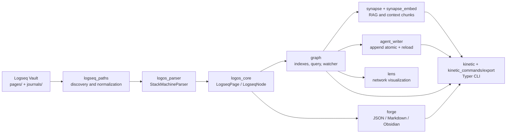
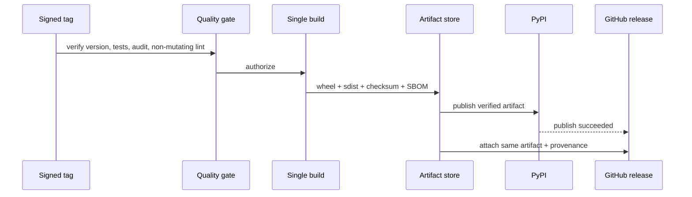
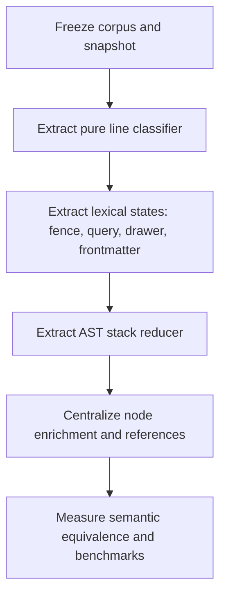
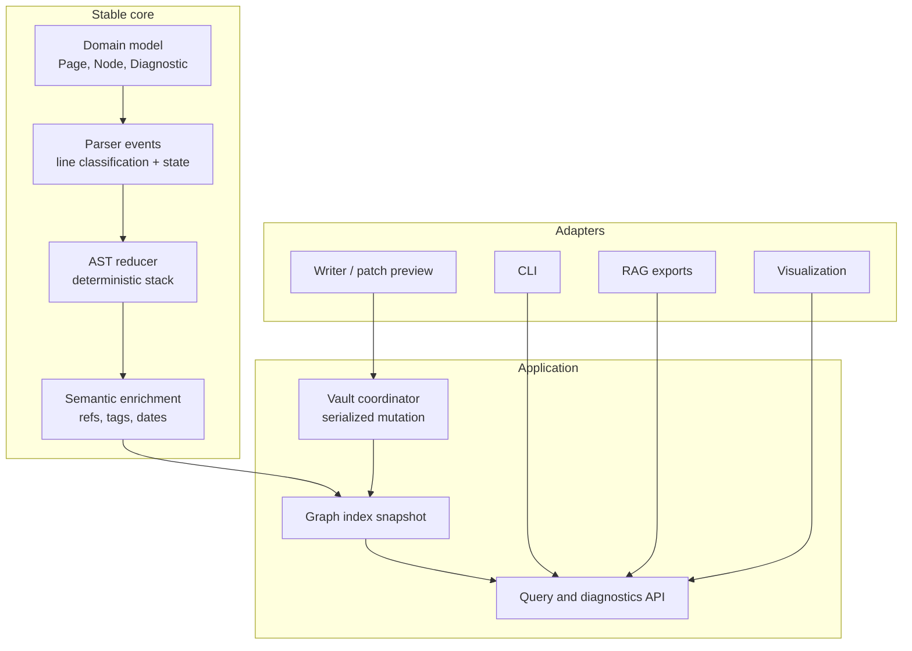

# Deep repository study - improvement opportunities

> **Historical document.** It is kept as a 2026-07-28 baseline and is superseded by [`REPOSITORY_STELLAR_ROADMAP_2026-08-06.md`](REPOSITORY_STELLAR_ROADMAP_2026-08-06.md),
> which includes additional probes, updated issue status, and an MKQ-4 documentation roadmap.

**Date:** 2026-07-28
**Scope:** architecture, correctness, reliability, security, performance, testing, supply chain, release engineering, documentation, and developer experience.
**Method:** semantic flow reading, code and workflow review, local checks, and isolated probes. Runtime code was not modified.

## Executive summary

The project is a mature, well-maintained Python library that converts Logseq block Markdown into a typed AST, a graph index, and export formats. Its strongest points are:

- a compact, typed domain model;
- deterministic parsing with excellent coverage of difficult syntax cases;
- index invariants already enforced (no orphan nodes after reload and collisions);
- architecture boundaries covered and zero import cycles;
- CI pipeline, dependency auditing, and PyPI distribution already in place.

The advised direction is not a complete rewrite: make contracts that are currently implicit explicit. The concrete priorities are to avoid silent data loss in title collisions, make writer/watcher concurrent operations atomic, turn the CI lint into a non-mutating production gate, and create a reproducible compatibility corpus and benchmark suite.

| Priority | Theme | Why now | Expected outcome |
|---|---|---|---|
| P0 | CI lint integrity | Lint used in CI currently fixes files instead of rejecting | A formatting violation cannot pass CI without a diff |
| P1 | Page collisions | Two files with the same title can silently drop content | Report or reject conflicts in strict mode |
| P1 | Writer/watcher concurrency | Read-modify-write and index refreshes have no serialization contract | No lost updates and consistent snapshots |
| P1 | Logseq compatibility contract | Many edge cases are tested, but a versioned corpus and metamorphic tests are missing | Regressions detected before release |
| P1 | Release/supply-chain hardening | Workflow and artifacts can have stronger verification | Verifiable, reproducible, attributable releases |
| P2 | Observability, performance, and API | Good logging exists, but SLOs, benchmarks, and machine contracts are missing | Faster operations and faster diagnosis |
| P3 | Parser modularization | The parser remains a large hub | Safer and clearer local changes |

## Collected evidence

| Check | Outcome |
|---|---:|
| Tests collected | 462 |
| Tests run | 462 passed |
| Total coverage | 91.09% |
| Coverage threshold | 80% |
| Lint | no issues found |
| Type check | no errors found |
| Import cycles in `src/` | 0 |
| Lockfile | consistent with `pyproject.toml` |
| CLI | `matryca-parse --help` is functional |
| Artifacts | 1.6.0 sdist and wheel built successfully |
| Runtime dependency audit | no known vulnerabilities at verification time |

The most relevant coverage gaps do not invalidate the global gate, but merit focused attention: `logos_core.py` (75%), `agent_writer.py` (77%), and `__main__.py` entrypoint (0%). Severity depends on flow criticality: writer touches user files, so it is more impactful than a plain aggregate percentage.

## Current architecture



### What works well in the structure

1. **Core separated from integrations.** `logos_core.py` owns entities; optional adapters (RAG, visualization, export formats) remain peripheral.
2. **Graph as application API.** `LogseqGraph` provides canonical access, backlinks, query, and incremental reload, preventing each consumer from rebuilding indexes.
3. **Deterministic parser.** The parser keeps stack, indentation, properties, drawers, references, and normalization in one coherent path.
4. **Strong regression protection already in place.** Tests cover synthetic UUIDs, cyclic embeds, frontmatter, namespace, backlinks, strict references, tab width, watcher, and writer flows.
5. **Good distribution discipline.** Lockfile, Python 3.12/3.13 testing, dependency audit, and OIDC-based publishing already provide a strong baseline.

### Architectural pressure point

`StackMachineParser.parse()` currently performs scanning, state management, AST construction, semantic extraction, and malformed input recovery in one place; it is intentionally a hub but around 400 lines. `_refresh_node()` also rebuilds many derived projections. Preserving current behavior is correct, but future parser evolution should reduce cognitive load without breaking determinism.

```text
Markdown lines
    |
    v
[classification] -> [lexical state] -> [typed event]
                                                   |
                                                   v
                  [AST reducer] -> [semantic enrichment] -> LogseqPage
```

This separation does not require a new framework: add internal boundaries and test each stage.

## Recommended findings and actions

### P0 — Make CI lint non-mutating

**Evidence.** `make lint` runs `ruff check . --fix`, and CI executes `make lint`. The runner can therefore mutate the checkout and still pass, meaning the gate no longer proves the incoming commit was compliant.

**Risk.** The preventive gate is weakened; a contributor may see a green CI while their working tree differs from the verified state. If the same checkout is reused later, implicit edits can contaminate downstream steps.

**Action.** Split validation and auto-fix, using only validation in CI.

```make
lint:
\tuv run ruff check .

lint-fix:
\tuv run ruff check . --fix

format-check:
\tuv run ruff format --check .

format:
\tuv run ruff format .
```

**Acceptance criteria.**

- a file with unsorted imports fails CI;
- `make lint-fix` remains ergonomic for local use;
- CI also runs `format-check` or explicitly asserts `git diff --exit-code` after mutating steps.

### P1 — Make title collision policy explicit

**Evidence.** `LogseqGraph.load_directory()` stores pages with `pages[page.title] = page` after sorting paths. A probe with `pages/Daily.md` and `journals/Daily.md` produced only one canonical page (`pages/Daily.md`); tests currently cover this behavior to avoid orphan nodes.

**Assessment.** The current invariant is internally consistent, but silent exclusion of the losing file is a product behavior issue: export/query/RAG can omit information without warning. This should be turned into an explicit contract.

**Proposal.** Keep the permissive default for one minor release, but collect structured conflicts; add `strict_title_collisions=True` and CLI-readable diagnostics.

```python
@dataclass(frozen=True)
class TitleCollision:
    title: str
    winner: Path
    loser: Path
    reason: Literal["same-derived-title", "title-frontmatter"]

def index_pages(parsed: list[tuple[Path, LogseqPage]], *, strict: bool) -> IndexResult:
    by_title: dict[str, LogseqPage] = {}
    collisions: list[TitleCollision] = []
    for path, page in sorted(parsed, key=stable_path_key):
        previous = by_title.get(page.title)
        if previous is not None:
            conflict = TitleCollision(page.title, winner_path(previous), path, reason(page))
            collisions.append(conflict)
            if strict:
                raise PageTitleCollisionError(conflict)
        by_title[page.title] = select_deterministic_winner(previous, page)
    return IndexResult(by_title, collisions)
```

**Tests to add.** Pages/journals collision, two files with identical `title::`, alias colliding with title, `scan --strict-title-collisions` CLI path, JSON diagnostic serialization. Explicitly document tie-breaker while permissive mode remains default.

### P1 — Concurrency contract for watcher, writer, and readers

**Evidence.** Writer performs read-modify-write and `os.replace`, then calls reload. Watcher can concurrently update indexes; `invalidate_and_reload_page()` mutates `pages`, then title map, node registry, and backlink map in separate passes. Atomic rename protects partial writes only, not two writers reading the same state and overwriting each other.

**Risk.** In a process with active watcher and concurrent requests, a reader can observe transient partial indexes; concurrent appends can drop updates. This is a concurrency risk that should be handled before offering long-running service-style APIs.

**Proposal.** Define a single mutation queue per vault and publish immutable graph snapshots.

```python
class VaultCoordinator:
    def __init__(self, initial: GraphSnapshot):
        self._lock = RLock()
        self._snapshot = initial

    def read(self) -> GraphSnapshot:
        return self._snapshot                  # complete snapshot, never partial

    def mutate_file(self, path: Path, transform: Callable[[str], str]) -> None:
        with self._lock:
            original = path.read_text("utf-8-sig")
            updated = transform(original)
            atomic_replace(path, updated)
            self._snapshot = rebuild_delta(self._snapshot, path)
            emit_change_event(path, self._snapshot.version)
```

**Acceptance criteria.** Tests covering two concurrent appends, read during reload, rename/delete during debounce, and a callback that does not block watcher thread; no state window where UUID/backlinks belong to different versions.

### P1 — Compatibility corpus and parser metamorphic tests

**Evidence.** Parser coverage is strong and the test suite is excellent, but Logseq syntax has many edge cases and editor behavior evolves. Coverage alone does not guarantee semantic compatibility.

**Proposal.** Version a corpus of minimal vault fixtures and add invariant tests without making tests brittle or network-dependent.

```text
tests/fixtures/compat/
  v1/indentation/
  v1/properties/
  v1/embeds/
  v1/journals/
  v1/recovery/
  manifest.json  # input, expected semantic result, origin, and invariant
```

```python
@given(spatial_markdown_strategy())
def test_parse_serialize_parse_preserves_semantics(text: str) -> None:
    original = parser.parse(text)
    reparsed = parser.parse(serialize_logseq_page(original))
    assert semantic_projection(reparsed) == semantic_projection(original)
    assert all_unique(reparsed.all_node_uuids())
    assert parent_links_are_consistent(reparsed)

def test_file_discovery_order_does_not_change_canonical_snapshot(vault: Path) -> None:
    assert load_with_order(vault, forward) == load_with_order(vault, reverse)
```

**Note.** For intentionally malformed inputs, assertions should not require textual equality. They should require termination, no crash, coherent AST, and classified diagnostics.

### P1 — Strengthen release engineering and supply chain

**Evidence.** CI already runs dependency checks and publishing uses OIDC; these are good foundations. Workflows still rely on movable action tags, and release creation plus PyPI publish are separate tag-driven jobs. Publishing reconstructs artifacts in a separate job than pre-flight.

**Actions.**

1. Pin actions to commit SHA and retain human-readable version comments.
2. Build once after gate completion; upload wheel and sdist as artifacts; publish exactly those artifacts.
3. Verify before publish: tag `vX.Y.Z` equals package metadata and `__version__`, `twine check` passes, and changelog has a non-empty section.
4. Link GitHub release to publish completion, or consume the same attested artifact.
5. Generate SBOM and provenance when artifact distribution becomes a meaningful security boundary.



### P2 — Measured performance and scalability

**Evidence.** Concurrent loading is a good choice; versioned benchmarks, explicit dataset sizes, and memory/time budgets are still missing. `search_content` and many query paths are linear scans: correct for medium vaults, potentially costly for large-server workloads.

**Proposal.** Add dedicated benchmarks outside the fast gate and comparable metrics across releases.

```python
@benchmark
def test_load_10k_pages(benchmark, fixture_vault_10k):
    graph = benchmark(LogseqGraph.load_directory, fixture_vault_10k)
    assert graph.page_count == 10_000

@benchmark
def test_incremental_reload(benchmark, loaded_10k_graph, changed_file):
    benchmark(loaded_10k_graph.invalidate_and_reload_page, changed_file)
```

Set realistic baseline budgets first (p95 load, p95 reload, RSS) after a stable runner baseline. If queries become a hot path, add optional indices with a single invalidation contract, not isolated micro-optimizations.

### P2 — Product-oriented observability

**Evidence.** Logging is useful and detailed across modules. A uniform serializable model for parser, collision, unresolved reference, reload, and export diagnostics is missing; many states are still logged as ad-hoc text.

**Proposal.** Add a serializable `Diagnostic` model and keep logging as sink.

```python
@dataclass(frozen=True)
class Diagnostic:
    code: str                 # e.g. TITLE_COLLISION, BROKEN_BLOCK_REF
    severity: Literal["info", "warning", "error"]
    source_path: str | None
    line: int | None
    message: str
    context: Mapping[str, str]

class ParseResult:
    page: LogseqPage
    diagnostics: tuple[Diagnostic, ...]
```

CLI can then support `--diagnostics json`, `scan --fail-on warning`, and summary counters, enabling automated vault quality checks without intrusive telemetry.

### P2 — Public API, typing, and compatibility

**Evidence.** `__init__.py` already exports many core classes/functions. `py.typed` is still missing, so downstream consumers may not receive type hints from package metadata. Version is duplicated between metadata and module, though covered by tests.

**Actions.**

- add `py.typed` to package and verify wheel inclusion;
- publish API stability table (`stable`, `experimental`, `internal`);
- use dynamic metadata or a single source of version truth;
- add public API compatibility tests and semver policy;
- evaluate phased `mypy --strict` for core only, not mandatory for optional adapters.

```text
public API -> test import -> test signature/semantic contract -> release note
internal API -> no stability guarantees -> freer refactor with internal tests
```

### P2 — Living documentation and onboarding quality

**Evidence.** Documentation is broad and well organized, but several docs still report 378 or 456 tests while current evidence is 462. Some historical docs are marked as historical, yet the distinction should be visually explicit.

**Actions.**

1. Replace volatile counts with a generated badge/script, or update a single canonical source during release.
2. Add tests for documented Python snippets and internal link checks.
3. Mark report headers with `Historical`, `Active`, `Superseded`, plus date and owner.
4. Add a "decision records" page for collision policy, synthetic UUIDs, strict references, and writer concurrency.

### P2 — Filesystem and writer security

**Already solid parts.** Writer uses temporary file plus same-directory `os.replace`; asset resolution rejects absolute paths and normalizes paths. Runtime dependency audit has no known vulnerabilities.

**Improvements.**

- add symlink and vault-boundary tests for all write operations;
- define explicit policy for permissions/ownership preserved by replace;
- add `dry-run` mode that outputs unified diffs before writing markdown;
- bound input size/depth for untrusted vault usage;
- run dependency audits in tag workflow, not only PR path.

### P3 — Incremental parser evolution

I do not recommend a big-bang parser rewrite. A safer sequence is:



Each slice must preserve semantic output, UUIDs, node ordering, line ranges, property normalization, and `strict_refs` behavior. Before touching parser/graph hubs, rerun impact analysis and update corpus/benchmark.

## Target architecture



Design principle: core produces deterministic data and diagnostics; application controls lifecycle; adapters must not access internal registries or define indexing rules themselves.

## Proposed roadmap

### Phase 1 — Delivery trust (1–3 days)

- Separate lint/check from fix/format.
- Update test counts in active documentation.
- Add `version/tag/changelog` and `twine check` release checks.
- Add `py.typed` and wheel inclusion test.

### Phase 2 — Vault integrity (3–7 days)

- Introduce `TitleCollision` and strict mode, with permissive default in the first release.
- Publish JSON diagnostics and CLI fail-fast flag.
- Add writer dry-run and symlink/permissions tests.

### Phase 3 — Operational robustness (1–2 weeks)

- Snapshot/coordination for reload and writer.
- Deterministic concurrent watcher/writer tests with barrier and failure injection.
- Versioned compatibility corpus and first property-based tests.

### Phase 4 — Sustainable evolution (incremental)

- Benchmark and budget for 1k/10k vaults.
- Extract parser classifier/states one slice at a time.
- Establish API stability policy, ADRs, and contract-generated release notes.

## What I would not change now

- I would not add a complex package hierarchy solely to follow a theoretical architecture: flat modules remain readable and import cycles are already zero.
- I would not add a database or external search engine until measured benchmarks prove linear scans are the bottleneck.
- I would not replace Pydantic or Typer: migration cost is not justified by a concrete problem.
- I would not make parser behavior more permissive without diagnostics; for a knowledge graph parser, ambiguous but silent output is worse than structured warnings.

## Definition of done for future structural changes

```text
[ ] impact analysis on hub symbols
[ ] targeted tests for changed behavior
[ ] corpus/regression for representative Logseq input
[ ] non-mutating lint, type check, tests, and coverage
[ ] import cycle check
[ ] benchmark if a hot path changes
[ ] docs/API/ADR updated when contract changes
[ ] install or artifact build verification if packaging/release changes
```

## Conclusion

The repository does not need a refoundation; it is already a strong foundation. The next step is moving from a robust project to a reliable platform under real inputs, large vaults, agent integrations, and frequent releases. The four best value-to-risk items are:
CI non-mutating gate, collision diagnostics, vault mutation serialization, and a compatibility corpus.
Together they protect the qualities that make this project distinctive: determinism, semantic fidelity, and trust in user data.
