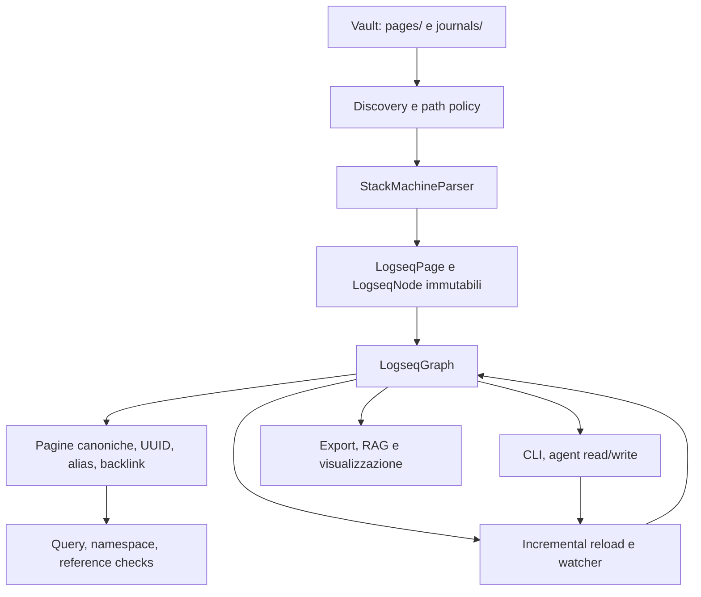

# Logseq Matryca Parser — Code Audit e roadmap verso una repository “stellare”

> **Stato:** studio eseguito e verificato il 2026-08-06  
> **Checkout analizzato:** `main` @ `8e90b44`  
> **Natura del documento:** decision record e backlog tecnico; non autorizza implementazione, commit, push, PR, merge o release  
> **Rapporto con lo studio precedente:** integra e corregge `REPOSITORY_IMPROVEMENT_STUDY_2026-07-28.md`, che al momento dell'audit era ancora non tracciato

## 1. Sintesi esecutiva

La repository è già nettamente sopra la media: il quality gate locale passa con **462 test**, **3.233 statement** misurati e **91% di coverage**, Ruff e Mypy puliti, **0 cicli di import**, packaging moderno, API grafo utili, parsing deterministico, writer atomico a livello di singolo file e una buona separazione degli adapter opzionali.

Il salto successivo non richiede una riscrittura né più feature indiscriminate. Richiede, in quest'ordine:

1. correggere due difetti P0 confermati su fixture sintetiche;
2. rendere espliciti e verificabili i confini di sicurezza del vault;
3. trasformare il grafo mutabile in uno snapshot coerente per writer, watcher e lettori;
4. congelare la semantica del parser con corpus versionato e test metamorfici;
5. rendere delivery, API, diagnostica e documentazione meccanicamente affidabili;
6. misurare la scala prima di introdurre nuovi indici, database o framework.

La conclusione più importante è che il backlog aperto **#101–#111 è valido ma non completo**. Copre quasi tutta la maturazione strategica, però il presente audit ha confermato anche:

- **P0 — perdita di contenuto su aggiornamenti di nodi annidati oltre il terzo livello**;
- **P0 — scrittura fuori dal vault attraverso file Markdown symlinkati**;
- **P1 — risoluzione di URI `file://` senza confinamento al vault**;
- **P1 — backlink obsoleti dopo una rinomina incrementale di pagina**.

Il primo difetto merita una issue bug dedicata e una correzione chirurgica prima del refactor del parser. I due difetti di confinamento devono diventare criteri espliciti della #106; il backlink stale deve diventare una slice esplicita della #103 o una issue figlia.

## 2. Piano iniziale

Il piano definito prima dell'esplorazione era:

1. raccogliere baseline live, istruzioni del repository, storico e architettura indicizzata;
2. delegare audit specialistici a GPT-5.3 Codex Spark e GPT-5.6 Luna;
3. confrontare i risultati e distinguere difetti correnti, debito già tracciato e idee speculative;
4. eseguire un round correttivo sui punti contraddittori o non provati;
5. depositare piano, evidenze, priorità, roadmap e limiti in un Markdown versionabile;
6. validare il documento con i gate prescritti dal repository.

### 2.1 Criteri di accettazione dello studio

- Le raccomandazioni devono derivare da sorgente live, test, workflow o probe riproducibili.
- I fatti storici non devono essere presentati come stato corrente.
- Ogni finding deve indicare impatto, confidenza, verifica minima e relazione con #101–#111.
- Le modifiche a hub devono essere precedute da impact analysis.
- Devono restare invariati parsing deterministico, UUID, ordinamento, pagine canoniche, no-ghost-node e `strict_refs`.
- Nessun commit, push, PR, issue o cambio remoto è autorizzato da questo studio.

## 3. Delega, raccolta e correzione del tiro

Sono state lanciate cinque attività read-only in worktree separati, partendo dallo stato corrente incluso il documento non tracciato del 28 luglio.

| Attività | Modello | Motivazione del routing | Esito utile |
|---|---|---|---|
| Documentazione e contributor experience | GPT-5.3 Codex Spark | Ricerca prevalentemente meccanica: link, numeri, indici, onboarding | Evidenze raccolte; il report finale è fallito per limite del servizio, quindi le conclusioni sono state ricostruite e riverificate localmente |
| CI, packaging e release engineering | GPT-5.3 Codex Spark | Workflow e manifest hanno controlli deterministici | Confermati lint mutante, action non pin-nate e lineage degli artifact non immutabile |
| Architettura e manutenibilità | GPT-5.6 Luna | Richiede ragionamento cross-module e blast radius | Confermati i due hub principali, la necessità di slice incrementali e il backlink stale |
| Correttezza, sicurezza e performance | GPT-5.6 Luna | Area ad alto rischio con probe e giudizio | Ha individuato quattro anomalie riprodotte poi nel checkout principale |
| Prodotto, API ed ecosistema | GPT-5.6 Luna | Richiede sintesi di posizionamento e sequenziamento | Confermata la strategia contract-first e il rifiuto di plugin/database prematuri |

### 3.1 Round correttivo

Le prime esecuzioni lunghe delle attività remote sono state interrotte durante la compattazione. Non sono state accettate come risultati completi. Il secondo round ha:

- ridotto lo scope;
- vietato nuove scansioni ampie;
- chiesto una chiusura dai dati già raccolti;
- ridotto il reasoning dove necessario;
- imposto output compatti e separazione fra fatti e ipotesi.

Quattro attività hanno poi prodotto report finali. L'attività documentale è fallita nuovamente per limite di output; i suoi dati parziali sono stati confrontati direttamente con `README.md`, `docs/README.md`, `CONTRIBUTING.md`, workflow e studio precedente.

### 3.2 Revisione critica dei risultati delegati

Una prima sintesi concludeva che #101–#111 coprissero tutto il lavoro necessario. Questa conclusione è stata rigettata dopo i probe indipendenti: la perdita di soft-break profondo non è un semplice requisito del corpus, ma un bug corrente riproducibile; il confine symlink e il ramo `file://` sono comportamenti di sicurezza attuali, non solo hardening teorico.

Questo è il motivo per cui la roadmap finale inizia con una **Wave 0 di contenimento e correzione**, prima delle iniziative strategiche già aperte.

## 4. Evidenze e baseline live

### 4.1 Stato Git

All'inizio dello studio:

```text
* main...origin/main
?? .serena/
?? docs/REPOSITORY_IMPROVEMENT_STUDY_2026-07-28.md
```

Entrambi i path preesistevano e sono stati preservati. L'aggiornamento locale dell'indice di audit code aveva aggiunto automaticamente contenuto a `AGENTS.md` e `CLAUDE.md`; quelle sole aggiunte generate durante lo studio sono state rimosse, riportando i due file senza diff.

### 4.2 Quality gate

Comando:

```bash
rtk make all
```

Risultato:

- Ruff: `All checks passed!`;
- Mypy: `Success: no issues found in 34 source files`;
- controllo documentale vendor-neutral: `OK`;
- Pytest: **462 passed**;
- coverage: **3.233 statement, 288 mancanti, 91% totale**.

Il target `make all` è verde, ma non è ancora un gate puramente verificativo: `make lint` esegue `ruff check . --fix`. Nel presente run non ha prodotto diff, ma in CI potrebbe correggere il checkout e mascherare una submission non conforme. Questo conferma #101.

### 4.3 Audit code

L'indice locale è stato aggiornato al commit corrente e ha riportato:

```text
2.133 nodi | 4.040 relazioni | 57 cluster | 169 flussi
cycleCount: 0
```

Il server di consultazione ha inizialmente mantenuto in cache un contesto vecchio; per questo nessun risultato stale è stato usato come prova sufficiente. I finding critici sono stati confermati con sorgente live, analisi semantica e probe runtime.

### 4.4 Blast radius degli hub protetti

| Simbolo | Rischio | Impatto rilevato | Conseguenza operativa |
|---|---:|---|---|
| `StackMachineParser._refresh_node` | HIGH | 102 simboli, 4 flussi | Modifiche solo con corpus, snapshot semantici e test parser completi |
| `StackMachineParser._replace_stack_tail_node` | HIGH | 102 simboli, 4 flussi | Il fix P0 deve essere chirurgico e equivalence-tested |
| `LogseqGraph.load_directory` | CRITICAL | 47 chiamanti diretti, 6 flussi | Nessuna modifica opportunistica; preservare API e determinismo |
| `LogseqGraph.invalidate_and_reload_page` | LOW locale | 3 chiamanti diretti, 2 flussi | Slice piccola, ma semantica globale degli indici da testare contro cold reload |
| `_expand_macros_and_embeds_impl` | LOW | 6 simboli, 2 flussi | Seams già sottili; non è un hotspot prioritario |

## 5. Architettura attuale



La direzione delle dipendenze è buona e il controllo cicli è pulito. I rischi principali non sono cicli o framework sbagliati, ma **coerenza temporale** e **propagazione delle strutture immutabili**:

- il parser ricostruisce nodi immutabili lungo uno stack;
- il grafo pubblica più indici derivati dalla stessa collezione di pagine;
- writer e watcher possono aggiornare file e indici in momenti diversi;
- alias e titoli trasformano una mappa in un insieme di identità canoniche più proiezioni secondarie.

Il design futuro deve rendere questi quattro contratti espliciti.

## 6. Findings confermati

### P0.1 — Perdita di contenuto su nodi annidati profondamente

**Stato:** bug corrente, alta confidenza, non coperto in modo sufficientemente esplicito dalle issue esistenti.

`StackMachineParser._replace_stack_tail_node` aggiorna il nodo, il parent e il grandparent, ma non propaga il nuovo ramo fino alla root per profondità superiori. Il soft-break viene registrato nello stack locale, mentre l'AST restituito conserva una root precedente.

Probe sintetico:

```text
DEEP_CONTENTS ['a', 'b', 'c', 'd', 'e']
DEEP_SOFT_BREAK_PRESENT False
```

Input protetto:

```markdown
- a
  - b
    - c
      - d
        - e
          continuation-e
```

**Impatto:** perdita silenziosa di contenuto e metadati quando una qualsiasi delle chiamate a `_replace_stack_tail_node` aggiorna un nodo profondo. Il problema non è limitato ai soft-break: lo stesso helper è usato per proprietà, fence, query e finalizzazione delle liste.

**Perché i test non lo vedono:** i test soft-break correnti proteggono casi poco profondi e la coverage di linea esegue l'helper senza verificare l'invariante “ogni aggiornamento allo stack è osservabile dalla root a qualsiasi profondità”.

**Slice minima:** sostituire la propagazione hard-coded a tre livelli con una ricostruzione iterativa dal leaf alla root, senza cambiare classificazione delle linee o semantica del parser.

**Test obbligatori:** profondità 1, 2, 3, 4, 8 e 32; soft-break, proprietà, code fence e lista proprietà; `line_end`; parent/left pointers; UUID; serializzazione e reparse; equivalenza fra shallow e deep nesting.

**Tracking raccomandato:** nuova issue bug dedicata. Collegarla a #104 e rendere il fix un prerequisito della #108.

### P0.2 — Il writer può mutare un file fuori dal vault tramite symlink

**Stato:** vulnerabilità di confinamento corrente; alta confidenza; sovrapposizione diretta con #106.

La discovery accetta Markdown symlinkati sotto `pages/` o `journals/`. `parse_page_file` salva nel nodo `path.resolve()`, cioè il target reale. `append_child_to_node` legge e sostituisce quel `source_path` senza verificare che sia contenuto nel `graph.graph_path`.

Probe eseguito esclusivamente in directory temporanee:

```text
SYMLINK_SOURCE_OUTSIDE True
SYMLINK_OUTSIDE_MUTATED True
```

**Impatto:** un vault non fidato può indurre un'integrazione con permessi locali a modificare un file Markdown esterno al vault.

**Slice minima:** scegliere e documentare una policy symlink fail-closed per tutte le operazioni di scrittura; verificare il target risolto immediatamente prima di leggere e immediatamente prima di `os.replace`; rifiutare mismatch fra root, source registrato e target corrente.

**Test obbligatori:** symlink a file, symlink a directory, cambio symlink fra parse e write, path relativo con traversal, rename race, dry-run senza scrittura, target interno valido.

**Tracking raccomandato:** aggiornare #106 con il probe e questi criteri di accettazione; non duplicare la issue salvo decisione del maintainer.

### P1.1 — `file://` bypassa il confinamento degli asset

**Stato:** difetto di lettura/confinamento corrente; alta confidenza.

`LogseqPage.resolve_asset_path` restituisce immediatamente il path assoluto per URI `file://`, prima del controllo sul `graph_root`. Questo contraddice la documentazione attiva, che dichiara il resolver confinato al vault.

Probe:

```text
FILE_URI_RESULT /private/etc/passwd
```

**Impatto:** un documento non fidato può trasformare un token asset in un path locale arbitrario che un adapter a valle potrebbe leggere o ingerire.

**Slice minima:** applicare una sola funzione di canonicalizzazione e containment a tutti i rami, inclusi `file://`, percent-decoding, path Windows e fallback asset. Definire se `file://` interno al vault è supportato o sempre vietato.

**Tracking raccomandato:** nuova issue security separata oppure ampliamento esplicito di #106 da “write boundary” a “filesystem boundary”.

### P1.2 — Backlink obsoleti dopo rinomina incrementale

**Stato:** bug corrente, alta confidenza, vicino a #103 ma non esplicitato nei criteri attuali.

Il full load ricostruisce tutti i backlink. `invalidate_and_reload_page` rimuove i nodi della sola pagina modificata e aggiunge i backlink in uscita della pagina fresca; non ricalcola le chiavi dei link provenienti da pagine non modificate quando cambia il titolo o un alias del target.

Probe:

```text
RENAME_BACKLINKS 1 1 0
```

Interpretazione: prima della rinomina esiste un backlink; dopo `Target → Renamed`, la vecchia chiave continua a restituire un risultato e la nuova non ne restituisce nessuno.

**Contratto corretto:** dopo ogni incremental reload, lo snapshot osservabile deve essere semanticamente equivalente a un cold load sullo stesso filesystem.

**Slice minima:** introdurre un risultato di delta che segnali cambi di identità pagina/alias; in quel caso ricostruire gli indici globalmente dipendenti o usare indici reverse-dependency espliciti. Prima ottimizzare la correttezza, poi misurare.

**Tracking raccomandato:** issue figlia della #103 o ampliamento esplicito della stessa; collegare #102 e #110.

### P1.3 — Collisioni titolo/alias possono nascondere una pagina

**Stato:** confermato e già correttamente coperto dalla #102.

Le pagine sono indicizzate in un dizionario title-keyed e gli alias possono rimappare una chiave canonica. Il comportamento è deterministico e il registry evita molti ghost node, ma la perdita di visibilità resta perlopiù un log.

**Azione:** non aprire una nuova iniziativa; implementare diagnostica strutturata, entrambe le path, winner policy stabile e strict mode come già richiesto da #102.

### P1.4 — Writer, watcher e lettori non condividono uno snapshot atomico

**Stato:** rischio architetturale confermato; coperto dalla #103.

Il writer offre `mkstemp` + `os.replace`, che protegge dall'osservazione di file parziali, ma non serializza due read-modify-write concorrenti. L'incremental reload assegna e aggiorna più strutture derivate in passi distinti.

**Azione:** un coordinatore per vault con lock per mutazioni e pubblicazione di un singolo snapshot immutabile. Nessun lock globale di processo.

### P1.5 — Il lint CI è mutante

**Stato:** confermato; coperto dalla #101.

Separare `lint`/`format-check` da `lint-fix`/`format`, aggiungere controllo dirty-tree e mantenere `make all` come gate non mutante.

### P1.6 — Artifact release non qualificato una sola volta

**Stato:** confermato; coperto dalla #105.

Pre-flight, build PyPI e GitHub Release non consumano necessariamente lo stesso wheel/sdist immutabile. Le action usano tag mobili e il VCS override `nltk` è tag-based anziché commit-based.

**Azione:** build once, checksum, artifact attestato, publish exact bytes, release exact bytes; tag/version/changelog coerenti; action pin-nate a SHA.

### P2 — Debito strategico valido ma non urgente quanto i finding precedenti

- #104: corpus di compatibilità e proprietà metamorfica;
- #107: `py.typed`, policy API e fonte versione;
- #109: lifecycle documentale, link/snippet checks e numeri generati;
- #110: diagnostica strutturata;
- #111: benchmark 1k/10k pagine e budget RSS/p95;
- #108: estrazione incrementale delle fasi parser solo dopo #104 e il fix P0.1.

## 7. Perché 91% di coverage non equivale a 91% di affidabilità

La suite è forte, ma la coverage di linea non esprime quattro dimensioni decisive:

| Dimensione | Esempio mancante | Tecnica necessaria |
|---|---|---|
| Profondità strutturale | aggiornamento leaf a profondità arbitraria | test generativi su alberi e metamorphic depth invariance |
| Coerenza temporale | incremental reload equivalente al cold load | state-machine test e snapshot oracle |
| Confine filesystem | symlink, TOCTOU, `file://` | abuse-case fixtures in tmp, path policy centralizzata |
| Concorrenza | due writer e watcher simultanei | test deterministici con barrier, non sleep casuali |

La metrica target non deve essere “95% coverage” in astratto. Deve essere: **100% degli invarianti critici protetti da oracle semantici**.

## 8. Repository e documentazione — profilo Matryca Knowledge

### 8.1 Baseline normativa e provenance

Questa parte del piano adotta i parametri correnti di
[`MarcoPorcellato/matryca-knowledge`](https://github.com/MarcoPorcellato/matryca-knowledge)
alla revisione `7a3ebd8` del 2026-08-06. I riferimenti normativi sono:

- [`ENGINEERING_PRINCIPLES.md`](https://github.com/MarcoPorcellato/matryca-knowledge/blob/7a3ebd8/docs/ENGINEERING_PRINCIPLES.md): determinismo prima dell'automazione, evidenze, baseline, test e rollback;
- [`OKF_SOURCE_GOVERNANCE.md`](https://github.com/MarcoPorcellato/matryca-knowledge/blob/7a3ebd8/docs/OKF_SOURCE_GOVERNANCE.md): identità Markdown stabile, link ordinari, entry point e ownership;
- [`FOUNDATION_GOVERNANCE_OKF_EXECUTION_PLAN.md`](https://github.com/MarcoPorcellato/matryca-knowledge/blob/7a3ebd8/docs/FOUNDATION_GOVERNANCE_OKF_EXECUTION_PLAN.md): separazione fra OKF ufficiale e qualità Matryca, livelli MKQ e Gate G6 dedicato al parser;
- [`SYNC_POLICY.md`](https://github.com/MarcoPorcellato/matryca-knowledge/blob/7a3ebd8/docs/SYNC_POLICY.md): sorgenti autorevoli, projection riproducibile, allowlist e rifiuto delle sorgenti dirty.

La baseline OKF esterna registrata da Matryca Knowledge è la specifica Google
OKF v0.2 al commit `3fcbb9f828c2f23d109c855ee403c3a4c81f3a96`, blob
`a516d50128f5aa1f5746d1464661a39f7143e875`. Questo repository **non dichiara
conformità OKF ufficiale**: fino all'implementazione e alla verifica del layer
ufficiale, il profilo corretto è `matryca_okf_inspired_quality`.

Il repository sorgente resta l'autorità sui propri documenti. Matryca Knowledge
ne può mantenere una proiezione revisionata e riproducibile, sempre riconducibile
a repository, commit, path e hash immutabili; la vista Logseq generata non è la
source of truth.

### 8.2 Stato corrente misurato

Al checkout analizzato:

- sono presenti 39 file Markdown sotto `docs/`, incluso questo report;
- nessun documento mantenuto usa ancora un vero frontmatter YAML uniforme;
- `docs/README.md` è l'unico portale documentale esplicito;
- mancano entry point distinti per macchina, cronologia, decisioni e reference;
- il repository è registrato in `matryca-knowledge/sources.toml`, ma non espone
  ancora `okf_entry_points`, quindi il validator corrente non ne può auditare un
  bundle mantenuto;
- i report storici e i blueprint sono già distinguibili semanticamente, ma la
  distinzione non è ancora verificata da metadata e CI.

### 8.3 Punti di forza

- `docs/README.md` separa attivo, storico e design docs.
- `CLEAN_CODE_ARCHITECTURE.md` esplicita hub, anelli e anti-pattern.
- `logseq_ast_primer.md` codifica regole di dominio difficili.
- Le roadmap storiche rendono visibile l'evoluzione per wave.
- CONTRIBUTING, issue template e Good First Issues offrono un percorso di ingresso reale.

### 8.4 Problemi correnti

- Lo studio del 28 luglio non è tracciato né indicizzato.
- I numeri test sono hand-maintained e divergono fra README/CONTRIBUTING/COOKBOOK/studi.
- Documenti “eseguiti”, “attivi”, “storici” e “proposte” non hanno metadata e lifecycle uniformi.
- Le roadmap sono numerose ma non esiste una sola mappa `Now / Next / Later / Rejected` collegata alle issue correnti.
- Non esiste un gate offline per link Markdown, anchor, snippet Python e comandi CLI documentati.
- La documentazione di asset resolution dichiara un confine che il ramo `file://` non rispetta.

### 8.5 Contratto metadata

Solo i documenti mantenuti e dichiarati nell'allowlist devono avere metadata
obbligatori. Gli archivi non vanno riscritti in massa. Il contratto di transizione
adotta già la separazione prevista dall'ultima evoluzione di Matryca Knowledge:

```yaml
type: ArchitectureGuide
title: Titolo stabile
description: Descrizione breve e utile alla discovery
status: draft | stable | deprecated
classification: canonical | active | historical | generated
owner: logseq-matryca-parser
last_verified: YYYY-MM-DD
verified: YYYY-MM-DD
stale_after: YYYY-MM-DD
supersedes: null
superseded_by: null
```

`status` è riservato al lifecycle compatibile con OKF v0.2; `classification`
esprime invece il ruolo Matryca. `last_verified` resta compatibile con il
validator corrente, mentre `verified` e `stale_after` preparano il modello di
freshness esplicito. I numeri volatili — test, coverage, versione, numero moduli
— non devono essere copiati a mano: una routine deterministica li genera oppure
il testo evita il valore assoluto.

### 8.6 Bundle mantenuto target

| Path | Classificazione | Responsabilità |
|---|---|---|
| `docs/index.md` | canonical | Entry point machine-readable e mappa del bundle |
| `docs/README.md` | canonical | Portale umano e navigazione per audience |
| `docs/log.md` | active | Cronologia delle evoluzioni documentali verificabili |
| `docs/decisions/index.md` | canonical | Registro ADR, stato e supersessioni |
| `docs/reference/index.md` | canonical | Provenance, sorgenti esterne e contratti pubblici |
| `docs/quality/README.md` | active | Backlog, gate e roadmap di qualità correnti |

I path devono restare stabili; rinomine e split richiedono redirect o link di
supersessione. I link Markdown ordinari costituiscono gli edge della knowledge
graph. I riferimenti locali e gli anchor devono essere validati offline. Nessun
documento pubblico può contenere secret, path locali assoluti, dump runtime o
log non sanitizzati.

### 8.7 Maturità MKQ e Gate G6

| Livello | Evidenza richiesta nel parser |
|---|---|
| MKQ-0 | Sorgente registrata con repository e provenance immutabile |
| MKQ-1 | Entry point stabile e navigazione del bundle |
| MKQ-2 | Metadata e freshness sui soli documenti mantenuti |
| MKQ-3 | Link, anchor, lifecycle, owner canonici e classificazioni coerenti |
| MKQ-4 | Verifica deterministica in CI dalla repository sorgente |
| MKQ-5 | Federation, storia e relazioni semantiche; fase successiva, non gate immediato |

Il Gate G6 è raggiunto quando Logseq Matryca Parser arriva a **MKQ-4 senza
degradare il comportamento Logseq**. La documentazione deve inoltre collegare
esplicitamente [Matryca Knowledge](https://github.com/MarcoPorcellato/matryca-knowledge)
e [Matryca Plumber](https://github.com/MarcoPorcellato/matryca-plumber), senza
trasferire l'autorità dei contenuti fuori dal repository sorgente.

### 8.8 Piano di migrazione documentale

1. Inventariare e classificare i documenti senza modificarne in massa lo storico.
2. Stabilizzare `docs/index.md`, il portale umano e gli indici decision/reference.
3. Applicare metadata e ownership a una allowlist iniziale di documenti mantenuti.
4. Validare link, anchor, lifecycle, canonical role e freshness offline.
5. Aggiungere un gate CI non mutante e riproducibile dalla sorgente pulita.
6. Dichiarare gli entry point nel registro di Matryca Knowledge tramite PR separata.
7. Proiettare solo commit puliti e immutabili; verificare che la vista Logseq non
   cambi la semantica dei documenti sorgente.

## 9. Strategia di prodotto e API

Posizionamento consigliato:

> Parser e grafo Logseq local-first, deterministici e model-neutral, con export e adapter opzionali; le scritture agentiche sono operazioni esplicite, confinate e verificabili.

### 9.1 Contratti da pubblicare

Separare chiaramente tre compatibilità:

1. **API Python:** import, firme, eccezioni, typing e deprecazioni;
2. **semantica Logseq:** AST, UUID, gerarchia, proprietà, riferimenti e round-trip;
3. **CLI:** stdout/stderr, exit code, JSON schema e stabilità dei comandi.

Classificare le superfici come `stable`, `experimental`, `internal`. Gli adapter AI, visualizzazione e watcher restano optional dependencies; il writer resta opt-in.

### 9.2 Cosa non costruire ora

- Nessuna riscrittura big-bang del parser.
- Nessun plugin registry prima di un adapter protocol tipizzato usato da almeno due integrazioni esterne.
- Nessun database o motore di ricerca prima che #111 dimostri un collo di bottiglia.
- Nessuna GUI desktop prima di segnali di adozione di library e CLI.
- Nessuna promessa “10k+ a 60 FPS” senza benchmark riproducibile.
- Nessuna orchestrazione LLM proprietaria nel core: il parser deve restare model-neutral.
- Nessuna nuova modalità permissiva senza diagnostica strutturata.

## 10. Roadmap proposta

### Wave 0 — Contenimento e correttezza (prima di ogni refactor)

| Slice | Priorità | Deliverable | Gate |
|---|---:|---|---|
| Propagazione leaf-to-root arbitraria | P0 | Fix chirurgico + test depth matrix | Output semantico invariato per fixture esistenti; deep soft-break preservato |
| Confinamento writer su symlink | P0 | Policy fail-closed + revalidation | Nessuna fixture può mutare path esterni |
| Confinamento asset URI | P1 | Path policy unica | Nessun resolver restituisce path esterni |
| Backlink rename correctness | P1 | Delta identity o rebuild corretto | Incremental snapshot = cold-load snapshot |

### Wave 1 — Trust baseline

- #101 lint e format non mutanti;
- #107 typing metadata e API stability table;
- #109 bundle MKQ, status/classification separati, freshness, numeri generati,
  link/anchor/snippet gate e provenance immutabile;
- aggiornare #106 con i due abuse case filesystem;
- aggiornare #103 con rename/backlink equivalence.

### Wave 2 — Safe vault semantics

- #110 diagnostica strutturata;
- #102 collisioni title/alias con strict mode;
- #106 dry-run e preview patch;
- codici diagnostici stabili per recovery, collisioni, confini e reload.

### Wave 3 — Safe automation

- #103 snapshot atomico per vault e mutazioni serializzate;
- #104 corpus versionato, semantic projection e test metamorfici;
- test watcher/writer con barrier e failure injection;
- equivalenza incremental/cold load come gate universale.

### Wave 4 — Release confidence

- #105 build once / publish exact bytes;
- action pin-nate a SHA;
- commit pin per VCS dependency;
- wheel installato in ambiente pulito, `RECORD` e checksum verificati;
- changelog/tag/version/artifact unificati.

### Wave 5 — Scale qualificata

- #111 generatori offline da 1k e 10k pagine;
- load, single-page reload, search, backlink, RAG export, RSS e p95;
- budget registrati per Python 3.12 e 3.13;
- solo dopo le misure, eventuali indici secondari.

### Wave 6 — Evoluzione architetturale

- #108: estrarre classifier, lexical state, reducer ed enrichment una fase alla volta;
- nessun cambio visibile senza decisione di compatibilità;
- ogni slice deve passare corpus, metamorphic suite, benchmark e impact review.

## 11. Backlog agent-ready

### Nuova issue A — `bug(parser): propagate immutable node refreshes through arbitrary depth`

**Scope:** solo `_replace_stack_tail_node`, test parser e changelog se richiesto.  
**Non scope:** riscrittura di `parse`, nuovi eventi, package split.  
**Definition of Done:** depth matrix verde; invarianti UUID/order/line range; round-trip semantico; `make all`; 0 cicli; impact review documentata.

### Estensione #106 — `security(writer): reject external symlink targets and unify filesystem confinement`

**Scope:** discovery/write boundary, `file://`, containment centralizzato, dry-run.  
**Definition of Done:** nessun path esterno viene letto o scritto dai flussi vault-bound; test POSIX e casi Windows normalizzati; typed error e diagnostic code.

### Estensione #103 — `graph: make incremental identity changes cold-load equivalent`

**Scope:** titolo, alias, backlink, lower-title map e registry derivati.  
**Definition of Done:** per create/edit/rename/delete, la semantic projection dello snapshot incrementale è identica al reload completo.

### Ordine delle issue esistenti

```text
Nuova bug parser P0
  ├─> #104 compatibility corpus
  └─> #108 parser phase extraction

#106 filesystem boundary
  └─> #110 structured diagnostics

#101 + #107 + #109
  └─> #105 immutable release

#102 + #103 + #110
  └─> #104 operational/semantic oracles
      └─> #111 benchmarks
          └─> #108 refactor slices
```

## 12. Metriche di successo

### 30 giorni

- 0 P0 noti aperti senza owner e riproduzione;
- CI non mutante e dirty-tree check;
- confine filesystem testato su symlink e `file://`;
- documentazione mantenuta a MKQ-2 con status/classification separati e senza numeri divergenti;
- issue #101–#111 etichettate per wave e dipendenze.

### 60 giorni

- incremental reload semanticamente equivalente al cold load;
- diagnostica JSON stabile per collisioni, riferimenti e filesystem;
- corpus Logseq versionato con provenance;
- wheel tipizzato e API stability table pubblica;
- artifact release costruito una sola volta.
- bundle documentale a MKQ-3 con link, anchor, lifecycle e canonical role verificati.

### 90 giorni

- benchmark 1k/10k pubblicati con RSS e p95;
- almeno due integrazioni esterne validate contro il contratto API;
- zero regressioni degli invarianti su corpus e metamorphic suite;
- prima estrazione parser completata senza semantic drift.
- Gate G6: MKQ-4 in CI senza regressioni del comportamento Logseq.

## 13. Comandi di riproduzione e verifica

Baseline:

```bash
rtk git status --short --branch
rtk make all
rtk make vendor-name-check
rtk uv run coverage report
rtk git diff --check
```

Audit code:

```text
status dell'indice al commit corrente
query/context sui flussi parser, grafo, writer e watcher
impact upstream sugli hub protetti
check(cycles) => cycleCount: 0
```

I quattro probe runtime sono stati eseguiti su directory temporanee e non su vault reali. Output:

```text
DEEP_CONTENTS ['a', 'b', 'c', 'd', 'e']
DEEP_SOFT_BREAK_PRESENT False
RENAME_BACKLINKS 1 1 0
SYMLINK_SOURCE_OUTSIDE True
SYMLINK_OUTSIDE_MUTATED True
FILE_URI_RESULT /private/etc/passwd
```

## 14. Limiti e affermazioni non autorizzate

- Non è stato eseguito un benchmark su vault reale o da 10k pagine.
- Non è stata qualificata una release pubblica né verificato un wheel installato pulito.
- Non sono state modificate issue, milestone, branch protection o workflow remoti.
- Lo studio non dimostra compatibilità totale con tutte le versioni Logseq.
- Il probe symlink dimostra il comportamento su macOS/POSIX; la policy deve includere una matrice Windows.
- Nessuna raccomandazione autorizza refactor di hub senza nuovo impact review al momento dell'implementazione.

## 15. Decisione finale

La repository non ha bisogno di “più cose”; ha bisogno di rendere **impossibile perdere dati senza segnalarlo**, **impossibile uscire dal vault**, e **misurabile ogni promessa pubblica**.

La traiettoria consigliata è quindi:

```text
correggere i P0
→ confinare il filesystem
→ rendere coerente lo snapshot
→ congelare la semantica
→ rendere verificabile il delivery
→ misurare la scala
→ refactor incrementale
```

Se queste wave vengono eseguite nell'ordine indicato, Logseq Matryca Parser può diventare una reference implementation credibile: non perché accumula feature, ma perché offre contratti deterministici, sicurezza locale, regressioni riproducibili e prove di qualità che un integratore può verificare autonomamente.
