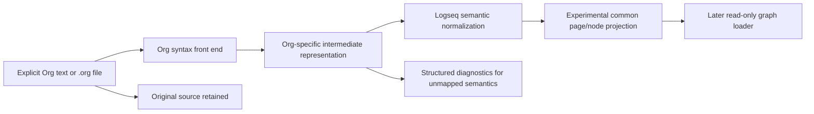

# Logseq Org-mode reader for OG file graphs

## Decision

**Maintainer decision (2026-09-29): approved.** The scope and architecture
below are accepted as the basis for a staged implementation plan. This does
not authorize production implementation, graph loading, or external changes.

**File-input decision (2026-09-30):** the caller supplies one absolute
`.org` path; no vault-root containment contract is implied. The maintainer
accepts a bounded, platform-specific no-follow and same-handle leaf predicate,
including the documented residuals in the D1 acquisition contract below:
opening/querying a selected OS object or provider may have side effects before
rejection, and the parser cannot promise physical locality, an immutable
snapshot during concurrent writes, or a hard wall-clock I/O deadline. This
accepts the proposed security trade-off, not an unreviewed API composition or
implementation. D1 still requires the exact platform matrix, path grammar,
predicates, fixed error mapping, and qualification tests to be frozen and
reviewed before D2 implementation.

**Recommendation:** add a separate, read-only Org-mode front end for Logseq OG
file graphs. Keep the existing Markdown parser and default graph-loading
behavior unchanged. Begin with an experimental page parser and an owned
Logseq-specific fixture corpus; add whole-graph loading only after the syntax
and AST mapping contract is demonstrated. Do not include Org writing,
serialization, round-trip editing, Logseq DB access, or full GNU Org
conformance in this tranche.

The parser must treat an Org file as untrusted data. It must never evaluate
Babel/source blocks, queries, macros, Lisp, links, or filesystem paths.

## Why this work is worth considering

The repository has strong and increasingly explicit Markdown semantics, but it
does not parse `.org` files. Supporting the file format used by Logseq OG would
serve users who want Logseq's file graph and Org workflows while retaining
Matryca's graph queries, diagnostics, exports, and AI integrations. This is a
distinct interoperability capability, not an extension of Logseq DB support.

The request is strategically plausible, but the upstream format is much larger
than a headline-token conversion. The first release must promise a named,
tested Logseq Org subset—not “all Org mode”—and must expose unsupported or
ambiguous behavior instead of silently flattening it.

## Verified baseline

This design is based on the clean isolated worktree at
`main@cf11de2fa7573b10d2555391676da3c3fbbe9f30` (verified 2026-09-29).

- `discover_graph_files()` scans only `*.md` in `pages/` and `journals/`.
- `LogseqGraph.load_directory()` dispatches discovered files to
  `StackMachineParser`; it builds indexes from the resulting `LogseqPage`
  objects.
- `StackMachineParser` documents and implements Logseq Markdown parsing.
  `LogosParser` is its compatibility alias.
- The public support matrix claims Logseq Markdown semantics, not Org support.
- The common `LogseqPage` / `LogseqNode` models have no source-format field.
- Existing fixtures and compatibility projections cover Markdown; there are
  no `.org` parser fixtures in this checkout.
- Markdown parser code recognizes some Org-looking tokens (for example
  `:PROPERTIES:`, `:LOGBOOK:`, and query delimiters) as shielded or special
  input. This is not evidence of an Org document parser.
- The current roadmap sequences parser assurance work (#104, #111, #108) and
  treats Logseq DB export research (#185) separately. This Org proposal does
  not replace those contracts or imply an update to their priority.

Primary local anchors: [`logseq_paths.py`](../../../src/logseq_matryca_parser/logseq_paths.py),
[`graph.py`](../../../src/logseq_matryca_parser/graph.py),
[`logos_parser.py`](../../../src/logseq_matryca_parser/logos_parser.py),
[`logos_core.py`](../../../src/logseq_matryca_parser/logos_core.py), and the
[support matrix](../../reference/CONFORMANCE_SUPPORT_MATRIX.md).

## What “Logseq Org support” means here

Logseq's official OG file-graph project documents Markdown and Org-mode as file
formats. Its configuration documents a preferred Markdown or Org format and
gives separate journal-template examples. Logseq's DB-graph documentation
describes a separate product boundary and says Org mode is not supported in DB
graphs. Therefore this proposal is specifically about **Logseq OG file
graphs**; it makes no DB-graph claim.

Org mode itself is a general document and task-management system. Its syntax
includes headlines, sections, affiliated keywords, elements, objects, drawers,
tables, lists, links, timestamps, TODO workflows, and more. A compatible
Logseq reader needs both generic Org syntax handling and the exact Logseq
file-graph semantics layered on top. Similar spelling is not semantic parity.

## Pinned behavior evidence (D1, 2026-09-29)

This ledger separates parser AST facts from Logseq's later graph projection.
The Logseq OG sources below are pinned to commit
[`6e7afa8eb040686ff057156ee877193b581dd369`](https://github.com/logseq/og/tree/6e7afa8eb040686ff057156ee877193b581dd369);
blob IDs are recorded so a future review can verify the exact files.

| Evidence | Pinned observation | Limit of the claim |
|---|---|---|
| Format dispatch | `src/main/frontend/format.cljs` (blob `2402550052fae95326433ab4ec5ffeef25caccc1`) routes both `:org` and `:markdown` through `MldocMode`; `src/main/frontend/format/mldoc.cljs` (blob `4a8eb7e548e3b97943f716d9aaef49079771ed8c`) delegates `toEdn` to the graph parser. | Shared upstream parser dispatch does not make Org and Markdown ASTs or semantics interchangeable. |
| AST vocabulary | `deps/graph-parser/src/logseq/graph_parser/schema/mldoc.cljc` (blob `22afd0f1697c5b4008a9977e9dd02c60d8a92cb3`, lines 22–216) describes headline level/title/marker/priority/tags, nested list items and checkboxes, directives, property drawers, links, timestamps, source blocks, drawers, and other elements. | A schema shape establishes representability, not that every form is projected into a page or has Logseq application semantics. |
| Page identity | `deps/graph-parser/src/logseq/graph_parser/extract.cljc` (blob `165b2a201711c0bb9c2c6132144a0b9f17393021`, lines 19–64) selects page name in this order: a top-level `title` property, parsed file name, then first headline; `pages/contents.*` is special-cased. `block.cljs` (blob `3acd5b3a3bb5e5ba03e7f325193e1da355dece6c`, lines 273–335) applies journal-title and namespace handling. | These are graph-extraction rules with file path, filename format, date formatter, and other options. D2 must not infer them from the first headline alone or from a test-fixture storage path. D1 fixtures pass `parse.page_title` as caller input; their page-title expectation does not claim OG identity precedence or prove that `#+TITLE` is ignored by Logseq. |
| Headings and lists | `block.cljs` (lines 561–609, 646–694) constructs blocks at heading AST elements and accumulates non-heading elements as body. | Nested Org lists remain body/IR structure in this extraction path; list items are not independently emitted as graph blocks here. |
| Heading fields | The same `block.cljs` ranges carry marker, priority, and tags into heading blocks; lines 398–404 convert tags to page-name references. | This does not establish configurable TODO workflow states, state transitions, or full tag inheritance. Preserve marker text without classifying an unknown state. |
| Directives and properties | `mldoc.cljc` (blob `7bc4bf05239e66ff1c35e4135005efd60f273754`, lines 117–148) collects directives into a synthetic `Properties` AST element. `property.cljs` (blob `47580b642463bf3e0c1dc613500b958f251685330`, lines 10–39) defines Org property delimiters and recognizes `Property_Drawer`/`Properties`; extraction associates properties by position and context. | Do not infer universal inheritance or merge page and heading properties without context. Keep source order and raw values. |
| References | `block.cljs` (lines 37–121, 337–378) recognizes selected page, block, search, file, nested-link, embed, and tag AST forms. | Reference construction is selective and can depend on format, DB, configuration, and asset handling. Pinned helpers define `((UUID))` delimiters, but do not prove that the Org parser accepts that raw syntax. OG extraction can create referenced-page placeholders; D1's `unresolved` value means only that this source-only profile has no graph context. A preserved `file:` link is never opened or resolved by this parser. |
| Timestamps | `schema/mldoc.cljc` models scheduled, deadline, date, closed, clock, and range forms. `block.cljs` (lines 250–271, 646–680) normalizes only `SCHEDULED` and `DEADLINE` into graph fields in this path. | AST support for `CLOSED` or `CLOCK` is not evidence of equivalent graph fields or time-tracking behavior. The D1 ISO date string is a proposed Matryca representation, not OG's normalized graph-value format. Keep unsupported forms opaque unless separately proven. |

The generic Org Manual is the syntax reference, not evidence of Logseq
application behavior. The pinned Logseq DB note is a separate graph-format
boundary, not evidence about OG: at docs commit
[`08f855f24d66e4509b7ea808554c13b4649e6ee1`](https://github.com/logseq/docs/tree/08f855f24d66e4509b7ea808554c13b4649e6ee1),
`logseq/config.edn` documents Markdown/Org file-graph preference and journal
templates, while `db-version-changes.md` says DB graphs support Markdown only.
The pinned `logseq/mldoc` feature summary and parser source are reference-only;
its `LICENSE` blob `50e494498e50adb31212fc5de3620f7e1a7f0937` declares
AGPL-3.0. This records provenance, not legal advice or permission to reuse it.

## Goals

1. Parse selected Logseq OG `.org` page and journal files without changing
   their source bytes or executing their contents.
2. Preserve deterministic outline order and useful source line spans; keep the
   filesystem source path private to file acquisition.
3. Project verified Logseq semantics into Matryca's graph-facing model without
   losing or misclassifying unsupported source.
4. Make format selection explicit and keep Markdown behavior unchanged by
   default.
5. Keep the base Python package lightweight and avoid a runtime dependency on
   Logseq's parser implementation.
6. Build a project-owned, synthetic fixture corpus with provenance and tests
   before claiming support.
7. Document support boundaries and unsupported constructs in plain English.

## Non-goals

- Full GNU Emacs Org-mode 9.8 conformance.
- Reading or writing Logseq DB / SQLite graphs or interpreting their exports;
  those remain distinct from OG `.org` file graphs and #185.
- Writing to `.org` files, Org serialization, round-trip editing, migrations,
  synchronization, or automatic format conversion.
- Evaluating source blocks, macros, queries, Babel, Lisp, links, or embedded
  commands.
- Changing the default Markdown scanner, parser, serializers, or stable API
  contracts as part of the first implementation slice.
- Copying upstream parser code, test fixtures, or user vault data into this
  Apache-2.0 repository.

## Proposed architecture

### 1. Keep the parser front ends separate

Add an Org-specific module rather than teaching `StackMachineParser` to infer
two grammars. The current Markdown parser's line classification, shielding,
identity rules, and nested-block behavior are Markdown contracts. Sharing a
front-end classifier would invite cross-format regressions and make the
existing parser hub harder to review.

The Org front end should first produce a private, format-aware intermediate
representation with explicit element kinds and source spans. A separate
normalizer may map only verified Logseq semantics into `LogseqPage` and
`LogseqNode`. During characterization, keep that projection private: do not
present it as a complete common page while Org-only constructs remain
unmapped. Before graph loading, decide whether the public parse result should
be a format-specific document or a common page with an explicit source-format
discriminator. Do not expose a stable package-root API or extend shared models
with a generic `source_format` field until serializer and adapter behavior has
been assessed.

### 2. Preserve source rather than pretending to round-trip

The input file remains authoritative. Retain the original decoded text at the
page boundary, and preserve source ranges for every projected element. Unknown
or unsupported elements must not disappear from the internal representation.
The parser may keep them as opaque source-backed elements and emit a structured
diagnostic when a requested semantic projection cannot represent them.

Do not silently convert an Org page through the Markdown serializer. Any
future conversion must have a separate explicit design, loss report, and
caller-selected output path.

### 3. Keep graph loading a gated second slice

The approved first parser slice accepts both in-memory text and one explicit
`.org` file path, and returns a format-aware, experimental page-level result.
The file entry point must read only that selected file after it passes the
explicit platform leaf-object predicate, under a bounded no-follow policy;
its cross-platform implementation remains unresolved. The
maintainer has selected a non-empty caller-supplied `page_title` for both
entrypoints and omission of source path from the result. D1 must freeze the
file-acquisition contract before D2. At this earlier evidence-stage checkpoint,
exact title-validation precedence remained a D2 API-plan detail; the finalized
bounded rule appears in the D2 contract below. Do not change
`discover_graph_files()` or `LogseqGraph.load_directory()` yet.
Decide the return type and projection onto shared models from the D1 corpus,
not by guessing in advance.

After page semantics pass the corpus and reference gates, add an explicit
Org-only read path for whole graphs. The Markdown default must remain
unchanged, and the caller must select Org rather than rely on extension
guessing or silently mix `.md` and `.org` pages. Before implementing that
loader, specify duplicate page identity across formats, title collisions,
journal path rules, alias/backlink resolution, and how unsupported refresh or
watcher operations fail visibly. A loaded Org graph must not appear to support
Markdown-only refresh behavior.

## Candidate Logseq Org behavior matrix

These are **research buckets**, not support claims. D1 disposition below
converts each candidate into a characterized subset, opaque project contract,
or explicit deferral. Any deferred behavior stays out of the D2 support claim.

| Area | D1 disposition | Evidence boundary |
|---|---|---|
| File graph identity | Defer graph-path identity, journals, namespaces, and `pages/contents.*` handling. Corpus uses caller-supplied titles only. | OG precedence is pinned above for future graph work. The approved D2 inputs include text and one explicit file path. The maintainer selected a non-empty caller title; exact validation and safe file-acquisition details remain open. `#+TITLE` is preserved separately from caller input. |
| Outline | Characterize source-ordered headings, ancestry, literal workflow markers, priority, tags, and nested-list preservation. | `outline-workflow` fixture. Unknown `WAITING` remains raw text; list items are not claimed as graph blocks. |
| Workflow | Preserve known or unfamiliar heading markers as literal strings; do not classify state transitions or custom TODO sequences. Checkbox semantics are deferred. | `outline-workflow` fixture covers TODO, DONE, and WAITING markers, but not state configuration or checkbox projection. |
| Page/block properties | Characterize top-level directives separately from one heading property drawer; preserve key/value order. Defer inline Logseq properties and inheritance. | `properties-references` fixture and pinned AST/extraction sources establish only the narrower distinction. |
| References | Characterize one internal page link as unresolved without graph context; preserve external/file syntax without resolving it. Defer block-reference recognition and anchors. | `properties-references` and `inert-content` fixtures. `((UUID))` is only a candidate: pinned OG helpers do not prove raw Org parser acceptance. |
| Time | Record date-only `SCHEDULED` and `DEADLINE` in the proposed ISO source-only form while preserving raw values; keep `CLOSED` and `CLOCK` opaque. | `schedule-and-clock` fixture. ISO values are not OG graph-value parity; repeaters/ranges/timezone conversion remain deferred. |
| Drawers/logbook | Characterize a heading `PROPERTIES` drawer and one unterminated drawer; defer `LOGBOOK`, clocks, and general drawer semantics. | `properties-references` and `malformed-drawer` fixtures. No inheritance or logging semantics are claimed. |
| Blocks/directives | Keep source/query/dynamic/macro examples inert and retain unsupported syntax; no evaluation or expansion. Other block kinds remain opaque/deferred. | `inert-content` fixture. Inertness is a Matryca safety rule, not a claim that OG does not extract macro metadata. |
| Tables/media | Defer table formulas, media rendering, embeds, and attachment semantics; preserve source without evaluating formulas or opening targets. | No semantic projection or path resolution is claimed. Add fixtures only if D2 later accepts a specific, independently evidenced subset. |
| Malformed/large input | Characterize one unterminated property drawer with a project-owned opaque/error expectation. Boundaries for size, depth, encoding, BOM, and line-ending variants are D2 generated-test obligations. | `malformed-drawer` fixture does not claim upstream recovery. Bounds and text/file decoding behavior must be finalized before implementation. |

## D1 corpus decisions and remaining gate

The first project-owned corpus is under `tests/fixtures/org/`, with independent
exact and semantic expectations under `tests/org_assurance/`. Every checked-in
source fixture is synthetic, project-authored, and marked `Apache-2.0` in the
manifest. The exact profile retains the full decoded source and ordered element
expectations; the semantic profile separately records page-title input,
heading blocks, page properties, references, timestamps, opaque content, and
diagnostics. The profiles do not reuse Markdown snapshots.

| Area | D1 decision | Evidence boundary |
|---|---|---|
| Page identity | Maintainer choice (2026-09-29, bounded precedence clarified 2026-10-01): require a non-empty caller-supplied `page_title` for both text and explicit `.org` file entrypoints; do not derive identity from Org content or path. Scan left-to-right without an encoded copy. A lone surrogate encountered before UTF-8 overflow returns `ORG_INVALID_UNICODE`; the first valid scalar that raises the cumulative length above 1,024 bytes returns `ORG_PAGE_TITLE_TOO_LARGE` immediately, without inspecting the suffix. Only a complete in-limit scan may classify empty/Unicode-whitespace-only input as `ORG_PAGE_TITLE_REQUIRED`. The scan is capped at 1,025 scalar checks (4,100 charged title-work units). | Logseq OG's observed precedence (top-level `title` property, parsed filename, then first headline; with special `pages/contents.*` handling) is evidence for a separately gated graph-loader design, not an automatic D2 rule. Journal and namespace normalization needs date/filename configuration. `#+TITLE` remains a separately recorded directive in the properties fixture. |
| Result provenance | Maintainer choice (2026-09-29, reconfirmed in follow-up): omit source path from `OrgDocument` and the public parse result. | The path remains internal to file acquisition; never emit it in diagnostics or fixture expectations. This does not make hard-link provenance or source identity observable. |
| File-input boundary and residuals | Maintainer choice (2026-09-30): accept one absolute caller-selected `.org` path and a bounded OS-specific no-follow/same-handle predicate; no vault-root containment contract. | The accepted residuals are pre-rejection OS/provider effects, no physical-locality guarantee, no immutable snapshot under concurrent writers, and no hard wall-clock I/O deadline. The exact D1 reader contract follows. |
| Outline | Preserve source-ordered headings, level, literal TODO marker, priority, and tags. The semantic profile models heading blocks in source order and their heading ancestry. | Unknown workflow words such as `WAITING` remain literal markers, not recognized workflow states. |
| Lists and body | Preserve nested lists in exact IR and opaque body content. | The pinned graph-extraction path creates blocks at headings and keeps other AST elements in body; it does not establish standalone list-item graph blocks. |
| Directives and drawers | Preserve directive/property order and keep document-level directives distinct from heading drawers. Retain original keys/values before any optional normalized view. | Property ownership is position-sensitive. General Org inheritance and Logseq property behavior beyond the pinned extraction path remain unsupported. |
| References | Preserve link syntax; the semantic fixture records one internal page target as `unresolved` because this source-only profile has no graph context. Preserve the unlabeled `file:` link as opaque. Defer block-reference recognition: `((UUID))` is a candidate syntax, but pinned sources do not prove Org-mode acceptance. | `unresolved` is not a claim about OG's placeholder-page behavior. Never resolve a page, block, asset, `file://`, or external target, or perform filesystem/network I/O to resolve a reference. |
| Time | Record date-only `SCHEDULED` and `DEADLINE` as ISO calendar dates while retaining raw spelling. | This is a proposed Matryca source-only representation, not OG graph-value parity. `CLOSED`, `CLOCK`, ranges, repeaters, timezone conversion, and time tracking remain opaque/deferred. |
| Executable or dynamic constructs | Keep source, query, dynamic, and macro constructs opaque and emit a bounded diagnostic; never evaluate or expand them. | GNU Org syntax documentation describes these features but cannot establish safe Logseq semantics or authorize execution. |
| Malformed input | The project-owned fixture contract preserves an unterminated drawer as opaque through EOF and expects one error at its opener; do not silently reinterpret it as valid properties. | This recovery behavior is a Matryca design choice, not behavior established by the pinned Logseq parser, which does not establish recovery for this input. The diagnostic shape is experimental and must not enter the stable diagnostic registry in D2. |
| Diagnostic contract | Keep diagnostics experimental and Org-local. Each record has exactly `code`, `severity`, and optional 1-based `line`; it contains no message, absolute path, source snippet, exception text, or arbitrary context. `ORG_OPAQUE_EXECUTABLE_SYNTAX` is `warning`; `ORG_UNCLOSED_DRAWER` is `error`. Fixed input/resource errors use `error`: `ORG_PAGE_TITLE_REQUIRED`, `ORG_PAGE_TITLE_TOO_LARGE`, `ORG_INVALID_UNICODE`, `ORG_SOURCE_TOO_LARGE`, `ORG_LINE_LIMIT_EXCEEDED`, `ORG_ELEMENT_LIMIT_EXCEEDED`, `ORG_NESTING_LIMIT_EXCEEDED`, and `ORG_INVALID_UTF8` for file-read decoding failures. Diagnostic overflow ends with `ORG_DIAGNOSTICS_TRUNCATED` (`error`) and no document. | Existing semantic fixtures establish only the two parse diagnostics and their severity/line shape. Resource and input codes are new Matryca contracts; they are not added to the stable registry. |
| Tables and media | Defer table formulas, media rendering, embeds, and attachment semantics; preserve source without evaluating formulas or opening targets. | No semantic projection or path resolution is claimed. Add fixtures only if D2 later accepts a specific, independently evidenced subset. |
| Resource/encoding contract | Enforce at most 8,388,608 UTF-8 source bytes (including any BOM), 1,024 UTF-8 bytes for the caller-supplied page title, 250,000 logical lines, 100,000 non-root structural/opaque IR elements, nesting depth 128, and 256 diagnostics total. Limits are inclusive. On source, title, line, element, or depth overflow, return no document with one fixed input/resource diagnostic; never silently truncate elements. If a 256th ordinary diagnostic would be emitted, return no document with at most 255 ordinary diagnostics plus one fixed `ORG_DIAGNOSTICS_TRUNCATED` marker, then stop. Count UTF-8 bytes for `str` without creating an unbounded encoded copy; reject lone surrogates. For titles, stop at the first valid scalar that crosses 1,024 UTF-8 bytes; do not inspect its suffix, and charge no more than 1,025 scalar checks. The file entrypoint must bound actual bytes before strict UTF-8 decoding. Retain source and title once and store element spans as offsets; do not copy every line or element payload. Use an explicit nesting stack and a single-pass scanner. | The 8 MiB ceiling matches `LocalGraphAssuranceConfig.max_file_bytes`; other ceilings are new conservative parser limits, not existing guarantees. Generated temporary cases—not large checked-in fixtures—must test each cap at limit−1, limit, and limit+1. The 100,000-element ceiling is defensible only with source-backed offsets and no repeated payload copies. |
| Text normalization and source locations | Preserve the original decoded source and supplied title unchanged; recognize only one optional leading U+FEFF as scanner metadata while retaining it in the source, and do not normalize Unicode. Treat LF and CRLF as line breaks; lone CR and other Unicode separators remain source content. Empty text has zero logical lines; a trailing line break does not add a phantom line. Logical line spans are 1-based and inclusive; source offsets are 0-based half-open Unicode-code-point offsets into the retained source. | D2 tests must cover empty/oversized titles, title bytes at 1,024/1,025 including multibyte text, a surrogate before overflow, an invalid suffix after overflow, scan-work bound, empty source, missing/present final newline, LF/CRLF, lone CR, non-LF Unicode separators, leading/interior/repeated BOM, multibyte source byte-limit boundaries, and surrogate rejection. Do not use `str.splitlines()` or make whole-input encoded copies before checking a byte cap. |
| File-source trust boundary | Read exactly one caller-selected `.org` file using the selected component-at-a-time OS reader below; do not crawl, resolve links, or open neighbors. The parser must not call network APIs or fetch linked/remote URLs. Passing a caller-selected path to the OS may still cause network/provider I/O before rejection; no physical-locality, immutable-snapshot, or hard-deadline guarantee is made. Enforce the per-handle filesystem/type predicate before reading bytes and fail closed outside the qualified matrix. | Python's standard library has no single portable safe reader; D2 uses standard-library `dir_fd` calls on POSIX and a bounded Windows `ctypes` native binding. The existing local-assurance reader is not a safe drop-in. A byte cap does not guarantee a stable snapshot under concurrent writes, and post-open checks cannot prove that opening every special object is side-effect free. |

### Selected D1 file-acquisition contract (owner accepted 2026-09-30)

The owner selected a single absolute caller path and accepted the policy and
residuals below. This freezes the D1 design boundary, not an assertion that
the native call compositions are already qualified. The final D2 plan must
receive Sol XHigh review; Windows native ABI and path behavior must pass the
planned real-Windows tests and the separate Sol security review before the
reader is considered qualified.

**API/path grammar.** `parse_org_file` accepts only `str` or `pathlib.Path`.
Validate the spelling exposed at the API boundary: the supplied string, or
`os.fspath(path)` for a `Path`. `pathlib.Path` may normalize repeated
separators or `.` components before the parser receives it, so the parser
cannot reject constructor text no longer represented by `os.fspath`; tests
must pin this observable behavior. The exposed spelling must be absolute in
the current OS namespace. Reject bytes paths, relative/drive-relative paths,
NUL, `.` or `..` components, empty/repeated or trailing components still
present in the exposed spelling, a non-lowercase `.org` suffix, and a path
longer than 32,767 Unicode code points with `ORG_FILE_PATH_INVALID`. Do not
call `resolve`, `realpath`, `stat`, `lstat`, or a full-path open as a precheck.
The path is never returned, logged, or copied into a diagnostic. The
entrypoint opens only that file; it never crawls, opens neighbors, or resolves
Org links. Validate the non-empty caller `page_title` before any filesystem
operation.

**Qualification matrix.** Run the parser's existing CI matrix on
`ubuntu-24.04` (x64), `macos-15` (arm64), and `windows-2025` (x64), for Python
3.12 and 3.13. Per-handle filesystem allowlist: Linux ext-family
`f_type == 0xEF53` (the kernel value does not distinguish ext2/ext3/ext4),
macOS `f_fstypename == "apfs"`, and Windows filesystem name `NTFS`. Query the
filesystem from each held root/directory/file handle, not from a path; reject
a component that crosses onto a non-allowlisted filesystem. These are
qualification profiles, not broad support for every OS release, architecture,
or filesystem. Missing API/ABI/capability or an unqualified profile returns
`ORG_FILE_SOURCE_UNSUPPORTED` or `ORG_FILE_SOURCE_REJECTED` as mapped below.
GitHub runner labels and architecture are verified against the repository's
current workflow and [official runner-image matrix](https://github.com/actions/runner-images).

**Linux.** Start from a held descriptor for `/`. Walk one validated component
per `os.open(..., dir_fd=parent_fd)` call. Open each intermediate component
with `O_PATH | O_CLOEXEC | O_NOFOLLOW`; use `fstat` to require a
directory and `fstatfs` on the same descriptor to require ext-family magic
`0xEF53`. Open the leaf with `O_RDONLY | O_CLOEXEC | O_NOFOLLOW | O_NONBLOCK |
O_NOCTTY`, then require `fstat` regular-file status and the same filesystem
profile before reading. The descriptor-relative walk pins already-opened
ancestors; a component that is replaced before its own open may resolve to
the entry present at open time, but cannot redirect an already-held parent.
Use no `openat2`/procfd fallback path and never silently fall back to a
full-path `open`. Fail closed if required flags, `dir_fd`, or the filesystem
probe are unavailable.

**macOS.** Start from a held descriptor for `/`. Walk one validated component
per `os.open(..., dir_fd=parent_fd)` call, using
`O_RDONLY | O_DIRECTORY | O_CLOEXEC | O_NOFOLLOW` for each intermediate
component. Use `fstat` to require a directory and `fstatfs` on the same handle
to require `f_fstypename == "apfs"`. Open the leaf with
`O_RDONLY | O_CLOEXEC | O_NOFOLLOW | O_NONBLOCK | O_NOCTTY`, then require
same-handle `fstat` regular-file status and APFS before reading. Require
`os.open` descriptor-relative support and every selected flag; otherwise fail
closed. No path-wide `O_NOFOLLOW_ANY` or race-prone metadata precheck is used.

**Windows.** Accept only an absolute drive-rooted spelling of the form
`X:\component\...\name.org`; reject drive-relative, UNC, extended/device
namespaces, `/` separators, empty/dot/dot-dot components, ADS colons, invalid
Win32 characters, reserved DOS device basenames, trailing spaces/dots, and
non-lowercase `.org`. Count each component in UTF-16 code units without
creating an encoded copy; reject more than 255 units before any native call.
POSIX-rooted spellings such as `/tmp/page.org` are invalid Windows grammar and
map to `ORG_FILE_PATH_INVALID`, not `ORG_FILE_SOURCE_UNSUPPORTED`.
After opening the drive-root handle, obtain the filesystem's maximum
component length through `GetVolumeInformationByHandleW` (the API reports
`WCHAR` units) and reject any component above that value before its child
open. The fixed 255-unit cap is a parser policy, not a claim that every NTFS
volume has that capacity. It also bounds every component `UNICODE_STRING` to
510 `Length` bytes and 512 `MaximumLength` bytes when its NUL-terminated
buffer is used; `Length` excludes the terminator.

Resolve `NtCreateFile` dynamically from `ntdll.dll`; an unavailable symbol or
failed x64 ABI self-check returns `ORG_FILE_SOURCE_UNSUPPORTED`. Bootstrap the
root with one fully-qualified `NtCreateFile` call for the internally built
native spelling `\??\X:\`, `RootDirectory=NULL`, `CreateDisposition=FILE_OPEN`,
`DesiredAccess=FILE_READ_ATTRIBUTES | FILE_TRAVERSE | SYNCHRONIZE`,
`ShareAccess=FILE_SHARE_READ | FILE_SHARE_WRITE | FILE_SHARE_DELETE`, and
`CreateOptions=FILE_OPEN_REPARSE_POINT | FILE_SYNCHRONOUS_IO_NONALERT`.
`AllocationSize`, `EaBuffer`, and other optional pointers are `NULL`; file
attributes and EA length are zero. Query the returned root handle for
directory, no-reparse, and NTFS status before walking children.

For each child, call `NtCreateFile` once with exactly one relative component
in `ObjectName`, `OBJECT_ATTRIBUTES.RootDirectory` equal to the retained,
already-validated parent handle, `Attributes=OBJ_CASE_INSENSITIVE`, null
security descriptor/QoS, and the same `FILE_OPEN`, share mask, synchronous
no-alert option, and no-reparse option. Intermediate components request
`FILE_READ_ATTRIBUTES | FILE_TRAVERSE | SYNCHRONIZE`; the leaf requests
`FILE_READ_DATA | FILE_READ_ATTRIBUTES | SYNCHRONIZE`. `AllocationSize` and
EA inputs are null/zero. **Do not set `FILE_DIRECTORY_FILE` or
`FILE_NON_DIRECTORY_FILE` on any open.** Microsoft lists an exclusive set of
compatible options when `FILE_DIRECTORY_FILE` is set and omits
`FILE_OPEN_REPARSE_POINT`; the selected calls avoid that unresolved
combination. Instead, query each returned handle before reuse: require
`FILE_STANDARD_INFO.Directory` for root/parents and reject it for the leaf;
require `FILE_ATTRIBUTE_TAG_INFO` not to report `FILE_ATTRIBUTE_REPARSE_POINT`;
and require NTFS from `GetVolumeInformationByHandleW` on every handle. The
leaf must additionally satisfy `GetFileType == FILE_TYPE_DISK`. This is an
**operational NTFS leaf predicate**, not a universal Windows equivalent of
POSIX `S_ISREG`. No child is read or used as a parent until its same-handle
checks pass.

The x64 ABI contract is the documented `NtCreateFile` prototype
`NTSTATUS(PHANDLE, ACCESS_MASK, POBJECT_ATTRIBUTES, PIO_STATUS_BLOCK,
PLARGE_INTEGER, ULONG, ULONG, ULONG, ULONG, PVOID, ULONG)`. `UNICODE_STRING`
uses 16-bit byte lengths; `OBJECT_ATTRIBUTES` and `IO_STATUS_BLOCK` layouts,
offsets, pointer widths, signed 32-bit `NTSTATUS` success interpretation, and
returned-handle ownership must be asserted against the Windows x64 ABI. Pass
`NT_SUCCESS(status)` and a successful `IO_STATUS_BLOCK.Status` before using a
returned handle; otherwise close any valid returned handle and map the
failure to the fixed file outcome. Read the accepted leaf with `ReadFile` on
the same synchronous handle, `lpOverlapped=NULL`, and a request no larger
than the remaining `8,388,609`-byte allowance; reject if the total exceeds
8,388,608 bytes. Close every handle on all paths. No full-path Win32 open or
fallback is allowed. This boundary remains unqualified until real
`windows-2025` adversarial/ABI tests and the separate Sol security review
pass. Microsoft documents the primitives and parameter meanings, not this
Python `ctypes` composition; that composition is a constrained candidate
whose runtime qualification remains mandatory.

**All platforms.** Open/metadata-query side effects may occur before a rejected
object or filesystem is identified. Mount/provider behavior can cause OS I/O
and is not constrained to physical local storage. Concurrent writers may
change file bytes while the already-open handle is being read; no immutable
snapshot or hard wall-clock deadline is promised. After the same-handle
predicate passes, read no more than `8,388,609` actual bytes, close every
opened handle on all paths, then apply the existing strict UTF-8 contract.

**Fixed file outcomes.** Return no document and one `error` diagnostic, with
no path, OS status text, exception string, or source excerpt:

| Condition | Code |
|---|---|
| Invalid type/spelling, relative path, disallowed component syntax, wrong suffix, or path-length cap | `ORG_FILE_PATH_INVALID` |
| Unsupported OS/architecture/API, missing required capability, or failed ABI self-check | `ORG_FILE_SOURCE_UNSUPPORTED` |
| Symlink/reparse, non-directory parent, wrong leaf type, or non-allowlisted filesystem | `ORG_FILE_SOURCE_REJECTED` |
| Missing/denied component, sharing violation, or other OS open/query/read error | `ORG_FILE_READ_FAILED` |
| More than 8,388,608 file bytes | `ORG_SOURCE_TOO_LARGE` |
| Invalid or truncated UTF-8 | `ORG_INVALID_UTF8` |

The path grammar and resource ceiling bound lexical work. Unknown OS error
codes never alter public wording. A read that returns fewer than the limit
bytes is not assumed to be a stable snapshot.

**Existing-reader contrast (verified in this base):** `local_graph_assurance._read_regular_file` performs `lstat`, resolves the selected path, checks the resolved target is under the vault root, stats that path, then opens the resolved pathname with `O_NOFOLLOW` and compares the opened descriptor identity before bounded reads. This is useful defense for its existing trusted-vault workflow, but it is not the proposed no-follow acquisition primitive: resolution and later open are separate path operations, and `O_NOFOLLOW` protects only the final component of the opened path. Do not reuse it as proof that no component was followed during Org file acquisition or that opening a special target has no side effects. See [`local_graph_assurance.py`](../../../src/logseq_matryca_parser/local_graph_assurance.py) and Linux [`openat(2)`](https://man7.org/linux/man-pages/man2/openat.2.html).

**D2 depth rule — Sol XHigh-approved specification; implementation proof required:** define parser depth as `max(heading_level, nested_list_item_depth)`. Measure both categories independently from root; never sum them. Root depth is `0`. Heading-shaped runs of 1–128 stars are accepted; every run of 129 or more stars followed by the required heading space returns no document with `ORG_NESTING_LIMIT_EXCEEDED`. A list item at depth 128 is accepted only when active ancestry is valid; depth 129 returns no document only after a valid depth-128 parent is established. A depth-129 orphan becomes a paragraph because parent validity precedes overflow handling. Blocks and drawers are explicitly non-nesting states, not depth dimensions. D2 characterization must test heading runs at 128, 129, and 130; list depth 128, a valid child at 129, and an orphan candidate at 129; plus simultaneous dimensions: heading level 1 containing a nested list at depth 128 remains total depth 128 and is accepted, proving the dimensions are not summed.

**D2 finite parser-v1 recognizer — Sol XHigh-approved specification; implementation proof required:** this is a deliberately finite Matryca subset, not general Org conformance. Unrecognized syntax remains source text; it is never evaluated. Physical lines use the LF/CRLF spans already specified. A blank line is empty or contains only ASCII space/tab; it emits no element and ends a list run. Other Unicode whitespace is content, not blank syntax. A single leading U+FEFF at source offset zero is ignored only for first-line recognition and remains in source spans; after that recognition adjustment, a line containing only spaces/tabs is blank. Every non-empty, non-blank line is classified once by the following state machine. ASCII keyword comparison folds only `A`–`Z`; all spans retain original source spelling.

| State | One permitted recognizer | Transition/output |
|---|---|---|
| `OUTSIDE` | Dispatch by the first scanner-visible code point: `*` heading; `#` directive/block opener; `:` property-drawer opener; ASCII-space or `-` unordered-list candidate; `S`/`D`/`C` timestamp candidate; otherwise paragraph with inline-link scan. A failed candidate becomes one paragraph line; it is never retried through a second syntax recognizer. | Empty and ASCII-space/tab-only lines emit nothing and terminate an active list run. Other Unicode whitespace remains content. Source order is stable. |
| `BLOCK(kind, opener_line)` | Only test the current kind's exact closer: `#+END_SRC`, `#+END_QUERY`, dynamic `#+END:`, or for `other_block`, `#+END_<same-name>`. A closer may have only trailing space/tab. | The first matching closer ends one `OrgOpaque` span including opener and closer. Other openers and all body syntax are inert text; blocks do not nest. EOF emits the opaque span through EOF without an additional diagnostic. Emit one warning at the opener only for `source_block`, `query_block`, and `dynamic_block`. |
| `DRAWER(owner, buffered_property_spans)` | Only exact `:END:` closes. A property candidate is `:` + ASCII key `[A-Za-z][A-Za-z0-9_]*` + `:` + optional horizontal space + value-to-line-end. Other lines are opaque drawer content; nested openers do not nest. | A closed immediately-owned drawer emits `OrgPropertyDrawer` and ordered `OrgProperty` spans. A closed unowned drawer emits `OrgOpaque(kind="unowned_property_drawer")`. EOF emits `OrgOpaque(kind="unterminated_drawer")` and one `ORG_UNCLOSED_DRAWER` error at the opener; buffered properties are not projected. |

Outside the state table, the exact grammar and precedence are:

1. **Heading:** a heading-shaped line starts at column zero with one or more `*` followed by one ASCII space. Runs of 1–128 stars create headings. A run of 129 or more stars with the required following space returns no document with `ORG_NESTING_LIMIT_EXCEEDED`; a star run without that space is a paragraph. After a valid heading delimiter, recognize `TODO`, `DONE`, or `WAITING` only when followed by one or more ASCII spaces/tabs; otherwise the spelling is title text. Then recognize optional `[#A]` through `[#Z]` only when followed by horizontal space or line end. These tokens have no workflow semantics and are recognized only in that order. The optional final tag run has grammar `":" tag (":" tag)* ":"`, preceded by one or more ASCII spaces; each `tag` matches `[A-Za-z0-9_@#%]+`. Thus `:engineering:org:` is one suffix with two tag components, not adjacent `:tag:` tokens. Consume it only when the entire final run matches. Trim only ASCII spaces/tabs around the remaining title span; an empty title is allowed and has a zero-width span after trimming. Other text stays in the title.
2. **Directives and blocks:** generic directive grammar is `#+` + ASCII key `[A-Za-z][A-Za-z0-9_-]*` + `:` + value-to-line-end; preserve raw key and value spans, excluding the colon and leading horizontal space from the value span. `#+BEGIN_SRC` and `#+BEGIN_QUERY` require end-of-keyword or horizontal-space boundary and open their corresponding inert block. `#+BEGIN:` requires horizontal space, then a 1–32-character ASCII name `[A-Za-z][A-Za-z0-9_-]*`, then end-of-line or horizontal space; it opens an inert dynamic block ending at `#+END:`. Any other `#+BEGIN_<name>` with the same bounded name grammar and end-of-name or horizontal-space boundary opens `other_block`, ending only at the ASCII-case-insensitive matching `#+END_<name>`; trailing opener text stays opaque and it has no diagnostic. `#+MACRO:` is one `macro_directive` opaque element and one warning; its later `{{{...}}}` spelling is not expanded. A malformed or unknown directive remains a generic directive or paragraph, never executable.
3. **Property drawer:** exact `:PROPERTIES:` opens the state above. It attaches to a heading only when it is the immediately following physical line; a blank or intervening line removes ownership. Keys and values are spans, preserve order/case, and are not normalized or inherited. A drawer without an owner has no semantic property projection.
4. **List:** recognize only an ASCII `-` followed by one ASCII space, with indentation composed exclusively of ASCII spaces and divisible by two. Depth is `indent/2 + 1`. Keep an active ancestor stack for the current uninterrupted run. A depth-1 item starts a run or appends as a sibling in the current run, clearing deeper active ancestors. For candidate depth `d > 1`, first pop active items at depth `d` or deeper; accept the candidate only when the remaining active top is exactly depth `d−1`. A candidate with no such active parent becomes a paragraph line (including normal paragraph-link scanning), terminates the list run, and is not counted or allocated as a list item; an earlier item that is no longer active cannot be reused as a parent. Only after a valid active parent exists, depth 129 returns no document with `ORG_NESTING_LIMIT_EXCEEDED`. Thus a valid chain through depth 128 is accepted, a child at depth 129 fails, and an orphan at depth 129 is a paragraph. Runs end on blank/non-list lines. Ordered markers, tabs in indentation, odd indentation, and unsupported bullets are paragraphs. List nodes/items preserve order and remain source-only.
5. **Timestamp:** recognize only a full physical line `SCHEDULED:` or `DEADLINE:` + one or more ASCII spaces/tabs + `<YYYY-MM-DD Ddd>` (four/two/two ASCII digits and three ASCII letters, with optional trailing ASCII spaces/tabs). Validate the Gregorian calendar date using fixed-width numeric checks; preserve but do not validate weekday/date agreement. Retain the full spelling. `CLOSED:` and `CLOCK:` at column zero with end-of-line or horizontal-space boundary are retained as opaque timestamp records with no normalized value, regardless of the remainder. A malformed or extra-content scheduled/deadline line is a paragraph.
6. **Paragraph links:** scan each paragraph line once left-to-right for non-overlapping `[[...]]`; the first following `]]` closes, nested `[[` has no special meaning, and an unmatched opener stays plain text. Recognize only `[[target]]` or `[[target][label]]`; for the latter, the first `][` splits target and label, the complete link is `span`, only the target is classified, and label text remains recoverable from the source span but has no separate field. Empty target or multiple `][` separators makes the candidate plain text. A target beginning `file:` (ASCII-insensitive) is kind `file`, resolution `never`; `http://`, `https://`, or `mailto:` is kind `external`, resolution `not_applicable`; every other non-empty target is kind `page`, resolution `unresolved`. Links are not recognized inside headings, list items, drawers, directives, timestamps, or opaque blocks and never cause I/O.

**D2 shared source-node and work budget — Sol XHigh-approved specification; implementation proof required:** increment the source-node counter before allocating each source-backed IR record/occurrence. Count each top-level element (including one `OrgList` per run), every list item at every depth, each property entry (including buffered entries later discarded for an unclosed drawer), each inline link annotation, and each heading-tag occurrence exactly once. A structurally orphaned list candidate is a paragraph, not a list-item occurrence. Limit `E=100,000` inclusive; attempted occurrence 100,001 returns no document with `ORG_ELEMENT_LIMIT_EXCEEDED`. The D2 production result contains exact source IR only; semantic-v1 remains a test-only projection and is not retained by the parser or included in `E`. That test projector must remain deterministic and bounded by the already bounded document; it may aggregate adjacent source elements (the macro directive and following expansion line) but may not duplicate source text. Retain source once; element payloads are spans. Line-index storage is at most `L=250,000`; diagnostics at most 256. Use explicit bounded stacks and no recursion.

For auditable parser work, define `B` as actual file bytes read or, for text input containing only Unicode scalar values, its UTF-8 byte length computed without an encoded copy. If text contains a lone surrogate, set `B=0` and reject during the `4N` scalar-validation pass before byte-length use. `N` is source code points; `T` is title code points; `L` is indexed logical lines; and `E` is counted source occurrences. A private test-injected counter charges source indexing/comparisons, line-loop iterations, precharged bounded byte operations, and every fixed-size record/span/tuple-slot initialization. Require `W <= 64 * (B + N + T + E + L + 1)`. `W` covers bounded source acquisition/decode allowance, title validation, and text scanning; it does not count OS syscall instructions or wall-clock latency. Use monotone cursors within each named scan phase. Charge every code-point inspection, including failed lookahead and paragraph fallback; no cursor may rewind, and no regex, backtracking, `find`, `startswith`, source slicing, `splitlines`, or hidden repeated scan may bypass the counter. Charge temporary records, builder slots, final tuple slots, stack entries, and diagnostics before allocating them. Store payloads as source spans/scalars, not copied token/value strings. Freeze each builder to its immutable tuple once, charge the tuple slots, and release the builder; do not repeatedly concatenate or re-tuple accumulated values. The `48E` allowance includes all temporary and final fixed-size allocations attributable to each source occurrence, including both builder and tuple slots; if an operation would exceed its charged allowance, abort before allocation. The file-path spelling check is a separate linear pass bounded by the 32,767-code-point path cap; component count and child-open count are each at most that cap. On the text entrypoint, the `8B` file-read/decode allowance is unused slack; UTF-8 byte-length calculation is covered by the `4N` source-validation charge. Decoder internals are not instrumented; the file decoder is one strict operation precharged by the actual-byte bound and is only an abstract bounded-work claim. The charge schedule is:

| Phase | Maximum charged units | Required implementation rule |
|---|---:|---|
| File read plus strict UTF-8 decode allowance | `8B` | Read no more than 8,388,609 bytes; charge the byte budget before the single strict decoder call. Decoder internals are not instruction-counted; this is a separate length-bounded phase, not a wall-clock promise. |
| Text source scalar/UTF-8-width validation | `4N` | Visit each code point once; no whole-input `.encode()` copy; reject lone surrogates. |
| Title scalar/UTF-8-width/blank validation | `4T` | One bounded pass, title cap 1,024 UTF-8 bytes. |
| LF/CRLF line indexing | `4N + L` | One pass; at most one CRLF lookahead per CR; each line-start slot charged before append. |
| State dispatch, grammar recognition, and paragraph-link scan | `16N + 2L` | One dispatch per non-empty line and at most one specialized recognizer followed by paragraph fallback only for that same line; each cursor/marker read goes through the charged helper. Block/drawer state tests only their one closer; no backtracking. |
| Record, span, tuple slot, diagnostic, and stack initialization | `48E + 4L + 16` | Charge before allocation; maximum 48 units per source occurrence, 4 per line-index slot, and 16 fixed state/terminal units. Ordinary diagnostics charge to the source occurrence that emitted them within its 48-unit allowance; one fixed input/resource or terminal truncation diagnostic uses the 16-unit fixed allowance. No copied source payloads or variable-size uncharged outputs. |

The total allowance is `8B + 24N + 4T + 48E + 7L + 16`, which is no greater than `64 * (B + N + T + E + L + 1)`. This is a conservative abstract work contract, not measured CPU time; OS read latency remains excluded. No `find`, `startswith`, regex, `splitlines`, uncharged source slice, repeated line scan, or variable-size output construction is allowed. The implementation must route every source access through the counter and add prefix-near-miss, nested-marker, malformed UTF-8, and maximal-record-shape tests. Sol XHigh reviewed the exact grammar and charge schedule as specification; enforcement remains unproven until the required tests pass.

The file entrypoint adds these fixed no-document codes to the general input/resource map above: `ORG_FILE_PATH_INVALID`, `ORG_FILE_SOURCE_UNSUPPORTED`, `ORG_FILE_SOURCE_REJECTED`, and `ORG_FILE_READ_FAILED`.

**Fixed no-document input failures:** every fixed input, path, capability, file-type, open/read, decode, or resource-limit failure returns no document and one Org-local `error` diagnostic with no line unless a syntax location exists; do not include a path, OS error string, exception text, or source excerpt. Normalize file outcomes as follows: `ORG_FILE_PATH_INVALID` for disallowed path spelling/grammar; `ORG_FILE_SOURCE_UNSUPPORTED` for an excluded platform or unavailable required capability; `ORG_FILE_SOURCE_REJECTED` for a disallowed root/filesystem/object, any symlink/reparse, or a target that fails the selected platform leaf predicate; and `ORG_FILE_READ_FAILED` for OS open/read failures such as missing, denied, or I/O error. File bytes over the source ceiling use `ORG_SOURCE_TOO_LARGE`; invalid or truncated UTF-8 uses `ORG_INVALID_UTF8`. The order is: validate title before any file I/O; validate path spelling; check platform capability; open and validate components/object; read at most limit+1 bytes; then enforce size and strict UTF-8 decoding. Never translate OS errors into path-bearing diagnostics.

**Owner-selected title direction (2026-09-29; bounded precedence approved 2026-10-01):** both entrypoints require a non-empty caller-supplied `page_title`; identity is never derived from path, `#+TITLE`, or a headline. Preserve accepted input unchanged. Omitted or non-`str` returns `ORG_PAGE_TITLE_REQUIRED`. For a `str`, scan code points left-to-right: a lone surrogate returns `ORG_INVALID_UNICODE` if encountered before valid UTF-8 bytes exceed 1,024; the first valid scalar that crosses the limit returns `ORG_PAGE_TITLE_TOO_LARGE` immediately and the suffix is not inspected. If the entire scan remains within the limit, empty or Unicode-whitespace-only input returns `ORG_PAGE_TITLE_REQUIRED`; otherwise accept unchanged. The maximum scan is 1,025 scalar checks (4,100 charged title-work units). Validate the title before any file I/O. `#+TITLE` remains preserved Org content and never substitutes for caller identity.

The approved D2 capability includes both in-memory text and one explicit
`.org` file path. The file entry point must not crawl or read neighboring files.
Luna completed a read-only platform-reader design study on 2026-09-29. It
produced the following candidates; neither is implemented or qualified:

- **Linux and macOS:** a candidate opens a trusted filesystem root and walks
  validated path components relative to held directory descriptors. Require
  no-follow traversal, an explicit leaf-object predicate, bounded actual-byte
  reads, strict UTF-8 decoding, and closure of every descriptor. Linux options
  are detailed below. On macOS, `O_NOFOLLOW_ANY` is an additional no-symlink
  capability, not a cross-platform contract; the leaf predicate and
  open-time side-effect residual remain unresolved. `O_NONBLOCK` plus a
  post-open `fstat` is not, by itself, a proven special-file-safe contract.
  Fail closed when a selected capability is unavailable; never fall back to
  path resolution followed by ordinary `open()`.
- **Windows:** a candidate is a small `ctypes` wrapper around user-mode
  `NtCreateFile`, opening one validated component at a time relative to a held
  directory handle through `RootDirectory`, with `FILE_OPEN_REPARSE_POINT` on
  each open. Inspect each returned handle and reject reparse points and
  unexpected directory/file types before using it as the next parent or
  reading it. Restrict accepted path namespaces and fail closed on unsupported
  paths or filesystems. `CreateFileW(FILE_FLAG_OPEN_REPARSE_POINT)` alone is
  insufficient because it protects only the final component of a full-path
  open. This native Windows boundary needs dedicated implementation review,
  Windows adversarial tests, and a security review; no new dependency is
  proposed.
- **Shared limits:** never call `resolve()` or follow links; open only the
  selected file; bound the actual bytes read before UTF-8 decoding; retain no
  absolute path or source snippet in diagnostics. Bounded bytes are not a
  wall-clock timeout. No portable immutable snapshot is promised if another
  process modifies the opened file during reading. POSIX special-file open
  side effects and blocking behavior on unusual or remote-backed filesystems
  also remain residual risks that the implementation must document and test
  where feasible. `O_NONBLOCK` is not a hard deadline for regular-file reads;
  neither the POSIX nor Windows candidate promises bounded wall-clock I/O.

**Historical D1 platform-acquisition evidence update — documented facts and
conservative inferences (2026-09-29; superseded by the owner-accepted
contract on 2026-09-30):** Microsoft documents that `NtCreateFile`
`RootDirectory` makes `ObjectName` relative to a directory handle, and
`FILE_OPEN_REPARSE_POINT` bypasses normal reparse processing for the component
being opened ([`NtCreateFile`](https://learn.microsoft.com/en-us/windows/win32/api/winternl/nf-winternl-ntcreatefile)).
`FILE_NON_DIRECTORY_FILE` excludes directories but its documentation explicitly
allows data files, logical/virtual/physical devices, or volumes. `FILE_STANDARD_INFO`
reports `Directory` as true or false; it does not provide a regular-file
classification ([`FILE_STANDARD_INFO`](https://learn.microsoft.com/en-us/windows/win32/api/winbase/ns-winbase-file_standard_info)).
`FILE_ATTRIBUTE_TAG_INFO` returns file attributes and a reparse tag
([`FILE_ATTRIBUTE_TAG_INFO`](https://learn.microsoft.com/en-us/windows/win32/api/winbase/ns-winbase-file_attribute_tag_info)).
`GetFileType` is coarse; `FILE_TYPE_DISK` means “disk file,” not proof of an
ordinary regular data file ([`GetFileType`](https://learn.microsoft.com/en-us/windows/win32/api/fileapi/nf-fileapi-getfiletype)).
Therefore, as a conservative inference, the current Windows NTFS candidate
still lacks a proven and selected object predicate and cannot close D1.

On Linux, `openat2(2)`'s `RESOLVE_NO_SYMLINKS` applies to every path component
(and implies `RESOLVE_NO_MAGICLINKS`); `openat2` was added in Linux 5.6, so
availability needs a capability/version gate
([`openat2(2)`](https://man7.org/linux/man-pages/man2/openat2.2.html)).
`openat(2)`'s `O_NOFOLLOW` affects only the final component; earlier components
are still followed ([`openat(2)`](https://man7.org/linux/man-pages/man2/openat.2.html)).
Python 3.12 documents that `os.supports_dir_fd` is Unix-only (not Windows),
and that `O_NOFOLLOW_ANY` is available only on macOS; this confirms that the
stdlib surface must be capability-gated rather than treated as uniform
([Python 3.12 `os`](https://docs.python.org/3.12/library/os.html#os.supports_dir_fd),
[`os` open flags](https://docs.python.org/3.12/library/os.html#open-flag-constants)).
The current Linux man-pages 6.19 also documents `OPENAT2_REGULAR`, available
since Linux 7.2, which fails the open with `EFTYPE` unless the target is regular
([`openat2(2)`](https://www.man7.org/linux/man-pages/man2/openat2.2.html)).
This strengthens the Linux leaf predicate when present but does not establish
a project kernel floor. A separately reviewed pre-7.2 candidate is recorded
below. D1 must select the accepted Linux capability policy; silently retrying
without `OPENAT2_REGULAR` or the selected fallback would change the guarantee.

**Linux before 7.2 — documented candidate, not an accepted contract:** Luna's
official-source review identified a possible two-stage path: use `openat2`
with path-wide `RESOLVE_NO_SYMLINKS` and `O_PATH`, then `fstat` the pinned
descriptor and reject unless `S_ISREG`; only then reopen the internally
generated `/proc/self/fd/<held-fd>` read-only, verify that the readable handle
identifies the same object, and perform the bounded read. Linux documents that
`O_PATH` does not open the file itself and permits `fstat`; this is materially
safer against opening a FIFO or device before type rejection than
`O_NONBLOCK` plus post-open `fstat` ([`open(2)`](https://man7.org/linux/man-pages/man2/open.2.html)).
This is an inference about the combined sequence, not a qualified reader.
Require usable `/proc/self/fd`; keep the private `O_PATH` descriptor open and
unreused through identity verification; fail closed if procfs or identity
checks fail. The only permitted magic-link traversal is the internally
constructed path for that live descriptor. Do not apply `RESOLVE_NO_MAGICLINKS`
to this deliberate reopen, and never accept a caller-controlled procfd path
([`openat2(2)`](https://www.man7.org/linux/man-pages/man2/openat2.2.html),
[`proc_pid_fd(5)`](https://man7.org/linux/man-pages/man5/proc_pid_fd.5.html)).
Do not combine leaf `O_PATH` with `O_NOFOLLOW` under `RESOLVE_NO_SYMLINKS`:
the documented special case can return a descriptor to the final symlink
rather than reject it. Tests must cover that edge, path replacement after pin,
descriptor lifetime/reuse, procfs absence, nonregular objects, and same-object
verification. This candidate still permits filesystem lookup/provider effects,
ordinary open/read effects, concurrent content changes, and unbounded I/O; it
does not establish locality, a stable snapshot, or a wall-clock deadline.
Apple’s linked secure-file guidance is archived documentation; it discusses
TOCTOU races and link substitution, and is guidance rather than a current API
contract ([Apple Secure Coding Guide: Race Conditions and Secure File
Operations](https://developer.apple.com/library/archive/documentation/Security/Conceptual/SecureCodingGuide/Articles/RaceConditions.html)).

**macOS feasibility refinement — official-source findings and an unqualified
candidate:** current XNU `open(2)` documents `O_NOFOLLOW_ANY` as rejecting a
symlink in any component of the supplied path; ordinary `O_NOFOLLOW` protects
only the final component. The reviewed XNU `fcntl.h` exposes no `O_PATH`
equivalent. `getattrlistat` with `FSOPT_NOFOLLOW_ANY` and
`ATTR_CMN_OBJTYPE` can inspect object type without reading file data, but a
separate metadata query followed by `open` has a replacement race and is not a
security proof. `O_EVTONLY` is documented for event monitoring, not as a safe
regular-file predicate; `O_SYMLINK` opens the final link itself. These facts
do not establish a macOS mechanism that rejects every special object before
opening it ([XNU `open(2)`](https://github.com/apple-oss-distributions/xnu/blob/main/bsd/man/man2/open.2),
[XNU `getattrlist(2)`](https://github.com/apple-oss-distributions/xnu/blob/main/bsd/man/man2/getattrlist.2),
[XNU `fcntl.h`](https://github.com/apple-oss-distributions/xnu/blob/main/bsd/sys/fcntl.h)).

A candidate for later owner/security review is to open the caller-selected
path with the documented all-components no-follow flag, retain that descriptor,
require `fstat` to report a regular file, and only then read at most the byte
limit plus one from that same descriptor. A nonblocking open flag may be
needed to avoid waiting on FIFO-like objects, but it does not prove that
opening a device or provider is side-effect free. This sequence therefore
offers a narrower claim—no symlink traversal and no bytes read until the
opened object is classified regular—not a claim that non-regular objects are
never opened. `getattrlistat` can be an additional early rejection check only;
it cannot replace the descriptor check. `O_NOFOLLOW_ANY`'s minimum supported
macOS release was not established by the reviewed documentation, so capability
and deployment-target qualification is still required. Test parent/final and
broken symlinks, regular files, directories, FIFOs and available special
objects, replacement races, supported filesystems/providers, descriptor
cleanup, and oldest/current supported macOS. Provider effects, concurrent
content changes, and unbounded I/O duration remain residuals.

**Windows feasibility refinement — documented facts, then unapproved
inferences:** Microsoft's `FILE_DIRECTORY_FILE` entry says the compatible
`CreateOptions` “include only” `FILE_SYNCHRONOUS_IO_ALERT`,
`FILE_SYNCHRONOUS_IO_NONALERT`, `FILE_WRITE_THROUGH`,
`FILE_OPEN_FOR_BACKUP_INTENT`, and `FILE_OPEN_BY_FILE_ID`; it omits
`FILE_OPEN_REPARSE_POINT` ([`NtCreateFile`](https://learn.microsoft.com/en-us/windows/win32/api/winternl/nf-winternl-ntcreatefile)).
This is a documentation gap, not proof that combining a directory-open and
no-follow flag fails. Do not claim the combined parent-directory/no-follow
flags are documented. A candidate workaround inference is a type-neutral,
metadata-only no-follow open of one component, followed by same-handle
`FILE_ATTRIBUTE_TAG_INFO` and `FILE_STANDARD_INFO` checks for non-reparse and,
for a parent, directory status before reusing that handle. This requires owner
selection and actual Windows qualification; it does not imply an open is free
of side effects.

A bounded NTFS leaf-predicate candidate—not a selected policy or universal
`S_ISREG` proof—is: a non-directory, non-reparse `FILE_TYPE_DISK` object,
reached component-by-component under an admitted NTFS directory namespace,
reading only its unnamed default `$DATA` stream. Microsoft documents unnamed
default data streams and the `filename::$DATA` spelling
([File Streams](https://learn.microsoft.com/en-us/windows/win32/fileio/file-streams));
`FILE_NON_DIRECTORY_FILE`, `FILE_STANDARD_INFO`, and `GetFileType` do not by
themselves establish this full predicate. Root/locality remain unresolved:
the owner must choose whether the trust anchor is a volume or selected vault
root, how it is bootstrapped, and whether mapped drives or `SUBST` aliases are
admitted. Obtaining a volume-GUID name from a held handle with
`GetFinalPathNameByHandleW` is one fail-closed candidate
([GetFinalPathNameByHandleW](https://learn.microsoft.com/en-us/windows/win32/api/fileapi/nf-fileapi-getfinalpathnamebyhandlew),
[Naming a Volume](https://learn.microsoft.com/en-us/windows/win32/fileio/naming-a-volume)),
not universal proof of locality: documented limitations include network
shares without volume-GUID paths and third-party drivers without DOS/GUID
names. `FileRemoteProtocolInformation` is a documented information class
([FILE_INFORMATION_CLASS](https://learn.microsoft.com/en-us/windows-hardware/drivers/ddi/wdm/ne-wdm-_file_information_class));
whether/how it contributes to a selected fail-closed locality policy remains
unresolved.

Before any Windows component normalization, the owner must freeze raw path
grammar: namespaces, drive-relative/absolute and UNC forms, traversal,
ADS/colon syntax, control characters, total/component lengths, reserved device
names, trailing-dot/space aliases, and relevant case/8.3 alias behavior.
Microsoft's naming documentation defines these as distinct namespace and
compatibility concerns ([Naming Files, Paths, and Namespaces](https://learn.microsoft.com/en-us/windows/win32/fileio/naming-a-file));
streams use colon syntax ([File Streams](https://learn.microsoft.com/en-us/windows/win32/fileio/file-streams)).
The reader's ABI review must freeze pointer-width-dependent `ctypes` layouts
and field offsets for `UNICODE_STRING`, `OBJECT_ATTRIBUTES`, and
`IO_STATUS_BLOCK`, handle and invalid-handle representation, `NTSTATUS`
interpretation, UTF-16 byte lengths, and exact access/create/share flags. Test
layout/packing against the selected Windows ABI; do not copy undocumented
numeric offsets. Sharing modes affect whether concurrent reads, writes,
renames, or deletes can coexist ([CreateFileW](https://learn.microsoft.com/en-us/windows/win32/api/fileapi/nf-fileapi-createfilew));
selecting a mode does not promise an immutable snapshot.

Residuals/inferences to retain: post-open checks cannot prove absence of
open-time side effects, including while opening the root; a byte cap bounds
bytes consumed, not I/O duration or an immutable snapshot under concurrent
growth/change; a caller-selected remote-backed provider may cause OS-level
I/O; root containment of a path does not establish exclusive provenance of a
hard-linked object; rename ancestry behavior needs an explicit choice; and no
candidate protects against malicious kernel/filesystem/filter drivers.
Minimum adversarial Windows qualification must cover parent and final reparse
points; path namespaces and raw-grammar boundary cases (traversal, ADS/colon,
reserved names, trailing dot/space, control characters, and length limits);
ordinary files versus device/volume/directory cases; default versus named
stream behavior; short reads, cap+1, and a concurrent growth race; invalid and
truncated UTF-8; handle closure on success and every failure path; and actual
execution on every selected Windows version/filesystem. Also verify the
pointer-width-specific ctypes ABI and the metadata-only parent workaround.
These facts and tests do not choose the file-reader mechanism, trusted
root/path grammar, object policy, or residual acceptance. The owner-selected
title direction and source-path omission are recorded below.

This study answers whether candidate designs exist; it does not qualify them
or authorize their implementation. **Historical maintainer scope/API choices
(2026-09-29; superseded by the owner-accepted contract above on 2026-09-30):**
preserve cross-platform text input plus one explicit `.org` path and continue
reader research; require non-empty caller-supplied `page_title` for both
entrypoints with no identity derivation from path or Org content; and omit
source path from `OrgDocument`/the parse result. The scope choice is not
acceptance of a Windows mechanism or implementation authorization as of that
date. The owner later selected the normative bounded file-reader policy and
accepted its stated residuals in the contract above; Windows ABI and
adversarial qualification remain required before the reader is considered
qualified. Path identity, journals, namespaces, and whole-graph containment
remain deferred.

The current corpus uses explicit `text` input with caller-supplied page titles.
It does not claim page-name derivation from fixture paths. Boundary cases not
stored as checked-in files—empty text, optional/repeated BOM, CRLF, missing
final newline, lone CR, non-LF Unicode separators, UTF-8 source byte counts
around 8,388,608, title bytes at 1,024/1,025, lines around 250,000, elements
around 100,000, nesting at 128/129, diagnostics at/above 256, and lone
surrogates—must be generated in temporary D2 tests. For the Sol XHigh-approved
shared node-budget contract above, generated tests must cover 100,000/100,001 nodes
for heading tags, nested list items, property entries, inline annotations, and
mixed-node inputs; instrument allocation to prove the counter rejects before
constructing node 100,001. Include dense long-line and near-miss delimiter
probes to detect catastrophic backtracking within the 8,388,608-byte source
bound. For the Sol XHigh-approved scanner-work contract, add deterministic counter
tests over increasing powers-of-two inputs and near-cap inputs containing
repeated partial `[[`, `#+BEGIN_...`, timestamp, and drawer/block closer
patterns; assert the proposed linear work inequality and counter abort at
bound+1. Do not use timing-only assertions. Filesystem I/O latency is tested
separately from text-scanner work. The file entrypoint also
needs invalid and truncated UTF-8 byte cases on every supported OS. These
cases must not create large repository fixtures or read external paths.

**D2 file-reader success/parity test — required for file integration:** on every selected supported platform, run all six project-owned
fixtures through the explicit `.org` file entrypoint with a non-empty,
caller-supplied `page_title`. Compare complete `OrgDocument` and diagnostics
with `parse_org_text` over identical fixture bytes decoded under the selected
UTF-8 contract, then assert both exact-v1 and semantic-v1 projections against
their expectations. The selected result omits source-path provenance; never
put paths in fixture expectations, diagnostics, logs, or assertion
identifiers. The local reader implementation exists, but this requirement is
not evidence of Linux or Windows runtime qualification.

### Prior platform research and alternatives (historical; superseded 2026-09-30)

Official Microsoft documentation confirms that `NtCreateFile` can open a name
relative to a held directory handle through `OBJECT_ATTRIBUTES.RootDirectory`,
and that `FILE_OPEN_REPARSE_POINT` bypasses normal reparse processing for the
opened component. This supports a handle-relative, one-component-at-a-time
no-follow candidate, but does not qualify an implementation.

The same contract explicitly says `FILE_NON_DIRECTORY_FILE` may open a data
file, a logical/virtual/physical device, or a volume. `GetFileType` reports only
coarse categories such as disk, character, pipe, or unknown; it is not a
filesystem or generic regular-file proof. `FILE_ATTRIBUTE_TAG_INFO` exposes
attributes and the reparse tag, not a general file-kind proof. Therefore the
current Windows proposal cannot yet claim that it rejects every non-regular
object. A filesystem allowlist or a stronger documented object-type proof, and
its residual limits, must be selected before D1 closes.

Windows path syntax adds input boundaries that the current design has not
selected: drive-relative names can depend on a per-drive current directory;
UNC and device namespaces have separate meanings; colons can select alternate
data streams; and reserved device basenames exist. The accepted path grammar
and the trusted starting handle/root are unresolved. These are not safe to
paper over with `Path.resolve()` or a final-component-only full-path open.

Microsoft also documents that synchronous I/O can block the calling thread.
Overlapped I/O usually returns while work is pending but can still behave
synchronously for blocked execution, and requires the operation buffer and
state to remain alive until completion. The parser can promise a byte ceiling,
but not a hard wall-clock read deadline across arbitrary filesystems from this
candidate alone. The D2 contract must state that limit plainly.

**Inference:** opening each validated single path component relative to a
previously held directory handle and refusing reparse points is the candidate
needed to avoid re-resolving mutable ancestors. It does not by itself prove a
regular target, a stable content snapshot, or bounded completion time.

Before retaining Windows file-path support, the maintainer must choose the
trusted root and accepted namespace, supported filesystem/object-type policy,
whether a Windows-only `ctypes` binding to the native API is acceptable, and
the explicit no-hard-deadline semantics. Otherwise D2 must record a narrower
platform contract and fail closed outside it. No full-path fallback is allowed.

**Prior file-path selection recommendation — now resolved:** the approved scope says
one caller-selected explicit `.org` file; it does not yet promise containment
inside a selected vault. Luna's independent D1 challenge recommends
`parse_org_file(file_path: absolute PathLike[str], *, page_title)` as the
smallest shape matching that scope, with relative/CWD-based paths rejected.
The alternative `parse_org_file(vault_root, relative_path, *, page_title)`
adds an explicit vault-containment promise and root-bootstrap policy. Omission
of source path from the result does not choose either input boundary. Both
shapes still require component-by-component no-follow acquisition and do not
resolve Windows object-type or locality risks. This recommendation is not an
owner decision.

**Prior Linux regular-leaf research — now superseded:** on Linux 7.2 and
newer, `OPENAT2_REGULAR` can reject a non-regular target as part of `openat2`.
For older kernels, Luna identified a distinct unqualified candidate: use
`openat2` with path-wide `RESOLVE_NO_SYMLINKS` and `O_PATH`, check
`fstat(S_ISREG)`, then reopen only the internally constructed
`/proc/self/fd/<held-fd>` while the `O_PATH` descriptor remains live, verify
same-object identity, and perform bounded reads. This requires usable procfs
and one deliberate private magic-link traversal; it still allows provider
lookup, ordinary data-open/read effects, concurrent mutation, and unbounded
I/O. Alternatively fail closed on older kernels. Do not silently substitute
ordinary component-open plus `fstat`, or silently downgrade when
`OPENAT2_REGULAR` is unavailable. This capability choice remains separate
from input path shape and Windows policy; neither Linux route is yet selected
or qualified.

One bounded Windows candidate considered before the owner decision was an operational contract,
not a universal regular-file proof: accept only absolute local drive-rooted
paths; initially allow NTFS only; open and inspect the drive-root directory
handle, query its filesystem through `GetVolumeInformationByHandleW`, and fail
closed on remote, unknown, or unsupported roots. Reject drive-relative, UNC,
extended/device namespaces, `.`/`..`, colons/alternate streams, reserved device
basenames, and trailing-dot/space aliases. Walk each component relative to the
held parent handle with `NtCreateFile` and `FILE_OPEN_REPARSE_POINT`; require
directory semantics for parents and reject every reparse tag. For the leaf,
require non-directory, non-reparse, disk-type evidence and read only the
default stream from that same handle, with the byte cap. These checks support
only a claim bounded to the allowlisted filesystem and trusted Windows kernel
and filter stack; they do not prove all providers/filters benign, physical
locality, a stable snapshot, or a hard timeout. NTFS is the only candidate in
this proposal; ReFS and other filesystems remain unsupported until separately
exercised and admitted. This candidate still requires a Windows-native ABI
review, real Windows CI, adversarial path/reparse/ADS tests, and Sol security
review. It is not yet selected.

The following table records v1 boundaries considered before the maintainer
accepted the cross-platform, policy-limited reader. It is not a live decision
menu.

| Choice | D2 file-input contract | Trade-off |
|---|---|---|
| POSIX file input only | Support the separately tested descriptor-relative reader on Linux/macOS. Keep text parsing cross-platform; return a fixed unsupported-platform result for file input on Windows. | Avoids a new Windows-native ABI boundary in this experimental slice; Windows vault callers can pass already-read text. This is an explicit reduction of file-input support. |
| Windows NTFS-only too | Add the handle-relative `ctypes`/`NtCreateFile` reader under the strict candidate contract above. Define the leaf as an operationally checked non-directory/non-reparse disk data-stream object on allowlisted NTFS under a trusted Windows kernel/filter stack, not as a universal `S_ISREG` proof. No hard read deadline; fail closed for unsupported roots/namespaces/filesystems. | Preserves path input for more Windows users but requires real Windows CI, path/race/ADS/device tests, ABI review, and Sol security review. |
| Text-only in v1 | Keep only in-memory Org text input on every OS; defer file acquisition to a later separately reviewed design. | Smallest filesystem surface; callers own safe file reading. |

For the NTFS-only option, drive-rooted spelling is not itself proof of a local
volume. The implementation must establish the trusted root from an opened
handle, reject remote or unknown drive classes and failed filesystem queries,
and test mapped/substituted-drive behavior. Do not claim that approved NTFS
means physical locality or protection from kernel/filter virtualization.

**Current D1 status (2026-09-30):** the owner accepted one absolute
caller-selected `.org` path, the policy-limited OS-specific reader in the
selected contract above, its no-vault-containment boundary, and the stated
residuals. The previous path-shape and platform-scope questions are resolved.
The reader is a frozen design contract, not a qualified implementation. D1
still needs final Sol XHigh review of the exact D2 plan and contract plus
final-tree quality/evidence checks. Windows remains unqualified until the
native ABI checks, real `windows-2025` adversarial tests, and Sol security
review pass; all failed capability/profile checks must fail closed. No parser
implementation may begin until the final plan review is `PASS` or
`PASS_WITH_NOTES` with no unresolved blocker.

The first supported subset should be based on Logseq OG behavior, not on the
whole Org manual or a third-party feature checklist. Unsupported generic Org
features remain explicitly outside the contract.

## Parser identity, source, and diagnostics invariants

- Owner decision (2026-09-29): both D2 entrypoints require non-empty,
  caller-supplied `page_title`; never derive identity from paths, Org
  directives, or headlines. Exact title validation precedence remains a D2
  API-plan detail. OG path, journal, namespace, collision, and page-identity
  rules belong to a separately approved graph-loader design.
- Owner decision (2026-09-29): omit source path from `OrgDocument` and the
  public result. Keep path internal to the reader and out of diagnostics. The
  file reader accepts an absolute path, but makes no vault-root or hard-link
  provenance promise.
- The test-only fixture manifest enforces the selected non-empty `page_title`
  rule for both `text` and `file` entrypoints; file-mode expectations must
  match the explicit caller title rather than infer one from fixture paths or
  Org content.
- The Windows leaf predicate is an operational predicate, not universal
  regular-file proof: Microsoft documents that `FILE_NON_DIRECTORY_FILE`
  permits devices and volumes, while `GetFileType` is coarse. D2 must retain
  the NTFS, non-directory, non-reparse, disk-type checks and pass its ABI,
  adversarial Windows CI, and Sol security gates. A byte limit is not a hard
  read timeout.
- Preserve source-supplied identifiers only where Logseq Org semantics are
  verified. Do not generate graph fallback identities or claim graph-wide
  uniqueness/parent/left relationships in D2.
- Keep Org source spans deterministic and 1-based where mapped to current
  diagnostic contracts. Specify CRLF, BOM, empty files, and final-newline
  behavior in tests.
- Separate source syntax, Logseq interpretation, and Matryca projection in
  diagnostics. Do not report an unsupported feature as successfully parsed
  merely because its text was retained.
- Preserve deterministic page ordering and existing collision policy; do not
  let an Org file shadow a Markdown page implicitly.

## Testing and conformance strategy

1. Author synthetic `.org` fixtures from documented syntax and independently
   observed Logseq OG behavior. Record fixture ID, source, expected semantic
   projection, expected diagnostics, and protected invariant; include no
   private vault content.
2. Keep an Org-specific exact and semantic projection versioned separately
   from the Markdown compatibility corpus. Reuse general test principles, not
   Markdown-specific expected snapshots or UUID assumptions.
3. Test both approved entrypoints, empty text/files, line spans, repeated
   parsing, deterministic source order, title handling, task/property
   extraction, links, malformed blocks, and deep/large input. Add adversarial
   file-acquisition and invalid-UTF-8 cases for every supported OS before
   claiming the file entrypoint safe.
4. Test isolation: parsing Org must not alter Markdown results, package import
   behavior, default graph discovery, or optional-dependency laziness.
5. Use a pinned upstream behavior reference only after legal and maintenance
   review. Compare semantic projections, not byte-for-byte rendering. Do not
   make an AGPL implementation a runtime dependency, copy its code or corpus,
   or describe any license conclusion as legal advice.
6. Add the full-vault graph loader only after the page-level contract is
   stable. Its tests must cover mixed extensions, duplicate titles,
   namespaces, aliases, backlinks, journals, and explicit rejection or
   handling of unsupported watcher/refresh paths.
7. Run focused tests, the complete test/coverage floor, and all repository
   quality and package gates on the exact implementation head. Record measured
   performance before making a performance claim.

## Security, privacy, and licensing boundaries

- Org files, links, blocks, drawer values, queries, and task text are untrusted
  input. Parsing never grants authority or executes content.
- Text parsing performs no filesystem access. The file entry point reads only
  the explicitly selected file after it passes the reviewed platform-specific
  leaf predicate, under no-follow and bounded-read policy. Neither mode calls network APIs, resolves linked
  `file://` paths, fetches remote URLs, crawls assets, or reads adjacent files.
  A path open delegated to the OS can still use network I/O for remote-backed
  storage; the parser does not promise otherwise.
- Any later graph discovery must reuse the repository's exclusion,
  containment, symlink, file-size, and resource-limit contracts.
- The repository is Apache-2.0. The reviewed Logseq `mldoc` reference at
  commit `553dea6ed8694352527a189747f787365469c9cb` declares AGPL-3.0 in its
  license file. This design selects it only as a possible independently
  reviewed behavioral reference. It authorizes no dependency, code reuse,
  fixture reuse, vendoring, or license conclusion. Obtain a separate legal
  review before adding it to any distributed or automated test workflow.

## Delivery stages and gates

| Stage | Scope | Exit evidence |
|---|---|---|
| D0 — Design approval | Confirm target is OG file graphs and read-only scope | Maintainer approves this specification |
| D1 — Behavior characterization | Pin official references; author synthetic corpus; finish candidate matrix and mapping decisions | Every in-scope construct has a fixture and expected projection/diagnostic; licensing boundary reviewed |
| D2 — Page parser | Add separate experimental Org parser and page-level API | Focused semantic, deterministic, malformed-input, and Markdown-non-regression tests pass |
| D3 — Static graph loading | Add explicit read-only `.org` whole-graph loading | Identity, collision, aliases, backlinks, journals, safety, and failure semantics pass |
| D4 — Reactive graph behavior | Consider watcher and incremental refresh | Separate design and parity evidence; never assume Markdown refresh works for Org |
| D5 — Writer/round-trip | Deferred | Separate user-demand gate, source-preserving writer design, and loss analysis |

No stage authorizes a push, pull request, issue or milestone edit, release, or
external publication. Those remain separate maintainer decisions.

## Review questions

1. Is the boundary correct: Logseq OG `.org` file graphs only, with Logseq DB
   graphs and Org writes deferred?
2. Is the proposed order acceptable: characterize the Logseq subset, build an
   experimental page parser, then add static graph loading only after semantic
   mapping passes?
3. Should any capability bucket be excluded from the first supported subset
   now, or should the implementation-stage evidence decide it?
4. Does the final D2 plan preserve the accepted file-reader contract without
   broadening path, filesystem, object-type, or locality claims? Sol XHigh must
   review the exact ABI and adversarial-test gates before implementation.

## Sources

### Repository at the verified base

- [`AGENTS.md`](../../../AGENTS.md)
- [`LogseqGraph` and graph loading](../../../src/logseq_matryca_parser/graph.py)
- [`StackMachineParser`](../../../src/logseq_matryca_parser/logos_parser.py)
- [Core graph models](../../../src/logseq_matryca_parser/logos_core.py)
- [Support and compatibility matrix](../../reference/CONFORMANCE_SUPPORT_MATRIX.md)
- [Public roadmap](../../ROADMAP_2026-2027.md)
- [Earlier parser-assurance study](../../LSDOC_REFERENCE_STUDY_AND_EXECUTION_PLAN_2026-08-16.md)

### Primary external references reviewed on 2026-09-29

- [Logseq OG](https://github.com/logseq/og) and its
  [format dispatch source at `6e7afa8`](https://github.com/logseq/og/blob/6e7afa8eb040686ff057156ee877193b581dd369/src/main/frontend/format.cljs)
- [Logseq file-graph format configuration at `08f855f`](https://github.com/logseq/docs/blob/08f855f24d66e4509b7ea808554c13b4649e6ee1/logseq/config.edn)
- [Logseq DB-version boundary at `08f855f`](https://github.com/logseq/docs/blob/08f855f24d66e4509b7ea808554c13b4649e6ee1/db-version-changes.md)
- [Logseq OG Mldoc format wrapper at `6e7afa8`](https://github.com/logseq/og/blob/6e7afa8eb040686ff057156ee877193b581dd369/deps/graph-parser/src/logseq/graph_parser/mldoc.cljc)
- [Logseq OG AST schema at `6e7afa8`](https://github.com/logseq/og/blob/6e7afa8eb040686ff057156ee877193b581dd369/deps/graph-parser/src/logseq/graph_parser/schema/mldoc.cljc)
- [Logseq OG graph extraction at `6e7afa8`](https://github.com/logseq/og/blob/6e7afa8eb040686ff057156ee877193b581dd369/deps/graph-parser/src/logseq/graph_parser/extract.cljc)
- [Logseq OG block extraction at `6e7afa8`](https://github.com/logseq/og/blob/6e7afa8eb040686ff057156ee877193b581dd369/deps/graph-parser/src/logseq/graph_parser/block.cljs)
- [Logseq OG property rules at `6e7afa8`](https://github.com/logseq/og/blob/6e7afa8eb040686ff057156ee877193b581dd369/deps/graph-parser/src/logseq/graph_parser/property.cljs)
- [Logseq `mldoc` feature summary at `553dea6`](https://github.com/logseq/mldoc/blob/553dea6ed8694352527a189747f787365469c9cb/readme.org)
- [`mldoc` parser entry point at `553dea6`](https://github.com/logseq/mldoc/blob/553dea6ed8694352527a189747f787365469c9cb/lib/mldoc_parser.ml)
- [`mldoc` license at `553dea6`](https://github.com/logseq/mldoc/blob/553dea6ed8694352527a189747f787365469c9cb/LICENSE)
- [The Org Manual 9.8](https://orgmode.org/manual/), especially
  [Headlines](https://orgmode.org/manual/Headlines.html),
  [TODO items](https://orgmode.org/manual/TODO-Items.html),
  [Links](https://orgmode.org/manual/Link-Format.html),
  [Property syntax](https://orgmode.org/manual/Property-Syntax.html),
  [Timestamps](https://orgmode.org/manual/Timestamps.html),
  [Drawers](https://orgmode.org/manual/Drawers.html), and
  [Code blocks](https://orgmode.org/manual/Structure-of-Code-Blocks.html)
- [Python 3.12 `os.open`](https://docs.python.org/3.12/library/os.html#os.open),
  [`os.supports_dir_fd`](https://docs.python.org/3.12/library/os.html#os.supports_dir_fd),
  and [open flags](https://docs.python.org/3.12/library/os.html#open-flag-constants)
- [Python 3.12 platform availability for `dir_fd` and `O_NOFOLLOW_ANY`](https://docs.python.org/3.12/library/os.html#os.supports_dir_fd),
  [Apple XNU `open(2)`](https://github.com/apple-oss-distributions/xnu/blob/main/bsd/man/man2/open.2),
  [Darwin `O_NOFOLLOW_ANY`](https://github.com/apple-oss-distributions/xnu/blob/main/bsd/sys/fcntl.h),
  [Apple XNU `getattrlist(2)`](https://github.com/apple-oss-distributions/xnu/blob/main/bsd/man/man2/getattrlist.2),
  [Linux `openat(2)` and `O_NOFOLLOW`](https://man7.org/linux/man-pages/man2/openat.2.html),
  [Windows `NtCreateFile`](https://learn.microsoft.com/en-us/windows/win32/api/winternl/nf-winternl-ntcreatefile),
  [`ZwCreateFile` handle-relative paths and `FILE_OPEN_REPARSE_POINT`](https://learn.microsoft.com/en-us/windows-hardware/drivers/ddi/wdm/nf-wdm-zwcreatefile),
  [Windows `CreateFileW` flags](https://learn.microsoft.com/en-us/windows/win32/api/fileapi/nf-fileapi-createfilew),
  [Windows reparse-point operations](https://learn.microsoft.com/en-us/windows/win32/fileio/reparse-point-operations),
  [`FILE_ATTRIBUTE_TAG_INFO`](https://learn.microsoft.com/en-us/windows/win32/api/winbase/ns-winbase-file_attribute_tag_info),
  [`GetFileType`](https://learn.microsoft.com/en-us/windows/win32/api/fileapi/nf-fileapi-getfiletype),
  [`GetVolumeInformationByHandleW`](https://learn.microsoft.com/en-us/windows/win32/api/fileapi/nf-fileapi-getvolumeinformationbyhandlew),
  [Windows file names, paths, and namespaces](https://learn.microsoft.com/en-us/windows/win32/fileio/naming-a-file),
  [NTFS and ReFS feature comparison](https://learn.microsoft.com/en-us/windows-server/storage/refs/refs-overview),
  [`ReadFile`](https://learn.microsoft.com/en-us/windows/win32/api/fileapi/nf-fileapi-readfile),
  and [synchronous and asynchronous I/O](https://learn.microsoft.com/en-us/windows/win32/fileio/synchronous-and-asynchronous-i-o)
- [Python 3.12 `str.splitlines`](https://docs.python.org/3.12/library/stdtypes.html#str.splitlines),
  whose documented boundary set is broader than LF/CRLF and whose result is a
  list; [`utf-8-sig`](https://docs.python.org/3.12/library/codecs.html#encodings.utf_8_sig)
  BOM-at-start behavior; and [strict byte decoding](https://docs.python.org/3.12/library/stdtypes.html#bytes.decode)
  plus [`str.encode`](https://docs.python.org/3.12/library/stdtypes.html#str.encode)
  UTF-8 byte-count behavior

### File-reader contract references reviewed on 2026-09-30

- [Linux `fstatfs(2)`](https://man7.org/linux/man-pages/man2/fstatfs.2.html)
  for filesystem identity from an opened descriptor, and Apple's
  [`statfs(2)`](https://developer.apple.com/library/archive/documentation/System/Conceptual/ManPages_iPhoneOS/man2/statfs.2.html)
  for `f_fstypename`.
- The Linux kernel's [`include/uapi/linux/magic.h`](https://github.com/torvalds/linux/blob/master/include/uapi/linux/magic.h)
  assigns `0xEF53` to the ext2, ext3, and ext4 filesystem magic constants; the
  selected check therefore admits the ext-family and does not distinguish its
  versions.
- The [Linux ext4 superblock documentation](https://github.com/torvalds/linux/blob/master/Documentation/filesystems/ext4/super.rst)
  independently identifies `0xEF53` as the ext4 superblock magic.
- [Python `os.fspath`](https://docs.python.org/3.12/library/os.html#os.fspath)
  for the filesystem spelling observed from a path-like object.
- [GitHub-hosted runner specifications](https://docs.github.com/en/actions/reference/runners/github-hosted-runners#standard-github-hosted-runners-for-public-repositories)
  for runner architecture; the repository workflow remains the source for
  the actual labels used by this project.
- [Microsoft `GetVolumeInformationByHandleW`](https://learn.microsoft.com/en-us/windows/win32/api/fileapi/nf-fileapi-getvolumeinformationbyhandlew)
  for querying filesystem information from a handle. This documents the API,
  not qualification of the composed `NtCreateFile` reader.
